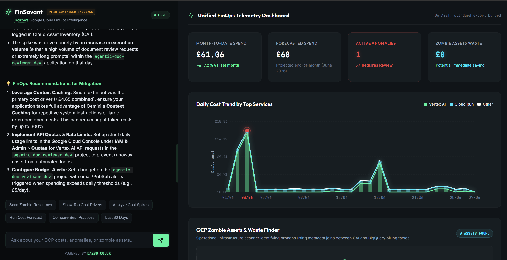

# FinSavant: Dazbo's Google Cloud FinOps Intelligence

An agentic FinOps solution for Google Cloud Platform (GCP) created by [Dazbo](https://dazbo.co.uk) that empowers Cloud Platform Engineers and FinOps Practitioners to manage, understand, and optimise cloud spend across their entire organisation.



## Table of Contents

- [Features](#features)
- [Associated Articles](#associated-articles)
- [Target Audience](#target-audience)
- [Success Metrics](#success-metrics)
- [Project Structure](#project-structure)
- [Requirements](#requirements)
- [Quick Start](#quick-start)
- [Commands](#commands)
- [Local Development & Testing Flow](#local-development--testing-flow)
  - [Run as Standalone Services (Hot-Reloading)](#run-as-standalone-services-hot-reloading)
  - [Step 1: Initialise Dependencies](#step-1-initialise-dependencies)
  - [Step 2: Run the Application](#step-2-run-the-application)
  - [Run as a Single Docker Container](#run-as-a-single-docker-container)
  - [Step 3: Run Tests & Quality Gates](#step-3-run-tests--quality-gates)
  - [Interactive Notebook Prototyping](#interactive-notebook-prototyping)
- [CI/CD & Deployment Flow](#cicd--deployment-flow)
  - [GitHub Actions Pipelines](#github-actions-pipelines)
- [IAM Permissions & Validation](#iam-permissions--validation)
- [Technical Architecture](#technical-architecture)
- [Useful Links & References](#useful-links--references)
- [License](#license)

## Features

- **BigQuery Billing Integration**: Direct access to BigQuery billing exports for cross-project cost analysis.
- **BigQuery ADK Integration**: Native dataset and table schema awareness using ADK's native `BigQueryToolset` with local query caching.
- **Natural Language Chat Interface**: A React-based UI allowing users to query billing data and infrastructure state in plain English.
- **FinOps Dashboard**: A centralised view for cost trends, anomaly reports, and optimisation progress.
- **Zombie Resource Detection & Audit**: Proactively identifies cost waste such as unattached persistent disks using Cloud Asset Inventory. Correlates billing spikes with historical configuration changes.
- **Multi-Project Analysis**: Ability to scope analysis to specific projects, billing accounts, or the entire Google Cloud Organisation.
- **AI-powered Forecasting**: Predict future cloud consumption and budget requirements using historical data.
- **Automated Anomaly Detection**: Proactively identify unusual billing spikes and cost inefficiencies.
- **Actionable Recommendations**: Combine billing insights with architectural best practices for high-impact cost optimisation.

[](https://youtu.be/zs_IRUxIx4E)

## Associated Articles

This repository is associated with a multi-part series of articles documenting the design, implementation, and deployment of FinSavant:

1. Goals, Architecture, and Tech Stack: Capabilities, project goals, target architecture, technology stack, and design decisions.
2. Dev Environment Setup with Google Antigravity, ADK, Agents CLI, MCP & Skills
3. Building the dynamic UI with A2UI
4. Authentication with IAP, Terraform, and CI/CD
5. Observing, Evaluating & Tuning Our Agent with Gemini Enterprise Agent Platform

## Target Audience

- **Cloud Platform Engineers**: Managing infrastructure and resource lifecycle.
- **FinOps Practitioners**: Dedicated teams responsible for cloud financial governance.
- **GCP Organisation Admins**: Overseeing cost and compliance across a large-scale cloud footprint.

## Success Metrics

- **Spend Reduction %**: Target reduction in unoptimised spend.
- **Anomaly Detection Speed**: Minimise MTTD (Mean Time to Detect) for billing outliers.
- **Forecasting Accuracy**: High precision in projected budget versus actual realisation.

## Project Structure

```
smart-gcp-finops/
├── app/               # Core agent code (FastAPI + ADK)
│   ├── agent.py               # Main agent logic
│   ├── fast_api_app.py        # FastAPI Backend for Frontend
│   └── app_utils/             # App utilities and helpers
├── deployment/        # Infrastructure and CI/CD (Terraform)
│   └── terraform/             # Centralised IaC for Prod & Staging
├── docs/              # System-wide architecture and design documentation
│   ├── images/                # Diagrams and architectural visual assets
│   ├── DESIGN.md              # Visual identity, components, and design tokens
│   ├── architecture-and-walkthrough.md # Solution blueprints, ADRs, and component data flows
│   └── testing.md             # Testing strategy and verification instructions
├── notebooks/         # Jupyter notebooks for prototyping and evaluation
│   └── adk_app_testing.ipynb  # Interactive playground for testing local and remote runs
├── tests/             # Unit and integration tests
├── .gemini/           # Gemini CLI configuration (MCP settings)
├── GEMINI.md          # Context for the Antigravity/Gemini AI development assistant
├── Makefile           # Development commands
└── pyproject.toml     # Project dependencies (Python 3.13, uv)
```

## Requirements

Before you begin, ensure you have:
- **uv**: Python package manager (Python 3.13+)
- **Google Cloud SDK**: Authenticated with your GCP project
- **Terraform**: For infrastructure deployment
- **make**: Build automation tool

## Quick Start

Install required packages and launch the local development environment:

```bash
make install && make playground
```

## Commands

| Command              | Description                                                       |
| -------------------- | ----------------------------------------------------------------- |
| `make install`       | Install dependencies using `uv`                                   |
| `make playground`    | Launch local development environment (ADK Dev UI)                 |
| `make run-backend`   | Run the Backend BFF Server locally (runs agent locally unless `AGENT_RUNTIME_ID` is set) |
| `make run-frontend`  | Launch the Vite Dev Server for the React UI                       |
| `make lint`          | Run backend code quality checks (`ruff`, `codespell`, `ty`)       |
| `make test-ui`       | Run frontend compiler and lint checks (TypeScript, ESLint)        |
| `make test`          | Run unit and integration tests (`pytest`)                         |
| `make build`         | Shortcut to build the unified production container image locally    |
| `make docker-build`  | Build the unified production container image (React + FastAPI) locally |
| `make docker-run`    | Run the built container locally (runs agent locally unless `AGENT_RUNTIME_ID` is set) |
| `make run`           | Shortcut for `make docker-run` to run the container locally        |
| `make tf-plan`       | Initialise Terraform and plan infrastructure deployment           |
| `make tf-apply`      | Initialise Terraform and apply deployment configuration           |
| `make deploy-agent-runtime` | Deploy backend agent code to Gemini Enterprise Agent Runtime   |
| `make get-agent-runtime-id` | Retrieve the deployed Agent Runtime ID (resource URN)              |
| `make deploy-cloud-run` | Deploy BFF container to Cloud Run using Cloud Build              |


## Local Development & Testing Flow

The application can be run locally in two different ways:
1. **Standalone Services** (recommended for active development): Runs the React frontend and FastAPI backend as separate, hot-reloading processes.
2. **Unified Docker Container**: Runs the entire application (compiled React assets + FastAPI backend) inside a single local Docker container, replicating the production environment.

### Run as Standalone Services (Hot-Reloading)

To run the React frontend and FastAPI backend locally as standalone services, follow this developer workflow:

### Step 1: Initialise Dependencies

Install both the backend Python package dependencies (`uv sync`) and the React frontend package dependencies (`npm install`) automatically in one step:
```bash
make install
```

### Step 2: Run the Application

You will need two separate terminal sessions to run both servers concurrently with hot-reloading:

*   **Terminal 1 (Backend)**: Spin up the FastAPI Backend BFF on `http://localhost:8000`:
    ```bash
    make run-backend
    ```
*   **Terminal 2 (Frontend)**: Spin up the Vite dev server on `http://localhost:5173`:
    ```bash
    make run-frontend
    ```
Open your browser and navigate to `http://localhost:5173`. The frontend automatically proxies all `/api` and `/events` queries to the backend.

### Run as a Single Docker Container

Alternatively, you can run the entire unified container (which bundles both the compiled React frontend and the FastAPI backend) locally using Docker:

```bash
# Build the unified container image locally
make docker-build

# Run the container locally (runs the agent locally unless AGENT_RUNTIME_ID is configured)
make docker-run
```
This launches the application on `http://localhost:8000`, running exactly as it would on Cloud Run.

### Step 3: Run Tests & Quality Gates
Before committing any changes to git, verify both the backend and frontend are healthy:

*   **Backend Linting & Types**: Run `ruff` linting/formatting and `ty` static typing checks:
    ```bash
    make lint
    ```
*   **Frontend Linting & Compile**: Run `eslint` checks and compile the production bundle to verify zero TypeScript errors:
    ```bash
    make test-ui
    ```
*   **Unit & Integration Tests**: Execute backend pytest coverage checks:
    ```bash
    make test
    ```

### Interactive Notebook Prototyping

An interactive notebook is available at [adk_app_testing.ipynb](notebooks/adk_app_testing.ipynb) for testing the agent in a sandbox environment. This allows:
- **Local Testing**: Instantiating the agent logic locally within the project virtual environment.
- **Remote Testing (Agent Runtime)**: Interacting with the deployed Gemini Enterprise Agent Runtime.
- **Remote Testing (Cloud Run)**: Triggering the deployed uvicorn server/SSE streaming interface.

For full usage instructions, refer to the [Testing Guide](docs/testing.md#interactive-testing-via-jupyter-notebook).

## CI/CD & Deployment Flow

FinSavant utilises a decoupled GitHub Actions pipeline to enforce a strict quality gate before releasing code to Production. The architecture splits the application into two deployed targets:
1. **Agent Logic (Gemini Enterprise Agent Runtime)**: Managed serverless environment hosting the agent's Python code, callbacks, and tools.
2. **BFF + UI (Cloud Run)**: A lightweight container hosting the static React assets and a FastAPI thin proxy layer.

### GitHub Actions Pipelines

* **Continuous Integration (Staging)**: 
  - **Trigger**: Automatic on pushes or merges to the `main` branch. (Pull requests against branches only run linting, unit, and integration tests to ensure code health, but do not deploy anything to GCP).
  - **Actions**: The [.github/workflows/staging.yaml](.github/workflows/staging.yaml) workflow automatically packages and deploys the agent logic to the staging Agent Runtime (`finops-admin-dev`), extracts the resulting `AGENT_RUNTIME_ID`, builds the unified container image, and deploys it to the Staging Cloud Run BFF with the correct engine ID.
* **Verification**: Verify the staging environment to ensure all agent tools, BigQuery MCP connections, and React component renders function correctly.
* **Manual Gate (Production)**: 
  - **Trigger**: Manual trigger ("workflow dispatch") in GitHub Actions.
  - **Actions**: The [.github/workflows/deploy-to-prod.yaml](.github/workflows/deploy-to-prod.yaml) workflow deploys the agent to the production Agent Runtime (`finops-admin-prd`), extracts the production ID, and deploys the BFF container to Production Cloud Run.

For details on network variables, service accounts, and Terraform variable propagation, refer to the [Deployment README](deployment/README.md).

## IAM Permissions & Validation

For the agent and the executive dashboard to discover GCP resources and projects, the querying developer's account (and the deployed application service account) must have the appropriate Cloud Asset Inventory permissions.

Please refer to the [IAM Permissions & Validation](deployment/README.md#iam-permissions--validation) section in the Deployment README for:
- The validation command to verify your user's permissions.
- `gcloud` commands to grant missing roles at the Organisation, Folder, or Project level.
- Helper bash scripts to bulk-bind permissions to all projects or standalone (orphaned) projects linked to your billing account.

## Technical Architecture

- **Orchestration**: Built with **Google ADK** for robust multi-agent orchestration, session context management, and telemetry.
- **APIs**: Google Cloud Assist API, Google Developer Knowledge API, and Cloud Asset Inventory.
- **Data Layer**: Direct semantic schema access to BigQuery via native ADK `BigQueryToolset` and cached SQL query execution.
- **Infrastructure**: GCS-backed remote state for consistent multi-environment management managed via Terraform.
- **Frontend**: React (TypeScript) built with **Stitch** for high information density, utilising **Agent-to-UI (A2UI)** to dynamically render rich components like tables and charts.
- **Security Boundary & Row-Level Filtering**: **Identity-Aware Proxy (IAP)** natively integrated with Cloud Run for enterprise-grade authentication. The FastAPI BFF extracts the user's identity from the `x-goog-authenticated-user-email` header, resolves project/org IAM permissions, and wraps all BigQuery queries in a subquery to enforce strict row-level security.
- **Hybrid Execution**: Supports two run modes:
  - *Remote Execution Mode*: The BFF acts as a stateless proxy to the remote agent running on the Google Agent Runtime.
  - *Local Fallback Mode*: If no remote runtime ID is configured, the BFF loads the agent locally inside the container, running the ADK engine using developer Application Default Credentials (ADC).
- **Deployment**: **Unified Container** architecture (bundling compiled React assets + FastAPI) hosted on **Google Cloud Run**.

## Useful Links & References

### Dazbo's Portfolio & Publications
- [Dazbo's Portfolio](https://dazbo.co.uk)
- [Using Google IAP with Cloud Run without a Load Balancer (Dazbo on Medium)](https://medium.com/google-cloud/using-google-identity-aware-proxy-iap-with-cloud-run-without-a-load-balancer-27db89b9ed49?sharedUserId=derailed.dash)
- [FinSavant Video Demo (YouTube)](https://youtu.be/zs_IRUxIx4E)

### Gemini Enterprise Agent Platform & ADK
- [Gemini Enterprise Agent Platform Overview](https://docs.cloud.google.com/gemini-enterprise-agent-platform/overview?utm_campaign=DEVECO_GDEMembers&utm_source=deveco)
- [Agent Runtime (ADK Hosting)](https://docs.cloud.google.com/gemini-enterprise-agent-platform/build/runtime?utm_campaign=DEVECO_GDEMembers&utm_source=deveco)
- [ADK Agent Building Guide](https://docs.cloud.google.com/gemini-enterprise-agent-platform/build/adk?utm_campaign=DEVECO_GDEMembers&utm_source=deveco)
- [Agents CLI Documentation](https://google.github.io/agents-cli/?utm_campaign=DEVECO_GDEMembers&utm_source=deveco)
- [ADK BigQuery Tool Integration](https://adk.dev/integrations/bigquery/?utm_campaign=DEVECO_GDEMembers&utm_source=deveco)
- [Agent Registry Overview](https://docs.cloud.google.com/agent-registry/overview?utm_campaign=DEVECO_GDEMembers&utm_source=deveco)
- [GEAP Memory Bank](https://docs.cloud.google.com/gemini-enterprise-agent-platform/scale/memory-bank?utm_campaign=DEVECO_GDEMembers&utm_source=deveco)
- [Agent Gateway Documentation](https://docs.cloud.google.com/gemini-enterprise-agent-platform/govern/gateways/agent-gateway-overview?utm_campaign=DEVECO_GDEMembers&utm_source=deveco)
- [Model Armor Security Overview](https://docs.cloud.google.com/model-armor/overview?utm_campaign=DEVECO_GDEMembers&utm_source=deveco)
- [GEAP Observability & Telemetry](https://docs.cloud.google.com/gemini-enterprise-agent-platform/optimize/observability/overview?utm_campaign=DEVECO_GDEMembers&utm_source=deveco)
- [Agent Evaluations](https://docs.cloud.google.com/gemini-enterprise-agent-platform/optimize/evaluation/agent-evaluation?utm_campaign=DEVECO_GDEMembers&utm_source=deveco)

### Google Cloud Services & APIs
- [Cloud Run Overview](https://docs.cloud.google.com/run/docs/overview/what-is-cloud-run?utm_campaign=DEVECO_GDEMembers&utm_source=deveco)
- [Identity-Aware Proxy (IAP) Overview](https://docs.cloud.google.com/iap/docs/concepts-overview?utm_campaign=DEVECO_GDEMembers&utm_source=deveco)
- [Google Cloud Assist](https://docs.cloud.google.com/cloud-assist/overview?utm_campaign=DEVECO_GDEMembers&utm_source=deveco)
- [Cloud Asset Inventory (CAI) API](https://docs.cloud.google.com/asset-inventory/docs/overview?utm_campaign=DEVECO_GDEMembers&utm_source=deveco)
- [Developer Knowledge MCP Server](https://developers.google.com/knowledge/mcp?utm_campaign=DEVECO_GDEMembers&utm_source=deveco)

### GCP Billing & FinOps
- [Google Cloud FinOps Hub](https://docs.cloud.google.com/billing/docs/how-to/finops-hub?utm_campaign=DEVECO_GDEMembers&utm_source=deveco)
- [BigQuery Billing Exports Setup](https://docs.cloud.google.com/billing/docs/how-to/export-data-bigquery?utm_campaign=DEVECO_GDEMembers&utm_source=deveco)

## License

This project is licensed under the MIT License - see the [LICENSE](LICENSE) file for details.
