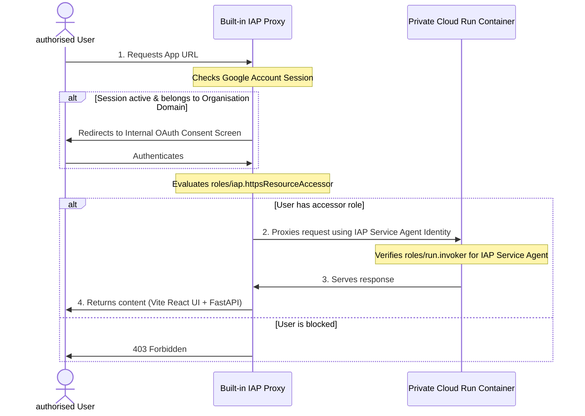

# Deployment & CI/CD Architecture

This document provides a deep dive into the infrastructure and automation for **FinSavant** (developed by [Dazbo](https://dazbo.co.uk)), based on the Google Cloud Agent Starter Pack.

## Project Strategy

The system is designed to operate across two distinct Google Cloud projects, partitioning the resources as follows:

| Project Purpose | Project ID | Key Resources Hosted | Role in Pipeline |
|-----------------|------------|----------------------|------------------|
| **Prod / CICD** | `finops-admin-prd` | Workload Identity Federation (WIF), Artifact Registry, Terraform state bucket, Production Cloud Run service, Production service accounts/logs. | Acts as the **Control Plane** (hosting CI/CD assets and registry images) and the **Production Environment**. |
| **Dev / Staging** | `finops-admin-dev` | Staging Cloud Run service, Staging service accounts, staging storage logs, and Dev/Staging BigQuery datasets. | Acts as the **Staging Environment** for testing release candidates. |

### Deploying to Staging vs. Production

There are distinct operational differences in how updates are delivered to each environment:

1. **Building Container Images**:
   All container images are compiled during CI/CD execution and pushed exclusively to the Artifact Registry hosted in the **Prod / CICD** project (`finops-admin-prd`). Both the staging and production Cloud Run instances pull their images from this central registry.

2. **Staging Deployments (Continuous Integration)**:
   - **Trigger**: Automatic on any push or merge of application code to the `main` branch.
   - **Workflow**: [.github/workflows/staging.yaml](file:///home/dazbo/localdev/smart-gcp-finops/.github/workflows/staging.yaml)
   - **Target**: Deploys the container to the Cloud Run service in the **Dev / Staging** project (`finops-admin-dev`) utilizing the staging service account and dev configuration parameters.

3. **Production Deployments (Continuous Delivery Gate)**:
   - **Trigger**: Manual trigger ("workflow dispatch") from the GitHub Actions interface.
   - **Workflow**: [.github/workflows/deploy-to-prod.yaml](file:///home/dazbo/localdev/smart-gcp-finops/.github/workflows/deploy-to-prod.yaml)
   - **Target**: Deploys the same verified container image to the Cloud Run service in the **Prod / CICD** project (`finops-admin-prd`) utilizing the production service account and prod configuration parameters.


## Developer Environment Setup

To enable the Gemini CLI agent to interact with BigQuery data locally, you must configure a workspace-specific settings file.

### 1. BigQuery MCP Configuration

Create or update `.gemini/settings.json` in the project root:

```json
{
  "mcpServers": {
    "bigquery-mcp-server": {
      "httpUrl": "https://bigquery.googleapis.com/mcp",
      "authProviderType": "google_credentials",
      "oauth": {
        "scopes": ["https://www.googleapis.com/auth/bigquery"]
      },
      "timeout": 30000,
      "headers": {
        "x-goog-user-project": "$GOOGLE_CLOUD_BILLING_PROJECT"
      }
    }
  }
}
```

**Note**: The `x-goog-user-project` header is critical when your billing export resides in a centralized "admin" project. It tells BigQuery to use your specific billing project for query quota and processing costs.

### 2. Environment Variables

For local development and container runtime, configuration is driven by variables in a `.env` file. Do NOT commit actual credential values or IDs; maintain a local `.env` file ignored by Git.

| Variable Name | Scope / Role | Description |
|---|---|---|
| `REPO` | GitHub | The name of the repository (e.g., `smart-gcp-finops`). |
| `GITHUB_TOKEN` | GitHub / IaC | Personal Access Token (classic) with `repo` scope to authorize Terraform's GitHub provider. |
| `SERVICE_NAME` | Cloud Run | The target service name used for Cloud Run deployments and logging tags. |
| `GOOGLE_CLOUD_PROJECT` | Deployment Target | The Google Cloud project ID hosting the active app runtime (e.g., staging project during local dev). |
| `CICD_PROJECT_ID` | CI/CD Infrastructure | The project ID hosting the CI/CD resources (Artifact Registry, WIF). |
| `GOOGLE_CLOUD_REGION` | Infrastructure Region | The default region where Cloud Run and other regional services are deployed (e.g., `europe-west1`). |
| `GOOGLE_CLOUD_LOCATION` | GenAI / Vertex AI | The Vertex AI API endpoint location (e.g., `global`). |
| `GOOGLE_CLOUD_BILLING_ACCOUNT` | Billing Scope | The target GCP Billing Account ID being audited (formatted as `XXXXXX-XXXXXX-XXXXXX`). |
| `GOOGLE_CLOUD_BILLING_LOCATION` | Billing / BigQuery | The geographic location of the BigQuery billing export dataset (e.g., `europe-west4`). |
| `GOOGLE_CLOUD_BILLING_PROJECT` | Billing Project | The ID of the project hosting the BigQuery billing export dataset (for query execution and data viewing). |
| `BILLING_EXPORT_DATASET` | Billing Dataset | The name of the BigQuery dataset where Google Cloud billing logs are exported. |
| `SERVICE_SA` | Security / Identity | Prefix name of the custom application service account (e.g., `smart-gcp-finops-app`). |
| `SERVICE_SA_EMAIL` | Security / Identity | The full email address of the application service account. |
| `GOOGLE_GENAI_USE_VERTEXAI` | GenAI Backend | Boolean flag (`True`/`False`) indicating whether to authenticate using Vertex AI IAM instead of raw Gemini API keys. |
| `MODEL` | GenAI Reasoning | The primary model ID used by the ADK agent for cost analysis (e.g., `gemini-3.5-flash`). |
| `FAST_MODEL` | GenAI Caching / Routing | The lite model ID used for semantic caching and request classification (e.g., `gemini-3.1-flash-lite`). |
| `GOOGLE_CLOUD_ORGANIZATION` | Infrastructure Scope | (Optional) The numeric ID of the Google Cloud Organization to enable Org-wide Cloud Asset searches. |


### 3. Google Cloud API Pre-requisites

The following APIs must be enabled in the projects where the agent or Terraform runs:
- **Cloud Billing API** (`cloudbilling.googleapis.com`): Required for project discovery via the Billing API.
- **Cloud Asset API** (`cloudasset.googleapis.com`): Required for inspecting infrastructure resources.
- **Developer Knowledge API** (`developerknowledge.googleapis.com`): Required for cross-referencing GCP best practices.
- **Artifact Registry API** (`artifactregistry.googleapis.com`): Required for hosting container images in the CI/CD project.


## Folder Structure & State Management

This project uses a **centralized Terraform orchestration model**. All environment infrastructure (Staging and Production) is managed from the root `terraform/` directory.

- **`terraform/` (Root)**: The "Global Orchestrator". This manages infrastructure for **both** Prod and Staging environments. It ensures that the CI/CD Service Account has the necessary orchestrated permissions across projects and automatically configures GitHub OIDC.

### Consolidation Note (Agent Starter Pack Context)

By default, the Agent Starter Pack (ASP) provides two distinct Terraform directories:
1.  **`terraform/` (Root)**: Intended for global management and CI/CD.
2.  **`terraform/dev/`**: An "Isolated Sandbox" for quick, manual prototyping.

**Why we consolidated**: In a professional, multi-project FinOps setup, using split directories can lead to `409: Already Exists` state conflicts and fragmented tracking. We have **manually removed** the `dev/` folder and the associated `make setup-dev-env` target. This ensures the root orchestrator remains the sole source of truth for both Staging and Production environments.

### GitHub Actions Integration

The integration leverages **OpenID Connect (OIDC)** via Google Cloud Workload Identity Federation (WIF). This enables keyless authentication, completely eliminating the need to store long-lived, high-privilege service account keys (JSON) as GitHub secrets.

### How it Works:

1.  **Authentication**: The GitHub Action runner requests a short-lived Google Cloud access token from the Workload Identity Pool by presenting its GitHub OIDC ID token.
2.  **Impersonation**: Once authenticated, the runner impersonates the dedicated CI/CD Service Account (`smart-gcp-finops-cb@...`) which has the necessary IAM permissions to manage and deploy resources.
3.  **Deployment**: The runner builds the unified container image, pushes it to Artifact Registry in the control project, and deploys it to the Staging or Production Cloud Run services.

### WIF Pool & Provider Configuration

The infrastructure for WIF is provisioned automatically in [wif.tf](file:///home/dazbo/localdev/smart-gcp-finops/deployment/terraform/wif.tf):

*   **Workload Identity Pool**: `smart-gcp-finops-pool`
*   **OIDC Provider**: `smart-gcp-finops-oidc` using the issuer `https://token.actions.githubusercontent.com`.
*   **Attribute Mapping**: Maps identity claims from the incoming GitHub token to GCP attributes:
    *   `google.subject` = `assertion.sub`
    *   `attribute.repository` = `assertion.repository`
    *   `attribute.repository_owner` = `assertion.repository_owner`
*   **Attribute Condition**: Enforces strict repository access control:
    ```hcl
    attribute.repository == 'derailed-dash/smart-gcp-finops'
    ```
    This ensures that *only* workflow runs initiated from this specific GitHub repository can assume the deployment role.
*   **IAM Bindings**: Grants the `roles/iam.workloadIdentityUser` and `roles/iam.serviceAccountTokenCreator` roles on the CI/CD runner service account to the principal set representing our GitHub repository:
    ```hcl
    principalSet://iam.googleapis.com/projects/PROJECT_NUMBER/locations/global/workloadIdentityPools/smart-gcp-finops-pool/attribute.repository/derailed-dash/smart-gcp-finops
    ```

## Production Approval Gate

To ensure production deployments never happen without intent, we have **decoupled** the production workflow from the staging push.

1.  **Staging Deploy**: Triggered automatically on push to `main`.
2.  **Verify Staging**: Check the Cloud Run service in the staging project to ensure everything is working as expected.
3.  **Manual Production Deploy**:
    *   Navigate to the **Actions** tab in your GitHub repository.
    *   Select the **"Deploy to Production"** workflow from the left sidebar.
    *   Click the **Run workflow** dropdown and then the **Run workflow** button.

This manual trigger ensures you have a final "human-in-the-loop" check before any changes reach your production environment.

## Troubleshooting CI/CD Failures


### Error: "Failed to generate Google Cloud federated token"

If you see an error containing `//iam.googleapis.com/projects//locations/global/workloadIdentityPools//providers/`, it means the Workload Identity Federation variables are missing or not set in GitHub.

**Resolution Steps:**
1.  **Run Terraform**: Ensure you have successfully run `terraform apply` in the `deployment/terraform/` directory. This process creates the WIF resources and uses the `github` provider to automatically set the following in your repo:
    *   `vars.GCP_PROJECT_NUMBER`
    *   `vars.GOOGLE_CLOUD_PROJECT` (CICD project ID)
    *   `vars.SERVICE_ACCOUNT_EMAIL` (CICD runner SA email)
    *   `vars.GCP_WIF_PROVIDER` (Full provider resource path)
    *   `vars.GEMINI_MODEL`
    *   `vars.GOOGLE_GENAI_USE_GCA`
    *   `vars.UPLOAD_ARTIFACTS`
    *   `secrets.WIF_POOL_ID`
    *   `secrets.WIF_PROVIDER_ID`
    *   `secrets.GCP_SERVICE_ACCOUNT`
2.  **Verify Secrets & Variables**: Check your GitHub Repository Settings > Secrets and variables > Actions to ensure these values are populated.
3.  **Permissions**: Ensure the GitHub token used by Terraform has `write` access to repository secrets and variables.


## Core Configuration & Variables

The agent and infrastructure are configured using variables in `deployment/terraform/vars/env.tfvars`. The key variables are:

| Variable | Description |
|----------|-------------|
| `billing_account_id` | The Google Cloud Billing Account ID (e.g., `0123AB-C456DE-F789GH`). |
| `google_cloud_billing_project` | The project ID hosting the BigQuery billing dataset (e.g., `finops-admin-123456`). |
| `billing_export_dataset` | The name of the dataset containing the billing data (e.g., `all_billing_data`). |
| `google_cloud_organization_id` | (Required) The numeric ID of your Google Cloud Organization. If you do not use an organization, you must set this to an empty string (`""`) in your `env.tfvars` to satisfy Terraform variable validation. |
| `google_genai_use_vertexai` | Whether to use Vertex AI for Gemini (default: `true`). |
| `google_cloud_location` | The location for Vertex AI API endpoint calls (e.g., `global`). |
| `model` | The primary model used for reasoning (default: `gemini-3.5-flash`). |
| `fast_model` | The model used for quick caching/semantic routing (default: `gemini-3.1-flash-lite`). |
| `staging_min_instances` / `prod_min_instances` | Minimum scaling count for Cloud Run (e.g., `0`). |
| `staging_max_instances` / `prod_max_instances` | Maximum scaling count for Cloud Run (e.g., `1` for dev, `10` for prod). |

These variables are defined in `deployment/terraform/vars/env.tfvars` and are automatically propagated to:

1.  **IAM**: Granting `roles/bigquery.dataViewer` and `roles/bigquery.jobUser` on the billing project, `roles/billing.viewer` on the Billing Account, and `roles/cloudasset.viewer` on the discovered projects (or the entire Org).
2.  **Environment Variables**: Injected into the Cloud Run container as `GOOGLE_CLOUD_PROJECT`, `GOOGLE_CLOUD_REGION`, `GOOGLE_CLOUD_BILLING_PROJECT`, `BILLING_EXPORT_DATASET`, `GOOGLE_GENAI_USE_VERTEXAI`, `GOOGLE_CLOUD_LOCATION`, `MODEL`, `FAST_MODEL`, and optionally `GOOGLE_CLOUD_ORGANIZATION`.
3.  **GitHub Actions**: Set as repository variables (`vars.GOOGLE_CLOUD_BILLING_ACCOUNT`, `vars.GOOGLE_CLOUD_BILLING_LOCATION`, etc.) via the GitHub Terraform provider in `github.tf`. These are injected into the CI/CD test environments and passed to `gcloud run deploy --update-env-vars`.


### FinOps Permissions & Roles

To support the FinOps cross-referencing logic, specific IAM roles are configured for the Application Service Account within `iam.tf`:

1.  **Billing Account Project Discovery**: Grants `roles/billing.viewer` at the Billing Account level via `google_billing_account_iam_member` to allow dynamic discovery of associated projects.
2.  **Asset Inventory Cross-Referencing**:
    - **With Organization**: If `google_cloud_organization_id` is supplied, grants `roles/cloudasset.viewer` at the Organization level via `google_organization_iam_member`. This provides efficient visibility across the entire estate.
    - **Local Testing**: Users must ensure their personal Google Identity has `roles/cloudasset.viewer` on target projects to successfully run the agent via `make playground`.
3.  **BigQuery Cost Analysis**: Grants `roles/bigquery.dataViewer` and `roles/bigquery.jobUser` on the centralized Billing Project via `google_project_iam_member`.

## Infrastructure Discovery Scoping

The application uses a **Discovery-Based Architecture** to map the infrastructure footprint. It supports two scoping strategies, each with specific IAM requirements:

### 1. Organization Scope (Recommended for Enterprise)

If `google_cloud_organization_id` is provided in your `env.tfvars`:
- **IAM**: Terraform attempts to grant `roles/cloudasset.viewer` to the agent's service account at the **Organization level**.
- **Requirement**: The identity running `terraform apply` **must** have `roles/resourcemanager.organizationAdmin` or equivalent permission to modify Organization-level IAM policies.
- **Search**: The agent performs efficient, global Asset Inventory searches across the entire organization.

### 2. Project List Fallback (Recommended for Org-less Accounts)

If `google_cloud_organization_id` is set to an empty string (`""`) or if you lack Organization-level permissions:
- **Discovery**: The agent uses the Cloud Billing API to list all Project IDs associated with the `billing_account_id`.
- **Inspection IAM**: You **must manually grant** `roles/cloudasset.viewer` to the agent's service account (`smart-gcp-finops-app@...`) on **every project** you want it to inspect.
- **Terraform Handling**: Terraform automatically handles this for the primary Staging and Production projects managed by this repo.
- **Search**: The agent iterates through the discovered project list to query assets.

## Managing Secrets & Variables

This project uses **git-crypt** to manage sensitive information. To prevent accidental exposure, we use a "shadow file" strategy for Terraform variables.

### Terraform Variable Files

- **Local Only (Ignored)**: `env.tfvars` files are used for local execution but are listed in `.gitignore`. They are **never** committed to the repository in plain text.
- **Tracked & Encrypted**: `env.tfvars.enc` files are the "source of truth" for the repository. They are automatically encrypted by `git-crypt` upon staging, as defined in `.gitattributes`.

### Encryption Workflow

1.  **Unlock**: Ensure your repository is unlocked (`git-crypt unlock`).
2.  **Edit**: Modify the local, unencrypted `env.tfvars` file.
3.  **Sync**: Copy the changes to the tracked shadow file:
    ```bash
    cp deployment/terraform/vars/env.tfvars deployment/terraform/vars/env.tfvars.enc
    ```
4.  **Commit**: Stage and commit the `.enc` files. `git-crypt` will encrypt them transparently.

**CRITICAL**: Always verify that your plain-text `env.tfvars` remains in `.gitignore` and is not accidentally staged.

## Remote State Management

The Terraform state for this project is stored remotely in a **Google Cloud Storage (GCS) bucket**.

- **Bucket**: `finops-admin-prd-tfstate`
- **Location**: `eu` (Multi-region)
- **Features**: Versioning enabled, uniform bucket-level access.

### Why Remote State?

1.  **Shared Reality**: Ensures that both local developers and the GitHub Action runner see the same infrastructure.
2.  **State Locking**: Prevents concurrent modifications that could corrupt the state.
3.  **Durability**: Versioning allows us to recover from accidental state corruption.

## Custom Domain Mapping

The system supports mapping custom subdomains to Cloud Run via Terraform. The environment mappings are provided in your `env.tfvars` securely:
- `prod_app_domain_name` for the production endpoint
- `staging_app_domain_name` for the staging endpoint

Terraform prepares the Cloud Run domain mappings (`google_cloud_run_domain_mapping`). Since this project pairs Cloud Run directly with an external registrar (e.g., IONOS) instead of Google Cloud DNS, the actual DNS records aren't fully localized within Google Cloud.

**Manual Verification Requirement**: 
When `terraform apply` finishes, it outputs a `cloud_run_domain_mappings` block containing the required DNS validation records. You must manually copy these records (usually CNAME, A, or AAAA) into your IONOS (or other DNS provider's) interface for the domain to point correctly to Cloud Run.

---

## Identity-Aware Proxy (IAP) Security

This project implements **Native (Built-in) IAP for Cloud Run**, providing enterprise-grade security directly at the serverless service level *without* requiring an external Global HTTPS Application Load Balancer (ALB).

### How Native IAP Works Under the Hood



1. **Request Interception**: All public traffic hitting the Cloud Run URL is intercepted at the Google Cloud front-end by the built-in IAP proxy layer before reaching the container.
2. **User Authentication**: Unauthenticated users are redirected to the Google OAuth consent screen. Native IAP requires this consent screen to be configured as **Internal** (restricted to members of your Google Workspace/Cloud Organization `123456789012`).
   > [!IMPORTANT]
   > **Domain Organization Constraint**: Because the OAuth Consent Screen for built-in IAP is configured as **Internal**, Google restricts logins exclusively to accounts belonging to the target organization domain (Workspace/Cloud Identity). When verifying access, you **must use an allowed user account from that exact same domain**. Personal `@gmail.com` accounts or credentials from external domains will be blocked immediately at the Google OAuth consent gate, even if added to `var.iap_access_emails`.
3. **User Access Authorization**: Once authenticated, IAP evaluates if the user's identity has been granted the **IAP-secured Web App User** (`roles/iap.httpsResourceAccessor`) role. If not, access is blocked at the edge with `HTTP 403 Forbidden`.
4. **Service Invocation**: If the user is authorized, the IAP proxy generates an OIDC token for its own system identity (the **IAP Service Agent**) and calls the underlying, private Cloud Run container. Cloud Run verifies that the IAP Service Agent is authorized to invoke the container via the **Cloud Run Invoker** (`roles/run.invoker`) IAM binding.


---

### Infrastructure Configuration (Terraform)

The architecture is managed cleanly in two Terraform files:
1. **Service Enablement ([service.tf](file:///home/dazbo/localdev/smart-gcp-finops/deployment/terraform/service.tf))**:
   The native integration is enabled directly on the Cloud Run resource with the `iap_enabled = true` parameter (which requires the `google-beta` provider).
2. **Identity Creation ([iam.tf](file:///home/dazbo/localdev/smart-gcp-finops/deployment/terraform/iam.tf))**:
   The Google-managed IAP Service Agent is explicitly provisioned in each project:
   ```hcl
   resource "google_project_service_identity" "iap_sa" {
     provider = google-beta
     service  = "iap.googleapis.com"
   }
   ```
   This generates an internal identity format: `service-PROJECT_NUMBER@gcp-sa-iap.iam.gserviceaccount.com`.
3. **Invoker IAM Binding ([iam.tf](file:///home/dazbo/localdev/smart-gcp-finops/deployment/terraform/iam.tf))**:
   The `google_cloud_run_v2_service_iam_member` resource grants `roles/run.invoker` to the generated IAP Service Agent.
4. **User Access Binding ([iam.tf](file:///home/dazbo/localdev/smart-gcp-finops/deployment/terraform/iam.tf))**:
   The `google_iap_web_cloud_run_service_iam_binding` resource maps your environment-specific `var.iap_access_emails` directly to the `roles/iap.httpsResourceAccessor` role.

---

### CLI Deployment & Parity Coordination

Standard CLI deployments (`gcloud run deploy`) are **imperative** and will naturally overwrite the service configuration, disabling IAP if run without explicit arguments. 

To maintain perfect parity with your Terraform infrastructure state, you **must specify the `--iap` and `--no-allow-unauthenticated` flags** on every deployment.

This coordination is fully automated in:
* **The [Makefile](file:///home/dazbo/localdev/smart-gcp-finops/Makefile)**: The `deploy-cloud-run` target has been updated to permanently pass the `--iap` flag.
* **GitHub Actions Workflows**: Both staging and production pipelines use `--iap` in their `gcloud run deploy` steps.

To prevent Terraform from trying to strip or revert the deployment-metadata and IAP signatures generated by `gcloud` builds, a `lifecycle` block is configured in [service.tf](file:///home/dazbo/localdev/smart-gcp-finops/deployment/terraform/service.tf) to ignore changes to the `annotations`, `client`, and `client_version` fields.

## Deployment Commands

### 1. Initialize Infrastructure

Navigate to the centralized Terraform directory and initialize the backend:

```bash
cd deployment/terraform
terraform init
```

### 2. Plan and Apply

You can manage Terraform plans and applications either natively or using the provided root-level `Makefile` shortcuts:

**Option A: Using Makefile Shortcuts (Recommended)**:
From the repository root:
```bash
# Preview changes
make tf-plan

# Apply changes automatically
make tf-apply
```

**Option B: Natively in Terraform directory**:
```bash
terraform plan -var-file=vars/env.tfvars -out=tfplan
terraform apply tfplan
```

### 3. Manual Build, Test, & Deploy (Optional)

Before deploying to Google Cloud Run, you can build and verify the unified container locally:

```bash
# Build the unified container
make docker-build

# Run the container locally to verify the React UI on port 8080
make run

# Once verified, deploy to Cloud Run using Cloud Build
make deploy-cloud-run
```

For more details on the agent logic, refer to the [Architecture Guide](../docs/architecture-and-walkthrough.md).

