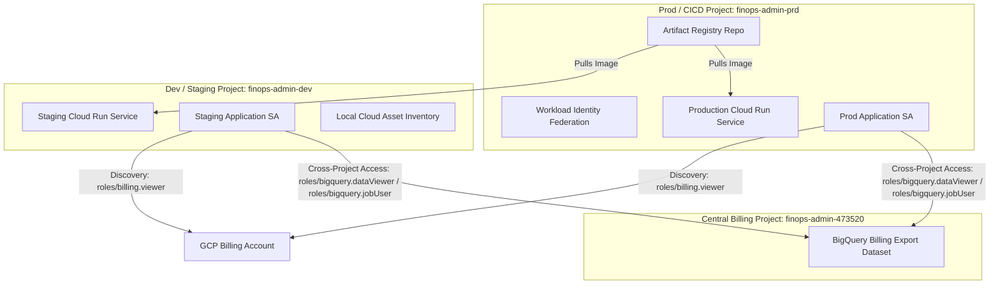
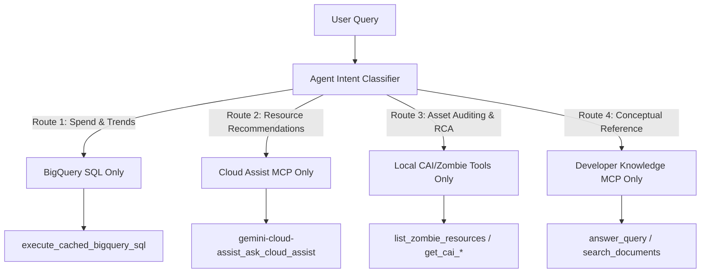

# FinSavant - Architecture & Walkthrough

This document serves as the "Blueprint" for the **FinSavant** system (developed by [Dazbo](https://dazbo.co.uk)), detailing the architectural decisions and service relationships.

## Design Decisions (ADRs)

| ADR | Status | Rationale |
|-----|--------|-----------|
| **Vite-React SPA Workspace** | Use an isolated, type-safe React + TypeScript SPA compiled via Vite. Rationale: Vite provides instant Hot Module Replacement (HMR) during dev; TypeScript ensures robust parsing of complex `application/json+a2ui` payloads; compiling to clean static assets maintains a tiny Python container footprint (no Node.js in production). |
| **BFF Architecture** | Use FastAPI as a Backend for Frontend (BFF) to decouple agent logic from the React UI while serving static assets. |
| **Unified Container for UI and BFF** | Pckage React and FastAPI into a single Cloud Run image to simplify CORS, authentication (IAP), and TCO. |
| **ADK Orchestration** | Google ADK for robust multi-agent coordination, session management, and standardized tool calling. |
| **A2UI Protocol** | Agent-driven rich UI generation (tables, charts, cards) to maintain a professional, information-dense UX. |
| **Native IAP** | Identity-Aware Proxy directly on Cloud Run avoiding the cost and complexity of a Global Load Balancer while maintaining enterprise security. |
| **GCS Remote State** | Store Terraform state on GCS (`finops-admin-prd-tfstate`) to ensure a shared source of truth across CI/CD environments and enable state locking. |
| **Custom Domain Mapping**| Use Cloud Run Domain Mappings over an External ALB + Cloud DNS setup for simplicity and cost optimization. |
| **Cross-Project Billing**| Grant the Application Service Account cross-project access to the BigQuery billing export project (`var.google_cloud_billing_project`) via project-level IAM roles, enabling centralised cost analysis. |
| **BigQuery MCP (Local CLI)** | The BigQuery MCP server (`https://bigquery.googleapis.com/mcp`) is configured exclusively in the local `.gemini/settings.json` file. It enables developers to use the Gemini CLI for direct, natural language database experimentation during development without deploying any code. |
| **BigQuery ADK Toolset (Agent)** | The ADK agent uses the native `BigQueryToolset` (from `google.adk.integrations.bigquery`) with Application Default Credentials (ADC) to query dataset metadata and schemas. By avoiding a separate remote MCP layer, it simplifies authentication, reduces runtime latency, and aligns with ADK best practices. |
| **Organisational CAI Scoping** | Prioritise Organisation-level scopes for CAI lookups but fall back to project-level lookups for any resources not found in the organisation. This ensures complete visibility across all projects linked to the billing account, even those residing in independent projects outside the primary organization. Graceful handling of `403 Forbidden` errors at the organisation level allows for silent fallback to project-level "sniper" queries if the service account lacks top-level permissions. |
| **CAI Zombie Detection** | Specialised Cloud Asset Inventory (CAI) queries as native ADK Python tools rather than using an MCP. This provides efficient, precise identification of unused resources like unattached disks. |
| **Developer Knowledge MCP** | The remote Google Developer Knowledge MCP server (`https://developerknowledge.googleapis.com/mcp`) allows our agent to cross-reference identified infrastructure issues and cost spikes against official GCP best practices, and to provide grounding for general Google-related queries. Additionally, it is fully-managed by Google, so no MCP servers to deploy and manage ourselves. |
| **Direct Table Binding**   | Programmatically resolve and inject the exact standard and resource-level table IDs into the agent system instructions at startup to eliminate table listing/schema exploration latency and avoid self-correction query loops. (_Potentially fragile?_) |
| **Keep-Alive Heartbeat SSE** | I Implemented a custom `/api/chat/stream` post-endpoint in FastAPI that streams agent responses via Server-Sent Events, running the agent in a dedicated background thread and writing event logs to an `asyncio.Queue` (with a `: heartbeat\n\n` comment every 15 seconds). Rationale: Prevents event loop blockages and thread pool starvation, ensuring reliable connection streaming on serverless runtimes like Cloud Run. |
| **Vite 6 Tooling & Sandboxing** | Vite and esbuild are strictly development-only tools used to compile React static assets; they are never compiled, packaged, or executed inside the production Cloud Run Python container, ensuring zero runtime security risk. |
| **Modularised Utilities** | I Extracted BQ/Developer Knowledge MCP connection details and authorisation providers into `mcp_config.py`, and isolated custom database executors (`execute_cached_bigquery_sql`) into `tools.py` under `app/app_utils/`. Rationale: Keeps the core `app/agent.py` focused purely on instructions and callback coordination, enhancing maintainability. |
| **Context Caching** | I Configured `ContextCacheConfig` on the global `App` container to cache system instructions and tool declarations model-side on Vertex AI/Gemini. Rationale: Minimises turn latency and slashes token usage for large system instructions and tools. |
| **Semantic Caching** | I Replaced exact string query normalisation with a GenAI Semantic Cache Resolver using `gemini-3.1-flash-lite` configured in `.env.enc`. Rationale: Intelligently skips database queries and expensive LLM calls on semantically matching prompts while keeping billing scopes precise. |
| **CI/CD Variable Sync** | I Defined core GenAI, model, and scaling settings as Terraform variables, propagating them dynamically to Cloud Run environment variables and GitHub Actions variables. Rationale: Ensures complete configuration parity across local development, manual terraform runs, and automated GitHub Actions, preventing runtime mismatches and drift. |
| **Agent Runtime Hosting** | I Adopted Gemini Enterprise Agent Runtime (Vertex AI Reasoning Engine) for agent execution, hosting only the static React UI and FastAPI BFF proxy in Cloud Run. Rationale: Decouples reasoning and tool invocation from the stateless web container, allowing independent scaling, enhanced security boundaries, native Vertex AI agent management, and automatic registration/synchronization in the central Google Cloud Console Agent Registry catalog. |


## Solution Architecture

### Data Flow

1. **User Request**: User interacts with the React UI (Natural Language or Dashboard) or the Gemini CLI (Local Dev).
2. **IAP Layer**: Identity-Aware Proxy intercepts the request, verifies the Google Identity, and checks IAM permissions (`roles/iap.httpsResourceAccessor`).
3. **FastAPI BFF Layer**: Receives the authenticated request and either routes it to the remote **Gemini Enterprise Agent Runtime** (in production/staging execution) or runs it locally (in-container fallback mode for dev).
4. **Agent Runtime (or Local ADK Runner)**: Orchestrates tools based on intent:
    - **BigQuery native toolset**: Directly inspects datasets and schemas using native `BigQueryToolset` semantic tools like `list_dataset_ids` and `get_table_info`.
    - **Developer Knowledge API**: Fetching architectural best practices.
    - **Cloud Asset Inventory**: Analyzing infrastructure state across projects.
5. **Rich UI Response**: Agent returns `application/json+a2ui` payloads via Server-Sent Events (SSE).
6. **Client Rendering**: React client renders interactive components based on the A2UI spec.

### Hybrid Execution Mode (Local vs. Remote Agent Runtime)

To facilitate seamless local development and robust managed execution, the system employs a **hybrid execution architecture** controlled by the `AGENT_RUNTIME_ID` environment variable:

*   **Local Fallback Mode (`AGENT_RUNTIME_ID` is unset/empty)**:
    *   **Trigger**: Default behavior when running the local backend (`make local-backend`), starting the playground (`make playground`), or running the Docker container locally (`make run`).
    *   **Behavior**: FastAPI loads the agent logic directly from the Python codebase (`from app.agent import root_agent`). It runs the ADK engine locally in a dedicated background thread of the application process. All tools (BigQuery, CAI, etc.) are executed locally using the developer's Application Default Credentials (ADC).
*   **Remote Execution Mode (`AGENT_RUNTIME_ID` is set)**:
    *   **Trigger**: Deployed environments (Staging and Production Cloud Run services).
    *   **Behavior**: FastAPI bypasses local execution and acts as a Backend-for-Frontend (BFF) proxy. It uses the `vertexai` client SDK to connect to the remote Reasoning Engine instance matching the `AGENT_RUNTIME_ID` resource name. User queries are streamed directly to the Vertex AI Agent Runtime, which manages agent execution and tool invocations remotely.
*   **Automatic Agent Registry Cataloging**: When deployed in Remote Execution Mode, the agent is automatically enrolled in the Google Cloud Console **Agent Registry** catalog (found under **Agent Platform Deployments**). This registration requires zero manual API or configuration calls; the Gemini Enterprise Agent Platform auto-synchronizes URN mapping (e.g. `urn:agent:...`) and deployment metrics in real-time, providing immediate centralized cataloging and administrative visibility for organizational governance.

### Component Diagram

```text
                                +-----------------------------+
                                |  React UI (Browser) / CLI   |
                                +-----------------------------+
                                               |
                                            (HTTPS)
                                               v
                                +-----------------------------+
                                |    Identity-Aware Proxy     |
                                +-----------------------------+
                                               |
                                        (Authenticated)
                                               v
                                +-----------------------------+
                                |  FastAPI BFF (Cloud Run)    |
                                +-----------------------------+
                                   |                       |
                             (Local Mode)            (Remote Mode)
                                   |                       |
                                   v                       v
                        +----------------------+ +-------------------------+
                        |  Local ADK Runner    | | Gemini Enterprise       |
                        |  (In-Container)      | | Agent Runtime           |
                        +----------------------+ | (Vertex AI Reasoning)   |
                                   |             +-------------------------+
                                   |                          |
                                   +------------+-------------+
                                                |
                                                v
                                 +-----------------------------+
                                 |   Google Cloud APIs & MCPs  |
                                 |                             |
                                 |  - BigQuery native toolset  |
                                 |  - Cloud Asset Inventory    |
                                 |  - Gemini Cloud Assist      |
                                 |  - Developer Knowledge API  |
                                 +-----------------------------+
```

### Project Relationships & Cross-Project Interactions

The FinSavant system relies on a multi-project GCP architecture to isolate operational environments, billing assets, and build pipelines. The relationships and interactions between these components are described below:



#### 1. Project Ownership and Identity
- **Central Billing Project (`finops-admin-473520`)**: Hosts the primary BigQuery billing export dataset (`all_billing_data`). No application services are deployed here; it serves strictly as the financial data source of truth.
- **Prod / CICD Project (`finops-admin-prd`)**: Hosts the CI/CD pipeline assets (GitHub Workload Identity Pool/Providers, central Artifact Registry repository) and the **Production** deployment of the Cloud Run app and its production-specific application Service Account.
- **Dev / Staging Project (`finops-admin-dev`)**: Hosts the **Staging** deployment of the Cloud Run application, its staging-specific application Service Account, and any local assets or staging databases.

#### 2. Cross-Project Interactions
- **Artifact Registry Sharing**: The Artifact Registry repository is centralized in the Prod/CICD project. Both the Staging Cloud Run service (in `finops-admin-dev`) and the Production Cloud Run service (in `finops-admin-prd`) pull their container images from this registry. To support this cross-project interaction, Terraform grants `roles/artifactregistry.reader` to the serverless robot service agents of both projects on the central registry repository.
- **Cross-Project BigQuery Cost Analysis**: Neither staging nor production copies billing data into their own projects. Instead, both the staging Service Account (`smart-gcp-finops-app@finops-admin-dev...`) and the production Service Account (`smart-gcp-finops-app@finops-admin-prd...`) are granted `roles/bigquery.dataViewer` and `roles/bigquery.jobUser` on the Central Billing Project. The ADK agent uses the native `BigQueryToolset` with Application Default Credentials (ADC) to interact with BigQuery directly, with query execution quota routed through the quota project by passing the central billing project in the client credentials, so query processing quotas and costs are billed to the central project.
- **Billing Account Discovery**: The Service Accounts are granted `roles/billing.viewer` at the **GCP Billing Account** level to dynamically discover which projects are currently linked to the billing footprint.
- **Cloud Asset Inventory Inspection**: The Service Accounts are granted `roles/cloudasset.viewer` at either the Organization level (for global asset inspection) or project level (to audit resource statuses and trace historical cost-spike changes).


## Agent Implementation Details

### BigQuery Native Toolset Integration

The agent logic in `app/agent.py` uses the native ADK `BigQueryToolset` to query and inspect BigQuery dataset metadata. This native toolset simplifies agent deployment by removing the dependency on remote MCP protocols while preserving performance.

**Configuration Key Points**:
- **Authentication**: Configured via `BigQueryCredentialsConfig` using standard Application Default Credentials (ADC), which allows seamless authentication locally and on Cloud Run.
- **Tool Filtering**: Instantiated with a custom `bq_tool_filter` function that excludes raw query execution tools (`execute_sql` and `ask_data_insights`). This guarantees that the agent executes all SQL queries through the optimized, cached `execute_cached_bigquery_sql` tool.
- **System Context**: The agent's system prompt is dynamically generated to include the target billing project and dataset IDs, ensuring it always targets the correct source of truth.

```python
# app/agent.py snippet
# Configure native BigQuery Toolset using Application Default Credentials (ADC)
import google.auth
from google.adk.integrations.bigquery import BigQueryToolset, BigQueryCredentialsConfig

credentials, _ = google.auth.default()
credentials_config = BigQueryCredentialsConfig(credentials=credentials)


def bq_tool_filter(tool, ctx=None) -> bool:
    """Excludes SQL execution and query tools from the exposed tool list to prevent bypass of execute_cached_bigquery_sql."""
    name = tool.name.lower()
    return "execute" not in name and "query" not in name


bigquery_toolset = BigQueryToolset(
    credentials_config=credentials_config,
    tool_filter=bq_tool_filter,
)
```

### MCP Server Use-Case Alignment & Routing Decision Tree

To deliver a high-performance FinOps analyst while keeping interaction latency to a minimum, FinSavant enforces a strict separation of concerns across its Model Context Protocol (MCP) servers and native tools. Rather than chaining multiple remote queries in a single turn, the system classifies the user's intent and routes it directly to a single, specialised toolset.

#### 1. Use-Case to MCP / Tool Alignment

The table below outlines how operational and financial use cases map to our integration endpoints:

| Use Case Category | Target Server / Tool | Key Capabilities | Why This Option? |
|:---|:---|:---|:---|
| **Financial Aggregation & Cost Trends** | **BigQuery native toolset**<br>`execute_cached_bigquery_sql` | • Month-to-Date (MTD) totals<br>• Project & service cost drivers<br>• Daily trend forecasting | Direct query access to the standard and resource-level billing export tables. Bypasses metadata overhead. |
| **Active Resource Optimisation** | **Gemini Cloud Assist MCP**<br>`ask_cloud_assist` | • Live VM/DB rightsizing recommendations<br>• Deployed service cost & scaling recommendations | Queries live Google recommender engines and active resource telemetry in real-time. |
| **Operational State Auditing & RCA** | **Local CAI & Zombie Tools**<br>`list_zombie_resources`<br>`get_cai_metadata_for_resources`<br>`get_cai_history_for_resource` | • Scanning for unattached disks / idle IPs<br>• Cross-referencing operational status<br>• Retrieving 35-day configuration change history | Accesses Cloud Asset Inventory (CAI) metadata directly. Essential for locating cost-spike causes (Root Cause Analysis). |
| **Best-Practice Reference Q&A** | **Developer Knowledge MCP**<br>`answer_query`<br>`search_documents` | • Autoclass vs Standard storage lookups<br>• Conceptual billing terms<br>• GCP architecture guidelines | Connects directly to Google's official product documentation and best-practices repository. |

#### 2. Latency-Aware Agent Routing Flow

To prevent execution overlap (e.g. running slow asset scans when asking for a simple database query or Cloud Run rightsizing), the system prompt in [agent.py](../app/agent.py) injects a strict classification tree.

The agent evaluates the incoming prompt and routes it into one of four mutually exclusive execution lanes, actively blocking/banning the tools belonging to other routes:




* **Route 1: Spend & Historical Trends**: Restricts execution strictly to `execute_cached_bigquery_sql`. Calls to CAI, Developer Knowledge, and Cloud Assist are explicitly banned.
* **Route 2: Active Infrastructure Optimisation & Recommendations**: Invokes only the Gemini Cloud Assist MCP toolset. Calls to BigQuery, local CAI/zombie tools, and Developer Knowledge are banned.
* **Route 3: Structured Asset Auditing, Config History & Drift**: Restricts execution to the local CAI and zombie scanning tools. Calls to BigQuery, Developer Knowledge, and Cloud Assist are banned.
* **Route 4: Conceptual Reference Q&A**: Queries only the Developer Knowledge base. All database and operational asset tools are banned.

## Key User Journeys

### 1. Cost Anomaly Investigation

- **User**: "Why did my Compute Engine costs spike yesterday?"
- **Agent**: Queries BigQuery for daily usage using `bigquery-mcp-server_execute_sql`, detects the spike, and correlates it with newly created instances found in Cloud Asset Inventory.
- **Output**: A table showing the specific instances and their owners, plus a "Savings Opportunity" card.

### 2. Architectural Best Practice Alignment

- **User**: "How can I optimize my current Cloud Storage spend?"
- **Agent**: Scans storage buckets, compares usage with Developer Knowledge API guidelines (e.g., Autoclass vs. Standard), and provides a specific optimization plan.
- **Output**: A recommendation list with a "Apply Changes" button for approved items.

## Implementation Notes

- **Language**: Python 3.12+ (Backend), TypeScript (Frontend).
- **Package Management**: `uv` for backend, `npm`/`pnpm` for frontend.
- **Observability & Tracing**:
  - **Standard ADK Telemetry**: Programmatically configured via OpenTelemetry using `google.adk.telemetry` wrappers. Spans trace the full agent execution flow (spawning LLM calls and tool execution hierarchies).
  - **Local Agent Tracing**: Locally running agents support full tracing export. Developers can set `OTEL_TO_CLOUD=true` in their local environment variables (along with standard Google Application Default Credentials) to route local execution traces directly to Google Cloud Trace for instant inspection.
  - **Gemini Enterprise Agent Runtime (GEAP) Integration**: Deploying the agent reasoning engine to Vertex AI enables automatic telemetry propagation. In addition to GCS/BigQuery structured logs, trace trajectories integrate seamlessly with the Gemini Enterprise Agent Platform (GEAP) observability interfaces with minimal friction.


## A2UI Rationale & Gemini Enterprise Portability

### Rationale for A2UI Protocol
The **Agent-to-UI (A2UI)** protocol decouples the backend agent's cognitive loops from the specific frontend rendering framework. Rather than returning hardcoded HTML, CSS, or framework-specific elements, the agent generates structured JSON payloads conforming to a standardized MIME type (`application/json+a2ui`). 

This architecture guarantees that the backend is fully **frontend-agnostic**:
* **Platform Portability**: The same agent backend can power a React/Vite web application, a native iOS/Android mobile dashboard, or an administrative command-line interface. Each client simply implements an interpreter to map standard JSON elements (e.g. `type: "table"`, `type: "chart"`) to native rendering widgets.
* **Independent Evolution**: The design system or front-end layout can be completely overhauled without changing a single line of Python agent code or altering tool logic.

### Fallback & Execution Mode Visual Indicator
To ensure full operational visibility for developers and operators, the React UI includes a visual execution indicator badge located in the main header of the chat panel. 
* **State Check**: On initialisation, the React client queries the thin BFF status endpoint (`GET /api/status`).
* **Visual Representation**:
  * **In-Container Fallback (`mode: "local"`)**: Renders a glassmorphic amber pill badge labelled **`IN-CONTAINER FALLBACK`** (`#F59E0B`), indicating the agent is executing locally inside the BFF container using local Application Default Credentials (ADC).
  * **Vertex Runtime (`mode: "remote"`)**: Renders a glowing neon-green badge labelled **`VERTEX RUNTIME`** (`#00F59B`), indicating the BFF is proxying queries to the managed **Gemini Enterprise Agent Runtime** (Vertex AI Reasoning Engine). Hovering over this badge displays the active Reasoning Engine resource name.

---

## Future Phase: Gemini Enterprise Portability

Surfacing this backend through text-centric enterprise interfaces like **Gemini Enterprise (GE)** or standard chat channels introduces a markdown limitation: standard Markdown natively renders tables and code blocks, but does not support interactive HTML5 Canvas or SVG charts.

To bring rich cost trends and cost curves to Gemini Enterprise without building custom frontend web components, we will implement **Dynamic Server-Side Chart Rendering (Solution 1)** in a future phase:

### Dynamic PNG Charting Architecture
```text
[ Gemini Enterprise ] <--- (Markdown + PNG Link) --- [ FastAPI BFF Gateway ]
                                                           |
                                                (Generate SVG/PNG Plot)
                                                           v
                                                [ matplotlib / Plotly ]
                                                           |
                                                (Write to /static or GCS)
                                                           v
                                                [ Storage Bucket / CDN ]
```

1. **Client-Channel Identification**: During API request routing, FastAPI will inspect request headers (e.g., `X-Client-Type`) or user session metadata to identify if the request originates from a text-only channel (like GE).
2. **Channel-Based Format Negotiation**:
   * **React Client**: The agent continues to stream rich A2UI JSON payloads to render the interactive Stitch-accelerated dashboard curves.
   * **Gemini Enterprise Client**: The backend intercepts the agent's A2UI payloads and executes a server-side charting tool (e.g. using `matplotlib` or a microservice) to generate a static PNG chart representing the cost curve.
3. **Static Image Storage**: The generated PNG is saved to the Cloud Run `/static/` directory or uploaded to a secure, public/IAP-exempt GCS bucket.
4. **Markdown Rendering Inline**: The agent returns a standard Markdown response containing the inline image tag:
   ```markdown
   Based on the last 3-month cost analysis, here is your forecasted spend:
   
   
   ```
   Gemini Enterprise will automatically fetch and display this high-quality PNG inline within the chat bubble, providing clean cost visualizations without requiring frontend code changes.

For details on how to verify these features, refer to the [Testing Guide](./testing.md).

