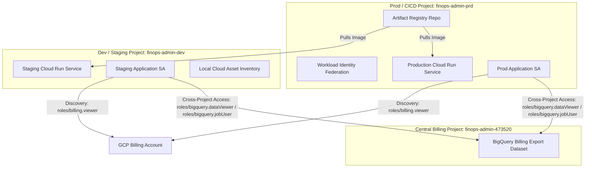
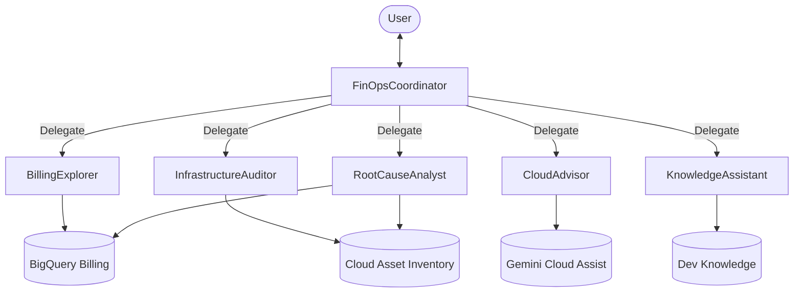
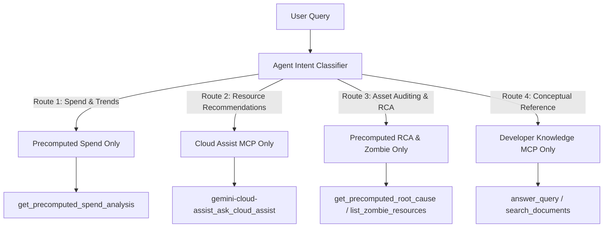

# FinSavant - Architecture & Walkthrough

This document serves as the "Blueprint" for the **FinSavant** system (developed by [Dazbo](https://dazbo.co.uk)), detailing the architectural decisions and service relationships.

## Design Decisions (ADRs)

| ADR | Status | Rationale |
|-----|--------|-----------|
| **Vite-React SPA Workspace** | Use an isolated, type-safe React + TypeScript SPA compiled via Vite. Rationale: Vite provides instant Hot Module Replacement (HMR) during dev; TypeScript ensures robust parsing of complex `application/json+a2ui` payloads; compiling to clean static assets maintains a tiny Python container footprint (no Node.js in production). |
| **BFF Architecture** | Use FastAPI as a Backend for Frontend (BFF) to decouple agent logic from the React UI while serving static assets. |
| **For Dev: Unified Container for UI and BFF** | Pckage React and FastAPI into a single Cloud Run image to simplify CORS, authentication (IAP), and TCO. Only used in the local development environment. |
| **ADK Orchestration** | Google ADK for robust multi-agent coordination, session management, and standardized tool calling. |
| **A2UI Protocol** | Agent-driven rich UI generation (tables, charts, cards) to maintain a professional, information-dense UX. |
| **Native IAP** | Identity-Aware Proxy directly on Cloud Run avoiding the cost and complexity of a Global Load Balancer while maintaining enterprise security. |
| **GCS Remote State** | Store Terraform state on GCS (`finops-admin-prd-tfstate`) to ensure a shared source of truth across CI/CD environments and enable state locking. |
| **Custom Domain Mapping**| Use Cloud Run Domain Mappings over an External ALB + Cloud DNS setup for simplicity and cost optimization. |
| **Cross-Project Billing**| Grant the Application Service Account cross-project access to the BigQuery billing export project (`var.google_cloud_billing_project`) via project-level IAM roles, enabling centralised cost analysis. |
| **BigQuery MCP for local development** | In our development workspace, the BigQuery MCP server (`https://bigquery.googleapis.com/mcp`) is configured in the local `.agents/mcp_config.json` file. This enables developers to have natural language interactions with BigQuery during development, without deploying any code. |
| **BigQuery ADK Toolset (Agent)** | The ADK agent uses the native `BigQueryToolset` (from `google.adk.integrations.bigquery`) with Application Default Credentials (ADC) to query dataset metadata and schemas. By avoiding a separate remote MCP layer, it simplifies authentication, reduces runtime latency, and aligns with ADK best practices. |
| **Organisational CAI Scoping** | Prioritise Organisation-level scopes for CAI lookups but fall back to project-level lookups for any resources not found in the organisation. This ensures complete visibility across all projects linked to the billing account, even those residing in independent projects outside the primary organization. Graceful handling of `403 Forbidden` errors at the organisation level allows for silent fallback to project-level "sniper" queries if the service account lacks top-level permissions. |
| **CAI Zombie Detection** | Specialised Cloud Asset Inventory (CAI) queries as native ADK Python tools rather than using an MCP. This provides efficient, precise identification of unused resources like unattached disks. |
| **Developer Knowledge MCP** | The remote Google Developer Knowledge MCP server (`https://developerknowledge.googleapis.com/mcp`) allows our agent to cross-reference identified infrastructure issues and cost spikes against official GCP best practices, and to provide grounding for general Google-related queries. Additionally, it is fully-managed by Google, so no MCP servers to deploy and manage ourselves. |
| **Direct Table Binding**   | Programmatically resolve and inject the exact standard and resource-level table IDs into the agent system instructions at startup to eliminate table listing/schema exploration latency and avoid self-correction query loops. (_Potentially fragile?_) |
| **Keep-Alive Heartbeat SSE** | Implemented a custom `/api/chat/stream` post-endpoint in FastAPI that streams agent responses via Server-Sent Events, running the agent in a dedicated background thread and writing event logs to an `asyncio.Queue` (with a `: heartbeat\n\n` comment every 15 seconds). Rationale: Prevents event loop blockages and thread pool starvation, ensuring reliable connection streaming on serverless runtimes like Cloud Run. |
| **Context Caching** | Used `ContextCacheConfig` on the global `App` container to cache system instructions and tool declarations model-side on the Gemini Enterprise Agent Platform. Rationale: Minimises turn latency and slashes token usage for large system instructions and tools. |
| **Semantic Caching** | Replaced exact string query normalisation with a GenAI Semantic Cache Resolver using `gemini-3.1-flash-lite` configured in `.env.enc`. Rationale: Intelligently skips database queries and expensive LLM calls on semantically matching prompts while keeping billing scopes precise. |
| **Agent Runtime Hosting** | Gemini Enterprise Agent Runtime for agent execution. Provides our agent with the benefits of native Gemini Enterprise Agent Platform, with automatic registration/synchronisation in the central Google Cloud Console Agent Registry catalog. |
| **BFF Rate Limiting** | Implemented `slowapi` rate limiting on the FastAPI BFF endpoints (/api/chat/stream, /api/dashboard) keyed by the user's authenticated IAP email. Rationale: Protects against Denial of Wallet (DoW) and quota exhaustion, and works natively in memory since Cloud Run is scaled to a single instance. |
| **Gemini Interactions API** | Rejected for Vertex AI. Rationale: Testing confirmed that the Vertex AI endpoint (`aiplatform.googleapis.com`) rejects standard Gemini text models (`gemini-3.5-flash`) via the Interactions API with a `400 BadRequest` (`Unsupported model interaction: gemini-3.5-flash`). We stick to stateless model inference with client/BFF side history management. |
| **ADK Global Plugins** | Register custom plugins subclassing `BasePlugin` at the global `App` level. Rationale: Avoids repeating logging, tracing, and tool error-handling callbacks in individual subagent constructors. Observability, logging, and defensive error-handling hooks automatically apply to all subagents globally. |
| **Parallel Function Calling (PFC)** | Instructed subagents (specifically `BillingExplorer`) via prompt rules to call `execute_cached_bigquery_sql` concurrently in a single turn for independent queries. Rationale: Exploits Gemini's native Parallel Function Calling capabilities to reduce turn latency by up to 60%. |
| **Hybrid Model Routing** | Switch the root coordinator (`FinOpsCoordinator`) and lightweight proxy/RAG subagents (`CloudAdvisor` and `KnowledgeAssistant`) to `gemini-3.1-flash-lite`, while keeping reasoning-intensive subagents (`BillingExplorer`, `InfrastructureAuditor`, `RootCauseAnalyst`) on `gemini-3.5-flash`. Rationale: Drastically reduces turn latency and token consumption/costs for orchestration, RAG documentation lookups, and tool proxying. |
| **Default Vertex AI Inferences** | Use Vertex AI mode (`GOOGLE_GENAI_USE_VERTEXAI=True`) with Google Cloud IAM credentials (ADC in local dev, Service Account identity in production) as the primary model inference route, avoiding raw `GEMINI_API_KEY` dependencies for enterprise security and unified billing. |

## BigQuery Query Optimization

To maintain sub-second response times and prevent high scan costs on massive billing export datasets (which contain millions of resource-level entries), the query execution wrapper (`execute_cached_bigquery_sql`) enforces the following optimization, caching, and security strategies:

### 1. Partition Pruning (Double-Temporal Filtering)
Standard Google Cloud Billing exports are partitioned by `export_time`. The query engine dynamically extracts temporal/partition filters (`export_time`, `usage_start_time`, and `usage_end_time`) from the agent's outer query and pushes them down directly into the inner scoping subqueries:
```sql
FROM (SELECT * FROM `table` WHERE project.id IN (...) AND export_time >= ... AND usage_start_time >= ...)
```
This forces BigQuery to prune partitions at the table-scan level, dropping execution time from over a minute to less than a second.

### 2. Targeted Scoping (Project Filter Intersection)
When the agent queries a single project, the scoping subquery is narrowed to that single project instead of listing all 38 allowed projects. The tool parses explicit project filters (`project.id = '...'` or `project.id IN (...)`) from the SQL query and intersects them with the user's `allowed_projects` context, accelerating clustering index lookups.

### 3. Dynamic Table Routing
Queries targeting the massive resource-level billing table (`gcp_billing_export_resource_v1_*`) that do not query or reference any `resource.` fields (e.g. general cost spikes or aggregations by project/SKU) are automatically rewritten at runtime to query the standard billing table (`gcp_billing_export_v1_*`). This instantly shrinks the scanned data footprint by ~100x.

### 4. Defensive Temporal Guardrail
If a query is issued with no date or partition filters on `export_time` (e.g. exploratory min/max date checks), the tool automatically injects a default partition constraint:
```sql
export_time >= TIMESTAMP(DATE_SUB(CURRENT_DATE(), INTERVAL 90 DAY))
```
This prevents unconstrained queries from scanning the full historical footprint of the table.

### 5. Private In-Memory Caching & Blackboard Auto-Caching
- **Private In-Memory Caching (`_IN_MEMORY_BQ_CACHE`)**: Raw BigQuery SQL caches are kept in a private, thread-safe in-memory Python dictionary mapped by `session_id` rather than ADK `SessionState` (`tool_context.state`). Because `SessionState` is serialized and persisted to disk or network stores on every turn, keeping the heavy SQL rows in a private process-level map avoids significant database I/O, network latency, trace/telemetry log bloat, and framework deepcopy CPU spikes.
- **Blackboard Auto-Caching**: Query execution results are automatically written to standard blackboard keys in python memory (`'daily_service_costs_30d'`, `'sku_period_costs_60d'`, and `'gcs_secret_waste'`). Subagents are instructed via prompt guidelines to consult the blackboard first and **not** call `set_session_value` with database results, completely eliminating the latency of the LLM generating large JSON lists.

### 6. Deterministic Python Precomputation & Subagent Tool Stripping
To completely eliminate model reasoning token generation and multi-turn conversational loop latency during heavy telemetry investigations:
- **Python Precomputation Tools (`get_precomputed_spend_analysis` and `get_precomputed_root_cause`)**: Heavy data analysis, cost summation, daily cost spike grouping, and Cloud Asset Inventory configuration log correlation are executed natively in Python. The LLM receives clean, pre-aggregated summary metrics instead of raw database rows, slashing subagent execution time to under 1.5 seconds.
- **Subagent Tool Stripping**: By completely removing raw database/cai tools (`execute_cached_bigquery_sql` and `get_cai_history_for_resource`) from the `RootCauseAnalyst` and `BillingExplorer` subagents and exposing only the precomputed helpers, we force them to run a single deterministic precomputation query, eliminating redundant queries and self-correcting loop chains.
- **Failed Optimization (Thinking Budget Overrides)**: We attempted to override the model's reasoning/thinking budget to `0` at the request config level. However, testing confirmed that for reasoning-enabled models like `gemini-3.5-flash`, forcing `thinking_budget = 0` causes the model to return empty response blocks, which violates ADK framework output validation rules ("model output must contain either output text or tool calls, these cannot both be empty"). We reverted request-level overrides and instead relied on shifting analytical calculations from the LLM reasoning loop to native Python to resolve reasoning token overhead.

## Solution Architecture

### Data Flow

1. **User Request**: User interacts with the React UI (Natural Language or Dashboard) or the Gemini CLI (Local Dev).
2. **IAP Layer**: Identity-Aware Proxy intercepts the request, verifies the Google Identity, and checks IAM permissions (`roles/iap.httpsResourceAccessor`).
3. **FastAPI BFF Layer**: Receives the authenticated request and either routes it to the remote **Gemini Enterprise Agent Runtime** (in production/staging execution) or runs it locally (in-container fallback mode for dev).
4. **Agent Runtime (or Local ADK Runner)**: Orchestrates tools based on intent:
    - **BigQuery native toolset**: Directly inspects datasets and schemas using native `BigQueryToolset` semantic tools like `list_dataset_ids` and `get_table_info`.
    - **Developer Knowledge API**: Fetching architectural best practices.
    - **Cloud Asset Inventory**: Analyzing infrastructure state across projects.
5. **Rich UI Response**: Agent returns `application/json+a2ui` payloads via Server-Sent Events (SSE).
6. **Client Rendering**: React client renders interactive components based on the A2UI spec.

### Hybrid Execution Mode (Local vs. Remote Agent Runtime)

To facilitate seamless local development and robust managed execution, the system employs a **hybrid execution architecture** controlled by the `AGENT_RUNTIME_ID` environment variable:

*   **Local Fallback Mode (`AGENT_RUNTIME_ID` is unset/empty)**:
    *   **Trigger**: Default behavior when running the local backend (`make local-backend`), starting the playground (`make playground`), or running the Docker container locally (`make run`).
    *   **Behavior**: FastAPI loads the agent logic directly from the Python codebase (`from app.agent import root_agent`). It runs the ADK engine locally in a dedicated background thread of the application process. All tools (BigQuery, CAI, etc.) are executed locally using the developer's Application Default Credentials (ADC).
*   **Remote Execution Mode (`AGENT_RUNTIME_ID` is set)**:
    *   **Trigger**: Deployed environments (Staging and Production Cloud Run services).
    *   **Behavior**: FastAPI bypasses local execution and acts as a Backend-for-Frontend (BFF) proxy. It uses the `google-genai` client SDK to connect to the remote Agent Runtime instance matching the `AGENT_RUNTIME_ID` resource name. User queries are streamed directly to the Gemini Enterprise Agent Runtime, which manages agent execution and tool invocations remotely.
*   **Automatic Agent Registry Cataloging**: When deployed in Remote Execution Mode, the agent is automatically enrolled in the Google Cloud Console **Agent Registry** catalog (found under **Agent Platform Deployments**). This registration requires zero manual API or configuration calls; the Gemini Enterprise Agent Platform auto-synchronizes URN mapping (e.g. `urn:agent:...`) and deployment metrics in real-time, providing immediate centralized cataloging and administrative visibility for organizational governance.

### Component Diagram


### Docker Containerisation & Deployment Options

To support clean isolation, local testing, and separate scaling in production, the workspace is structured with **three separate Dockerfiles**:

1. **Unified Container ([Dockerfile](file:///home/dazbo/localdev/smart-gcp-finops/Dockerfile) at root)**:
   - **Purpose**: Combines both the compiled static React frontend assets and the FastAPI BFF backend into a single image.
   - **Use Case**: Used for local container testing (`make docker-run`) where the frontend, BFF, and agent execution run together in-container.
   - **Build Mode**: Multi-stage build (Node.js stage for Vite compiler, Python stage for FastAPI).

2. **Standalone FastAPI BFF Container ([bff/Dockerfile](file:///home/dazbo/localdev/smart-gcp-finops/bff/Dockerfile))**:
   - **Purpose**: Packages only the FastAPI application and the compiled React frontend static assets.
   - **Use Case**: Deployed to Google Cloud Run in production and staging. It routes queries to the remote Agent Runtime in Gemini Enterprise.
   - **Dependencies**: Includes `fastapi`, `uvicorn`, and `google-genai` client packages.

3. **Standalone Agent Runtime Container ([agent/Dockerfile](file:///home/dazbo/localdev/smart-gcp-finops/agent/Dockerfile))**:
   - **Purpose**: Packages the core ADK agent code (`finops_agent`) and the `agent_runtime_app.py` bootstrapper.
   - **Use Case**: Deployed to Gemini Enterprise Agent Runtime to execute the cognitive loops and run tools.
   - **Dependencies**: Includes `google-adk`, `mcp`, and Google Cloud client libraries, with all web-serving and database dependencies (`fastapi`, `uvicorn`, `asyncpg`, etc.) completely pruned.


### Developer Configuration & Deployment "Sets"

To manage the decoupled lifecycle of the UI/BFF and the Agent, the project maintains two isolated configuration sets. It is crucial to understand which files govern each deployment:

#### 1. The Root Deployment Set (FastAPI BFF & React UI)
This set manages the web container deployed to Cloud Run, which hosts the static frontend assets and exposes the endpoints to the user client.
*   **Dependencies**: Governed by the root [pyproject.toml](file:///home/dazbo/localdev/smart-gcp-finops/pyproject.toml) and root `uv.lock`. This includes web frameworks (`fastapi`, `uvicorn`), database drivers (`asyncpg`), and the client SDK (`google-genai`) to communicate with the remote agent.
*   **Build Target**: Governed by [bff/Dockerfile](file:///home/dazbo/localdev/smart-gcp-finops/bff/Dockerfile) for Cloud Run deployment. This is a multi-stage Docker build that compiles the React application using Node.js/Vite and mounts the static dist output directly inside the FastAPI Python runtime.
    - *Note on Cloud Build:* Because the build context must remain the repository root (`.`) to copy sibling packages like `finops_agent`, but the target Dockerfile is nested at `bff/Dockerfile`, we use a custom Cloud Build configuration file ([cloudbuild-bff.yaml](file:///home/dazbo/localdev/smart-gcp-finops/deployment/cloudbuild-bff.yaml)) to run the build. The default `gcloud builds submit --tag` shortcut is limited to building a file named `Dockerfile` at the root of the upload directory and does not support specifying custom Dockerfile paths.
    - The root [Dockerfile](file:///home/dazbo/localdev/smart-gcp-finops/Dockerfile) remains in place for building local unified containers.
*   **Configuration**: Initialised locally via `.env` and secured in the repository using the `.env.enc` git-crypt file.
*   **Deploy Command**: Triggers building the standalone BFF+UI image using `deployment/cloudbuild-bff.yaml` and pushing it to Artifact Registry via Cloud Build, then deploying to Cloud Run:
    ```bash
    make deploy-cloud-run
    ```

#### 2. The Agent Deployment Set (ADK Agent & Agent Runtime)
This set manages the Agent container deployed to Gemini Enterprise Agent Runtime, which executes the cognitive loops and calls tools.
*   **Dependencies**: Governed by [agent/pyproject.toml](file:///home/dazbo/localdev/smart-gcp-finops/agent/pyproject.toml) and `agent/uv.lock`. This contains only the execution dependencies (`google-adk`, `mcp`, `google-cloud-logging`, `gcsfs`, `google-cloud-aiplatform`).
*   **Build Target**: Governed by [agent/Dockerfile](file:///home/dazbo/localdev/smart-gcp-finops/agent/Dockerfile). This builds the python serving container wrapping the ADK agent logic, exposing port `8080` with the `google.adk.cli` API server as its CMD.
*   **Configuration**: Initialised locally via `agent/.env` and secured in the repository using the `agent/.env.enc` git-crypt file. The deployment metadata is also tracked in [agent/agents-cli-manifest.yaml](file:///home/dazbo/localdev/smart-gcp-finops/agent/agents-cli-manifest.yaml).
*   **Deploy Command**: Executes `agents-cli deploy` inside the `agent/` folder to build and deploy the container image directly to Gemini Enterprise Agent Runtime:
    ```bash
    make deploy-agent-runtime
    ```

#### 3. Automatic Requirements Compilation (`requirements.txt`)
In the `agent/finops_agent/` directory, there is a [requirements.txt](file:///home/dazbo/localdev/smart-gcp-finops/agent/finops_agent/requirements.txt) file. 
*   **Purpose**: The Gemini Enterprise Agent Platform requires a standard `requirements.txt` file inside the agent source directory during Agent registration/serialization to map package dependencies.
*   **Maintenance**: **Developers must not edit this file manually.** Instead, define all dependencies inside `agent/pyproject.toml` and run the compilation target to generate it automatically:
    ```bash
    make export-requirements
    ```
    This compiles the frozen dependencies from `agent/pyproject.toml` directly into `agent/finops_agent/requirements.txt`.


### Project Relationships & Cross-Project Interactions

The FinSavant system relies on a multi-project GCP architecture to isolate operational environments, billing assets, and build pipelines. The relationships and interactions between these components are described below:



#### 1. Project Ownership and Identity
- **Central Billing Project (`finops-admin-473520`)**: Hosts the primary BigQuery billing export dataset (`all_billing_data`). No application services are deployed here; it serves strictly as the financial data source of truth.
- **Prod / CICD Project (`finops-admin-prd`)**: Hosts the CI/CD pipeline assets (GitHub Workload Identity Pool/Providers, central Artifact Registry repository) and the **Production** deployment of the Cloud Run app and its production-specific application Service Account.
- **Dev / Staging Project (`finops-admin-dev`)**: Hosts the **Staging** deployment of the Cloud Run application, its staging-specific application Service Account, and any local assets or staging databases.

#### 2. Cross-Project Interactions

- **Artifact Registry Sharing**: The Artifact Registry repository is centralized in the Prod/CICD project. Both the Staging Cloud Run service (in `finops-admin-dev`) and the Production Cloud Run service (in `finops-admin-prd`) pull their container images from this registry. To support this cross-project interaction, Terraform grants `roles/artifactregistry.reader` to the serverless robot service agents of both projects on the central registry repository.
- **Cross-Project BigQuery Cost Analysis**: Neither staging nor production copies billing data into their own projects. Instead, both the staging Service Account (`smart-gcp-finops-app@finops-admin-dev...`) and the production Service Account (`smart-gcp-finops-app@finops-admin-prd...`) are granted `roles/bigquery.dataViewer` and `roles/bigquery.jobUser` on the Central Billing Project. The ADK agent uses the native `BigQueryToolset` with Application Default Credentials (ADC) to interact with BigQuery directly, with query execution quota routed through the quota project by passing the central billing project in the client credentials, so query processing quotas and costs are billed to the central project.
- **Billing Account Discovery**: The Service Accounts are granted `roles/billing.viewer` at the **GCP Billing Account** level to dynamically discover which projects are currently linked to the billing footprint.
- **Cloud Asset Inventory Inspection**: The Service Accounts are granted `roles/cloudasset.viewer` at either the Organization level (for global asset inspection) or project level (to audit resource statuses and trace historical cost-spike changes).

#### 3. API Rate Limiting & Denial of Wallet (DoW) Protection

To prevent financial spikes (accumulating large BigQuery scan costs or excessive Gemini API usage) and protect the system from quota exhaustion, the FastAPI BFF enforces user-level rate limiting using the `slowapi` library.
* **Authentication Keying:** Limits are keyed by the authenticated user's email address extracted from the IAP headers (`X-Goog-Authenticated-User-Email`), falling back to local credentials in dev.
* **Endpoint Quotas:**
  * **Dashboard Endpoint (`/api/dashboard`):** Limited to **10 requests per minute** and **100 per day**.
  * **Chat Stream Endpoint (`/api/chat/stream`):** Limited to **5 requests per minute** and **100 per day** to protect the backend background thread pool from execution starvation.
* **Single-Instance Accuracy:** Because our Cloud Run setup is configured to run a maximum of 1 instance to control costs, a local in-memory token-bucket storage backend is fully accurate and requires no external Redis / Memorystore setup.


## Multi-Agent Collaborative Architecture

To scale our cognitive processing and prevent instruction bloat, we have evaluated splitting the monolithic agent into a coordinated multi-agent system. Below is the architecture options, design decisions, and rationale for this change.

### Orchestration Evaluation

1. **Coordinator and Dispatcher**:
   * *Structure*: A central coordinator (`FinOpsCoordinator`) handles conversation flow and routes user queries to specialized leaf subagents.
   * *Pros*: High scope isolation, clean context window per subagent, native task delegation/clarification using ADK `task` mode with automatic return to parent via `finish_task`.
   * *Cons*: Minor routing latency on the first turn.
2. **Parallel Fan-Out and Gather**:
   * *Structure*: Runs multiple subagents concurrently (`ParallelAgent`) and combines their outputs via a subsequent synthesizer (`SequentialAgent`).
   * *Pros*: Low latency when running multiple independent tools/network fetches.
   * *Cons*: Subagents must run in `single_turn` mode; no user interaction or clarifications allowed.
3. **Hierarchical Task Decomposition**:
   * *Structure*: A deep, multi-level tree of agents recursively decomposing sub-tasks.
   * *Pros*: Solves deep, complex planning problems.
   * *Cons*: Excessive latency, token cost, and trace stacks; overkill for our flat domains.

### Selected Design & Rationale

We selected the **Coordinator and Dispatcher** pattern as the core layout, with a custom sequential-parallel fallback for complex root cause analysis (RCA). This isolates specialized tools (such as SQL query generation vs. Gemini Cloud Assist recommendations) to prevent model confusion and slashes input token count on every conversational turn.

#### Schematic Architecture Diagram




* **`FinOpsCoordinator` (Root)**: Acts as the conversation router, utilising `gemini-3.1-flash-lite` for low routing and delegation latency. Exposes no direct tools but routes prompts via auto-generated delegation tools.
* **`BillingExplorer` (Mode: `task`)**: Specialised in spend queries, running on `gemini-3.5-flash` to query SQL safely, calculate costs, and output exact A2UI cost explorer/dashboard payloads.
* **`InfrastructureAuditor` (Mode: `task`)**: Specialised in scanning unattached disks or idle IPs and retrieving live CAI asset metadata, running on `gemini-3.5-flash`.
* **`CloudAdvisor` (Mode: `task`)**: Specialised in live resource optimisation, running on `gemini-3.1-flash-lite` to rapidly and cheaply proxy prompts to the Gemini Cloud Assist MCP.
* **`KnowledgeAssistant` (Mode: `single_turn`)**: Handles conceptual reference Q&A with the Developer Knowledge MCP, running on `gemini-3.1-flash-lite` for fast document summarisation (RAG) and low latency.
* **`RootCauseAnalyst` (Mode: `task`)**: Investigates billing spike dates, running on `gemini-3.5-flash` to perform logical cause-and-effect correlation between cost increases and configuration drift.


### State Sharing and Resiliency Guidelines

Since users can invoke subagents directly (or via UI action chips) without a strict sequential order (e.g. clicking "Align with best practices" immediately upon opening a clean chat session), the system enforces two state-resiliency rules:

1. **Bootstrap Project Discovery**:
   The root `FinOpsCoordinator` executes `before_agent_discover_projects` during the initial connection handshake. This populates `session.state.allowed_projects` immediately on turn 1, establishing the tenant boundaries.
2. **Lazy Context Hydration**:
   If a subagent (such as `KnowledgeAssistant` or `CloudAdvisor`) is invoked but finds cost spikes or active service lists are missing from `session.state`, it must not fail or return generic suggestions. Instead, it lazily triggers a fast, cached lookup query to BigQuery to resolve the top cost-driving services for the allowed projects, populating the session state on-the-fly.
3. **Global Plugin Observability and Error Interception**:
   We register custom plugins subclassing `BasePlugin` globally on the ADK `App` runner container. Observability (OpenTelemetry logging/tracing) and defensive error handling (such as `DefensiveToolErrorPlugin`) are handled globally. Any tool execution failure in a subagent is automatically caught, logged, and returned to the BFF as a friendly user warning, maintaining session consistency.

### Proposed Multi-Agent Orchestration Flows

To design the decoupled execution paths, the table below maps each standard use case and UI chip action directly to the subagents invoked, tracing how session state is shared and how the final A2UI layout is generated:

| User Intent / UI Action | Entrypoint (Root) | Subagent Invoked (Mode) | Data/State Updates | Final Output / UI Component |
| :--- | :--- | :--- | :--- | :--- |
| **Initial Dashboard Load / MTD Summary**<br>*(e.g. "Show MTD spend")* | `FinOpsCoordinator` | `BillingExplorer` (`task`) | Invokes `get_precomputed_spend_analysis` to aggregate MTD costs, PoP trends, spikes, and zombie waste. Writes descriptions, total costs, and metrics into `session.state`. | Renders `dashboard` A2UI payload with spend curves and MTD KPI indicators. |
| **Zombie Asset Sweep**<br>*(e.g. "Scan for unused resources")* | `FinOpsCoordinator` | `InfrastructureAuditor` (`task`) | Scans CAI and populates `session.state` with details of unattached disks and idle IP configurations. | Renders `recommendations` A2UI payload showing individual zombie resources. |
| **GCP Best Practices Chip**<br>*(e.g. "Align with best practices")* | `FinOpsCoordinator` | Combination: `KnowledgeAssistant` (`single_turn`) + `CloudAdvisor` (`task`) | Reads active services, cost spikes, and project scopes from `session.state`. Queries Cloud Assist for live recommendations and Developer Knowledge to ground the advice. | Renders rightsizing/configuration suggestions grounded in official GCP best practices. |
| **Get Optimization Advice Chip**<br>*(e.g. "Optimize active resources")* | `FinOpsCoordinator` | `CloudAdvisor` (`task`) | Reads the user's active cloud project from state to scope Gemini Cloud Assist API queries. | Renders architectural/rightsizing suggestions for active infrastructure. |
| **Investigate Cost Spike**<br>*(e.g. "Why did costs spike yesterday?")* | `FinOpsCoordinator` | `RootCauseAnalyst` (`task`) | Invokes `get_precomputed_root_cause` to perform comparative cost analysis and correlate configuration logs for persistent resources in a single turn. | Renders comparative SQL findings and correlated resource configuration logs. |

---

## Agent Implementation Details

### BigQuery Native Toolset Integration

The agent logic in `agent/finops_agent/agent.py` uses the native ADK `BigQueryToolset` to query and inspect BigQuery dataset metadata. This native toolset simplifies agent deployment by removing the dependency on remote MCP protocols while preserving performance.

**Configuration Key Points**:
- **Authentication**: Configured via `BigQueryCredentialsConfig` using standard Application Default Credentials (ADC), which allows seamless authentication locally and on Cloud Run.
- **Tool Filtering**: Instantiated with a custom `bq_tool_filter` function that excludes raw query execution tools (`execute_sql` and `ask_data_insights`). This guarantees that the agent executes all SQL queries through the optimized, cached `execute_cached_bigquery_sql` tool.
- **System Context**: The agent's system prompt is dynamically generated to include the target billing project and dataset IDs, ensuring it always targets the correct source of truth.

```python
# agent/finops_agent/agent.py snippet
# Configure native BigQuery Toolset using Application Default Credentials (ADC)
import google.auth
from google.adk.integrations.bigquery import BigQueryToolset, BigQueryCredentialsConfig

credentials, _ = google.auth.default()
credentials_config = BigQueryCredentialsConfig(credentials=credentials)

def bq_tool_filter(tool, ctx=None) -> bool:
    """Excludes SQL execution and query tools from the exposed tool list to prevent bypass of execute_cached_bigquery_sql."""
    name = tool.name.lower()
    return "execute" not in name and "query" not in name

bigquery_toolset = BigQueryToolset(
    credentials_config=credentials_config,
    tool_filter=bq_tool_filter,
)
```

### MCP Server Use-Case Alignment & Routing Decision Tree

To deliver a high-performance FinOps analyst while keeping interaction latency to a minimum, FinSavant enforces a strict separation of concerns across its Model Context Protocol (MCP) servers and native tools. Rather than chaining multiple remote queries in a single turn, the system classifies the user's intent and routes it directly to a single, specialised toolset.

#### 1. Use-Case to MCP / Tool Alignment

The table below outlines how operational and financial use cases map to our integration endpoints:

| Use Case Category | Target Server / Tool | Key Capabilities | Why This Option? |
|:---|:---|:---|:---|
| **Financial Aggregation & Cost Trends** | **Precomputation helper**<br>`get_precomputed_spend_analysis` | • Month-to-Date (MTD) totals<br>• Project & service cost drivers<br>• Daily trend forecasting | Orchestrates BQ billing export queries and aggregates metrics in Python. Bypasses model-side math latency. |
| **Active Resource Optimisation** | **Gemini Cloud Assist MCP**<br>`ask_cloud_assist` | • Live VM/DB rightsizing recommendations<br>• Deployed service cost & scaling recommendations | Queries live Google recommender engines and active resource telemetry in real-time. |
| **Operational State Auditing & RCA** | **Precomputation & Zombie Helpers**<br>`get_precomputed_root_cause`<br>`list_zombie_resources` | • Scanning for unattached disks / idle IPs<br>• Correlating cost spikes with 35-day CAI history | Runs comparative cost query and performs CAI configuration log drift check in Python. |
| **Best-Practice Reference Q&A** | **Developer Knowledge MCP**<br>`answer_query`<br>`search_documents` | • Autoclass vs Standard storage lookups<br>• Conceptual billing terms<br>• GCP architecture guidelines | Connects directly to Google's official product documentation and best-practices repository. |

#### 2. Latency-Aware Agent Routing Flow

To prevent execution overlap (e.g. running slow asset scans when asking for a simple database query or Cloud Run rightsizing), the system prompt in [agent.py](../agent/finops_agent/agent.py) injects a strict classification tree.

The agent evaluates the incoming prompt and routes it into one of four mutually exclusive execution lanes, actively blocking/banning the tools belonging to other routes:




* **Route 1: Spend & Historical Trends**: Restricts execution strictly to `get_precomputed_spend_analysis`. Calls to CAI, Developer Knowledge, and Cloud Assist are explicitly banned.
* **Route 2: Active Infrastructure Optimisation & Recommendations**: Invokes only the Gemini Cloud Assist MCP toolset. Calls to BigQuery, local CAI/zombie tools, and Developer Knowledge are banned.
* **Route 3: Structured Asset Auditing, Config History & Drift**: Restricts execution to `get_precomputed_root_cause` and `list_zombie_resources`. Calls to BigQuery, Developer Knowledge, and Cloud Assist are banned.
* **Route 4: Conceptual Reference Q&A**: Queries only the Developer Knowledge base. All database and operational asset tools are banned.

## Key User Journeys

### 1. Cost Anomaly Investigation

- **User**: "Why did my Compute Engine costs spike yesterday?"
- **Agent**: Queries BigQuery for daily usage using `bigquery-mcp-server_execute_sql`, detects the spike, and correlates it with newly created instances found in Cloud Asset Inventory.
- **Output**: A table showing the specific instances and their owners, plus a "Savings Opportunity" card.

### 2. Architectural Best Practice Alignment

- **User**: "How can I optimize my current Cloud Storage spend?"
- **Agent**: Scans storage buckets, compares usage with Developer Knowledge API guidelines (e.g., Autoclass vs. Standard), and provides a specific optimization plan.
- **Output**: A recommendation list with a "Apply Changes" button for approved items.

## Implementation Notes

- **Language**: Python 3.13+ (Backend), TypeScript (Frontend).
- **Package Management**: `uv` for backend, `npm`/`pnpm` for frontend.
- **Observability & Tracing**:
  - **Standard ADK Telemetry**: Programmatically configured via OpenTelemetry using `google.adk.telemetry` wrappers. Spans trace the full agent execution flow (spawning LLM calls and tool execution hierarchies).
  - **Local Agent Tracing**: Locally running agents support full tracing export. Developers can set `OTEL_TO_CLOUD=true` in their local environment variables (along with standard Google Application Default Credentials) to route local execution traces directly to Google Cloud Trace for instant inspection.
  - **Gemini Enterprise Agent Runtime (GEAP) Integration**: Deploying the agent to the Gemini Enterprise Agent Platform enables automatic telemetry propagation. In addition to GCS/BigQuery structured logs, trace trajectories integrate seamlessly with the Gemini Enterprise Agent Platform (GEAP) observability interfaces with minimal friction.


## A2UI Rationale & Gemini Enterprise Portability

### Rationale for A2UI Protocol
The **Agent-to-UI (A2UI)** protocol decouples the backend agent's cognitive loops from the specific frontend rendering framework. Rather than returning hardcoded HTML, CSS, or framework-specific elements, the agent generates structured JSON payloads conforming to a standardized MIME type (`application/json+a2ui`). 

This architecture guarantees that the backend is fully **frontend-agnostic**:
* **Platform Portability**: The same agent backend can power a React/Vite web application, a native iOS/Android mobile dashboard, or an administrative command-line interface. Each client simply implements an interpreter to map standard JSON elements (e.g. `type: "table"`, `type: "chart"`) to native rendering widgets.
* **Independent Evolution**: The design system or front-end layout can be completely overhauled without changing a single line of Python agent code or altering tool logic.

### Fallback & Execution Mode Visual Indicator
To ensure full operational visibility for developers and operators, the React UI includes a visual execution indicator badge located in the main header of the chat panel. 
* **State Check**: On initialisation, the React client queries the thin BFF status endpoint (`GET /api/status`).

---

## Future Phase: Gemini Enterprise Portability

Surfacing this backend through text-centric enterprise interfaces like **Gemini Enterprise (GE)** or standard chat channels introduces a markdown limitation: standard Markdown natively renders tables and code blocks, but does not support interactive HTML5 Canvas or SVG charts.

To bring rich cost trends and cost curves to Gemini Enterprise without building custom frontend web components, we will implement **Dynamic Server-Side Chart Rendering (Solution 1)** in a future phase:

### Dynamic PNG Charting Architecture
```text
[ Gemini Enterprise ] <--- (Markdown + PNG Link) --- [ FastAPI BFF Gateway ]
                                                           |
                                                (Generate SVG/PNG Plot)
                                                           v
                                                [ matplotlib / Plotly ]
                                                           |
                                                (Write to /static or GCS)
                                                           v
                                                [ Storage Bucket / CDN ]
```

1. **Client-Channel Identification**: During API request routing, FastAPI will inspect request headers (e.g., `X-Client-Type`) or user session metadata to identify if the request originates from a text-only channel (like GE).
2. **Channel-Based Format Negotiation**:
   * **React Client**: The agent continues to stream rich A2UI JSON payloads to render the interactive Stitch-accelerated dashboard curves.
   * **Gemini Enterprise Client**: The backend intercepts the agent's A2UI payloads and executes a server-side charting tool (e.g. using `matplotlib` or a microservice) to generate a static PNG chart representing the cost curve.
3. **Static Image Storage**: The generated PNG is saved to the Cloud Run `/static/` directory or uploaded to a secure, public/IAP-exempt GCS bucket.
4. **Markdown Rendering Inline**: The agent returns a standard Markdown response containing the inline image tag:
   ```markdown
   Based on the last 3-month cost analysis, here is your forecasted spend:
   
   
   ```
   Gemini Enterprise will automatically fetch and display this high-quality PNG inline within the chat bubble, providing clean cost visualizations without requiring frontend code changes.

For details on how to verify these features, refer to the [Testing Guide](./testing.md).

