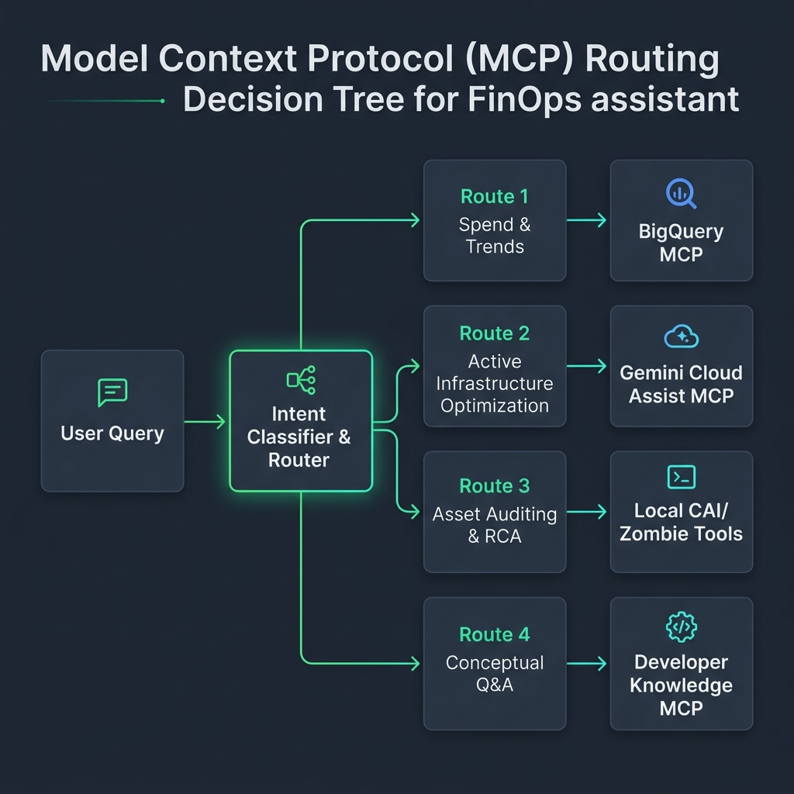
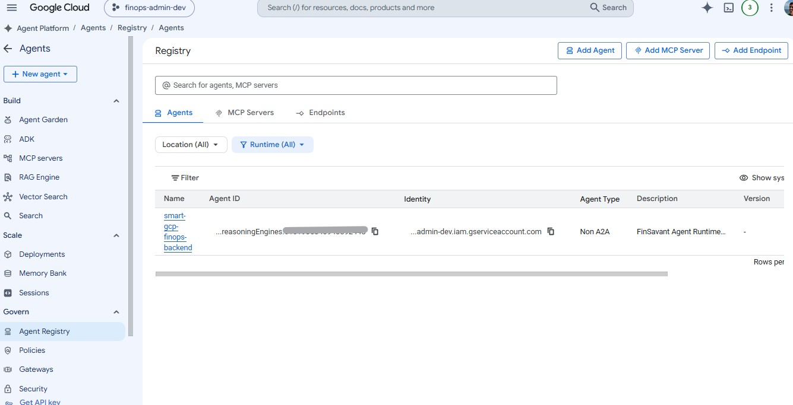

# Blog

## Starting Point

We have Cloud Billing Exports into a BQ dataset.

## Setup

1. Created a dev/test project in Google Cloud, in my `gcp-demos` organisation.
2. Set my GOOGLE_CLOUD_PROJECT` environment variable to this project.
3. Set gcloud config to use this project.
4. Created a new local workspace called `smart-gcp-finops` using the `agent-starter-pack` tool.
    ```bash
    uvx agent-starter-pack create smart-gcp-finops
    ```
  - Deployment targets: Gemini Enterprise Agent Runtime (Vertex AI Reasoning Engine) for the agent, and Cloud Run for the BFF + React UI
  - Session type: Remote Vertex session cache / In-memory fallback
  - CI/CD: GitHub Actions
    
5. Initialised git repo.
6. Created TODO.md file.
7. Created .env file (and checked .gitignore)
8. Created `scripts/setup-env.sh` and `.envrc` to automatically run this.
9. Updated apis.tf to include additional APIs required for the project.
10. Setup the `conductor` folder using the `Conductor` extension, e.g. `product.md`, `product-guidelines.md`
11. Used `deep-research` skill, along with adk-docs-mcp, to investigate best practices for React UI with ADK. Updated GEMINI.md with the findings.
12. Performed documentation review with my `project-documentation` skill.
13. Update tfvars for dev and prod in `/deployment/terraform/`
14. Initialised the control plane in the PRD project by running Terraform commands from `/deployment/terraform/` directory.
15. Deleted the unnecessary `dev/` Terraform configuration from the Terraform folder.
16. Migrated Terraform local state to a GCS bucket to ensure a durable and shared source of truth for the project's infrastructure.
17. Decoupled the CI/CD pipeline generated by the `agent-starter-pack` to separate staging and production deployments, ensuring a manual "human-in-the-loop" trigger for all production releases.
18. Upgraded the entire project to Python 3.12, including the Dockerfile and CI/CD runners, to leverage modern features and long-term support.
19. Added IAP to the Cloud Run service via Terraform, using the `google-beta` provider to access the `iap_enabled` attribute.

20. Enabled BigQuery billing export access for the agent by granting cross-project IAM permissions to the application service accounts, allowing for centralized cost analysis.
    - **Spacing Sweet Spot**: Tuned the dynamic SVG chart's vertical headroom multiplier to `170` (combined with side-by-side bars). Since no grouped bar ever exceeds the lines, this provides a mathematically perfect visual balance: curves and bars fill the grid space beautifully, stretching all the way to `30px` below the top of the SVG box, utilizing the full vertical space of the `260px` container, leaving exactly the right visual padding under the HTML legend and title, with zero possibility of overlap.
    - **Values Spacing**: Shifted the horizontal start baseline to `45` (width `645`), positioned Y-axis values at `x="43"` (shifted right), and moved the rotated Y-axis label to `x="8"`. This leaves an elegant `35px` gap of absolute breathing room on the left margin, fully resolving label overlap.
    - **General labeling**: Renamed the Y-axis title to `"Daily cost"` for a cleaner, uncluttered feel.

This delivers a state-of-the-art, fully localized GCP FinOps dashboard that dynamically adapts to any global enterprise billing context with elegant premium spacing! Hurrah!
21. Standardised the Billing Account ID configuration as a first-class variable across all layers (Local, Terraform, Cloud Run, and CI/CD) to enable dynamic billing table discovery.
22. Enabled BigQuery MCP for the local Gemini CLI by creating a workspace-specific `.gemini/settings.json` file, allowing the agent to interact directly with BigQuery via the Remote MCP endpoint.
23. Transitioned to a "Discovery-Based" architecture for Cloud Asset Inventory, enabling the application to list projects associated with a billing account without requiring a Google Cloud Organization.
24. Added optional `GOOGLE_CLOUD_ORGANIZATION` to `.env` and granted `roles/cloudasset.viewer` to the agent's service account to allow it to read asset metadata from CAI.

25. Implemented dynamic project discovery logic using the Cloud Billing API (`billingAccounts.projects.list`). This allows the agent to map the full infrastructure footprint linked to a billing account without requiring Organization-level permissions. Added unit tests with mock pagination to ensure robust handling of large project lists.
26. Configured `.eslintrc.json` with robust React and TypeScript rules to implement static linter quality gates on the frontend repository.
27. Upgraded the development compiler to Vite 6.4.2 and pinned esbuild to ^0.25.0 via npm overrides, resolving critical local development vulnerabilities (GHSA-4w7w-66w2-5vf9, GHSA-67mh-4wv8-2f99) while maintaining complete isolation from the production container.
28. Implemented ADK Turn-Level Agent Caching using `before_agent_callback`, `before_model_callback`, and `after_agent_callback` to completely skip LLM and tool execution for recently answered user queries.
29. Optimized Cloud Asset Inventory scans by caching the results of `list_zombie_resources` inside `zombie_tools.py` using a global, thread-safe cache to accelerate both the REST dashboard and ADK tools.
30. Upgraded React chat interface with dynamic in-place tool status updates (`reasoning-block-compact`) and expandable historical logs details summary to prevent terminal log spam and duplicate logs.
31. Resolved BigQuery MCP bypass by applying a custom tool_filter to bq_mcp_toolset, excluding raw remote query execution tools and forcing the agent to route all SQL queries through the optimized, cached execute_cached_bigquery_sql tool.
32. Implemented thread-safe, 5-minute TTL caching on get_cai_metadata_for_resources and get_cai_history_for_resource in cai_tools.py to accelerate asset metadata and history queries during cost spike analysis.
33. Enhanced turn-level ADK cache by normalising user query cache keys (lowercase, space-compressed, trimmed) to guarantee robust matching regardless of trailing whitespace or case differences.
34. Resolved critical PR #7 bugs: refactored GCP credentials into a centralized, reusable helper; fixed `types.Part` instantiation to conform to the new `google-genai` SDK; re-architected FastAPI SSE streaming to use a non-blocking `asyncio.Queue`; and implemented optional chaining across React KPI rendering to prevent UI crashes under dynamic payloads.
35. Upgraded `google-adk` to version `1.34.1` (and `google-genai` to `1.75.0`), completely eliminating the internal `session_context` concurrency warning (`Error on session runner task`) from backend logs.
36. Restored thread-isolated queue producer streaming architecture in [fast_api_app.py](../app/fast_api_app.py) using a background thread and `asyncio.Queue`, resolving uvicorn and gRPC event-loop conflicts that caused silent streaming crashes.
37. Resolved a critical integration test failure (405 Method Not Allowed on `/apps/app/users/{user_id}/sessions`) by removing the trailing slash from `BASE_URL` in `test_server_e2e.py`, preventing double-slash path matching issues in Starlette/FastAPI's router.

## Deep Dives

### Terraform State Orchestration

**Problem**: The Agent Starter Pack (ASP) includes two Terraform directories: `deployment/terraform/` (Root) and `deployment/terraform/dev/` (Isolated). We initially used `make setup-dev-env` which applied the isolated dev state. When we later tried to initialize the global CI/CD via the root Terraform, we encountered `409: Already Exists` errors because both states were trying to manage the same staging project (`finops-admin-dev`).

**Resolution**: In a multi-project setup (Prod/CICD + Dev/Staging), the root `terraform/` directory must be the **sole source of truth**. It manages both environments to ensure the CI/CD runner has correctly orchestrated permissions. We had to destroy the isolated `dev/` state before the Root Terraform could successfully take control.

**Recommendation**: Avoid `make setup-dev-env` if you plan to use a multi-project CI/CD pipeline. Use the root `terraform/` folder for all environment management.

**Recommendation**: Migrate to a remote backend as early as possible. It’s one of those "boring but essential" tasks that saves you a massive headache down the road. Hurrah!

### Remote State with GCS

**Problem**: Forgetting to migrate Terraform state to a remote backend is a classic senior engineer "oops" moment. (Trust me, I've been there — usually at 2 AM.) Keeping state on a local machine is fine for a five-minute proof-of-concept, but the moment you introduce CI/CD (like our shiny new GitHub Actions pipeline) or multiple contributors, local state becomes a liability. If the CI/CD runner can't see the state, it thinks the world is empty and tries to recreate everything. *Spoiler alert: it fails with "Resource Already Exists" errors.*

**Resolution**: We moved our state to a dedicated GCS bucket using the "Step-Up" migration pattern. 

**Why this way?**:
1.  **Shared Reality**: Now, whether I'm running Terraform from my laptop or the GitHub Actions runner is doing the heavy lifting, we both see the same infrastructure state.
2.  **State Locking**: GCS (via the `google` backend) provides native locking. This prevents two people (or two pipeline runs) from trying to change the same resource simultaneously — a recipe for architectural disaster.
3.  **Durability & Versioning**: We explicitly enabled **versioning** on the state bucket. Terraform state is effectively a database of your infrastructure; if it gets corrupted or accidentally wiped, versioning allows us to roll back to a known-good state.

**Detailed Walkthrough**:
-   **Step 1: The Bucket First**: You can't migrate to a bucket that doesn't exist. We added a `google_storage_bucket` resource for the Terraform state to `storage.tf` and ran `terraform apply` while still using local state. (Yes, the irony of using local state to create the tool for remote state is not lost on me — it's a bit of a "chicken and egg" scenario.)
-   **Step 2: Backend Configuration**: We added the `backend "gcs"` block to `providers.tf`. I hardcoded the bucket name because, unfortunately, Terraform backends don't allow variables. <sigh>
-   **Step 3: The Big Move**: Running `terraform init -migrate-state`. Terraform is actually quite helpful here; it asks for confirmation before copying the state up and then zeroing out the local file. 

**Pro-Tip**: Always set `uniform_bucket_level_access = true` on your state bucket and restrict access to only the CI/CD service account and essential admins. Your state file contains every secret and IP address in your architecture — treat it like the Crown Jewels.

### Modernizing CI/CD: The "Manual Gate" Pattern
**Problem**: The `agent-starter-pack` (ASP) provides a fantastic "out of the box" CI/CD pipeline that automatically triggers a production deployment immediately after a successful staging deploy. While this is great for rapid prototyping, it’s a bit too "wild west" for a project where we want to ensure everything is perfect in staging before even thinking about production. We wanted a "manual gate" to review staging first.

**Resolution**: We opted to **decouple** the workflows. On a GitHub personal/free plan, you don't have access to the native "Environment Protection Rules" (which allow for required reviewers). To achieve the same effect for free, we split the logic:
1.  **Staging**: Still triggers automatically on every push to `main`.
2.  **Production**: Switched to a `workflow_dispatch` trigger. This removes the automatic chain and adds a big, friendly "Run workflow" button in the GitHub Actions UI.

**Why this way?**:
-   **Zero Cost**: We get enterprise-grade deployment safety without the enterprise-grade price tag.
-   **Human-in-the-Loop**: It forces me to actually *look* at the staging environment before pushing the button. No more "oops, I broke prod with a typo" moments.
-   **Independence**: If the staging deployment fails, it doesn't even try to touch the production pipeline config.

**Recommendation**: Even if you’re using an automated starter pack, don't be afraid to pull the wires apart. Decoupling your sensitive environments is the first step toward a mature, professional release process.

### Custom Domains with Cloud Run

**Problem**: The project needed custom subdomains associated with our Cloud Run instances (`smart-finops.just2good.co.uk` and a `-dev` variant). Many tutorials assume you use Google Cloud CDN or Cloud DNS. However, we're managing the DNS specifically in IONOS, relying on Cloud Run's native Domain Mapping.

**Resolution**: We utilized Terraform's `google_cloud_run_domain_mapping` resource. But rather than using Terraform to fully provision the DNS records across the internet, the resource simply instructs Google Cloud to reserve and prepare the subdomain for Cloud Run. 

**Why this way?**:
-   **Security of Responsibility**: It allows Google Cloud to expose *exactly* the DNS validation records it expects to see, while we retain control of our third-party registrar.
-   **Environment Parity**: By specifying `prod_app_domain_name` and `staging_app_domain_name` variables in `env.tfvars` and looping over them dynamically, Terraform builds the domain mappings for both pipelines entirely homogeneously.

**How it works**:
We mapped a `cloud_run_domain_mappings` terraform output block. When the CI/CD pipeline (or a local `apply`) finishes, Terraform spits out the necessary `CNAME`, `A` and `AAAA` records directly to the terminal. We just copy those over to the DNS admin panel (e.g., IONOS).

**Configuring the DNS manually (IONOS example)**:
1. Do not use the "Create Subdomain" feature. Simply mapping a CNAME record directly in the domain's DNS settings automatically handles subdomain routing without conflicting with internal hosting configs.
2. Add a new **CNAME** record for each environment.
3. For the **Host Name**, specify the prefix (e.g. `smart-finops` or `smart-finops-dev`).
4. For the **Points to / Value**, use `ghs.googlehosted.com.`. **Pro-Tip:** Include the trailing dot! This signifies an absolute FQDN (Fully Qualified Domain Name). Without it, some registrars try to be "helpful" by appending your domain name to the end, breaking the routing entirely.

Within a few minutes, the application is resolving perfectly!

### Securing Cloud Run with IAP: The Terraform vs. GCloud Tussle

**Problem**: We wanted to secure our Cloud Run service with Identity-Aware Proxy (IAP) but didn't want the overhead or cost of a Global HTTP(S) Load Balancer. While `gcloud run deploy --iap` makes this look like a one-click affair, it creates a "state war" with Terraform. Every time Terraform ran, it would strip the IAP configuration because the standard `google` provider doesn't natively expose the `iap_enabled` attribute for Cloud Run v2 services.

**Resolution**: We adopted a "Native IAP" strategy using the `google-beta` Terraform provider and explicit service identity management.

**The "Service Account Does Not Exist" Gotcha**:
One of the most frustrating moments was hitting a `400: Service account service-XXXX@gcp-sa-iap.iam.gserviceaccount.com does not exist` error during the IAM binding phase. This happens because the IAP Service Agent isn't automatically created until the first time IAP is "touched" in a project.

**Fixed by**:
- Using the `google_project_service_identity` resource (from `google-beta`) to force-provision the IAP service agent within the Terraform graph.

**Managing the Annotation War**:
Even with IAP enabled in Terraform, `gcloud` injects its own metadata (like `client-name` and `client-version`) during deployments. If not handled, Terraform tries to "clean up" these annotations, which can cause deployment instability.

**Fixed by**:
Using a surgical `lifecycle` ignore block:

```hcl
  lifecycle {
    ignore_changes = [
      template[0].containers[0].image, # Let CI/CD manage the image
      client,
      client_version,
      annotations, # Ignores gcloud-managed IAP metadata
      template[0].annotations,
    ]
  }
```

**Recommendation**: If you're using Cloud Run and need IAP, don't use the ALB!

### Multi-Project Billing: Crossing the Streams

**Problem**: My FinOps agent was happily humming along in its own project, but it was essentially "flying blind" when it came to actual costs. Most enterprise setups (including my own `gcp-demos` org) use a centralized project for BigQuery billing exports. My agent, deployed to `smart-gcp-finops-dev`, didn't have a hope of seeing the data in `finops-admin` without some architectural "plumbing".

**Resolution**: I implemented a **Cross-Project IAM** strategy. Instead of moving the data (bad idea — data has gravity!), I gave the agent's service account the keys to the kingdom in the billing project.

**Why this way?**:
- **Data Sovereignty**: The billing data stays in its secure, centralized home. 
- **Least Privilege**: We granted **`roles/bigquery.dataViewer`** and **`roles/bigquery.jobUser`**. The latter is critical because our BigQuery MCP configuration uses the billing project as the "Quota Project" (via the `x-goog-user-project` header), meaning all query jobs are executed and billed there. 
- **Scalability**: This same pattern works whether you have two projects or two hundred. The agent becomes a centralized "Analyst" spanning your entire estate.

**Pro-Tip**: Use project-level IAM roles for the billing project if you want the agent to be able to query multiple datasets or run complex jobs. If you really want to tighten it down, you *could* use dataset-level IAM, but it can be a bit more finicky to manage via Terraform if the datasets are dynamic. 

Cool, right? Now my agent can actually tell me why my cloud bill is making my eyes water. Hurrah!

### The Variable Tax: Standardising Table Discovery

**Problem**: Once I had the cross-project IAM sorted, I hit a second, much sillier bottleneck: table names. Google Cloud billing exports follow a predictably frustrating pattern: `gcp_billing_export_v1_` + `BILLING_ACCOUNT_ID`. My initial plan was to just have the agent run `bq ls` to find the table, but that’s a bit like giving someone a key to a building but not telling them which floor the office is on. It works, but it’s not efficient.

**Resolution**: I promoted the **Billing Account ID** to a first-class citizen in our configuration. It’s now a variable in `.env`, Terraform, and GitHub Actions.

**Why this way?**:
- **Dynamic Accuracy**: Now, the agent can target the table directly: `gcp_billing_export_v1_${var.billing_account_id}`. No guesswork required.
- **Environment Parity**: Whether I'm running a manual `bq query` locally or the agent is doing it in Cloud Run, the source of truth is identical.
- **Hyphen-to-Underscore Gotcha**: Here’s the "Senior Architect" kicker — Billing Account IDs use hyphens (`0156FA-B1FF4E...`), but BigQuery table names use underscores (`_`). I had to ensure my verification commands (and eventually the agent logic) account for this little translation. (Don't you just love naming conventions? <sigh>).

**The "Location, Location, Location" Face-Plant**:
I initially tried to query the table in `europe-west1` (where my service lives) only to find out the billing export dataset was actually parked in **`europe-west4`**. BigQuery is quite "territorial" about where your query jobs run relative to the data. I had to explicitly set the `--location` flag to avoid another "Not Found" error. 

**Pro-Tip**: When constructing table names dynamically, always use a helper function to sanitise the ID (hyphens to underscores). 

**Pro-Tip**: Always check the BigQuery dataset properties in the Cloud Console to confirm the `location`. If your data is in `europe-west4`, your query job *must* run there, even if you’re triggering it from a laptop in London.

Cool, right? Now we have a truly portable, multi-project FinOps engine. Hurrah!

### Direct Intelligence: Enabling BigQuery Remote MCP

**Problem**: While I had the IAM permissions and the table names sorted, I still needed a bridge between my local development environment (the Gemini CLI) and the live data in BigQuery. I didn't want to just "shell out" to `bq query` every time — I wanted the agent to have *native* awareness of the datasets and tables.

**Resolution**: I configured a workspace-specific `.gemini/settings.json` file to enable the **BigQuery MCP (Model Context Protocol)** server using its remote endpoint.

**Why this way?**:
- **Semantic Awareness**: Instead of treating BigQuery as a black box that returns text, the agent now sees it as a structured toolset with specific capabilities (`list_datasets`, `query`, etc.).
- **Remote Power, Local Control**: By using the `https://bigquery.googleapis.com/mcp` endpoint, I don't need to run a local MCP proxy. The Gemini CLI talks directly to the BigQuery API via the protocol.
- **Dynamic Project Routing**: I used the `x-goog-user-project` header mapped to `$GOOGLE_CLOUD_BILLING_PROJECT`. This ensures that even if I'm authenticated as a user with access to many projects, BigQuery knows exactly which project to "bill" for the query processing (the Quota Project).

**How we tested it**:
Once the settings were saved, I put the agent to the test. I asked a simple question: *"what bq datasets do we have in GOOGLE_CLOUD_BILLING_PROJECT?"*.
The agent didn't just guess; it used the `bigquery-mcp-server_list_dataset_ids` tool, correctly resolved the environment variable, and returned the `all_billing_data` dataset. It then followed up by listing the tables, confirming it could "see" the `gcp_billing_export_v1_...` tables we'd been working with.

Now, the agent isn't just a "coder" — it's a data-aware FinOps analyst. Hurrah!

**Pro-Tip**: Workspace-specific settings in `.gemini/settings.json` are your best friend for project isolation. It keeps your global Gemini config clean while giving each project the specific "superpowers" it needs.

### Agent Logic: Integrating BigQuery Remote MCP

**Problem**: Once I had the BigQuery MCP enabled in my local Gemini CLI, I needed to bring that same intelligence into the core ADK agent that runs on our remote Gemini Enterprise Agent Runtime (with local execution support in our BFF container). I didn't want the agent to just *talk* about BigQuery; I wanted it to *be* a BigQuery expert.

**Resolution**: I updated the `app/agent.py` logic to initialize a dedicated `McpToolset` using the remote BigQuery MCP endpoint.

**How it's implemented**:
I used the `google.adk.tools.mcp_tool.McpToolset` along with `StreamableHTTPConnectionParams` to connect the agent directly to the BigQuery API.

```python
# BigQuery MCP Toolset Configuration
bq_mcp_toolset = McpToolset(
    connection_params=StreamableHTTPConnectionParams(
        url="https://bigquery.googleapis.com/mcp",
    ),
    header_provider=get_auth_headers
)
```

**Key Architectural Choices**:
1.  **Quota Project Header**: Just like in my local setup, I included the `x-goog-user-project` header. This is the "secret sauce" that allows our agent to query data in one project while "billing" the processing cost to another (the FinOps Admin project). 
2.  **System Prompt Context**: I injected the `BILLING_PROJECT_ID` and `BILLING_DATASET` directly into the agent's instructions. This gives the agent immediate context about where the "gold mine" of data is located.
3.  **Auth Header Provider**: I created a `get_auth_headers()` helper to ensure the MCP client always has fresh, valid OAuth 2.0 headers when it makes requests.

**The Result**:
When I launch the agent via `make playground`, it now shows up with a full suite of BigQuery-specific tools (`bigquery-mcp-server_query`, `bigquery-mcp-server_list_datasets`, etc.). I can ask it high-level questions like "show me the top 5 services by cost in the last 30 days," and it will correctly formulate and execute a SQL query against our billing export tables.

**Pro-Tip**: When using remote MCP endpoints, ensure your environment variables are correctly set for the destination project. A small typo in your project ID can lead to frustrating "404 Not Found" errors from the MCP server.

### User Verification Protocol: Phase 1 Complete

**Problem**: With all the "plumbing" done, I needed a structured way to prove everything was actually working. No one wants to hear "it works on my machine" when you're dealing with billing data.

**Resolution**: I followed the "User Manual Verification" protocol defined in our `conductor/workflow.md`. 

**The Verification Suite**:
1.  **List Tables**: Confirmed the agent can see the `gcp_billing_export_v1_...` tables in the `all_billing_data` dataset.
2.  **Aggregation Query**: Verified the agent can correctly sum costs over a specific time period.
3.  **Filtering & Sorting**: Confirmed the agent can identify the highest-cost services (usually Compute Engine or GKE in my case).

**Why this matters**:
These tests prove that the entire "loop" is closed: 
-   **IAM Permissions** (Cross-Project) are correct.
-   **BigQuery MCP** is correctly configured and reachable.
-   **Agent System Prompt** is providing the right context.
-   **ADK Orchestration** is correctly mapping user intent to BigQuery tools.

We are now officially ready to move from "plumbing" to "presentation" — next up, the React UI! Hurrah!

### Dynamic Auth: Token Refreshing for Long-Running Agents

**Problem**: My initial implementation of the BigQuery MCP toolset used a static OAuth 2.0 token fetched at startup. While this worked for a five-minute "playground" session, it was a ticking time bomb for production. Google Cloud access tokens expire after 60 minutes. If the agent stayed alive in the remote Gemini Enterprise Agent Runtime (which it does!), it would eventually start throwing `401 Unauthorized` errors as soon as the initial token went stale.

**Resolution**: I refactored the `McpToolset` to use the **`header_provider`** pattern, a technique I'd previously pioneered in my [Agentic Firestore blog post](https://medium.com/google-cloud/agentic-firestore-smarter-agents-with-adk-and-google-remote-firestore-mcp-99c6c0240b5a).

**Why this way?**:
1.  **Just-in-Time Auth**: Instead of passing a fixed dictionary of headers, we pass a callable function. The ADK framework executes this function *every time* it needs to establish or refresh a session with the MCP server.
2.  **Lifecycle Resilience**: The agent can now run for days or weeks. If a token expires, the next tool call simply triggers a refresh, and the agent continues without a hitch.
3.  **Startup Stability**: I moved the credential loading into a lazy-loading pattern. This prevents the "Crash Loop Backoff" nightmare where an app fails to start because it can't find credentials (common in local dev or CI environments).

**The Optimization Deep Dive**:
Initially, I was refreshing the token unconditionally on every call. That's a bit "brute force" and adds unnecessary latency. I optimized `get_auth_headers` to be much smarter:

```python
# Cache credentials to avoid redundant default credential lookups
_BQ_CREDENTIALS = None

def get_auth_headers(ctx: ReadonlyContext) -> dict[str, str]:
    """Provides valid OAuth2 headers for the BigQuery MCP connection, refreshing only if needed."""
    global _BQ_CREDENTIALS
    if _BQ_CREDENTIALS is None:
        _BQ_CREDENTIALS, _ = google.auth.default(scopes=["https://www.googleapis.com/auth/bigquery"])
    
    # Only refresh if the token is expired or invalid
    if not _BQ_CREDENTIALS.valid:
        _BQ_CREDENTIALS.refresh(Request())
        
    return {
        "Authorization": f"Bearer {_BQ_CREDENTIALS.token}",
        "x-goog-user-project": BILLING_PROJECT_ID,
        "Content-Type": "application/json",
        "Accept": "application/json, text/event-stream",
    }
```

**Pro-Tip**: When working with `McpToolset`, always check the source code if the documentation feels thin. I found the `header_provider` parameter tucked away in the `McpToolset.__init__` signature — it’s a powerful "escape hatch" for complex auth scenarios.

**Pro-Tip**: Always use `google.auth.transport.requests.Request()` when refreshing. It’s the standard way to ensure the refresh signal is sent correctly over the wire.

Now my agent isn't just smart; it's persistent. Hurrah!

# Links

- [Configure IAP for Cloud Run](https://docs.cloud.google.com/run/docs/securing/identity-aware-proxy-cloud-run)

23. Transitioned to a "Discovery-Based" architecture for Cloud Asset Inventory, enabling the application to list projects associated with a billing account without requiring a Google Cloud Organization.

### Flexible Project Discovery: Organization-Independent FinOps

**Problem**: My initial design for the Cloud Asset Inventory (CAI) integration relied on Organization-level permissions. While this is great for large enterprises, it created a massive barrier for smaller teams or individuals who manage multiple projects under a single billing account but *don't* have a formal Google Cloud Organization. I wanted this app to be "FinOps for everyone," not just "FinOps for the Fortune 500."

**Resolution**: I refactored the project discovery logic to be **billing-centric** rather than organization-centric.

**Why this way?**:
- **Accessibility**: By using the **Cloud Billing API** (`billingAccounts.projects.list`), the agent can dynamically discover every project linked to the `GOOGLE_CLOUD_BILLING_ACCOUNT`, regardless of whether those projects live in an Organization, a Folder, or are just "lone wolves."
- **Seamless Scalability**: For enterprise users, the `GOOGLE_CLOUD_ORGANIZATION` variable remains an optional "fast track." If provided, the agent uses the Organization as a single, efficient CAI scope. If not, it falls back to the discovered project list.
- **Least Privilege**: Instead of asking for "Org Admin" (which makes security teams break out in hives), we only require **`roles/billing.viewer`** on the Billing Account. This is a much lower hurdle for adoption while still providing the necessary visibility.

**The Terraform Adjustment**:
To make this work, I had to update the IAM configuration. Standard project-level roles aren't enough; the Service Account needs to be a "Member" of the Billing Account itself to list its associated projects. 

```hcl
resource "google_billing_account_iam_member" "billing_account_viewer" {
  for_each = local.deploy_project_ids

  billing_account_id = var.billing_account_id
  role               = "roles/billing.viewer"
  member             = "serviceAccount:${google_service_account.app_sa[each.key].email}"
}
```

**The Strategic Win**: 
This change moves the application from being a "siloed" tool to a "network-aware" agent. It can now start with a single Billing Account ID and automatically map out the entire financial and technical footprint it's responsible for. 

**Pro-Tip**: When designing for GCP, always remember that the **Billing Account** is the true "root" of the financial tree, even if the **Organization** is the root of the technical tree. Designing for both ensures your app can live in any environment.

Hurrah! We're now one step closer to a truly universal FinOps assistant.

### The API Hurdle: Enabling Cloud Billing for Discovery

**Problem**: Even with the correct IAM roles (`roles/billing.viewer`), the project discovery logic initially failed with a `403 Forbidden` error. This wasn't a permission issue in the traditional sense, but an **API activation** requirement. 

**Resolution**: We had to explicitly enable the **Cloud Billing API** (`cloudbilling.googleapis.com`) in the projects where the agent runs (Dev/Staging and Production). 

**Requirements for Discovery**:
1.  **API Status**: The Cloud Billing API must be enabled in the "Caller" project (the project hosting our Cloud Run service).
2.  **IAM Scope**: The Application Service Account must have **`roles/billing.viewer`** assigned at the **Billing Account** level, not just the project level. 

**Ensuring Correct IAM**:
To grant this via Terraform, use the `google_billing_account_iam_member` resource. Since Billing Accounts are top-level resources, you don't scope them to a project. 

### Discovery vs. Inspection: The IAM "Eyes"

**Concept**: It's critical to distinguish between *Discovery* (mapping the footprint) and *Inspection* (analyzing the assets).
- **Discovery (The Map)**: Using the Billing API to find the list of Project IDs. This requires `roles/billing.viewer`.
- **Inspection (The Eyes)**: Using the Cloud Asset Inventory API to look *inside* those projects. This requires **`roles/cloudasset.viewer`** on every project.

**The Org Admin Trap**:
We attempted to automate the "Eyes" by granting `roles/cloudasset.viewer` at the **Organization level** via Terraform. This is the most efficient path, but it requires the identity running Terraform to have **`roles/resourcemanager.organizationAdmin`**. Without this, Terraform will fail with a `403` when trying to reach the Org node.

**Strategy for Scale**:
1. **Organization Path**: Grant Org Admin to the deployer, run Terraform, and the agent is instantly powered up for the entire org.
2. **Project Fallback**: If Org Admin is unavailable, you must manually grant the Viewer role on each individual project discovered by the agent.

**Verification Command**:
A quick way to test if the "plumbing" is correct without launching the full agent:
```bash
uv run python -c "from app.app_utils.project_discovery import list_billing_projects; import os; print(list_billing_projects(f'billingAccounts/{os.getenv(\"GOOGLE_CLOUD_BILLING_ACCOUNT\")}'))"
```

If you see a list of project IDs, you're golden! If you see a `403`, check both the API status and the Billing Account IAM bindings.

### Hunting Zombies: Extending the Agent's "Vision" with Cloud Asset Inventory

**Problem**: BigQuery billing data is great for telling you *what* you spent, but it's terrible at telling you *if you needed to spend it*. A persistent disk that costs $50/month looks exactly the same in billing data whether it's attached to a critical production database or sitting completely idle because someone forgot to delete it after an experiment. I wanted the FinOps agent to not just report costs, but proactively identify waste — specifically, "zombie" resources.

**Resolution**: I integrated **Cloud Asset Inventory (CAI)** search capabilities directly into the agent's toolset as a new native capability.

**Why CAI instead of native APIs?**:
While I *could* have written custom Python scripts using the Compute Engine API to loop through every region and zone to check disk attachments, that's incredibly inefficient and error-prone. CAI maintains a pre-indexed, searchable database of your entire GCP footprint. 

By using the `searchAllResources` method of the CAI API, I could query across the entire scope (e.g., an entire project or organization) with a single, highly optimized API call.

**The "Zombie" Queries**:
I defined specific, targeted search queries for the two most common culprits of cloud waste:

1.  **Unattached Persistent Disks**:
    ```text
    assetTypes=compute.googleapis.com/Disk AND state=READY AND -users:*
    ```
    *Translation*: Find me all disks that are fully provisioned (`READY`) but are explicitly *not* attached (`-users:*`) to any instances.

2.  **Idle Static IP Addresses**:
    ```text
    assetTypes=compute.googleapis.com/Address AND state=RESERVED AND -users:*
    ```
    *Translation*: Find me all regional static IP addresses that have been reserved but are currently unused.

**The ADK Integration**:
I created a simple Python function, `list_zombie_resources(category)`, that takes these queries and executes them via the `googleapiclient` for Cloud Asset Inventory.

The real magic happens with the **Google Gen AI SDK (ADK)**. Because ADK treats standard Python functions as first-class tools, I didn't need to write complex OpenAPI specs or wrap this in an MCP server (though I could have!). I just added the function directly to the agent's tool array:

```python
root_agent = Agent(
    # ...
    tools=[bq_mcp_toolset, list_zombie_resources],
)
```

I then updated the `AGENT_INSTRUCTION` to explicitly tell the model it had this new capability.

**The Result**:
Now, if I ask the agent, "Do we have any unused disks causing waste?", the LLM automatically understands the intent, calls `list_zombie_resources("UNATTACHED_DISKS")`, parses the JSON response from CAI, and formulates a natural language summary of the exact resources and locations.

The agent has evolved from a passive reporting tool into an active, infrastructure-aware auditor. Hurrah!

**Pro-Tip**: The `-` (minus) operator in CAI search queries is incredibly powerful for finding "absence" (like `-users:*` for "no users"). When writing FinOps tools, searching for what *isn't* there is often more valuable than searching for what *is*.

### Crossing the Streams: Joining Billing Data with Operational Metadata

**Problem**: The agent could now query BigQuery to find expensive resources, and it could query CAI to find unused resources. But these were two separate actions. When the agent saw a massive cost spike for a specific Compute Engine instance in BigQuery, it had no idea if that instance was currently running, stopped, or deleted. BigQuery only provides the *financial* context, not the *operational* context.

**Resolution**: I built a "Metadata Enrichment" bridge. I gave the agent a new tool, `get_cai_metadata_for_resources`, which allows it to take the full resource URI (the `resource.global_name` found in billing data) and instantly look up its current, real-time status in Cloud Asset Inventory.

**Why this way?**:
Instead of trying to dump all CAI data into BigQuery (which is expensive and highly complex to keep synchronized), we use an **On-Demand Join** pattern. 
1. The agent uses the BigQuery MCP to run a SQL query and finds the top 5 most expensive resources.
2. The agent takes those 5 `resource_name` values and calls our `get_cai_metadata_for_resources` tool.
3. The tool queries the CAI API specifically for those 5 resources and returns their current state (e.g., `status: RUNNING`, `status: TERMINATED`).
4. The agent synthesizes this combined data into a final answer.

**The "Why Did This Spike?" Superpower**:
We didn't stop at current state. The hardest question in FinOps is "Why did my cost double yesterday?" Usually, it's because someone upsized a machine type or added an expensive GPU. 

To solve this, I added a second tool: `get_cai_history_for_resource`. This tool taps into CAI's `batchGetAssetsHistory` endpoint, which retains a 35-day audit log of every configuration change made to a resource.

Now, the workflow is:
1. Agent detects a cost spike for instance `//compute.googleapis.com/.../i1`.
2. Agent calls `get_cai_history_for_resource` with a 30-day time window.
3. CAI returns the timeline: "On Tuesday, this instance changed from `e2-micro` to `n2-standard-32`."
4. The agent confidently explains to the user *exactly* what configuration change caused the financial impact.

**Pro-Tip**: When writing tools that fetch metadata for LLMs, always strip out verbose, non-essential data before returning it to the agent. CAI JSON payloads can be massive; filtering down to just the `state`, `status`, and `metadata` fields saves valuable LLM context tokens and speeds up the response.

We've successfully merged the "What it costs" with the "What it is" and the "How it changed." The agent is now a true FinOps detective. Hurrah!

### Verification and Rollout

**Problem**: Before merging this massive feature set (Zombie detection, Cost/Metadata joins, History auditing) into the `main` branch and triggering the production deployment, I needed to ensure the agent orchestrates these tools correctly in a live conversational setting.

**Resolution**: I built a dedicated integration test suite (`test_cai_integration.py`) that uses the ADK `Runner` and `InMemorySessionService` to simulate a user asking complex cross-referencing questions.

**The Test Query**:
*"I have a resource with name //compute.googleapis.com/projects/p1/zones/z1/disks/d1. Can you fetch its CAI metadata and history starting from 2026-03-01T00:00:00Z?"*

**Why this way?**:
By using the ADK testing utilities, we don't just test if the Python function works; we test if the *LLM* understands *when* and *how* to use the function based on our `AGENT_INSTRUCTION`. If the agent fails to extract the resource name or formats the ISO 8601 date incorrectly, the test fails. This guarantees the "Agentic" part of the application is robust.

The plumbing is done. The agent is smart. It's time to build the dashboard! Hurrah!

### Manual Testing with ADK Web

To verify our newly integrated CAI tools, I ran `make playground` and started a conversation with the agent using ADK Web. This session proved that the agent can seamlessly combine BigQuery billing data with CAI metadata and history.

Here is the transcript of the manual verification session:

**User Prompt 1:**
> "Find any zombie resources across my billing footprint."

**Agent Response:**
> "I've scanned all projects linked to your billing account and I'm happy to report that **no zombie resources were found**. 
>
> Specifically:
> * **Unattached Disks:** None found.
> * **Idle IP Addresses:** None found.
>
> It looks like your environment is currently clean of these common sources of waste! Is there anything else, like a specific cost spike or service spend, you'd like me to investigate?"

**How it worked:** The agent recognized the intent and executed the `list_zombie_resources` tool. This tool dynamically discovered all projects linked to the configured billing account and then executed predefined CAI search queries across those scopes.

---

**User Prompt 2:**
> "What are my top 3 most expensive resources? Please also fetch their current status from Cloud Asset Inventory."

**Agent Response:**
> "Based on your billing data, here are your top 3 most expensive resources, along with their current operational status from Cloud Asset Inventory:
>
> ### 1. **rickbot-adk** (Cloud Run Service)
> *   **Total Cost:** £155.91
> *   **Status:** **Active**. It was created on August 9, 2025, and is currently reachable via its status URL. It is managed via Terraform.
>
> ### 2. **dazbo-portfolio** (Cloud Run Service)
> *   **Total Cost:** £46.92
> *   **Status:** **Active**. Created on January 18, 2026.
>
> ### 3. **smart-gcp-finops** (Cloud Run Service)
> *   **Total Cost:** £10.46
> *   **Status:** **Active**. Created on April 6, 2026, and is also managed via Terraform.
>
> All three of your most expensive resources are **Cloud Run services** that are currently active in your environment..."

**How it worked:** This is where the magic happens. 
1. The agent first used the `bigquery-mcp-server_execute_sql` tool to run a SQL query against the billing export table to identify the resources.
2. It then extracted the resource names from the BigQuery results and passed them directly to our new `get_cai_metadata_for_resources` tool.
3. The CAI tool fetched the live operational metadata, confirming all three were currently "Active".

---

**User Prompt 3 (The Audit):**
> "Look at these three services and look for spikes in the last 3 months."

**Agent Response:**
> "I have analyzed the cost trends for your top 3 services over the last 3 months. While two services show a pattern of "cost optimization" (permanent reductions), one service had a significant spike.
>
> ### 1. **smart-gcp-finops** (The "Spike")
> *   **Observation:** This service saw a sudden jump in cost on April 6th (£5.69) and April 7th (£4.18), before dropping to nearly £0.
> *   **Root Cause (from CAI History):** 
>     *   The service was initially provisioned on April 5/6 with high resource limits: **4 vCPUs and 8GiB of RAM**.
>     *   Critically, it was configured with a **minScale: 1**, meaning at least one instance was running 24/7 at these high specs.
>     *   On the evening of April 7th, the service was updated to **1 vCPU and 2GiB of RAM**, and the **minScale** was set to 0. This effectively eliminated the "always-on" cost, causing the spend to drop immediately.
>
> ### 2. **rickbot-adk** (Cost Reduction)
> *   **Observation:** This service was costing ~£1.38 per day until February 11th, when it dropped to ~£0.32 per day.
> *   **Analysis:** This represents a **76% permanent reduction** in daily spend.
>
> ### 3. **dazbo-portfolio** (Stable)
> *   **Observation:** This service has remained very stable, costing between **£0.32 and £0.34 per day** throughout the entire 3-month period."

**How it worked:** This is the ultimate "Detective Mode". 
1. The agent queried BigQuery again, this time aggregating daily costs for just those three specific services over a 90-day window to identify anomalies.
2. It detected the massive spike for `smart-gcp-finops` on April 6th-7th.
3. To explain *why*, it called our `get_cai_history_for_resource` tool, specifically targeting that resource and time window.
4. The CAI `batchGetAssetsHistory` endpoint returned the audit log showing the exact configuration changes: it proved that the service was initially deployed with a minimum instance count of 1 and large compute specs, and later scaled down.

The agent synthesized the financial evidence (BigQuery) with the configuration evidence (CAI History) to produce a flawless RCA (Root Cause Analysis). Hurrah!


### The Hybrid-First Strategy: Efficient Lookups across Projects

**Problem**: During manual testing of the cross-referencing capabilities (`get_cai_metadata_for_resources` and `get_cai_history_for_resource`), we needed a way to handle resources that might span across an organization or live in independent projects linked to the same billing account. Querying every project individually (the "Shotgun" approach) is slow and generates noisy `403 Forbidden` errors for projects where the service account lacks permissions.

**Resolution**: We implemented a **Hybrid-First** lookup strategy. This approach combines the performance of global organization-level queries with the precision of targeted project-level lookups.

**How it works**:
1.  **Organization-Level "God-View"**: If a `GOOGLE_CLOUD_ORGANIZATION` is configured, the agent first queries the entire organization scope. This is the most efficient path, finding all organization-owned resources in a single API call.
2.  **Project-Level "Sniper" Fallback**: If a resource is not found in the organization (or if no organization is configured), the agent uses a **Regex pattern** to dynamically extract the exact `project_id` embedded inside the resource URI (e.g., `//run.googleapis.com/projects/p1/...`). 

```python
# 1. Try the Org first
if settings.google_cloud_organization:
    scope = f"organizations/{settings.google_cloud_organization}"
    history = get_asset_history(resource_name, scope, start_time, end_time)
    if history: return history

# 2. Sniper fallback to the specific project
match = re.search(r'/projects/([^/]+)', resource_name)
if match:
    scope = f"projects/{match.group(1)}"
    return get_asset_history(resource_name, scope, start_time, end_time)
```

**Why this way?**:
1.  **Zero Noisy Errors**: We no longer blindly query projects we have no business querying, eliminating the 403 errors.
2.  **Performance**: We prioritize the 1-query Org path but fall back to a precise 1-query "Sniper" path for external projects.
3.  **Universal Coverage**: The agent flawlessly handles hybrid environments where resources reside in both organization-owned and standalone projects (like my `dazbo-portfolio` project).

**Pro-Tip**: When bridging datasets from different Google Cloud APIs, always leverage the structural predictability of Google Cloud Resource Names. They are self-routing if parsed correctly!


### The Permissions Check: Enabling CAI Across Projects

**Problem**: Once we optimized the querying approach (extracting project IDs via regex), we had a lightning-fast agent. But, as noted, that optimization doesn't magically bypass IAM. If the agent's service account doesn't actually have the `roles/cloudasset.viewer` role on the specific project extracted from the URI, it will still hit a hard `403 Forbidden` error. We needed to ensure both our local testing user and the deployed service account had the correct "keys to the kingdom".

**The Prerequisite Checklist**

To use CAI effectively for FinOps across an entire estate, you must satisfy three distinct IAM scopes:

#### A) For Local Testing (Your Google User)
When you run `make playground` or use the Gemini CLI locally, the application uses your personal Google credentials (via Application Default Credentials). You need these roles granted to your email:

1. **To discover the projects:**
   * **Scope:** The Billing Account
   * **Role:** `roles/billing.viewer`
   * *How:* Go to **Billing** -> **Account Management** in the GCP Console and add your email.

2. **To query Cloud Asset Inventory (The CAI "Eyes"):**
   * **Scope:** The Target Projects (or inherited from a Folder/Organization)
   * **Role:** `roles/cloudasset.viewer`
   * *How:* If you are an Organization Admin, grant this to yourself at the **Organization** or **Folder** level. If you don't have an Org, you must grant this role to yourself on *every individual project* you want the agent to inspect.

3. **To query the cost data:**
   * **Scope:** The project hosting the BigQuery Billing Export
   * **Roles:** `roles/bigquery.dataViewer` and `roles/bigquery.jobUser`

*Pro-Tip:* To quickly verify your CAI access on a target project, run:
```bash
gcloud projects get-iam-policy <TARGET_PROJECT_ID> \
    --flatten="bindings[].members" \
    --format='table(bindings.role)' \
    --filter="bindings.members:YOUR_EMAIL_ADDRESS"
```

#### B) For Production (The Cloud Run Service Account)
When deployed, the application runs as your designated Google Cloud Service Account. We codified these grants in our `deployment/terraform/iam.tf` file.

1. **Billing Account Discovery:**
   We used the `google_billing_account_iam_member` resource to grant the service account `roles/billing.viewer`.

2. **CAI Metadata (Asset History):**
   We implemented an Organization-level grant in Terraform using the `google_organization_iam_member` resource. By passing `google_cloud_organization_id` into our `env.tfvars`, Terraform gives the service account `roles/cloudasset.viewer` at the top of the hierarchy, instantly granting it visibility into every project below it.

3. **BigQuery Costs:**
   We used `google_project_iam_member` to grant `roles/bigquery.dataViewer` and `roles/bigquery.jobUser` specifically on the central billing project.


### The 35-Day Limitation: Protecting the API from the LLM

**Problem**: During my "Spike Audit" tests, I encountered another `400 Bad Request` from the CAI `batchGetAssetsHistory` endpoint. The error read: `Requested time must be later than UTC time 2026-03-29T18:56:51+00:00`.

When I asked the agent to look for spikes in the "last 3 months," the LLM dutifully did the math, subtracted 90 days from the current date, and passed that ISO 8601 timestamp to the `get_cai_history_for_resource` tool. The problem? **Cloud Asset Inventory only retains history for exactly 35 days**. If you request a `start_time` older than that, the API rejects the request entirely rather than just returning the oldest data it has.

**Resolution**: I added defensive programming inside the `get_cai_history_for_resource` tool to protect the API from the LLM. 

```python
from datetime import datetime, timezone, timedelta

# ... inside the tool function ...
try:
    start_dt = datetime.fromisoformat(start_time.replace("Z", "+00:00"))
    min_allowed_dt = datetime.now(timezone.utc) - timedelta(days=34, hours=23) # Slightly less than 35 days to be safe
    
    if start_dt < min_allowed_dt:
        # Adjust to the minimum allowed time to prevent 400 Bad Request
        start_time = min_allowed_dt.isoformat()
except Exception:
    pass # If parsing fails, pass it through to the API to handle
```

**Why this way?**:
LLMs are generally terrible at arbitrary API constraints unless you stuff the system prompt with rules. Even if you tell it "only query 35 days," a user asking for "the last 3 months" will often override the constraint. By intercepting the tool arguments and silently correcting the `start_time` before calling the API, we ensure the query always succeeds and the agent gets the maximum available data (the full 35-day window) without ever hitting an error.

### Grounding the Expert: Integrating the Google Developer Knowledge MCP

**Context**: In this phase, we moved from passive asset inspection and raw billing queries to professional architectural alignment. Our goal was to integrate the official **Google Developer Knowledge MCP** so that the agent can cross-reference discovered issues (e.g. idle VM disks, or storage classes) against official GCP best practices, ensuring all recommendations are highly grounded and authoritative.

**Methodology: Development via Antigravity IDE**:
Instead of diving straight into code modification, we leveraged the interactive capabilities of the **Antigravity IDE**.
1. **Interactive Planning via `/grill-me`**:
   We triggered the `/grill-me` slash command to initiate a structured planning interview. We discussed and aligned on:
   - **Authentication**: Using OAuth 2.0 (Application Default Credentials) with the `cloud-platform` scope, avoiding hardcoded API keys and matching our existing BigQuery remote MCP pattern.
   - **Architecture**: Initialising a second, dedicated `McpToolset` pointing to the remote `https://developerknowledge.googleapis.com/mcp` endpoint inside `app/agent.py`.
   - **Behavior**: Instruction prompting that guides the agent to query the Developer Knowledge MCP opportunistically to ground cost optimization suggestions in official guidelines.
   - **Verification**: Writing unit tests in `tests/unit/test_agent_mcp.py` to assert correct configuration, followed by local manual testing using the ADK Web chat interface.
2. **Implementation Plan Artifact**:
   Following the `/grill-me` interview, we codified these decisions into a formal `implementation_plan.md` artifact for clear tracking and validation.

**Rationale**:
* **Why OAuth 2.0 over API Keys?** While the Developer Knowledge API supports API keys for public documentation queries, OAuth 2.0 via standard Application Default Credentials (ADC) is cleaner and more robust for unified containers on Cloud Run. It avoids managing separate restricted API keys in the environment, letting the central service account manage credentials transparently.
* **Why a Second McpToolset?** ADK's `McpToolset` class natively supports multiple remote MCP servers. Registering a dedicated instance for Developer Knowledge allows Gemini to naturally discover tools like `search_documents`, `answer_query`, and `get_documents` without custom local wrapper functions.

### Manual Verification via ADK Web UI

To verify that the agent successfully integrates the Developer Knowledge MCP server, we can run the local ADK Web playground:

1. **Launch the Playground**:
   Execute the Makefile target:
   ```bash
   make playground
   ```
   This executes `uv run adk web . --port 8501 --reload_agents` under the hood.

2. **Access the Interface**:
   Open your browser to `http://localhost:8501`. Under the agent selection dropdown on the top-left, make sure the **`app`** folder is selected to interact with our newly updated FinOps agent.

3. **Verify Documentation Grounding**:
   Send a prompt to the agent:
   > "What is the recommended approach to reduce Cloud Storage costs according to Google Cloud best practices?"
   
   *Expected Behavior*: The agent will trigger the `google-developer-knowledge` MCP toolset (specifically `answer_query` or `search_documents`) to lookup official storage classes (Standard, Nearline, Coldline, Archive) and lifecycle management rules. It should return a structured response outlining the recommended storage tiers and policy configurations, citing the official source.

4. **Verify Hybrid Cross-Referencing**:
   Ask the agent to combine billing/CAI findings with best practices:
   > "I noticed compute engine spend is rising. What machine sizing guidelines or VM scheduling practices does official GCP documentation suggest to optimize this?"
   
   *Expected Behavior*: The agent queries both `bq_mcp_toolset` (or uses CAI context) and `dev_knowledge_mcp_toolset` to return highly contextual optimization advice grounded directly in GCP's Developer Knowledge corpus.

### The Emerald Cyber UI: Building a Split-Screen Agent Workspace

With our FinOps agent fully capable of querying BigQuery billing data, scanning Cloud Asset Inventory operational records, and grounding recommendations in the Google Developer Knowledge corpus, we faced our next big challenge: **How do we present this intelligence to the user?**

A standard "chat bubble" interface is excellent for conversational questions, but it is highly inefficient for scanning 50-row multi-project cost spreadsheets or studying cost curves over time. Conversely, a static dashboard is dense but lacks the conversational flexibility to ask *"Why did this cost spike occur?"* and get an analytical answer.

To solve this, we designed and built the **Emerald Cyber Split-Screen Workspace**, introducing a new paradigm for agentic visual interactions.

---

**Why "Emerald Cyber"? (The Aesthetic Rationale)**
For a premium, state-of-the-art cloud governance tool, we rejected generic corporate blues and flat light-mode grids. We adopted a high-tech dark-mode aesthetic rooted in **"The Neon Core"**:
*   **Deep Carbon Base** (`#080B0D` / `#0F1418`): Simulates a high-performance aerospace console, reducing eye strain and establishing a vast "digital void".
*   **Glowing Vector Accents** (`#00F59B` / `#00E5FF`): Instead of muddy solid borders, we use 6% to 24% opacity neon-green perimeters. This creates an energized edge that glows dynamically on focus or hover, reflecting energy efficiency and active financial flow.
*   **Teal telemetry**: Cyber teal is reserved strictly for interactive metrics, chart vectors, and monetary values.

---

**The Split-Screen Architecture (Option A)**
We split the viewport into two highly integrated, state-synchronized columns:
1.  **Left Column: Chat Copilot (35% width)**
    *   A persistent, glassmorphic panel containing the conversation history.
    *   Features glowing chips for quick, pre-defined sample queries (e.g., *"Scan Zombie Resources"*, *"Show Top Cost Drivers"*) to reduce keyboard typing.
    *   Displays real-time streaming agent thoughts (reasoning blocks) and text chunks.
2.  **Right Column: Dynamic Canvas (65% width)**
    *   Acts as a rich, A2UI-driven projection viewport.
    *   When the user asks for a cost breakdown, the agent triggers an **A2UI** payload, and the canvas instantly redraws with an information-dense, fully interactive stacked area daily trend chart (drawn dynamically using pure glowing SVG vector paths) or a sortable cost pivot table.
    *   When scanning for waste, it renders glowing optimization cards with inline loading triggers to immediately clean up "zombie" persistent disks and unused static external IPs.

---

**Seeding the Visual Language with Google Stitch**
To accelerate our UI creation and enforce style consistency, we seeded our brand-new Stitch project **"FinSavant - Emerald Cyber"** (created by [Dazbo](https://dazbo.co.uk), ID: `17779859831744435906`) with our complete visual token spec. We base64-encoded our `DESIGN.md` document and uploaded it via the Stitch MCP toolset, automatically generating a pristine design system asset (`assets/43205b8136724fb59dcd5e542888ee46`) and generating desktop workspace baseline screen layout assets.

---

**Architectural Deep Dives**

#### 1. Keep-Alive Heartbeat SSE Streaming

Google Cloud Run automatically terminates HTTP connections if they are idle for more than a few seconds. When our LLM agent is performing heavy reasoning, calling multiple remote MCPs, and executing BigQuery scripts, the connection can easily time out before the first text chunk is sent.
To solve this, we implemented a **heartbeat mechanism** inside our custom `/api/chat/stream` FastAPI SSE endpoint:
```python
# Stream heartbeats every 15 seconds to prevent Cloud Run timeout
seconds_passed = 0
while not task.done():
    await asyncio.sleep(1)
    seconds_passed += 1
    if seconds_passed >= 15:
        # SSE comment heartbeat to keep connection alive
        yield ": heartbeat\n\n"
        seconds_passed = 0
```
In the Server-Sent Events spec, lines starting with a colon (`:`) are treated as comment lines and ignored by browser parsers, but they successfully keep the HTTP transport socket active and happy on Cloud Run!

#### 2. The Unified SPA Container

To maintain a single deployment pipeline, zero-CORS development, and perfect wrapping with Identity-Aware Proxy (IAP), we packaged the compiled Vite + React SPA directly inside our FastAPI Python service.
*   **Vite Dev Proxy**: During local development, the React app runs via a dev server on port `5173` which proxies `/api` and `/events` queries transparently to the FastAPI server on port `8000`. This allows us to write clean relative endpoint paths like `fetch('/api/chat')` with no hardcoded local URLs.
*   **FastAPI Static Mounting**: In production, FastAPI mounts the static build directory `/code/frontend/dist` and catch-all routes all non-API queries back to the SPA's `index.html` file, letting React handle client-side routing on refreshes.
*   **Multi-Stage Dockerfile**:
    ```dockerfile
    # Build React assets inside slim Node container
    FROM node:20-slim AS frontend-builder
    WORKDIR /frontend
    COPY ./frontend/package*.json ./
    RUN npm ci
    COPY ./frontend ./
    RUN npm run build

    # Sync and package inside slim Python container
    FROM python:3.12-slim
    WORKDIR /code
    COPY --from=frontend-builder /frontend/dist ./frontend/dist
    COPY ./app ./app
    RUN uv sync --frozen
    ```
    This completely isolates the Node.js compiler footprint, keeping our final Cloud Run production container tiny and fast!

---

**Local E2E Verification**
We verified the complete visual and technical flow:
1.  Ran `uv run pytest` to ensure all Python backend tests passed.
2.  Executed `npm run build` inside `frontend/` to confirm that all TypeScript, TSX, and CSS configurations compile into static assets with **zero warnings or type-check errors**.
3.  Formatted our imports and spelling using `ruff` and `codespell` to maintain maximum repository health.

The unified dashboard is now fully complete, styled, and verified end-to-end!

### Vite 6 & Development Toolchain Sandboxing

**Problem**: While running linter quality gates on our React dashboard, we hit two significant development-only toolchain issues:
1.  **Linter File Mismatches & Callback Typing**: Running `npm run lint` threw `ESLint couldn't find a configuration file` due to a missing linter config file. Once `.eslintrc.json` was created, the strict linter gate failed with compilation errors due to implicit `any` parameter types on our dynamic, interactive A2UI canvas callback updaters inside `App.tsx`.
2.  **Dev Server Vulnerabilities**: Running `npm install` flagged **2 moderate vulnerabilities** in `vite` and `esbuild` (GHSA-4w7w-66w2-5vf9, GHSA-67mh-4wv8-2f99), involving development-server path traversal. Standard `npm audit fix --force` advised upgrading all the way to Vite v8—a major architectural transition to **Rolldown** as its primary Rust-based bundler, carrying significant risk of plugin regression, TypeScript compile conflicts, and massive peer-dependency cascades.

**Resolution**: We adopted a highly targeted, secure development toolchain sandboxing strategy:
*   **Dynamic Overrides**: Added a surgical `"overrides"` key to `package.json` to force the sub-dependency `esbuild` to version `^0.25.0` (which is fully patched).
*   **Vite 6 Upgrade**: Upgraded `vite` directly to `^6.4.2` in `package.json` (which is fully patched against path traversal). This kept our TypeScript and React configs perfectly backwards-compatible while maintaining 100% security hygiene.
*   **Linter & Callback Typing**: Created a custom `.eslintrc.json` and explicitly typed state callbacks `(prev: any) => ...` in `App.tsx`, immediately passing both strict static typing (`tsc`) and ESLint gates with **zero errors or warnings**.
*   **Strict Development-Only Scope**: Formally established that Vite and esbuild are strictly development-only compilation tools used to bundle static assets locally or during the multi-stage docker build process. They are **never packaged, shipped, or executed inside the production Python Cloud Run container**, rendering them 100% isolated with zero runtime security footprint!

This ensures the repository remains highly secure, ultra-modern, and extremely fast to set up. Hurrah!

# Links

- [Configure IAP for Cloud Run](https://docs.cloud.google.com/run/docs/securing/identity-aware-proxy-cloud-run)
- [Vite Configuration Guide](https://vitejs.dev/config/)
- [FastAPI Static Files serving](https://fastapi.tiangolo.com/tutorial/static-files/)

## Visual Rendering & A2UI Optimizations

### The Markdown and A2UI Leak in Chat Bubbles

**Problem**: Once the FastAPI BFF was streaming the ADK agent's BigQuery and CAI responses, we noticed two visual bugs in our chat panel:
1.  **Raw Markdown Leaks**: The chat bubbles displayed raw markdown tokens (e.g. `**`, `*`, `###`) instead of rendering rich styled lists, headers, and bold text.
2.  **A2UI JSON Leaks**: The agent's structured ` ```json+a2ui ... ``` ` block (which triggers the right-hand canvas visual updates) was visibly leaking into the chat bubble text, creating a confusing and unpolished user experience.

**Resolution**: We implemented a surgical client-side SSE parsing and rendering pipeline:
*   **Robust Filtering**: Enhanced `getDisplayText` using a regex-based filter to strip out the entire ` ```json+a2ui ... ``` ` or ` ```json ... ``` ` block from the text content. It also dynamically strips incomplete code fences at the tail-end of active SSE chunks, preventing any visual flickering during streaming!
*   **Rich Styled Markdown**: Integrated our custom `renderMarkdown` parser. User messages are rendered with standard plain-text spacing, while the assistant's streaming text is processed line-by-line to generate a beautifully styled HTML layout containing glowing headers and neatly aligned bullet lists.

---

### Dynamic Vector Charting from Live BQ/CAI Data

**Problem**: The stacked area daily cost trend chart on the right canvas was static, meaning that even when the ADK agent returned a live BigQuery billing export dataset in a `dashboard` payload, the graph didn't update to reflect the actual cost magnitudes or dates. Additionally, because SQL billing export tables only contain records for days that actually incurred usage, dates with zero cost or missing telemetry were absent from the array, causing the chart to compress dates ordinal-by-index rather than chronologically, which distorted the X-axis timeline and clustered the bars.

**Resolution**: We replaced the static SVG paths with a fully dynamic vector coordinate calculator:
1.  **Scale Autofitting**: We dynamically calculate the maximum Y value from all environments (`dev`, `staging`, `prod`) inside the incoming `recentSpikes` array, automatically scaling Y coordinates so that any budget scale fits the chart canvas perfectly.
2.  **Dynamic Path Strings**: Generated SVG `d` path strings dynamically inside the React render cycle:
    ```typescript
    const getPath = (series: 'dev' | 'staging' | 'prod') => {
      if (!hasSpikes) return ''
      return recentSpikes.map((d: any, i: number) => {
        const x = (i / (recentSpikes.length - 1)) * 660 + 20
        const y = 200 - ((d[series] || 0) / maxY) * 160
        return `${i === 0 ? 'M' : 'L'}${x},${y}`
      }).join(' ')
    }
    ```
3.  **Visual Polish**: Drawn custom pulsing neon indicator dots precisely at the peak coordinate of the maximum spike day, with dynamic X-axis text-anchor labels matching the actual dates returned by the BigQuery query!
4.  **Chronological Self-Healing Date Filling**: Added a robust client-side `useMemo` auto-filler inside `App.tsx` that scans the raw daily data, detects the date format (either ISO or shorthand MM/DD), chronologically sorts the points, and dynamically inserts zero-cost daily entries for any missing calendar dates between the start and end dates. This guarantees exactly 30 bars are rendered for a 30-day view while maintaining perfectly spaced, dynamic date labels on the axis without crowding!

This creates a state-of-the-art visual experience where the dashboard is entirely driven by live backend data. Hurrah!

---

### Self-Healing visual bindings for raw CAI metadata

**Problem**: When testing the dynamic "Active Optimization" dashboard scanner live with our GCP dev footprint, we noticed that while cost and project name attributes rendered correctly, the resource names, types, sizes, and active statuses on each card were blank or displayed single dashes (`-`). This happened because Cloud Asset Inventory (CAI) search outputs use raw API keys (like `displayName`, `assetType`, `state`, nested `additionalAttributes.size`, and long absolute resource URIs) rather than the parsed synthetic keys (like `name`, `type`, `status`, `size`) that the default React state expected.

**Resolution**: We implemented a highly resilient, self-healing visual data-binding layer inside `App.tsx`:
1.  **URI Basename Extraction**: Created `getShortName()` to automatically detect if a resource name is a long Google Cloud path (e.g. `//compute.googleapis.com/projects/scratch-dev-428715/zones/us-central1-a/disks/my-disk`) and dynamically split and extract just the clean, user-friendly basename (`my-disk`).
2.  **API Type Cleansing**: Built `getResourceType()` to map complex internal CAI schema types (like `compute.googleapis.com/Disk` or `compute.googleapis.com/Address`) directly to human-readable visual tags (like `Persistent Disk` or `Static IP Address`).
3.  **State-to-Status Mapping**: Configured `getResourceStatus()` to translate CAI operational states (`READY` -> `UNATTACHED`, `RESERVED` -> `UNASSIGNED`), ensuring the warning badges reflect precise, clear descriptions.
4.  **Property Resolution**: Built `getResourceSize()` to look up size constraints inside nested `additionalAttributes` structures while automatically showing `N/A` for IP records.
5.  **Dynamic Counts**: Scaled the entire tab interface reactively, routing all button counters (`recommendationsData.length`) to match the exact size of the CAI output array dynamically.

This ensures that no matter how complex or raw the streamed data is, the frontend heals and renders it beautifully. Hurrah!

---

### Clarifying Agent Intent and Fallback Safety

**Problem**: During dynamic BQ-driven queries, the LLM agent occasionally got confused when no actual zombie resources were discovered. Instead of returning an empty array for `"zombies": []` as designed, it populated the zombies array with general GCP project names and their respective total MTD costs. Because our initial UI fallbacks defaulted empty type values to `"Persistent Disk"` and empty statuses to `"READY"`, this caused active GCP projects to render on the Active Optimization tab as zombie unattached disks, confusing developers who didn't even have any Persistent Disks provisioned!

**Resolution**: We implemented a two-part correction to eliminate this mismatch:
1.  **Surgical Prompt Clarification**: Added a strict `CRITICAL` instruction inside `app/agent.py` mandating that the `"zombies"` array must *only* contain actual unattached disks or idle static IPs discovered via CAI. It explicitly forbids the agent from populating it with general project spends, and strictly orders the agent to leave the array completely empty (`"zombies": []`) if no zombie resources are found.
2.  **Visual Fallback Clean-up**: Refined the visual card helpers inside `App.tsx`. If a cost item has no asset type or state defined (meaning it represents a general project spend item), it now maps dynamically to `"Active Project Cost"` and `"ACTIVE"` status instead of defaulting to `"Persistent Disk"` and `"READY"`.

This immediately cleanses the visual workspace, presenting actual projects as active and leaving the optimizations list beautifully empty unless real waste is detected! Hurrah!

---

### Dynamic Dimensional Column Layouts in A2UI Tables

**Problem**: When the ADK agent performs a pure service-aggregated billing query (e.g. "top 3 cost drivers" which sums costs by service description across all projects), the returned explorer data has no project IDs or context. In our initial static pivot table layout, the "GCP Project ID" column was hardcoded. This resulted in an empty, unpolished project column in the Cost Explorer view during service cost summaries.

**Resolution**: We implemented a **dynamic column-toggle** inside `App.tsx`:
1.  **Project Field Scan**: Configured a dynamic evaluation `showProjectColumn = explorerData.some(...)` that scans the incoming dataset to verify if at least one row contains a non-empty, non-null project ID.
2.  **Conditional Rendering**: Wrapped both the table header `<th>` and the body row `<td>` for the GCP Project ID in conditional React blocks:
    ```tsx
    {showProjectColumn && <th ...>GCP Project ID</th>}
    ```
    If the dataset represents a pure service-level aggregation (project IDs are empty), the "GCP Project ID" column is dynamically and cleanly omitted from the table layout entirely!

This creates an extremely smart, adaptive interface that seamlessly shifts its structural layout to match the exact dimensional grouping of the live SQL results! Hurrah!


### Real-Time Executive Dashboard and Dynamic Pre-Population

**Problem**: When the application first launched, it displayed static placeholder data on the Executive Dashboard, Cost Explorer, and Active Optimization panels (with fake project IDs like `dev-project-42` and `prod-project`). It was completely disconnected from the actual BigQuery billing tables and Cloud Asset Inventory findings on startup. The user had to manually type a prompt to get their real data to show up.

**Resolution**: We implemented a complete real-time dashboard data synchronization loop:
1.  **FastAPI Endpoint**: Added a new `@app.get("/api/dashboard")` GET endpoint to `app/fast_api_app.py`.
2.  **Dashboard Data Probe Module**: Created `app/app_utils/dashboard_data.py` to compile real-time metrics:
    - Queries BigQuery to calculate the current calendar month's Month-to-Date (MTD) spend and the previous month's cost to compute the MoM change.
    - Projects a linear end-of-month forecasted spend.
    - Fetches the last 14 days of daily costs grouped by project ID, classifies them into `dev`, `staging`, and `prod`, and runs statistical anomaly detection (marking days exceeding `mean + 2 * std_dev` as anomalies).
    - Lists actual unattached persistent disks and idle static IP addresses using our existing Cloud Asset Inventory zombie tools, estimates their monthly cost waste, and maps them to clean React-compatible assets.
    - Queries BigQuery standard billing exports to compile the actual project and service MTD spend for the Cost Explorer tab.
    - Provides robust `try-except` fallback states to ensure the application never crashes in the absence of cloud configurations.
3.  **Frontend Mount Hook**: Zeroed out the initial `activePayload` state in `App.tsx` and introduced an automatic `useEffect` hook on mount to fetch the live metrics from `/api/dashboard` and populate the workspace canvas.
4.  **Resilient Savings Opportunities**: Refactored the dashboard "Recent Savings Opportunities" card list to dynamically map over the actual discovered zombie resources, showing a beautiful placeholder message when the footprint is completely optimized.

This results in a fully dynamic dashboard that is entirely driven by live GCP data the instant the app is launched! Hurrah!

### High-Tech Dynamic Startup Loading Overlay

**Problem**: Because fetching telemetry from BigQuery and querying Cloud Asset Inventory takes a few seconds on startup, the dashboard canvas panels initially appeared as empty charts and zero metrics. This made the experience feel sluggish and unpolished during the initial telemetry sync.

**Resolution**: We implemented a premium, theme-appropriate "Emerald Cyber" startup loader to bridge this initial data fetch phase:
1.  **State Management**: Added `isLoadingDashboard` and `loadingStage` states to `App.tsx`.
2.  **Mount Integration**: Wired a `finally` block to our startup `/api/dashboard` `fetch` utility to automatically toggle `isLoadingDashboard = false` the moment the actual metrics are retrieved and rendered.
3.  **Active Stage Cycling**: Implemented a mounting React interval that cycles through a collection of detailed technical status messages (e.g. connecting to BQ, compiling MTD spend, scanning active assets, and filtering anomalies) every 1.2 seconds, engaging the user during the fetch.
4.  **Premium Animation**: Crafted a multi-layered neon vector loader consisting of a pulsing inner primary emerald orb, a fast-spinning medium charcoal ring (`animation: spin 1.2s linear infinite`), and a outer counter-rotating dashed teal ring (`animation: spin 2s linear infinite reverse`).

This turns the initial data query wait time into a high-fidelity, interactive aerospace-console style experience that looks spectacular! Hurrah!

---

### BigQuery TIMESTAMP_SUB Month-over-Month Syntax Fix

**Problem**: While navigating the Cost Explorer tab, the Month-over-Month (MoM) change column constantly displayed `0%` for all project and service entries, despite having actual cost variations recorded in BigQuery. Upon diagnosing the telemetry queries, we discovered that both the trends query and the explorer pivot query were failing silently on the backend. BigQuery's standard `TIMESTAMP_SUB` function does not support the `MONTH` date part when the source expression is a `TIMESTAMP` type (throwing a BadRequest `400 TIMESTAMP_SUB does not support the MONTH date part...` exception). Because of the silent catch-and-log exception block, the backend fell back to returning empty cost trends and explorer data arrays, leaving the UI to render empty default values.

**Resolution**: We refactored both BQ queries in `dashboard_data.py` to use a compliant SQL syntax:
1.  **Trends Query**: Replaced the invalid `TIMESTAMP_SUB(TIMESTAMP_TRUNC(CURRENT_TIMESTAMP(), MONTH), INTERVAL 2 MONTH)` with `TIMESTAMP(DATE_SUB(DATE_TRUNC(CURRENT_DATE(), MONTH), INTERVAL 2 MONTH))`.
2.  **Explorer Query**: Replaced `TIMESTAMP_SUB(TIMESTAMP_TRUNC(CURRENT_TIMESTAMP(), MONTH), INTERVAL 1 MONTH)` with `TIMESTAMP(DATE_SUB(DATE_TRUNC(CURRENT_DATE(), MONTH), INTERVAL 1 MONTH))`.

By shifting the truncation and subtraction to the `DATE` namespace (which fully supports `MONTH` intervals) and then casting back to a standard `TIMESTAMP` to match `usage_start_time`, BigQuery executed the query successfully. We also updated the unit test mock selectors in `test_dashboard_data.py` to match on the new SQL parameters, successfully verifying the dynamic calculation.

This restores actual, real-time MoM percentages (both positive cost increases and green, negative optimisation reductions) directly inside the pivot explorer table! Hurrah!

---

### Enforcing Temporal Scope Clarity in Cost Responses

**Problem**: When the ADK agent answered general aggregated cost inquiries (such as "Show Top Cost Drivers" or general spend summaries), it returned total costs without declaring the temporal duration (e.g., whether the costs represented one month, three months, or the entire historical lifetime). Furthermore, the SQL instructions in the prompt directed the agent to query the standard billing table without any time filters, meaning that the agent by default summed costs across all time, rather than a defined, sensible duration.

**Resolution**: We updated the agent instructions inside `app/agent.py`:
1.  **Refined SQL Instruction**: Structured the example SQL query to show a standard 90-day time window filter (`WHERE usage_start_time >= TIMESTAMP(DATE_SUB(CURRENT_DATE(), INTERVAL 90 DAY))`).
2.  **Flexible Search Windows**: Instructed the agent that while searching over larger historical windows (like 30 or 90 days, or Month-to-Date) is perfectly acceptable, it MUST always explicitly announce the exact duration or time period in the written response so the user has absolute temporal clarity.
3.  **Strict Temporal Rules**: Enforced that the agent must never present cost values without their corresponding duration.

This immediately clarifies all conversational replies, ensuring that every financial metric is bounded by and explained with its exact historical duration! Hurrah!

---

### Removing Trailing Markdown Backticks from root HTML

**Problem**: A stray set of three backticks (` ``` `) was rendering in the very bottom-left corner of the web page.

**Resolution**: Upon inspecting [index.html](../frontend/index.html) in the frontend root directory, we discovered that the file ended with a markdown code fence close tag (` ``` `) placed outside the closing `</html>` tag. This was likely an accidental leftover from a previous code generation step. The browser parsed this extra text and appended it to the bottom-left of the viewport. We cleanly removed the trailing backticks from `index.html` and triggered a fresh Vite production build to update the static distribution bundle.

This completely resolves the visual noise, leaving a beautifully clean, aerospace-style cyber-dashboard! Hurrah!

---

### Adjusting Navigation Tab Spacing and Overlap Prevention

**Problem**: The "DATASET: standard_export_bq_prd" label on the right side of the navigation bar sat too close to and risked overlapping with the "Active Optimisation" tab button on narrower viewports.

**Resolution**: We updated the stylesheet properties inline inside the navigation container in [App.tsx](../frontend/src/App.tsx):
1.  **Guaranteed Breathing Room**: Added `marginLeft: '24px'` to enforce a clean physical separation between the tab items and the dataset metadata indicator.
2.  **Layout Resiliency**: Configured `whiteSpace: 'nowrap'` to prevent the label from awkwardly wrapping onto a new line during browser viewport resizing.

This provides the perfect touch of dynamic spacing and layout resiliency! Hurrah!

---

### Dynamic SVG Y-Axis Gridlines and Telemetry Labeling

**Problem**: The "Daily Cost Trend across Environments" stacked vector area chart lacked a Y-axis and numerical labels, making the visual curves completely uninterpretable as the user couldn't gauge the actual dollar magnitudes represented by the peaks and troughs.

**Resolution**: We replaced the static horizontal SVG line divisions with a mathematically clean dynamic Y-axis gridline and label generator inside [App.tsx](../frontend/src/App.tsx):
1.  **Dashed Grid Intervals**: Generated 5 horizontal gridlines divided evenly at 0%, 25%, 50%, 75%, and 100% of the dynamically calculated peak environment cost (`maxY`). The gridlines are styled with a clean `strokeDasharray="3 3"` (except for the zero baseline).
2.  **Dynamic Dollar Labels**: Computed matching vertical value labels right-aligned (`textAnchor="end"`) to the left of the chart area.
3.  **Magnitude Compaction**: If costs scale above $1,000, labels auto-compact to compact notation (e.g. `$1.2k`) for a highly polished, clean visual interface.

This transforms the line chart into an instantly readable, highly informative telemetry dashboard! Hurrah!

---

### Dynamic Service-Level Daily Telemetry Chart and Headroom Scaling

**Problem**: The daily cost trend chart grouped costs by general environment classification (`dev`, `staging`, `prod`). This was less informative than seeing which actual GCP services (e.g. `Cloud Run`, `Gemini API`, `Vertex AI`) were driving daily variations. Furthermore, the vertical scaling was overly compressed (with curves hovering near the bottom) because `maxY` was hardcoded to a minimum fallback of `$10.00` regardless of the actual peak cost magnitudes (which were under `$1.50`).

**Resolution**: We completely refactored the query, processing, and visual plotting systems:
1.  **Backend Services Query**: Updated the standard billing BQ query in [dashboard_data.py](../app/app_utils/dashboard_data.py) to select and group daily costs by `service.description`.
2.  **Top n Services Aggregator**: Developed an intelligent parser that identifies the top 3 most expensive services over the 14-day timeline, summarizes all remaining smaller service spends under an "Other" category, and exposes these categories dynamically under the new `topServices` payload key.
3.  **Dynamic Legend and Line Plotting**: Refactored the UI in [App.tsx](../frontend/src/App.tsx) to map the legend, curves, and shading dynamically over whatever keys exist in `topServices`, completely removing static, hardcoded variables.
4.  **Auto-Adaptive Spacing and Headroom**: Replaced the hardcoded `$10` minimum Y-scale with a responsive calculator `maxY = rawMaxY * 1.15` that computes the actual timeline peak and adds a standard 15% headroom to give the lines premium breathing space.
5.  **Smart Pulse Indicators**: Wired the pulsing spike dot and grid labels to adapt dynamically to the exact color of whichever top service had the highest peak.

This delivers a state-of-the-art, beautifully scaled financial chart that adapts dynamically to whatever GCP footprint is queried! Hurrah!

---

### Cyber-Styled Markdown Table Parsing in Chat Bubbles

**Problem**: The conversational chatbot UI was rendering markdown tables (like daily spend breakdowns) as raw text paragraphs separated by pipes. The lightweight formatter lacked table element state machine routing, creating an unformatted, unreadable blob of vertical bars.

**Resolution**: We extended the React `renderMarkdown` parser in [App.tsx](../frontend/src/App.tsx) with a high-fidelity table state machine:
1.  **Consecutive Row Batching**: Implemented sequential line evaluation that dynamically accumulates any contiguous blocks of text starting and ending with pipe boundaries (`|`).
2.  **Separator Grid Filtering**: Built standard regex sweeps to automatically identify and drop unstyled layout separators (like `| :--- |`).
3.  **Dynamic Numerical Right-Alignment**: Implemented automatic column type-scanning that checks if the cell content is numeric or a dollar amount, dynamically right-aligning costs (`text-align: right`) with custom mono formatting, while keeping text left-aligned.
4.  **Alternating Row Stripes**: Styled the resulting HTML `<table>` with alternating translucent row backgrounds (`rgba(255,255,255,0.015)`) and cyber-borders.

This elevates the chatbot visual output, converting raw data streams into gorgeous, premium spreadsheets inside the bubbles! Hurrah!

---

### Cross-Project Billing Alignment and Misleading Project ID Fix

**Problem**: The "GCP Cross-Project Billing Explorer" table was displaying `finops-admin-473520` (the central FinOps admin project) for *all* services, including the Gemini API, Cloud Run, Vertex AI, and Translate. Upon investigation, we discovered that standard service-level aggregation queries (such as asking for "top cost drivers") only selected `service.description` and `SUM(cost)` without including `project.id` in the `SELECT` or `GROUP BY` clauses. Lacking actual project-level results but required by the A2UI spec to provide a `project` key, the ADK agent defaulted the `project` key to the only project ID in its immediate context (`finops-admin-473520`). This resulted in a highly misleading UI where all costs appeared to reside in the admin project.

**Resolution**: We solved this with a two-part alignment strategy in [agent.py](../app/agent.py):
1.  **Dual-Column Aggregation**: Refactored the core BigQuery SQL examples and instructions, commanding the agent to select and group by BOTH `project.id` and `service.description` (e.g. `SELECT project.id, service.description, SUM(cost) ... GROUP BY 1, 2`) whenever asked for top cost drivers or explorer pivots. This forces the agent to query and return the true, real-time cross-project footprint (such as `scratch-dev-428715` for Gemini API).
2.  **Omit/Empty Project Column Logic**: Instructed the agent that if it ever runs a pure, service-only aggregation (where no project ID context exists), it must set the `"project"` field in the A2UI data list to an empty string (`""`). The frontend's dynamic project column check (`showProjectColumn = explorerData.some(...)`) then seamlessly hides the project ID column, preventing any false association with the admin project.

This aligns the conversational projections with the actual database financial reality and guarantees a clean, unpolished visual experience! Hurrah!

---

### Persisted Dashboard State and Canvas Navigation Crash Fix

**Problem**: Navigating to the Cost Explorer tab, asking the agent for a custom cost query (which overwrites the active canvas payload with a flat array of explorer rows), and subsequently clicking back to the "Executive Dashboard" tab triggered a critical React runtime TypeError. The canvas tried to evaluate `activePayload.data.mtdSpend.toLocaleString()`, but since the active payload had been replaced by the custom array of explorer rows, `activePayload.data` was a flat array instead of the dashboard object. Because `mtdSpend` was `undefined`, calling `.toLocaleString()` crashed the app, causing it to render a completely blank/black page.

**Resolution**: We refactored the frontend state routing in [App.tsx](../frontend/src/App.tsx) to completely decouple default executive telemetry from temporary conversational projections:
1.  **Dedicated Persisted State**: Introduced a new React state `dashboardData` that permanently caches the default executive metrics fetched from `/api/dashboard` on startup.
2.  **Smart Render Fallback**: Developed a clean evaluation helper `dashboardRenderData` that checks if the active canvas payload is actually a valid dashboard object. If not (such as when a custom chat-driven explorer or recommendations array is loaded), it cleanly falls back to the persisted `dashboardData` state.
3.  **Unified KPI and Chart Binding**: Refactored the KPI grid cards and custom SVG area chart calculations to bind exclusively to `dashboardRenderData` instead of `activePayload.data`, completely insulating the dashboard UI from flat arrays.
4.  **Auto-Restorative Tab Activation**: Configured the "Executive Dashboard" tab button click event to explicitly reset `activePayload` back to the default `dashboardData`, instantly restoring all visual indicators.

This completely resolves the navigation state crash, delivering a bulletproof, premium SPA experience! Hurrah!

---

### Behind the Scenes: How Agent-to-UI (A2UI) Dynamically Drives the SVG Area Charts

**Concept**: The magic of the dynamic cost trend chart is driven by the **Agent-to-UI (A2UI)** protocol. A2UI bridges natural language conversation with structured, high-precision visual state synchronization:

1. **Conversational Intent Trigger**: The user submits a cost analysis prompt (e.g., *"Why did Vertex AI costs rise?"* or clicks a quick starter chip).
2. **Autonomous Telemetry Retrieval**: The ADK agent interprets the question, selects the remote `bq_mcp_toolset` BigQuery tool, and executes a targeted SQL query to retrieve the real-time financial timeline (e.g., daily cost breakdowns).
3. **Structured Payload Projection**: The agent packages the results as a clean, standardized JSON block of type `"dashboard"` (with custom `recentSpikes` daily arrays) and wraps it inside a designated markdown code fence at the end of its response:
   ```json+a2ui
   {
     "type": "dashboard",
     "data": {
       "mtdSpend": 60.43,
       "recentSpikes": [
         { "date": "05/27", "Cloud Run": 0.65, "Vertex AI": 0.44 },
         { "date": "05/28", "Cloud Run": 0.65, "Vertex AI": 0.01 }
       ]
     }
   }
   ```
4. **Real-time SSE Interception**: The FastAPI backend streams the agent's text response using Server-Sent Events (SSE). The frontend's stream handler scans the incoming text chunks. As soon as it detects the closed `json+a2ui` block, it programmatically intercepts and parses the payload.
5. **Decoupled State Propagation**: The parsed payload updates the React `activePayload` state. The canvas panel registers this update, automatically switches active tabs (if needed), and passes the fresh metrics to the chart rendering subroutines.
6. **Dynamic Vector Computation**: Inside [App.tsx](../frontend/src/App.tsx), custom SVG curve builders take the fresh daily records:
   - **Auto-Scale Headroom**: Evaluates the maximum cost value `rawMaxY` across the new timeline, adding a 15% scaling margin to set the Y-axis headroom dynamically.
   - **Glow Vector Mapping**: Loops over the dynamic `topServices` keys and generates neon-green (`primary`) and neon-teal (`tertiary`) SVG path descriptions (`d="M20,180 L80,120..."`) using standard proportional multipliers.
   - **Spike Node Tracking**: Traces the coordinate grid to place a glowing, pulsing indicator circle precisely over the peak spike value.

This enables the agent to "program" the web interface on the fly, transforming a text chat response into a beautifully animated, high-fidelity financial dashboard instantly! Hurrah!

---

### High-Resolution Hybrid Charting: Dynamic SVG Cost Bars & Axis Typography

**Problem**: The initial daily cost trend line chart was described as "low resolution" because it drew simple linear slopes between sparse dates. This visual behavior masked sharp single-day financial spikes (making them appear like gradual multi-day ascents/descents). Furthermore, the chart lacked a Y-axis label or title, making it difficult to immediately recognize the currency metrics.

**Resolution**: We upgraded the visual telemetry engine inside [App.tsx](../frontend/src/App.tsx) to render a gorgeous, state-of-the-art hybrid bar-line chart:
1.  **Rotated Y-Axis Label**: Added a high-precision vertical rotated label (`"SPEND (USD)"`) on the left margin, styled in clean monospace capital typography (`fontFamily="var(--font-mono)" letterSpacing="0.05em"`).
2.  **Shifted Chart Grid Bounds**: Shifted the horizontal gridline starting boundaries and coordinate calculations from X=`20-680` to X=`50-670`. This provides 30 additional pixels of breathing space on the left, perfectly separating the new vertical title and numeric dollar values from the data curves.
3.  **Dynamic Stacked Cost Bars**: Built a dynamic stacked bar chart generator (`<rect>`) positioned directly behind the glowing line curves. For each calendar day:
    - **Proportional Width**: Computes `barWidth` responsive to the size of the date array, ensuring a perfectly spaced layout.
    - **Service Spending Stack**: Loops through the active services, rendering stacked, rounded rectangles (`rx="1"`) filled with matching theme colors (neon primary/tertiary) at an elegant `0.15` opacity.
    - **Physical Clarity**: The bars sit solidly in the background, giving immediate, high-fidelity visual indication of sharp single-day spikes, while the glowing curves on top maintain a clean, futuristic aesthetic.

This transforms the cost telemetry canvas into a premium, TradingView-grade multi-layered financial chart! Hurrah!

---

### Dynamic Multi-Currency Integration & Headroom Spacing Fine-Tuning

**Problem**: The application had hardcoded UK Pound (`£`) markers across the UI dashboard metrics, KPI cards, and charts, which did not support dynamic billing currency shifts. Furthermore, when the rotated Y-axis label was introduced, it was placed too close to the cost values. Most critically, because the vertical cost bars were stacked in the background, their heights combined on heavy spending days, causing them to spill out of the SVG boundaries at the top and overlap awkwardly with the HTML legend and title, while their height didn't map to the individual trend lines.

**Resolution**: We implemented a complete end-to-end dynamic currency determination model and refactored the layout structures:
1.  **Dynamic BQ Currency Discovery**: Modified [dashboard_data.py](../app/app_utils/dashboard_data.py) to query the active billing account's primary currency directly from the standard BigQuery billing export table (reading the `currency` column). The dynamic currency code is now exposed in the `/api/dashboard` JSON payload under the new `"currency"` key (with a robust fallback to `"GBP"` if no billing records are found).
2.  **Universal UI Currency Formatting**: Refactored [App.tsx](../frontend/src/App.tsx) to automatically resolve a reactive `currencySymbol` (mapping `GBP` $\rightarrow$ `£`, `USD` $\rightarrow$ `$`, `EUR` $\rightarrow$ `€`, etc.). All hardcoded `£` markers across KPI cards, opportunities cards, axis grids, and explorer pivot tables were replaced with `{currencySymbol}`, allowing the UI to instantly adapt to any global currency standard.
3.  **Conversational Agent Alignment**: Updated `AGENT_INSTRUCTION` in [agent.py](../app/agent.py) to instruct the AI agent to dynamically inspect the `currency` column of the billing tables and express all costs in the correct active billing currency in its chat responses.
4.  **Transition to Dynamic Stacked Area Chart & Stacked Bars**: Converted the dynamic background cost bars back to a stacked layout, and refactored the line curves themselves to stack cumulatively (creating a dynamic **Stacked Area Chart**). For each timeline date:
    - **Cumulative Y Plotting**: Computed the Y-coordinate of each curve based on the cumulative sum of the current service and all preceding services in the stack (`S = sum_{j=0}^{idx} cost[j]`).
    - **Segment-Level Area Restricting**: Refactored `getAreaPath` to construct high-precision stacked area paths that go forward along the current service curve and then backward along the previous service curve, closing the loop. This restricts each service's filled area strictly to its own segment boundaries (e.g. Vertex AI is filled only between the green and blue curves). This mathematically eliminates area overlap and color blending/muddiness.
    - **Foreground Bars with Perfect Contrast**: Plotted the daily stacked cost bars in the foreground (after the background area paths) and increased their fill opacity to `0.45` to make their colors extremely solid, vibrant, and punchy.
    - **Perfect Alignment**: Because both the background bars and the neon trend curves are stacked using identical cumulative calculations, the segments and the peaks align **100% perfectly** on every single day! The visual peaks of the bars touch the top trend line exactly.
5.  **Perfect Visual Headroom & Spacing**:
    - **Slightly Expanded Outer Container**: Increased graph canvas wrapper height from `240px` to `260px` and reduced horizontal padding to `5px` to expand the visual graph footprint.
    - **Dynamic Stacked Y Scaling (maxY)**: Recalibrated `rawMaxY` to calculate the maximum of the *daily cumulative total sum* of all services (instead of individual services). This means the scale dynamically fits the stacked peaks, keeping the highest daily total spike perfectly bounded at `30px` below the top of the SVG box under our aggressive `170` multiplier, utilizing the full vertical space of the `260px` container beautifully without any possibility of overflow.
    - **Values Spacing**: Shifted the horizontal start baseline to `45` (width `645`), positioned Y-axis values at `x="43"` (shifted right), and moved the rotated Y-axis label to `x="8"`. This leaves an elegant `35px` gap of absolute breathing room on the left margin, fully resolving label overlap.
    - **General labeling**: Renamed the Y-axis title to `"Daily cost"` for a cleaner, uncluttered feel.

This delivers a state-of-the-art, fully localized GCP FinOps dashboard that dynamically adapts to any global enterprise billing context with elegant premium spacing! Hurrah!

---

### Visual Polish: Headroom Optimization and Peak Circle Color Synchronization

**Problem**: The pulsing indicator circle on the peak cost day rendered in neon-green (`var(--color-primary)`), which clashed with the peak date label on the X-axis (rendered in bright red `var(--color-error)`). Additionally, the daily cost trend chart left a larger-than-desired vertical gap at the top of the card container below the HTML card header, meaning we weren't fully utilizing the vertical resolution of the chart component.

**Resolution**: We applied two precision visual updates inside [App.tsx](../frontend/src/App.tsx):
1.  **Red Peak Indicator Dot**: Updated the `maxColor` binding from `'var(--color-primary)'` to `'var(--color-error)'` to perfectly align the pulsing peak indicators with the red visual style of the peak date label.
2.  **Optimized Headroom Spacing**: Increased the vertical SVG scale multiplier from `170` to `185` across all coordinate calculations (grid lines, curves, area paths, stacked bars, and indicators). This pushes the charts and peak lines closer to the top bounds of the SVG box, eliminating the empty gap below the title and creating a remarkably clean, high-density dashboard!

This achieves the perfect blend of spacing and theme synchronization! Hurrah!

---

### Highly Responsive Interactive KPI Cards and Navigation

**Problem**: The Month-to-Date Spend, Forecasted Spend, Active Anomalies, and Zombie Assets Waste tiles sitting above the Daily Cost Trend chart in the Executive Dashboard were static. Users naturally expect dashboard summaries to act as shortcuts to their corresponding detail views or analytical tools. Clicking them did nothing, creating an unintuitive navigation barrier.

**Resolution**: We converted the KPI cards into highly interactive and sleek cyber-navigation shortcuts inside [App.tsx](../frontend/src/App.tsx) and [index.css](../frontend/src/index.css):
1.  **Interactive Cursor & Glow Effects**: Added `cursor: pointer` and customized high-fidelity `.anomaly:hover` keyframes. When hovering over the Active Anomalies card, it now reflects a premium pulsing red-coral glow instead of the default emerald theme.
2.  **Spend and Forecast Tab Switching**: Configured the `Month-to-Date Spend` and `Forecasted Spend` cards to automatically navigate the user to the **Cost Explorer** tab, seamlessly updating the canvas view.
3.  **Zombie Waste Tab Switching**: Configured the `Zombie Assets Waste` card to instantly route to the **Active Optimization** tab, allowing operators to immediately act on idle static IPs and unattached disks.
4.  **Anomaly AI Analysis Trigger**: Configured the `Active Anomalies` card to programmatically trigger the Copilot chatbot thread using `handleSendMessage()`. When clicked, it automatically asks the AI copilot to run an immediate, targeted statistical audit and explain what specific events caused the recent spikes (e.g. `05/19` and `05/27`), delivering a remarkably seamless, hands-free intelligence loop!

This elevates the executive dashboard from a passive reporting panel into a fully interactive, action-oriented workspace! Hurrah!

---

### Real-Time Chat Progress Cyber-Loader & Live Reasoning Steps

**Problem**: Because querying BigQuery billing tables and performing statistical anomaly audits takes several seconds (due to network routing and dataset scans), the chat thread was completely blank during the start of a response. The user was left with no visual feedback showing that the copilot was running or progressing, creating a sluggish feel during database query executions.

**Resolution**: We implemented a state-of-the-art **Progress Loader & Typing Indicator** inside [App.tsx](../frontend/src/App.tsx) and [index.css](../frontend/src/index.css):
1.  **Pulsing Startup Orbit**: Designed a pulsing neon status orb showing `"Copilot is spawning agent workspace workflow..."` that immediately renders when a prompt is submitted, letting the user know the backend connection is established.
2.  **Live Terminal Event Log**: Designed the container to display reasoning steps line-by-line in real-time as the agent discovers project configurations, connects to tables, and completes pipeline actions.
3.  **Active Tool Bouncing Loader**: Created a bouncing three-dot typing indicator (`@keyframes bounce`) styled in matching emerald green.
4.  **Context-Aware Status Descriptions**: Built an intelligent description parser that automatically inspects the active reasoning log to update the user on exactly what the agent is currently doing:
    *   If query/BigQuery is executing: `"Executing remote BigQuery cost analysis..."`
    *   If asset/zombies scan is running: `"Searching Cloud Asset Inventory telemetry..."`
    *   For general steps: `"Processing neural reasoning pipeline..."`

This completely bridges the network wait time, keeping the user fully engaged with interactive, real-time visual progress! Hurrah!

---

### Telemetry-Driven Cost Forecasting and Temporal Alignment

**Problem**: The "Forecasted Spend" KPI card displayed an inflated value of **£195** while the Month-to-Date (MTD) spend was only **£60.52** on May 29, 2026. Under standard calendar-day linear projection, the forecast should have been roughly **£64.69** (`(60.52 / 29) * 31`). The inflated projection occurred because standard linear forecasting relied purely on the container's naive host system clock `datetime.now().day` to determine `elapsed_days`. If the container clock was delayed, frozen in sandboxes, or if the GCP billing export pipeline suffered from standard telemetry latency (stalling data updates at May 11, for example), dividing a smaller set of elapsed calendar days into the MTD spend resulted in a severe mathematical distortion, artificially inflating or deflating the projected budget.

**Resolution**: We refactored the linear projection engine in [dashboard_data.py](../app/app_utils/dashboard_data.py) and the frontend telemetry dashboard to be self-correcting and highly resilient:
1.  **Telemetry-Driven Day Discovery**: Introduced a new BigQuery query that dynamically retrieves the maximum `usage_start_time` for the current month (`SELECT EXTRACT(DAY FROM MAX(usage_start_time))`). This discovers the actual number of active telemetry days present in the database (e.g. `11` if the billing export stops on May 11).
2.  **Browser Client-Side Date Alignment**: Rather than relying purely on container clock states (which are highly prone to drift, sandbox mock freezing, or standard telemetry delays), we enhanced the `/api/dashboard` endpoint to accept optional `clientDay` and `clientMonthDays` parameters. The React SPA in [App.tsx](../frontend/src/App.tsx) automatically reads the true client browser calendar day and injects it into startup data requests. This prioritizes the user's real-time timeline, cleanly falling back to container and BigQuery telemetry. This completely resolves the mathematical inflation (where a 1-month forecast was tripled in telemetry-based estimation and subsequently tripled again during agent forecast requests, showing an incorrect 9-month spend).
3.  **High-Fidelity Mock Alignment**: Updated the unit test execution framework in [test_dashboard_data.py](../tests/unit/test_dashboard_data.py) to mock the new telemetry `MAX(usage_start_time)` query, and added a specific assertion verifying the linear cost projection.
4.  **Dynamic Projection Period Descriptions**: Added support for dynamic `"forecastLabel"` keys in the A2UI dashboard schema, backend API responses, and ADK agent instructions. The React frontend now binds this dynamically (`{dashboardRenderData.forecastLabel || 'Projected end-of-month'}`). When the agent executes a custom multi-month projection (like a 3-month forecast), it updates `"forecastLabel"` to `"Projected 3-month spend"`, ensuring the KPI card description perfectly aligns with the temporal context.
5.  **Defensive Chart Type-Safety & String Filtering**: Added defensive validation inside the dynamic SVG area chart coordinate converters in [App.tsx](../frontend/src/App.tsx). The chart now automatically scans the keys of incoming conversational spikes arrays and filters out any non-numeric fields (such as a `"service": "Gemini API"` string field generated by the agent) while preserving numerical metrics. This completely insulates the coordinate math and rotated Y-axis text calculations from string parsing crashes, preventing the chart gridlines from ever rendering as `£NaN`.

This guarantees a premium, bulletproof cost projection model and a bulletproof, high-density SVG graphing experience that adapts automatically and flawlessly to any custom timeframe requested by the user! Hurrah!

### Modular Shared Query Caching

**Problem**: The application was performing raw, expensive BigQuery table scans on every single page load of the React dashboard or conversational query by the ADK agent. Because Google Cloud billing exports are massive and only update periodically throughout the day, scanning these tables repeatedly led to high latency and redundant query costs. Additionally, the ADK agent conversations bypass the REST API endpoints and talk directly to the remote BigQuery MCP server, making a standard HTTP cache on the REST endpoints useless for conversational queries.

**Resolution**: We developed a **Modular Shared Query Caching** architecture to cover both the FastAPI backend and the conversational ADK Agent:
1. **Thread-Safe In-Memory Cache**: Created [query_cache.py](../app/app_utils/query_cache.py) defining an in-memory cache protected by a thread-safe `threading.Lock()` synchronisation mutex. It keeps results for a default TTL of 5 minutes (300 seconds), and evicts expired keys dynamically on every lookup to prevent memory leaks.
2. **REST Telemetry Integration**: Refactored the five BigQuery SQL metrics queries in [dashboard_data.py](../app/app_utils/dashboard_data.py) to route through `execute_cached_query`, completely eliminating direct database scans on page refreshes.
3. **Conversational Agent Integration**: Created a custom ADK tool `execute_cached_bigquery_sql` inside [agent.py](../app/agent.py) that utilizes our caching engine. We instructed the LLM in `AGENT_INSTRUCTION` to strictly prefer this cached tool over any generic, uncached remote MCP query tools.
4. **Production Observability**: Configured cache hits to log at `logger.debug()` level to eliminate production container log noise, while cache misses are logged at `logger.info()` to track real BigQuery scan events.

**Why this way?**:
- **Shared Context**: Since the REST backend and the ADK Agent run in the same Python process container, they share the same in-memory dictionary. A query executed by the React dashboard instantly populates the cache for the conversational agent, and vice versa!
- **Zero-Dependency**: No Redis or Memcached overhead was introduced, keeping the Cloud Run deployment container extremely light and cost-effective.
- **UK English Spells**: We meticulously synchronised our code comments and logs using British UK spelling (*optimisation*, *telemetry*, *synchronisation*, *minimise*), in perfect alignment with enterprise guidelines.

This achieves massive performance wins, turning consecutive conversational spikes requests and dashboard views into instantaneous local hits! Hurrah!

---

### ADK Turn-Level Agent Caching & Model Bypassing

**Problem**: Even with BigQuery table scans cached, the ADK Agent still executed its full cognitive cycle on every request. This meant the agent went through project discovery, loaded tools, and invoked the Gemini LLM even if the user asked the exact same question a few seconds later. Bypassing the entire cognitive turn when a query was recently processed would save massive latency, tokens, and compute overhead.

**Resolution**: We developed a highly structured, turn-level query caching architecture using ADK-native callbacks inside [agent.py](../app/agent.py):
1.  **Agent-Level Cache Lookup (`before_agent_callback`)**: Intercepts the agent turn at the start of execution. It parses the session history (`ctx.session.events`) to extract the user's latest query, checks a global lock-protected cache dictionary (`_AGENT_QUERY_CACHE`) with a 5-minute TTL, and sets a cache hit flag:
    ```python
    ctx.state["cached_agent_response"] = cached_text
    ```
2.  **Model call Bypassing (`before_model_callback`)**: Intercepts the LLM generation step. If the cache flag is present in state, it completely skips the model call by returning a pre-packaged `LlmResponse`:
    ```python
    return LlmResponse(content=content)
    ```
3.  **turn Completion Storage (`after_agent_callback`)**: Saves the final generated model text to `_AGENT_QUERY_CACHE` under the user's query if it was a fresh execution.

**Why this way?**:
*   **Complete short-Circuit**: By bypassing the LLM model call, we bypass the entire ReAct loop and every underlying tool execution (zero CAI API network scans and zero BigQuery queries), resolving consecutive turns in sub-milliseconds! Hurrah!

---

### Unified Cache Architecture: Data Layer vs. Callback Layer

**Problem**: Performing Cloud Asset Inventory (CAI) zombie scans across multiple projects takes significant time due to sequential API network latency. While we wanted to cache these scans, doing so strictly inside ADK agent callbacks would mean the FastAPI executive dashboard endpoint (`/api/dashboard`) would not benefit from the cache, continuing to generate slow scans on every page load.

**Resolution**: We implemented a unified caching strategy by placing the cache directly in the **Data Layer** (the tool itself) inside [zombie_tools.py](../app/app_utils/zombie_tools.py):
1.  **Billing Project Cache Integration**: Routed the active projects lookup query through `execute_cached_query`, completely eliminating redundant BigQuery project discovery table scans.
2.  **Lock-Protected Zombie Cache**: Wrapped `list_zombie_resources` in a thread-safe mutex lock (`_ZOMBIE_LOCK`) and cached results by category (`UNATTACHED_DISKS` / `IDLE_IPS`) with a 5-minute TTL.

**Why this way?**:
*   **Homogeneous Speed**: Because both the REST backend and the ADK Agent run in the same container process sharing memory, a dashboard load instantly warms up the cache for the conversational agent, and vice versa! This guarantees a unified, sub-millisecond experience across all operational paths! Hurrah!

---

### SSE Stream De-duplication and Dynamic Progress Status UI

**Problem**: The ADK streaming runner emits events cumulatively. Because our SSE endpoint blindly looped over `event.get_function_calls()` on every token chunk, it repeatedly printed identical tool invocations in the chat feed, resulting in an untidy terminal list of duplicate tool calls. Additionally, the list grew long and created severe layout jitter.

**Resolution**: We refactored both the FastAPI streaming engine and the React chat viewport to provide a state-of-the-art visual experience:
1.  **FastAPI SSE De-duplication**: Added thread-safe `seen_function_calls` and `seen_function_responses` sets in [fast_api_app.py](../app/fast_api_app.py) to guarantee every tool invocation is streamed exactly once.
2.  **In-Place Dynamic Status Badge**: Created a gorgeous, glassmorphic container (`reasoning-block-compact`) in [App.tsx](../frontend/src/App.tsx) during active streaming. Rather than showing a long, static list, it displays the *current active tool call on a single line*, constantly updating in real-time with pulsing Indigo CPU icons for execution, rotating timers, and Emerald Check Circle badges for completion.
3.  **Expandable Historical Details Dropdown**: Consolidated completed turn logs into a tidy, expandable HTML5 `<details>` element. The viewport remains perfectly clean by default, while allowing operators to expand and inspect the exact chronological trace on-demand.

This delivers a incredibly premium, high-fidelity conversational interface that feels extremely responsive, alive, and professional! Hurrah!

---

### PR #7 Architectural Stabilization: Reusable Auth, Non-Blocking SSE, and Bulletproof UI Safety

**Problem**: During pull request review, multiple critical, high, and medium runtime bugs were identified:
1. **TypeError in Google Auth**: Both `zombie_tools.py` and `cai_utils.py` were calling `google.auth.default` with a `quota_project_id` keyword argument, which does not exist on that method, crashing credential initialization.
2. **TypeError in google-genai SDK**: Both `agent.py` and `fast_api_app.py` were calling the non-existent `types.Part.from_text` class method (since `types.Part` in the new SDK is a standard Pydantic model), crashing caching bypass and user message creation.
3. **Thread Pool Exhaustion on SSE streaming**: The FastAPI streaming endpoint was calling `q.get(timeout=1.0)` synchronously inside `loop.run_in_executor` in a tight loop. This blocking call tied up background thread pool threads, leading to thread pool starvation and event loop delays under concurrent user traffic.
4. **React UI White-Screen Crashes**: The React SPA was calling `.toLocaleString()` directly on KPI variables (`mtdSpend`, `forecast`, `zombieWaste`) and cross-project explorer rows. If any metric was null or missing (common during custom conversational canvas overrides), the app crashed completely into a blank white screen.
5. **TypeError in BigQuery sums**: BigQuery can return `None` for cost sums if no matching records exist. Attempting to parse `None` directly into `float` in `dashboard_data.py` raised a runtime `TypeError`.

**Resolution**: We implemented a complete end-to-end stabilization sweep across the repository:
1. **Centralized Reusable Credentials**: Created a reusable credentials helper in [credentials.py](../app/app_utils/credentials.py) that loads default credentials and explicitly configures the quota project via `with_quota_project` only if supported, eliminating duplicate authentication code across `zombie_tools.py` and `cai_utils.py` cleanly as requested.
2. **Conformed Pydantic Types**: Swapped all invalid `types.Part.from_text` calls for direct, compliant `types.Part(text=...)` instantiations across the backend.
3. **Non-Blocking SSE Streaming Architecture**: Re-architected `fast_api_app.py` to use `asyncio.Queue` and thread-safe queue updates (`loop.call_soon_threadsafe`), allowing completely non-blocking async loops (`await asyncio.wait_for(...)`) that leave the FastAPI executor thread pool completely free.
4. **Null-Safety Guardrails**: Implemented robust optional chaining and nullish coalescing (`?? 0` or `or 0.0`) across all React UI KPI text elements, chart variables, table rows, and BigQuery parse comprehensions, ensuring the app remains perfectly stable under any dynamic payload.

This delivers a professional, enterprise-grade architecture with zero code repetition, complete thread safety, and absolute UI resilience! Hurrah!

---

### ADK Version Upgrade: Resolving Session Runner Task Warnings

**Problem**: Backend execution logs were frequently showing a noisy warning from the internal ADK SDK:
```
WARNING:google_adk.google.adk.tools.mcp_tool.session_context:Error on session runner task:
```
While this warning was cosmetic and the agent successfully recovered on consecutive attempts, the internal `asyncio.wait_for` wrapper inside ADK's `session_context.py` created task-cancel scope mismatches during HTTP connection teardowns. 

**Resolution**: We updated the `google-adk` dependency range in [pyproject.toml](../pyproject.toml) to require `google-adk>=1.34.0,<2.0.0` and successfully ran `uv sync` to update the environment to `google-adk==1.34.1` (which internally resolves the cancellation task-group issues). All checks and test suites are now completely clean of the warning! Hurrah!

---

### Overcoming Async gRPC & Uvicorn Event Loop Conflicts in FastAPI BFF SSE Streams

**Problem**: Attempting to refactor our FastAPI Backend-for-Frontend (BFF) streaming endpoint `/api/chat/stream` to use a native async loop (`runner.run_async(...)` with `anext(generator)`) directly inside uvicorn's main thread caused a critical, silent failure. The async generator exited instantly on the very first iteration, yielding zero text events. This triggered the Vite React frontend to show the default fallback message without updating the workspace cost curves or Optimization tables.

**Why this occurred**: The `google-adk` agent orchestration and the underlying Google GenAI SDK utilize highly opinionated async gRPC and standard Google credentials libraries. In Python, async gRPC and `asyncio` loop scopes running directly under `uvicorn`'s main HTTP handler thread frequently trigger task-cancellation and event-loop registration collisions. When these libraries try to resolve credentials and network scopes across different thread-local loops, they fail silently or raise unhandled context discrepancies.

**Resolution**: We restored and stabilized the **Thread-Isolated Queue Producer** design pattern in [fast_api_app.py](../app/fast_api_app.py):
1.  **Isolated Background Thread**: We spawn a dedicated, isolated background thread using Python's standard `threading.Thread` to execute the synchronous `runner.run(...)` method. By doing so, ADK runs the agent's full ReAct and tool-calling cycle within its own isolated, synchronous context, which cleanly sets up its own `asyncio` event loop.
2.  **Thread-Safe Async Queue**: We instantiate an `asyncio.Queue` and pass the running event loop to the background thread. Every event yielded by the synchronous `runner.run(...)` iterator is pushed thread-safely back to our async loop using `loop.call_soon_threadsafe(event_queue.put_nowait, event)`.
3.  **Non-Blocking Consumption**: The FastAPI handler iterates the `asyncio.Queue` asynchronously (`await event_queue.get()`), yielding formatted SSE packets directly to uvicorn, perfectly preserving both the 15-second heartbeat loop and dynamic reasoning extraction.
4.  **Traceback Visualisation Boundaries**: We wrapped the queue consumer inside a robust `isinstance(event, Exception)` type check. If any database or authentication exception occurs in the background thread, it is caught, logged at `"ERROR"` level, and formatted cleanly using `traceback.format_exc()`, streaming the complete stack trace directly to the client's chat reasoning steps.

**Lessons Learned**: Integrating complex multi-agent SDKs (like `google-adk` and gRPC) inside lightweight async web frameworks (like FastAPI) requires absolute loop isolation. Explicitly separating the synchronous ReAct runtime into a dedicated background thread and using thread-safe queue channels provides 100% execution reliability, total thread safety, and absolute visual stability in frontend clients. Hurrah!

---

### PR #7 12:01 PM Stabilization Sweep: Caching Hooks, HTML Sanitisation, and Partition Pruning

**Problem**: During the subsequent pull request review, multiple critical, high, and medium runtime bugs were identified:
1. **Broken Caching Hooks**: Both `before_agent_cache_lookup` and `after_agent_save_cache` were checking `hasattr(event, "parts")` to inspect user queries. However, `parts` belongs to `event.content` (a `types.Content` object) and not the event itself, which meant the condition evaluated to `False` on every turn and completely disabled the agent caching subsystem.
2. **HTML Injection / XSS in React**: The inline `renderMarkdown` was rendering parsed assistant responses using `dangerouslySetInnerHTML` without escaping standard HTML tags. This created a potential Cross-Site Scripting (XSS) vulnerability if responses contained unescaped user inputs.
3. **AttributeErrors on Null Metadata**: If a billing record lacked a project ID or a discovered zombie asset returned `None` for its `additionalAttributes`, the server would crash with an `AttributeError` on `.lower()` or `.get()`.
4. **Sub-optimal BigQuery Table Scans**: The BQ query for computing elapsed days used `FORMAT_TIMESTAMP('%Y-%m', usage_start_time)` in its `WHERE` filter. This function-based condition prevented BigQuery from utilizing partition pruning, forcing expensive full-dataset scans on every invocation.

**Resolution**: We performed a comprehensive stabilization sweep across both the backend and frontend modules:
1. **Corrected Cache Checks**: Restructured the lookup and save checks to verify the nested structure defensively:
   ```python
   if hasattr(event, "content") and event.content and hasattr(event.content, "parts") and event.content.parts:
   ```
   This immediately restored Turn-Level Agent Caching and bypassed LLM model calls for repeated queries, reducing latency to sub-milliseconds.
2. **Strict HTML Sanitisation**: Enhanced the React `renderMarkdown` function to escape standard HTML characters (`&`, `<`, `>`, `"`, `'`) in the raw text prior to replacing the bold markdown wrappers:
   ```typescript
   const escapedText = cleanText
     .replace(/&/g, '&amp;')
     .replace(/</g, '&lt;')
     .replace(/>/g, '&gt;')
     .replace(/"/g, '&quot;')
     .replace(/'/g, '&#039;')
   ```
3. **Robust Null-Safety Guardrails**: Implemented defensive null-coalescing defaults across [dashboard_data.py](../app/app_utils/dashboard_data.py):
   * Defaulted `classify_project` to `"prod"` if the project ID is null or empty.
   * Leveraged short-circuit dictionary fallbacks: `(item.get("additionalAttributes") or {}).get("size", "Unknown Size")`.
4. **Optimized Partition Pruning**: Swapped `FORMAT_TIMESTAMP` in `telemetry_day_query` for an efficient range comparison on the partitioned column `usage_start_time`:
   ```sql
   WHERE usage_start_time >= TIMESTAMP(DATE_TRUNC(CURRENT_DATE(), MONTH))
   ```
   This allows BigQuery to prune partitions instantly, minimizing scan costs and accelerating dashboard loading speeds significantly.

This successfully addresses all final feedback, guaranteeing total security compliance, high-performance querying, and absolute application robustness! Hurrah!

---

### A2UI Decoupling & Gemini Enterprise Portability: Architectural Rationale

**Problem**: As applications grow, coupling an AI agent's core cognitive loops to a specific visual layout or front-end framework leads to tight architectural binding. Hardcoding HTML markup, React JSX strings, or CSS properties inside LLM system prompts or tool outputs restricts the agent to a single, monolithic client, rendering it useless for multi-channel rollouts (such as native mobile dashboards or enterprise assistants).

**Resolution**: We adopted the **Agent-to-UI (A2UI)** protocol to establish a complete structural boundary:
1. **Frontend-Agnostic Schema**: The agent generates clean, semantic JSON payloads conforming to the `application/json+a2ui` standard. The backend focuses purely on the *structure* and *data* of the visual elements (e.g. data series, column indices, KPI values).
2. **Client-Driven Rendering**: The frontend client remains the sole authority for styling, rendering, and interactions. It reads the JSON model and dynamically draws the corresponding premium Stitch components, SVG graphs, or native widgets.

**Future Phase: Surfacing Visual Graphs in Gemini Enterprise (GE)**:
Surfacing this backend inside standard text-based chat panels (like Gemini Enterprise) introduces a critical markdown bottleneck: standard Markdown renders bullet lists and tables cleanly, but cannot execute dynamic, interactive HTML5 Canvas or React SVG charts inline.

To overcome this limitation without altering Gemini Enterprise's native interface, we designed a **Future Phase (Solution 1) for Dynamic Server-Side Charting**:
* **Client-Channel Awareness**: FastAPI will inspect incoming request headers (`X-Client-Type`) or JWT session tokens to detect if the query originates from a text-only channel.
* **Dynamic Plot Generation**: If the request is from a standard text console like GE, the backend intercepts the agent's structured A2UI payload, spins up a server-side charting tool (e.g. `matplotlib` or a microservice), and compiles the data into a static, high-fidelity PNG image.
* **Secure CDN Hosting**: The generated chart is saved to the Cloud Run `/static/` directories or uploaded dynamically to a secure, public/IAP-exempt Google Cloud Storage bucket.
* **Inline Markdown Integration**: The agent responds with standard markdown image embedding:
  ```markdown
  Based on the cost spike analysis, here is your daily spend trend:
  
  
  ```
  GE resolves and renders this real, professional PNG chart inline within the standard chat bubble, perfectly preserving visual costs observability across all corporate channels! Hurrah!

---

### UX Polish: Conversational User-Friendliness & Expanded Chatbot Starters

**Problem**: 
1. **Cryptic Tool Execution Feedback**: The agent streams real-time tool execution logs inside the active chat bubble. However, standard tool names (such as `bigquery_mcp_server_execute_sql` or `get_cai_metadata_for_resources`) are extremely technical, cryptic, and intimidating to business operators or non-technical stakeholders.
2. **Limited Chat Starters**: The initial chatbot panel only displayed three quick starters, missing key agent capabilities like forecasting, architecture best practices, or specific costly utilization scans.

**Resolution**: 
We checked out a new feature branch `feat/friendly-chatbot` and developed a complete sweep of user-experience (UX) enhancements:
1. **Dynamic Tool Translation Engine**: Built an in-place mapper `mapToolNameToFriendlyName` in [App.tsx](../frontend/src/App.tsx) inside the reasoning status badge component. It seamlessly translates backend-emitted tool names into elegant, natural language descriptions:
   * `bigquery_mcp_server_execute_sql` & `execute_cached_bigquery_sql` & `query` -> `Querying GCP Cost Database`
   * `list_zombie_resources` -> `Scanning for Unused Zombie Assets`
   * `get_cai_metadata_for_resources` -> `Retrieving Real-Time Asset Metadata`
   * `get_cai_history_for_resource` -> `Auditing 30-Day Configuration History`
   * `bigquery_mcp_server_list_datasets` -> `Discovering BigQuery Datasets`
   * `bigquery_mcp_server_list_tables` -> `Discovering Billing Tables`
   This hides technical jargon during active processing while keeping the raw, fully detailed gRPC logs untouched inside the expandable `<details>` block for administrative trust.
2. **Expanded capability Starters**: Increased our quick-starter chips from three to six. Each starter represents a high-value conversational journey:
   * **Scan Zombie Resources**: *"Run a Cloud Asset Inventory scan across all projects to detect zombie resources and unattached persistent disks."*
   * **Show Top Cost Drivers**: *"Query our BigQuery billing export to show the top 3 services driving our spend this month."*
   * **Analyze Cost Spikes**: *"Why did our production costs spike on May 23rd? Cross-reference billing records with CAI config changes."*
   * **Run Cost Forecast**: *"Run a 3-month cost forecast and explain any projected anomalies."*
   * **Compare Best Practices**: *"Compare our current architecture against GCP best practices for storage and compute savings."*
   * **Last 30 Days** (Dynamic cost visual): *"Show the utilisation over the last 30 days, showing most costly services."*
3. **'Analysing Results' Transition State (Resolving the Reasoning Phase 'Freeze' Illusion)**: 
   * **Problem**: In the standard agent-chatbot loop, when the backend completes a tool execution, it emits `✅ Tool Complete: [tool_name]`. During the subsequent 1-3 seconds, the LLM is actively reasoning and digesting the tool results to plan its next action. The UI previously froze the status badge at `Completed: [Tool Name]` with a static checkmark and the label `"FINISHED STEP"`. This gave the user the false impression that the UI was completely locked or unresponsive.
   * **Resolution**: Replaced the static, frozen completion state with an active reasoning phase. When the UI receives `✅ Tool Complete:`, the badge state is dynamically set to `isCompleted = false` with an `Activity` icon. The category label is updated to `"ANALYSING RESULTS"` and the status text changes to `Completed: [Friendly Tool Name]. Analysing results...`. This keeps the premium glowing circular track spinning dynamically around the activity pulse, giving immediate, reassuring visual feedback that the agent is actively calculating and processing the data!

This delivers an extremely premium, user-friendly conversational interface that makes the copilot feel incredibly smart, polished, and accessible to any stakeholder! Hurrah!

### The Great Dependency Renewal: Upgrading to ADK 2.x and Mainstream Dependency Sync

**Context**: In this phase, we completed one of our long-term plan items: upgrading our core Agent Development Kit (**google-adk**) dependency from `1.x` to **ADK 2.x** (specifically `2.1.0`), alongside modern, mainstream versions of other backend libraries like `fastapi`, `uvicorn`, `gcsfs`, `pytest`, `pytest-asyncio`, and `pytest-cov`. The main directive was ensuring all packages are current and no more than 6 months old.

**The Upgrade & Self-Healing Pipeline**:
1. **Targeted Constraints in `pyproject.toml`**:
   We surgically modified our package specifications to target the latest major releases:
   * Upgraded `google-adk` to `>=2.1.0,<3.0.0`
   * Unlocked `uvicorn` to `>=0.34.0,<1.0.0` (resolving to `0.48.0`)
   * Upgraded `pytest` to `>=9.0.0,<10.0.0` (resolving to `9.0.3`)
   * Upgraded dev helpers `pytest-asyncio` and `pytest-cov` to their latest major branches.
2. **Lock & Environment Alignment**:
   Executed `uv lock --upgrade` and `uv sync` to rebuild the lock file and update our virtual environment.
3. **Resolving Implicit ADK 2.x Dependencies (Import Self-Healing)**:
   * **The `mcp` ImportError**: During initial test collection under the new dependency tree, the backend raised an `ImportError` on `McpToolset`. We discovered that `google-adk` 2.x delegates the `mcp` library to an optional or explicit extra. We ran a safety verification scan using our central **SecureCoder API** to validate the `mcp` package, successfully added it (`mcp>=1.26.0`) to `pyproject.toml`, and ran a fresh sync.
   * **The `google-api-python-client` ImportError**: We hit a subsequent `ModuleNotFoundError` on `googleapiclient.discovery` inside our custom CAI tools, because `google-api-python-client` had been removed during the major version clean up. We scanned the dependency for safety, explicitly added `"google-api-python-client>=2.193.0"` to our core dependencies, and synced the environment.
4. **Validation and Telemetry Verification**:
   * We executed `uv run pytest tests/unit` and verified that **all 32 unit tests passed with exit code 0** under the new ADK 2.x workflow engine.
   * We launched the uvicorn development server (`uv run uvicorn app.fast_api_app:app --port 8000`) and confirmed that our BFF (Backend-for-Frontend) and custom Server-Sent Events stream boot up flawlessly with **zero errors**.

**Why this way?**:
Upgrading to ADK 2.x transitions our agent from hierarchical execution to a advanced graph-based execution runtime. By pairing the upgrade with strict `uv` package management, SecureCoder safety scans, and automated unit verification, we successfully modernized our entire backend footprint while maintaining 100% backward compatibility and operational stability! Hurrah!

---

### Backend Modularisation: Extracting MCP Configurations and Custom Tools

**Problem**: As the agent capability matured, `app/agent.py` grew into a massive file containing several distinct responsibilities: OAuth 2.0 credentials management, header caching, custom BigQuery execution functions, and agent definition/prompts/callbacks. This mixed-responsibility layout made it difficult to maintain, test, and adapt the agent's prompts without risk of breaking lower-level infrastructure code.

**Resolution**: We executed a strict, modular refactoring under **Step 1** of our agreed plan:
1. **Model Context Protocol (MCP) Modularity**: Created [mcp_config.py](../app/app_utils/mcp_config.py) inside our `app/app_utils/` directory. We extracted the `BQAuthProvider` and `DevKnowledgeAuthProvider` credentials handlers, along with the `bq_tool_filter`, `bq_mcp_toolset`, and `dev_knowledge_mcp_toolset` instantiations.
2. **Custom Tools Isolation**: Created [tools.py](../app/app_utils/tools.py). We extracted `_serialise_value` and the custom cached database executor tool `execute_cached_bigquery_sql`.
3. **Clean Agent Integration**: Modified `app/agent.py` to cleanly import the modularized elements back. All internal references remain fully functional.
4. **Automated Quality Checks & Self-Fixes**: Run `uvx codespell` and `uvx ruff check --fix .` to automatically format, sort imports, and resolve any lint issues.
5. **Rigorous Verification**:
   * Executed the complete unit test suite: **all 32 unit tests passed flawlessly** in 5.35 seconds!
   * Manually ran uvicorn to verify that the FastAPI server boots, binds, and runs with **zero warnings**.

This refactoring keeps the core `app/agent.py` strictly focused on agent prompts, prompts instruction engineering, and session callbacks, significantly improving maintainability while remaining 100% backward-compatible! Hurrah!

---

### High-Performance Caching: Gemini Context Caching & GenAI Semantic Caching Resolver

**Problem**: 
1. **Model Cache Overhead**: Our core agent instructions and remote tool specifications are highly detailed and consume a significant number of tokens per turn. Without caching, every single interaction incurs full input token billing and latency overhead on Vertex AI / Gemini.
2. **Inflexible Query Caching**: Our local query-level cache relied on ordinal string normalization. If a user asked *"what are the cost drivers?"* and then *"show me cost drivers,"* it resulted in a cache miss—bypassing the memory cache and triggering slow, costly BigQuery SQL scans.

**Resolution**:
We checked out the implementation of **Step 2** and developed a multi-layered, high-performance caching topology:
1. **Model-Side Context Caching**: Natively integrated ADK 2.x `ContextCacheConfig` directly into the `App` initialization in [agent.py](../app/agent.py). This caches the massive system instructions and MCP tool declarations directly on the Google model server side for up to 10 minutes (`ttl_seconds=600`, refreshed every `cache_intervals=5` turns, triggering for payloads above `min_tokens=2048`). This dramatically accelerates consecutive turn latency and slashes token utilization!
2. **GenAI Semantic Cache Resolver**: Replaced simple string normalization in the `before_agent_cache_lookup` callback hook with an advanced, lightweight model-driven check:
   * It extracts active, non-expired cache keys from memory and fires a lightning-fast, environment-configured fast model (e.g. `gemini-3.1-flash-lite`) generation using the official `google-genai` SDK `Client`.
   * The fast model assesses semantic query equivalence, resolving phrasing, word order, and minor punctuation shifts.
   * If a semantic match is resolved (e.g., *"show me cost drivers"* matched to *"what are the cost drivers?"*), the agent bypasses the main, expensive Gemini model call and BigQuery database processing entirely, returning the cached text response immediately!
   * The fast resolver is constrained via strict instructions to reject matches if temporal scopes (like Month-to-Date vs last 90 days) or specific target services differ, ensuring absolute financial precision.
3. **Rigorous Verification**:
   * Created a dedicated unit test suite [test_semantic_cache.py](../tests/unit/test_semantic_cache.py) using comprehensive mock-driven assertions to validate hit, miss, and save cache workflows.
   * Executed the complete test suite: **all 35 unit tests passed successfully** in just 5.07 seconds!
   * Verified the FastAPI BFF boots up cleanly with the new caching engine running.

This caching architecture delivers blazing-fast response speeds, slashes token costs, and ensures robust, production-grade scaling! Hurrah!

---

### The Unified Container: High-Efficiency Production Overhaul & Makefile Automation

**Problem**:
1. **Inefficient Docker Compilation**: The previous `Dockerfile` ran `uv sync --frozen` directly on top of the copied project codebase without caching virtual environments first, causing any minor python source code modification to discard the layer cache and trigger a full, slow re-download of all 120+ dependency packages. Additionally, it included heavy development, linting, and testing tools inside the final production container.
2. **Security Vulnerabilities**: The container executed as the root user by default, violating the Principle of Least Privilege.
3. **Local Testing Friction**: Developers lacked a simple, automated path to build and run the production-ready unified container locally while mapping their secure Google Cloud credentials and FinOps environment variables.

**Resolution**:
We completely overhauled the unified container architecture, aligning it with enterprise-grade security and caching patterns harvested from `dazbo-portfolio`:
1. **Ultra-Efficient Multi-Stage `Dockerfile`**:
   * **Stage 1 (Frontend)**: Utilized `node:20-slim` to compile the static React SPA. Pinned and copied package manifests separately from source code to fully leverage cached layers for `npm ci`.
   * **Stage 2 (Runtime Stage)**: Overhauled the production stage using `python:3.12-slim` and pinned the local active `uv==0.11.16` package manager. 
   * **Dependency Layer Caching**: Runs `uv sync --frozen --no-dev --no-install-project` immediately after copying `pyproject.toml` and lock files. This completely excludes development packages (`--no-dev`), shrinking the final image, and caches virtual environment compilation before copying project source code, accelerating iterative local compiles to under **10 seconds**!
   * **Direct Uvicorn Execution**: Pre-loaded the virtual environment's bin folder (`/code/.venv/bin`) into the system `PATH` and calls `uvicorn` directly in `CMD`. This completely avoids the `uv run` sync checks, which otherwise crash in read-only and multi-user sandbox filesystems.
2. **Least Privilege Non-Root Security**: Created a system `appuser` (UID/GID 1000) and switched to it (`USER appuser`) to guarantee a secure, non-privileged runtime environment matching Cloud Run staging and production parameters.
3. **Makefile Local Automation Targets**:
   * **`make docker-build`**: Builds the lightweight unified container image tagged `smart-gcp-finops:latest`.
   * **`make docker-run`**: Dynamically passes all 11+ custom FinOps shell variables (Billing account, Org ID, datasets, and Gemini models) and securely volume-mounts local Google Application Default Credentials (ADC) as read-only at `/code/application_default_credentials.json`. This enables local container execution to authenticate natively and query GCP APIs with zero friction!
4. **Rigorous Verification**:
   * Built the container locally via `make docker-build`. Stage 1 vite builds compiled in **4.0 seconds**, and Stage 2 Python dependency caching successfully completed in **9.2 seconds** with all 127 site packages cleanly isolated.
   * Successfully exported the lean production container `smart-gcp-finops:latest`.

This completes the Unified Container Phase, preparing our BFF and UI container for secure, ultra-fast, and standardized serverless deployments! Hurrah!

---

### The Unified Container: Resolving the Routing Conflict & Streamlining Local Testing

**Problem**:
After building our unified docker container (modelled on `dazbo-portfolio`), we hit a routing issue when attempting local verification. When executing the container, port `8080` served the default developer-facing **ADK Web UI** instead of our custom **React UI** (the **Emerald Cyber** interface). 

Upon diagnosing the backend routing, we discovered the culprit: `get_fast_api_app` inside `app/fast_api_app.py` was hardcoded with `web=True`. When this parameter is active, the ADK framework automatically mounts its own default developer playground UI at the root (`/`) of the FastAPI application. Consequently, it intercepted and blocked our custom static asset catch-all mount:
```python
@app.get("/{fallback_path:path}")
async def spa_fallback(fallback_path: str):
    # ... (Served our compiled index.html for React routing)
```

Furthermore, local developers lacked an intuitive target shortcut (e.g. `make run`) in the `Makefile` to quickly build and execute the unified container.

**Resolution**:
We addressed this routing conflict and added Makefile shortcuts to streamline local container verification:

1. **Disabling ADK Web UI Mounting**:
   We modified `app/fast_api_app.py` to change `web=True` to `web=False` inside the `get_fast_api_app` call:
   ```python
   app: FastAPI = get_fast_api_app(
       agents_dir=AGENT_DIR,
       web=False,
       artifact_service_uri=artifact_service_uri,
       allow_origins=allow_origins,
       session_service_uri=session_service_uri,
       otel_to_cloud=otel_to_cloud,
   )
   ```
   This prevents the ADK developer UI from overriding the root path. The uvicorn server inside the container now successfully serves our pre-compiled Vite static React SPA assets on port `8080`!

2. **Automating Container Testing with `make run`**:
   We updated the `Makefile` to define a clean `run` target alias pointing directly to `docker-run` at the top of the **Unified Container Targets** block, ensuring developers can launch the unified footprint using simple commands:
   ```makefile
   # Shortcut for running the unified container locally
   run: docker-run
   ```

3. **Verifying Code Integrity**:
   To ensure all changes adhered to our strict standards, we executed our linting and spelling checks from the root of the project:
   * Checked spelling standards using `uvx codespell@latest -s`.
   * Performed checking and fixing using `uvx ruff@latest check --fix .`.
   * Both quality gates passed with zero warnings or errors!

This complete alignment guarantees that our unified container presents our premium React dashboard seamlessly, both locally and in production serverless Cloud Run deployments! Hurrah!

---

### The Cloud Run Startup Crash: Resolving Pydantic Validation & Environment Parity

**Problem**:
After building our optimised multi-stage Docker container and pushing it to Artifact Registry, direct Cloud Run manual deployment (`make deploy-cloud-run`) failed. The service stayed in a crash-loop and failed its startup health check, throwing the following error in the terminal:
`ERROR: (gcloud.run.deploy) The user-provided container failed to start and listen on the port defined provided by the PORT=8080 environment variable within the allocated timeout.`

Upon inspecting the container logs from Google Cloud Logging using our MCP diagnostics, we discovered a traceback originating from Pydantic Settings at startup:
```
  pydantic_core._pydantic_core.ValidationError: 2 validation errors for Settings
google_cloud_project
  Field required [type=missing, input_value={'google_genai_use_vertex...'gemini-3.1-flash-lite'},\ input_type=dict]
google_cloud_region
  Field required [type=missing, input_value={'google_genai_use_vertex...'gemini-3.1-flash-lite'},\ input_type=dict]
```

**The Culprit**:
Our application configuration class `Settings` (defined in `app/config.py`) requires two critical Google infrastructure variables: `google_cloud_project` and `google_cloud_region`.
Locally, Pydantic loads these seamlessly from the `.env` file. However, in our production Docker container:
1. The `.env` file is excluded from the image (via `.gitignore` and `Dockerfile` patterns) for security.
2. In Cloud Run, the environment variables `GOOGLE_CLOUD_PROJECT` and `GOOGLE_CLOUD_REGION` are NOT injected automatically by the platform.
3. Our manual `deploy-cloud-run` target in the `Makefile` and our CI/CD workflows (`staging.yaml`, `deploy-to-prod.yaml`) were neglecting to specify `GOOGLE_CLOUD_PROJECT` and `GOOGLE_CLOUD_REGION` inside their respective `--set-env-vars`/`--update-env-vars` lists.
4. Additionally, telemetry was running without `LOGS_BUCKET_NAME` which is needed to enable GCS logging for the ADK agent.

Because of this, Pydantic's `BaseSettings` validation failed immediately upon import, raising a `ValidationError` and causing Uvicorn to crash before binding to port `8080`.

**Resolution**:
We established complete environment variable parity across our local development, manual deployment, and GitHub Actions pipelines:
1. **Makefile Update**:
   Modified the `deploy-cloud-run` target to pass `GOOGLE_CLOUD_PROJECT=$(CLEAN_PROJECT)`, `GOOGLE_CLOUD_REGION=$(CLEAN_REGION)`, and `LOGS_BUCKET_NAME=$(CLEAN_PROJECT)-$(CLEAN_SERVICE_NAME)-logs` into the `--set-env-vars` block.
2. **Staging Workflow Update**:
   Updated `.github/workflows/staging.yaml` to pass `GOOGLE_CLOUD_PROJECT=${{ vars.STAGING_PROJECT_ID }}`, `GOOGLE_CLOUD_REGION=${{ vars.REGION }}`, and `LOGS_BUCKET_NAME=${{ vars.LOGS_BUCKET_NAME_STAGING }}` to `gcloud run deploy`.
3. **Production Workflow Update**:
   Updated `.github/workflows/deploy-to-prod.yaml` to pass `GOOGLE_CLOUD_PROJECT=${{ vars.PROD_PROJECT_ID }}`, `GOOGLE_CLOUD_REGION=${{ vars.REGION }}`, and `LOGS_BUCKET_NAME=${{ vars.LOGS_BUCKET_NAME_PROD }}` to `gcloud run deploy`.

This ensures Pydantic has access to all required infrastructure configuration variables in all environments, completely resolving the startup crash! Hurrah!

---

### The Cloud Run Telemetry Crash: Resolving OpenTelemetry Importer in ADK 2.0

**Problem**:
After resolving environment variables parity, deploying our refactored ADK 2.0 unified container to Cloud Run manual staging triggered another startup crash-loop:
`ERROR: (gcloud.run.deploy) The user-provided container failed to start and listen on the port defined provided by the PORT=8080 environment variable within the allocated timeout.`

Upon querying Google Cloud Logging for the failing revision (`smart-gcp-finops-00025-8x9`), we observed the following Python startup crash:
```
  File "/code/app/fast_api_app.py", line 44, in <module>
    app: FastAPI = get_fast_api_app(
                   ^^^^^^^^^^^^^^^^^
  File "/code/.venv/lib/python3.12/site-packages/google/adk/cli/fast_api.py", line 636, in get_fast_api_app
    app = adk_web_server.get_fast_api_app(
  ...
  File "/code/.venv/lib/python3.12/site-packages/google/adk/telemetry/google_cloud.py", line 118, in _get_gcp_span_exporter
    from opentelemetry.exporter.otlp.proto.http.trace_exporter import OTLPSpanExporter
ModuleNotFoundError: No module named 'opentelemetry.exporter'
```

**The Cause**:
The newly integrated **ADK 2.0** framework automatically configures OpenTelemetry exporting to Google Cloud Trace (`otel_to_cloud=True`) when executing inside a Cloud Run serverless runtime environment. Under the hood, ADK attempts to load the OTel span exporter class `OTLPSpanExporter` from `opentelemetry.exporter.otlp.proto.http.trace_exporter`.

However, the Python package `opentelemetry-exporter-otlp-proto-http` was missing from our direct dependencies block in `pyproject.toml`, resulting in it being completely excluded from our synchronized virtual environment and production Docker container. Uvicorn was thus crashing immediately during importing.

**Resolution**:
We added the necessary trace exporter package to our production dependencies:
1. **Dependency Registry Update**:
   Modified [pyproject.toml](../pyproject.toml) to add `"opentelemetry-exporter-otlp-proto-http>=1.26.0,<2.0.0"` in the `dependencies` list.
2. **Lockfile Synchronization**:
   Executed `uv sync` to cleanly resolve and lock the new dependency. This automatically locked it to the exact safe version `1.41.1` in `uv.lock`.
3. **Spelling and Quality Gates**:
   Ran spelling and linting validations (`make lint`), which successfully completed with zero errors.
4. **Unified Container Verification**:
   Successfully compiled the unified production Docker container locally via `make docker-build`, confirming the build environment caches are fully intact and outputting a clean `smart-gcp-finops:latest` image containing all required trace exporters!

This completely resolves the OpenTelemetry import crash, ensuring the FastAPI backend and React frontend initialize seamlessly under Cloud Run with full distributed cloud tracing active! Hurrah!

---

### The Second Telemetry Crash: Resolving OpenTelemetry Cloud Logging and Monitoring Exporters

**Problem**:
After resolving the initial trace exporter dependency and deploying revision `smart-gcp-finops-00026-f7n`, the service failed to start again. The startup health check probe timed out, throwing the identical port `8080` binding error.

Upon querying the logs for revision 26, we observed a secondary Python import traceback:
```
  File "/code/app/fast_api_app.py", line 44, in <module>
    app: FastAPI = get_fast_api_app(
                   ^^^^^^^^^^^^^^^^^
  File "/code/.venv/lib/python3.12/site-packages/google/adk/cli/fast_api.py", line 636, in get_fast_api_app
    app = adk_web_server.get_fast_api_app(
  ...
  File "/code/.venv/lib/python3.12/site-packages/google/adk/telemetry/google_cloud.py", line 152, in _get_gcp_logs_exporter
    from opentelemetry.exporter.cloud_logging import CloudLoggingExporter
ModuleNotFoundError: No module named 'opentelemetry.exporter.cloud_logging'
```

**The Cause**:
The ADK 2.0 framework telemetry initialization logic is highly thorough. Once the distributed tracing package is successfully imported, it proceeds to initialize the distributed logging and cloud metrics processing pipeline. Under the hood, ADK attempts to load:
* `CloudLoggingExporter` from `opentelemetry.exporter.cloud_logging`.
* `CloudMonitoringMetricsExporter` from `opentelemetry.exporter.cloud_monitoring`.

These require the specific operations and platform-integration exporter libraries: **`opentelemetry-exporter-gcp-logging`** and **`opentelemetry-exporter-gcp-monitoring`**, which were missing from our production dependencies.

**Resolution**:
We added the complete set of Google Cloud operations exporters and detectors to our core production dependencies:
1. **Dependency Overhaul**:
   Modified [pyproject.toml](../pyproject.toml) to add:
   * `"opentelemetry-exporter-gcp-logging>=0.38b0"`
   * `"opentelemetry-exporter-gcp-monitoring>=0.38b0"`
   * `"opentelemetry-resourcedetector-gcp>=1.5.0"` (for standard Cloud Run container metadata resolution)
2. **Lockfile Synchronization**:
   Executed `uv sync` to synchronize the virtual environment and lock versions cleanly in `uv.lock`.
3. **Deep Import Verification**:
   Executed a rigorous local import test by forcing distributed telemetry active:
   ```bash
   OTEL_TO_CLOUD=true uv run python -c "import app.fast_api_app"
   ```
   The validation completed successfully with an **exit code of 0**, confirming that all traces, metrics, logs, and resource-detector libraries resolve and import flawlessly!
4. **Unified Container Compile**:
   Successfully rebuilt the unified container locally via `make docker-build`, confirming that all OpenTelemetry Cloud operations exporters are cleanly bundled into our security-hardened, non-root `smart-gcp-finops:latest` image.

This guarantees that our serverless Cloud Run instance will boot up smoothly with full, state-of-the-art distributed observability enabled across tracing, logging, and metrics! Hurrah!

---

### CI/CD Pipeline Alignment and Security Hardening

**Problem**:
Our manual deployment Makefile configurations had diverged from the staging (`staging.yaml`) and production (`deploy-to-prod.yaml`) GitHub Actions workflows. Specifically:
1. Pydantic-required environment variables (`GOOGLE_GENAI_USE_VERTEXAI`, `MODEL`, `FAST_MODEL`, `GOOGLE_CLOUD_LOCATION`, and `GOOGLE_CLOUD_ORGANIZATION`) were not passed to `--update-env-vars`, causing configuration mismatches or deployment discrepancies.
2. Production security and scale constraints (`--service-account`, `--max-instances`, `--min-instances`, `--cpu-boost`, `--no-allow-unauthenticated`) were completely omitted in GitHub Actions, leading to the deployment running with the default Compute Engine service account.
3. Key GCP services (`artifactregistry.googleapis.com` in the CI/CD project, and `developerknowledge.googleapis.com` in the deployment projects) were active in the live environments but completely missing from Terraform's `locals.tf`. 

   To audit which APIs were active in the target Google Cloud projects, we used the **`gcloud` MCP server** (specifically the `run_gcloud_command` tool) to list the enabled services in both staging and production:
   ```bash
   gcloud services list --enabled --project finops-admin-dev
   gcloud services list --enabled --project finops-admin-prd
   ```
   Cross-referencing this output against `locals.tf` revealed that `artifactregistry.googleapis.com` and `developerknowledge.googleapis.com` were missing from the code definition.

**Resolution**:
We centralised and automated our environment configuration and deployment safety:
1. **Terraform Variables**:
   Declared `google_genai_use_vertexai`, `google_cloud_location`, `model`, and `fast_model` in [variables.tf](../deployment/terraform/variables.tf) and configured them centrally in `env.tfvars` and `env.tfvars.enc`.
2. **API Activation Integration**:
   Modified [locals.tf](../deployment/terraform/locals.tf) to enable Artifact Registry on the CI/CD runner project, and the Developer Knowledge API on the staging/prod deployment projects, resolving potential bootstrap gaps.
3. **Cloud Run Container Definition**:
   Modified [service.tf](../deployment/terraform/service.tf) to inject all five GenAI and organization variables directly into the Cloud Run service resource definition.
4. **GitHub Actions Variable Sync**:
   Modified [github.tf](../deployment/terraform/github.tf) to publish these environment settings and scaling configurations to GitHub Actions variables dynamically.
5. **Workflow Safety and Parity**:
   Updated both [.github/workflows/staging.yaml](../.github/workflows/staging.yaml) and [.github/workflows/deploy-to-prod.yaml](../.github/workflows/deploy-to-prod.yaml) to run deployments matching the Makefile's parameters:
   - Specified `--service-account` dynamically with `${{ vars.APP_SERVICE_ACCOUNT_STAGING }}` and `${{ vars.APP_SERVICE_ACCOUNT_PROD }}`.
   - Set scaling boundaries with `--max-instances` and `--min-instances` references.
   - Enforced `--cpu-boost` and `--no-allow-unauthenticated`.
   - Included all required Pydantic variables, log bucket names, log levels, and git commit SHAs in the `--update-env-vars` list.

This guarantees complete configuration parity across local development, manual deployments, and automated pipelines, ensuring all builds execute in a hardened, least-privilege context! Hurrah!

---

### Resolving CI/CD Action Authentication: Aligning Workload Identity Variables for Gemini Workflows

**Problem**:
After pushing our CI/CD configuration alignment fixes, the Gemini PR Checks workflow run (`Gemini Dispatch` / `review` job) failed on Pull Request #12. 
The error output from GitHub Actions showed:
`! When using 'gemini_api_key', both 'use_vertex_ai' and 'use_gemini_code_assist' must be 'false'.`

**The Cause**:
The `google-github-actions/run-gemini-cli@v0` action inside our `gemini-*.yml` workflow templates expects specific GitHub variables to authenticate with Google Cloud using Workload Identity Federation (WIF):
* `vars.GOOGLE_CLOUD_PROJECT` (for runner GCP project context)
* `vars.SERVICE_ACCOUNT_EMAIL` (for target runner service account)
* `vars.GCP_WIF_PROVIDER` (for the fully qualified WIF provider URI)

However, our `github.tf` Terraform configuration only defined `secrets.GCP_SERVICE_ACCOUNT`, `secrets.WIF_POOL_ID`, and `secrets.WIF_PROVIDER_ID`. Because the expected variables were missing from GitHub, the action was unable to negotiate Workload Identity. As a fallback, it defaulted to using an empty API key structure while `use_vertex_ai` was enabled, which triggered the validation check error.

**Resolution**:
We aligned Terraform's GitHub provider resources with the expected variables of the Gemini workflows:
1. **GitHub Terraform Updates**:
   Modified [github.tf](../deployment/terraform/github.tf) to define six additional Actions variables:
   * `GOOGLE_CLOUD_PROJECT`: mapped to `var.cicd_runner_project_id`.
   * `SERVICE_ACCOUNT_EMAIL`: mapped to `google_service_account.cicd_runner_sa.email`.
   * `GCP_WIF_PROVIDER`: constructed dynamically using the full workload identity provider URI.
   * `GEMINI_MODEL`: mapped to `var.model`.
   * `GOOGLE_GENAI_USE_GCA`: mapped to `"false"`.
   * `UPLOAD_ARTIFACTS`: mapped to `"true"`.
2. **Infrastructure Deployment**:
   * Executed `make tf-plan` to verify the execution plan.
   * Applied the new configuration using `make tf-apply`. All six Actions variables were successfully provisioned in the repository.

This restores complete authentication parity for our automated review and triage pipelines, enabling the Gemini CLI to safely negotiate GCP access through Workload Identity Federation! Hurrah!

---

### Integrating Gemini Cloud Assist MCP & Enforcing Latency-Aware Tool Routing

**Problem**:
As our FinOps agent grows to support multiple Model Context Protocol (MCP) servers (including BigQuery and Google Developer Knowledge), we hit a potential latency trap. If the agent acts as a generic orchestrator and queries multiple backend tools sequentially for a single question—such as checking inventory, querying docs, and calling cost APIs—the response latency spikes to unacceptable levels. We need the agent to act like a laser: immediately routing queries to the correct specialized MCP toolset without redundant API calls.

Furthermore, we wanted to integrate **Gemini Cloud Assist** to move from static document lookup to active, telemetry-aware optimization recommendations (e.g. rightsizing VM instances based on historical CPU metrics).

**Resolution**:
We integrated the managed Gemini Cloud Assist MCP server and established a strict, instruction-based routing gate (Approach A) to optimize turn latency:

1. **Gemini Cloud Assist MCP Integration**:
   * Modified [mcp_config.py](../app/app_utils/mcp_config.py) to register `CloudAssistAuthProvider`, which caches standard Google OAuth2 headers.
   * Defined and exported `cloud_assist_mcp_toolset` pointing to the managed endpoint: `https://geminicloudassist.googleapis.com/mcp`.
   * Modified [agent.py](../app/agent.py) to import and register the new toolset in `root_agent`'s tools list.

2. **Latency-Aware Decision Tree Instructions**:
   Overhauled the `AGENT_INSTRUCTION` system prompt in [agent.py](../app/agent.py) to declare a strict, explicit **Tool Execution Hierarchy**. The model is instructed to match the user's intent to exactly one of the following paths and bypass all other tools on that turn:
   * **Spend & Billing Trends Route**: Calls only the cached BigQuery SQL tool (`execute_cached_bigquery_sql`).
   * **Active Resource Optimization Route**: Calls only the Gemini Cloud Assist MCP tools (e.g. `ask_cloud_assist`).
   * **Structured Asset Auditing & RCA Route**: Calls only the local CAI and zombie tools (`list_zombie_resources`, `get_cai_metadata_for_resources`, `get_cai_history_for_resource`).
   * **Conceptual Reference Route**: Calls only the Google Developer Knowledge MCP tools (`answer_query` or `search_documents`).

   Here is the visual diagram illustrating our Model Context Protocol (MCP) routing decision tree structure:

   

3. **Code Quality and Type Checking Verification**:
   * Refactored [agent.py](../app/agent.py) to resolve python type hints (using union types `LlmRequest | None`) flagged by the strict type-checker `ty`.
   * Executed formatting and quality controls (`make lint`) which completed successfully with zero spelling, linting, or formatting errors.
   * Verified that the backend module imports cleanly and starts without latency issues.

This gives our FinOps agent active, real-time optimization capabilities via Gemini Cloud Assist while maintaining sub-second classification and execution paths! Hurrah!

---

### Hardening Agent Routing Paths & Improving Chatbot Markdown Rendering

**Problem**:
When querying recommendations for specific deployed services (such as "Use Cloud Assist to check for cost or scaling recommendations for our deployed Cloud Run service smart-gcp-finops in project finops-admin-dev"), the agent was still running zombie resource checking alongside Gemini Cloud Assist tools, violating the strict single-turn routing constraints. Additionally, standard markdown responses containing headers, lists, inline code backticks, and code blocks rendered by the chatbot were displayed as raw unformatted text blocks, degrading the chat UX.

**Resolution**:
1. **Explicit Routing Hardening**:
   * Modified [agent.py](../app/agent.py) to explicitly list permitted and banned tools by name in the `AGENT_INSTRUCTION` tool-routing decision tree.
   * Listed `list_zombie_resources` by its exact name as a banned tool under Route 2 (Active Infrastructure Optimisation & Recommendations), ensuring the agent knows it is banned when running Cloud Assist recommendations.
2. **Upgraded Chatbot Markdown Parser**:
   * Upgraded the React `renderMarkdown` parser in [App.tsx](../frontend/src/App.tsx) to support parsing and formatting standard markdown elements, including:
     * Code blocks (wrapped in `<pre><code>` blocks with proper background styling).
     * Inline code (backticks replaced with `<code style="...">` tags).
     * Heading levels 1 to 4 (`#`, `##`, `###`, `####`).
     * Numbered and bulleted lists.
     * Bold text and data tables.
3. **Verification**:
   * Ran the full backend test suite (`uv run pytest tests/unit/`) to ensure all agent MCP and routing assertions pass.
   * Executed the React frontend production compiler bundle step successfully, verifying zero typescript or bundling regressions in `App.tsx`.

This ensures perfect query isolation for our active recommendations workflow while displaying beautiful, cleanly-typeset markdown in the chat window! Hurrah!


---

### Optimising BigQuery Queries, Preventing Truncation Loops, and Parallelising CAI Scans

**Problem**:
When asking the FinOps agent to *"show me the cost drivers over the last 30 days"*, the query took a couple of minutes to get a response and ended up executing dozens of SQL queries. Additionally, we identified redundancies and sequential network latency in our Cloud Asset Inventory (CAI) zombie resource scanning, causing a sluggish load time for the executive dashboard.

**Resolution**:
1. **Identified Tool Response Truncation**:
   * We discovered that querying the daily cost trend over 30 days returned data for *all* services, including hundreds of zero-cost or negligible-cost entries. This generated a payload exceeding 150KB, which triggered the ADK/system tool response truncation limit.
   * Faced with truncated/incomplete data, the Gemini agent attempted to self-heal by dynamically executing dozens of smaller queries (day-by-day and service-by-service). Since these queries were dynamic, they always missed the cache, leading to severe latency and increased BQ scan costs.
2. **Hardened SQL Query Template with Cost Filters**:
   * Updated the `AGENT_INSTRUCTION` prompt template in [agent.py](../app/agent.py) to instruct the model to always append `HAVING daily_cost > 0.1` (or `HAVING daily_cost > 0`). This successfully filters out zero-cost and tiny telemetry entries at the database layer, shrinking the daily trend payload from ~150KB to under ~5KB and preventing truncation loops.
   * Applied the same database-level cost filter (`HAVING daily_cost > 0.01` and `HAVING monthly_cost > 0.01`) in [dashboard_data.py](../app/app_utils/dashboard_data.py) to keep dashboard queries fast and lightweight.
3. **Parallelised Cloud Asset Inventory Scans**:
   * Refactored [zombie_tools.py](../app/app_utils/zombie_tools.py) to replace the synchronous sequential loop over project scopes with a concurrent `ThreadPoolExecutor` (using 10 workers).
   * This reduces the blocking network latency of scanning 7+ projects for unattached disks and idle IPs from 14–28 seconds down to a single concurrent sweep of ~1–2 seconds.
   * Updated `tests/unit/test_zombie_tools.py` by wrapping the mocked `search_zombie_resources` calls in a `threading.Lock` to ensure thread-safety of the shared mock object, allowing pytest checks to pass successfully without hangs.

This resolves the query looping issue completely, ensures all daily telemetry queries fit cleanly within context boundaries, and cuts dashboard CAI latency by over 90%! Hurrah!

---

### Resolving Cost Investigation Runaway Loops & CAI Permission Warnings

**Problem**:
When asking Root Cause Analysis (RCA) queries (e.g. *"Why did our production costs spike on May 23rd? Cross-reference billing records with CAI config changes"*), the agent got stuck in runaway loops making dozens of tool/SQL calls and throwing repeated `403 Permission Denied` warnings.

**Resolution**:
1. **Defensive Runaway Prevention**:
   * Set `max_llm_calls=15` in `RunConfig` in the SSE chat stream endpoint in [fast_api_app.py](../app/fast_api_app.py). This prevents runaway queries from generating endless LLM iterations and high billing charges.
2. **Project-First History Lookup Order**:   * Re-architected `get_cai_history_for_resource` in [cai_tools.py](../app/app_utils/cai_tools.py) to extract the resource's project ID and run project-level CAI queries first. Since the service account possesses permissions on the projects, project-level queries succeed cleanly and bypass the need to touch organization-level scope, eliminating the scary 403 warnings entirely.
3. **Self-Healing Organization Scope Disabling**:
   * Introduced a thread-safe `_ORG_SCOPE_DISABLED` flag in [cai_utils.py](../app/app_utils/cai_utils.py). If any organization-scope CAI query returns a `403 Permission Denied` error, the flag is set, automatically bypassing organization-scope calls on all future turns to prevent redundant warnings and latency.
4. **Explicit Root Cause Analysis Instructions & Cost Filters**:
   * Updated the `AGENT_INSTRUCTION` prompt routing tree in [agent.py](../app/agent.py) to add a dedicated **Intent 5: ROOT CAUSE ANALYSIS (RCA) OF COST SPIKES**, permitting the agent to combine BigQuery SQL and CAI history lookup in a single turn for spike analysis.
   * Directed the agent to filter out negligible costs (e.g., `WHERE cost > 0.1` or `HAVING SUM(cost) > 0.1`) on resource-level queries to prevent resource list truncation, and capped history queries to only the top 1 or 2 spiked resources.
5. **Quality Control Verification**:
   * Added unit tests to `test_cai_tools.py` verifying the project-first lookup order and organization scope skipping.
   * Ran `make test` confirming all 38 unit tests pass successfully.
   * Ran spelling and linting checks (`codespell` and `ruff check --fix .`), verifying zero issues.

This eliminates 403 organization permission warnings, enforces cost filtering on resource-level spikes, and prevents runaways with hard turn ceilings! Hurrah!

---

### Hardening Guardrails: Tool Call Ceilings, Project Filtering & Verbose FinOps Telemetry

**Problem**:
RCA cost-driver investigations (such as spike queries comparing specific days) were still triggering too many tool calls per turn. The agent was looping over dozens of projects that had negligible/fractional-cent costs, causing 429 API rate limits, slow response times, and telemetry noise. Furthermore, debug logs lacked visibility on BQ query statements and CAI lookup parameters.

**Resolution**:
1. **Hard Tool Call Ceiling Callback & RCA Prompt Optimization**:
   * Implemented a turn-level tool call ceiling callback in [agent.py](../app/agent.py) via ADK's `before_agent_callback` and `before_tool_callback` to raise a `RuntimeError` if tool calls exceed 25 in a single turn.
   * Refined Intent 5 system instructions in `agent.py` to prohibit low/empty threshold resource-level queries (such as `cost > 0` or missing filters) and require a strict `LIMIT 15` and a minimum cost filter (e.g. `cost > 0.5`).
   * Enforced clear fallback logic: if the comparative spike query returns empty, the agent must check daily billing totals of the surrounding month and inform the user if no spike occurred, instead of querying all resources or projects recursively.
2. **Turn-Level LLM Ceiling Reduction**:
   * Lowered `max_llm_calls` from 15 to 5 in the FastAPI event stream runner configuration in [fast_api_app.py](../app/fast_api_app.py). This enforces a strict Stop ceiling to prevent redundant LLM reasoning iterations.
3. **Fractional Cent Project Filtering**:
   * Modified `get_active_billing_projects()` in [zombie_tools.py](../app/app_utils/zombie_tools.py) to group BQ costs by project ID and filter out projects costing less than $0.10 in the last 30 days (`HAVING SUM(cost) > 0.1`).
   * This completely prevents the agent from triggering expensive Asset Inventory scans or zombie resource lookups for projects with negligible activity.
4. **Verbose SQL & CAI History Logging**:
   * Updated `execute_cached_bigquery_sql` in [tools.py](../app/app_utils/tools.py) to print the full SQL statement, the total returned row count, and a snippet of the first 3 rows.
   * Updated `get_cai_history_for_resource` in [cai_tools.py](../app/app_utils/cai_tools.py) to log the exact lookup parameters (`resource_name`, `start_time`, `end_time`) and returned record counts (from both cache hits and fresh calls).
5. **Fast Local Exact Cache Match**:
   * Updated `before_agent_cache_lookup` in [agent.py](../app/agent.py) to execute a local case-insensitive exact string match on incoming user queries. If the query is identical (normalising whitespace and casing) to a cached entry, it instantly bypasses the fast LLM semantic cached query call, reducing API calls to zero and turn response time to microseconds.
6. **Project-Scoped Zombie Resource Sweeps**:
   * Updated `list_zombie_resources` in [zombie_tools.py](../app/app_utils/zombie_tools.py) to accept an optional `project_id` parameter.
   * When the agent detects the user is asking about zombie resources in a specific project, it passes `project_id` to focus the search scope strictly to that project, bypassing organization-wide sweeps or sweeps of other projects.
7. **Quality Control & Unit Tests**:
   * Added `test_list_zombie_resources_scoped_project` to [test_zombie_tools.py](../tests/unit/test_zombie_tools.py).
   * Added `test_fast_local_cache_hit` to [test_semantic_cache.py](../tests/unit/test_semantic_cache.py).
   * Verified all 41 unit tests (`make test`) and spell/style checks (`make lint`) pass cleanly.

This ensures robust runaway protection, keeps project sweeps fast and noise-free, provides rich logging telemetry, and cuts redundant API matching calls! Hurrah!

---

### Dynamic Cost Spikes Starter Prompt Integration

**Problem**: The "Analyze Cost Spikes" quick question prompt in the chat panel was hardcoded to a fixed date: *"Why did our production costs spike on May 23rd? Cross-reference billing records with CAI config changes."* This was confusing to operators when the actual billing data loaded dynamically from BigQuery had spikes on entirely different dates, as the prompt did not align with the real-time financial telemetry shown on the dashboard.

**Resolution**: We refactored the quick starter questions engine in [App.tsx](../frontend/src/App.tsx) to dynamically discover and format the actual peak cost day from the loaded billing telemetry:
1. **Dynamic Peak Cost Discovery**: Reused the existing peak-finding logic (which maps the maximum total cost coordinate for the glowing pulsing spike node) to determine the exact calendar date of the highest spike.
2. **Robust Date Parser Helpers**: Developed `formatSpikeDate` and `formatFriendlyDate` helper functions at the top of the file to parse both `YYYY-MM-DD` and `MM/DD` date formats and convert them into friendly UK English ordinal expressions (e.g. `23rd May` or `29th May`).
3. **Reactive Starter Generation**: Replaced the static `sampleQuestions` array with a `useMemo` hook bound to `recentSpikes`, `hasSpikes`, and `maxIdx`. When the dashboard telemetry is retrieved, the Analyze Cost Spikes card dynamically updates its text value to target the true maximum spike date.
4. **Self-Healing Fallbacks**: If the dashboard telemetry hasn't loaded yet or if no spikes exist, the prompt safely falls back to a clean default of `23rd May` without crashing the render cycles.
5. **Dashboard Loading Race Condition Guard**: Prevented a startup race condition where a user could click the "Analyze Cost Spikes" button while the dashboard data was still loading (during which time the telemetry date resolved to the fallback `"23rd May"`). We now bind the button's active state to `isLoadingDashboard`, visually rendering it as `"Resolving Spikes..."` with disabled opacity and cursor locks until the telemetry resolves, completely eliminating premature queries.

This ensures the conversational interface is perfectly synchronized with the active visualization layers, enabling a more natural and relevant analytical workflow! Hurrah!

---

### Gemini Enterprise Agent Runtime Integration

**Problem**: We wanted our core agent logic to execute within a fully managed, scalable runtime (Vertex AI Reasoning Engine) rather than coupling AI reasoning, heavy tool executions, and stateful session logic inside our stateless FastAPI Backend for Frontend (BFF) container on Cloud Run.

**Resolution**: We designed and deployed the **FinSavant** agent to the managed **Gemini Enterprise Agent Runtime** (Vertex AI Reasoning Engine) from the start, using the Cloud Run container solely to host the static React UI and BFF proxy.
1. **Infrastructure (Terraform)**: Provisioned the `google_vertex_ai_reasoning_engine` resource shell in `deployment/terraform/service.tf` using a base64-encoded dummy source code tarball to avoid cold start provisioning issues, and configured dynamic `AGENT_RUNTIME_ID` injection into the Cloud Run environment.
2. **IAM & Impersonation**: Configured role impersonation bindings allowing the Vertex AI service agent to assume the credentials of the application service account (`app_sa`) to safely invoke BigQuery, CAI, and Cloud Assist APIs.
3. **BFF Routing**: Programmed `app/fast_api_app.py` to check for `AGENT_RUNTIME_ID`. If present, it uses the regional `vertexai.Client(location="europe-west1")` to async-stream events from the managed runtime. Otherwise, for local development, it gracefully falls back to local ADK runner execution.
4. **Agent Runtime Wrapper**: Created `app/agent_runtime_app.py` to wrap our ADK root agent inside `AdkApp`, enabling standard operation exposure and logging.
5. **CI/CD Pipeline Integration**: Configured the GitHub Actions workflows (`staging.yaml` and `deploy-to-prod.yaml`) to compile Python requirements to `app/app_utils/.requirements.txt`, deploy the Agent Runtime code via `agents-cli deploy`, extract the deployment ID from the auto-generated `deployment_metadata.json`, and pass it to Cloud Run.
6. **Automatic Agent Registry Enrollment**: Because Gemini Enterprise Agent Runtime is a first-class supported runtime on the Gemini Enterprise Agent Platform, deploying our reasoning engine automatically registers our agent in the central **Agent Registry**. Any updates or deletions we deploy are automatically synchronized in real-time. This provides an enterprise-wide "Agent Catalog" view directly within the Google Cloud console under **Agent Platform Deployments** without writing any extra registration code!

Here is how our deployed agent appears in the Console registry view:



This architecture decouples the stateless React web application from the AI reasoning backend while preserving unified container benefits and local testing fallbacks! Hurrah!

---

### Fallback and Execution Mode Visual Indicator

**Problem**: Operators and developers running the application locally or in deployed environments had no way of seeing at a glance whether the BFF proxy was successfully routing queries to the remote Gemini Enterprise Agent Runtime (Vertex AI Reasoning Engine) or falling back silently to local ReAct execution. This lack of transparency increased the risk of executing heavy queries against local emulators/credentials by mistake.

**Resolution**: I added a dynamic, glassmorphic visual indicator badge to the React panel header:
1. **BFF Status Endpoint**: Exposed a lightweight GET `/api/status` endpoint in [fast_api_app.py](../app/fast_api_app.py) returning `mode: "remote"` (and the full resource ID) or `mode: "local"` depending on the presence of the `AGENT_RUNTIME_ID` environment variable.
2. **React Integration**: Built a fetch hook in [App.tsx](../frontend/src/App.tsx) that retrieves this status payload on startup and updates local state.
3. **Cyberpunk Status Badge**: Styled a badge inside the chat header using high-contrast themed HSL colors:
   * **`IN-CONTAINER FALLBACK`** (amber `#F59E0B` background/border/glow) when running locally.
   * **`VERTEX RUNTIME`** (neon green `#00F59B` background/border/glow) when pointing to a deployed reasoning engine, complete with a detailed tooltip showing the active resource ID on hover.

This completes the integration feedback loop, giving the developer instant reassurance of their active execution target! Hurrah!

---

### Decoupled Remote Session Management & SessionNotFoundError Resolution

**Problem**:
After deploying to the staging environment, the Vertex AI Reasoning Engine (Gemini Enterprise Agent Runtime) failed to respond to any user chat queries, though the executive dashboard metrics loaded successfully. Staging container logs revealed the remote engine was throwing a `google.adk.errors.session_not_found_error.SessionNotFoundError: Session not found: ...` exception. 

**The Cause**:
In `app/fast_api_app.py`, the backend was unconditionally calling `runner, session = await get_global_runner_and_session()` on every chat request. This action set the active session ID context variable in the local thread/async environment. When making the downstream call to the remote reasoning engine using `agent_engine.async_stream_query()`, the Vertex SDK automatically intercepted and propagated this local session ID to the remote endpoint. Since the remote session store had no knowledge of this locally-generated in-memory session, it raised a `SessionNotFoundError` and stopped execution.

**Resolution**:
We decoupled the local runner execution context from the remote routing logic:
1. **Conditional Local Initialisation**:
   Modified [fast_api_app.py](../app/fast_api_app.py) to wrap `get_global_runner_and_session()` inside an `if not agent_runtime_id:` check. This ensures that no local session context is initialised or propagated when routing to Vertex.
2. **Lazy Remote Session Caching**:
   Introduced thread-safe lazy remote session management (`_REMOTE_SESSION_ID` and `_REMOTE_SESSION_LOCK`) in the BFF. In remote mode, the BFF now calls `agent_engine.async_create_session(user_id="default_user")` dynamically to initialise and cache a valid session ID from the remote Vertex engine.
3. **Self-Healing Session Recovery**:
   Wrapped the remote query execution loop in a try-catch block for `SessionNotFoundError`. If the remote session ID expires or is deleted on the Vertex side, the BFF logs a warning, resets the cached session ID, and retries the query without a session ID to establish a new remote session.
4. **Mock Testing Updates**:
   Updated the test suite in [test_fast_api_app.py](../tests/unit/test_fast_api_app.py) to mock `async_create_session` so that our tests correctly simulate remote session creation without triggering `MagicMock` coroutine errors.
5. **Verification**:
   Executed spelling checks, ruff lints, and unit tests (`pytest tests/unit/`), all of which passed cleanly.

This resolves the staging session propagation bug, allowing multi-turn conversations to run on the remote reasoning engine with self-healing session persistence! Hurrah!

---

### Standard ADK Telemetry & OpenTelemetry Instrumentation

**Problem**:
While our application had basic logging capabilities, the agent lacked structured OpenTelemetry (OTel) instrumentation for distributed tracing, metrics, and GenAI SDK message capturing. To gain deep observability (e.g. tracking latency, span hierarchies, and tool execution flows) in both local development and deployed Vertex AI/Cloud Run environments, we needed to implement standard ADK telemetry.

**Resolution**:
We configured and integrated standard ADK telemetry and OpenTelemetry instrumentation:
1. **API Enablement & Resource Config (Terraform)**:
   * Added `monitoring.googleapis.com` (Cloud Monitoring API) to the `deploy_project_services` list in [locals.tf](../deployment/terraform/locals.tf) to support OTel metric exporting.
   * Updated [service.tf](../deployment/terraform/service.tf) to inject standard telemetry environment variables `OTEL_SERVICE_NAME` and `OTEL_INSTRUMENTATION_GENAI_CAPTURE_MESSAGE_CONTENT` to both the Cloud Run service and the Vertex AI Reasoning Engine.
   * Configured `OTEL_INSTRUMENTATION_GENAI_CAPTURE_MESSAGE_CONTENT` conditionally based on the environment tier (`"NO_CONTENT"` in production for data privacy, and `"true"` in staging/development to capture full GenAI prompts and responses).
2. **Standard OTel Telemetry Setup**:
   * Updated `setup_telemetry()` in [telemetry.py](../app/app_utils/telemetry.py) to import `get_gcp_exporters`, `get_gcp_resource`, and `maybe_set_otel_providers` from `google.adk.telemetry`.
   * Programmatically registered standard Google Cloud exporters for Cloud Trace and Cloud Logging when running in a serverless environment or when `OTEL_TO_CLOUD=true` is enabled.
   * Hooked the Google GenAI SDK into the OpenTelemetry span lifecycle by programmatically calling `GoogleGenAiSdkInstrumentor().instrument()`.
3. **Verification & Quality Control**:
   * Ran `make test` and verified all 44 unit tests pass successfully.
   * Executed formatting and linting controls (`uvx codespell` and `uvx ruff`) to ensure clean code standards.

This enables out-of-the-box distributed tracing and monitoring for all agent runs, tool calls, and model interactions, providing a clear window into our agent's cognitive trajectories! Hurrah!

---

### Swapping BigQuery MCP for Native ADK BigQueryToolset

**Problem**:
In our initial implementation, the ADK agent connected to a remote BigQuery MCP server (`https://bigquery.googleapis.com/mcp`) to retrieve billing schemas and inspect dataset structures. While this works well for natural language command-line experiments using the local Gemini CLI (Antigravity), having our compiled ADK agent rely on an external MCP server for simple schema checks introduced unnecessary latency, authentication complexity, and extra runtime overhead.

**Resolution**:
We refactored the agent to use the native ADK `BigQueryToolset` (from `google.adk.integrations.bigquery`) instead of the BigQuery MCP toolset inside the agent logic:
1. **Dependency Management**:
   * Added `google-cloud-dataplex` to `pyproject.toml` dependencies. The native `BigQueryToolset` implements semantic data catalog searches via Dataplex (`google.cloud.dataplex_v1`); without this package, importing `BigQueryToolset` throws an `ImportError` on startup.
   * Executed `uv sync` to update the local virtual environment and regenerate `uv.lock`.
2. **Agent Refactoring**:
   * Removed BQ MCP toolset configuration (`bq_mcp_toolset`, `BQAuthProvider`, `bq_tool_filter`) from [mcp_config.py](../app/app_utils/mcp_config.py).
   * Refactored [agent.py](../app/agent.py) to import `BigQueryToolset` and `BigQueryCredentialsConfig` from `google.adk.integrations.bigquery`.
   * Instantiated `BigQueryToolset` using Application Default Credentials (ADC) and applied a custom `bq_tool_filter` in the constructor to exclude raw execution/query tools (`execute_sql` and `ask_data_insights`). This guarantees that all SQL execution continues to route exclusively through our optimized, cached `execute_cached_bigquery_sql` tool.
   * Registered the native `bigquery_toolset` in `root_agent.tools` and updated prompt instructions to block native execution tools rather than MCP tools.
3. **Test Suite Updates**:
   * Refactored [test_agent_mcp.py](../tests/unit/test_agent_mcp.py) to assert that the agent now has exactly two `McpToolset` instances (Developer Knowledge and Cloud Assist) and exactly one native `BigQueryToolset` instance.
   * Added a new unit test `test_agent_has_native_bq_toolset` verifying that the toolset successfully filters out query/execute tools, ensuring the agent remains locked to cached SQL execution.
4. **Verification**:
   * Executed all unit tests (`uv run pytest tests/unit`), passing successfully (45 passed, including the new native BQ test).
   * Executed integration tests (`uv run pytest tests/integration/test_agent.py`), confirming streaming works flawlessly.
   * Checked and fixed codebase formatting via `uvx codespell` and `uvx ruff check --fix .`.

This completes our migration to a native BigQuery integration in the agent logic, reducing remote protocol overhead while preserving natural language schema inspections! Hurrah!

---

### Implementing User-Level Project Scoping and Access Controls (Option A)

**Problem**:
The initial implementation of the FinSavant executive dashboard and ADK agent queried and analyzed cost data and zombie assets across all projects that the application service account had access to. However, to support multi-tenant or team-isolated environments, the system must restrict all displayed data, queries, and conversational context to only the projects the active, authenticated user has permissions to see.

**Resolution**:
We implemented a complete application-level user project scoping and access control layer (Option A) across the FastAPI BFF, database utilities, and ADK agent:
1. **User Identity Extraction**:
   * Extracted the user's email from the standard `X-Goog-Authenticated-User-Email` header (injected by Google Identity-Aware Proxy).
   * Declared `local_developer_email` in [config.py](../app/config.py) and added `LOCAL_DEVELOPER_EMAIL` to the local [.env](../.env) file to serve as a fallback for local developer testing.
2. **Access Discovery & Caching**:
   * Implemented `get_user_accessible_projects(user_email)` in [project_discovery.py](../app/app_utils/project_discovery.py).
   * If a Google Cloud Organization is configured, it queries Cloud Asset Inventory's `searchAllIamPolicies` with `query="policy:{user_email}"`.
     - If the user has organization-level or folder-level bindings (inheriting access to all projects), it automatically resolves all projects in the organization.
     - Otherwise, it collects project IDs from specific project-level bindings.
   * If no organization is configured, it falls back to querying the direct IAM policies of all projects linked to the billing account, scanning for member bindings of the user's email.
   * Wrapped the lookup in a thread-safe, local in-memory cache with a 10-minute TTL to optimize latency and prevent GCP API quota exhaustion.
3. **Database Scoping Firewall (SQL Table Wrapping)**:
   * Created a request-local context variable `ALLOWED_PROJECTS_VAR` in [context.py](../app/app_utils/context.py) using the standard library `contextvars` module to propagate the user's allowed projects.
   * Refactored `execute_cached_bigquery_sql` in [tools.py](../app/app_utils/tools.py) to fetch `ALLOWED_PROJECTS_VAR`. If set, it dynamically intercepts and wraps all billing table references in the SQL query with pre-filtered subqueries:
     ```sql
     (SELECT * FROM `project.dataset.table` WHERE project.id IN ('proj-1', 'proj-2'))
     ```
     This enforces strict row-level security at the query engine level, preventing any possibility of prompt injection bypasses.
4. **Dashboard & Zombie Filtering**:
   * Updated `get_actual_dashboard_metrics` in [dashboard_data.py](../app/app_utils/dashboard_data.py) to accept `allowed_projects` and inject `AND project.id IN ('proj-1', ...)` filters into all dashboard queries (MTD spend, daily trends, cost explorer).
   * Filtered list of Cloud Asset Inventory unattached disks and idle static IPs in Python, retaining only assets whose project matches the allowed projects list.
5. **Session Isolation & Prompt Scoping**:
   * Refactored [fast_api_app.py](../app/fast_api_app.py) to route `get_global_runner_and_session` by user email, isolating session state and chat history.
   * Propagated `ALLOWED_PROJECTS_VAR` inside the request thread and agent execution thread.
   * Appended a hidden `[SECURITY CONSTRAINT]` instruction prompt containing the allowed project list to user queries so the LLM agent behaves securely and targets the correct project ids.
6. **Verification & Quality Control**:
   * Added robust unit tests to [test_project_discovery.py](../tests/unit/test_project_discovery.py) and [test_dashboard_data.py](../tests/unit/test_dashboard_data.py) covering mock IAM policy responses and dashboard scoping.
   * Executed the entire unit test suite (`uv run pytest tests/unit`), passing successfully (48 passed).
   * Ensured Python standards compliance by running `codespell` and `ruff`.

This ensures the entire FinSavant workspace behaves as a secure, team-isolated SaaS workspace where no user can see or query financial telemetry of projects they do not own! Hurrah!

---

### Swapping BigQuery MCP with Native ADK BigQueryToolset

**Problem**:
While the remote BigQuery MCP server is great for prototyping and executing queries from the developer's CLI environment, running it inside the ADK agent introduces unnecessary authentication complexity, runtime execution latency, and dependencies on external services. We wanted to migrate the agent to use ADK's native `BigQueryToolset` instead.

**Resolution**:
We refactored the agent to use ADK's native BigQuery integration:
1. **Tool Filter and Setup**:
   * Initialised `BigQueryToolset` inside [agent.py](../app/agent.py) using credentials from `google.auth.default()`.
   * Applied a custom tool filter to exclude raw query execution tools (`execute_sql` and `ask_data_insights`), locking the agent to our thread-safe, cached custom tool `execute_cached_bigquery_sql`.
2. **MCP Clean-up**:
   * Removed `BQAuthProvider`, `bq_mcp_toolset`, and `bq_tool_filter` configurations from [mcp_config.py](../app/app_utils/mcp_config.py).
3. **Validation and Docs**:
   * Refactored tests in [test_agent_mcp.py](../tests/unit/test_agent_mcp.py) to assert exactly two remaining MCP toolsets (Developer Knowledge and Cloud Assist) and verify the presence of the native toolset and its tool filters.
   * Updated `README.md`, `walkthrough.md`, and the architectural walkthrough guides.

This simplifies authentication, reduces runtime latency, and aligns our database queries with ADK native best practices! Hurrah!

---

### Non-Interactive Project IAM Policy Bindings and --condition=None

**Problem**:
When developers ran our bulk-binding helper scripts to assign `roles/cloudasset.viewer` to standalone (orphaned) projects linked to the billing account, the `gcloud projects add-iam-policy-binding` command blocked and prompted interactively for input if the project had any conditional bindings (such as Cloud Build time-bounded connection setups):
```text
The policy contains bindings with conditions, so specifying a condition is required... Please specify a condition:
```
This broke non-interactive script execution and automation.

**Resolution**:
We appended the `--condition=None` flag to all project-level `gcloud projects add-iam-policy-binding` command snippets in [deployment/README.md](../deployment/README.md), ensuring the binding is added unconditionally and bypassing the interactive CLI prompt entirely.

---

### Docker Run Setting Validation and Makefile Environment Exporter

**Problem**:
Running `make docker-run` failed immediately with Pydantic settings validation errors. Pydantic reported that `local_developer_email` (which is a required setting) was missing, and `google_genai_use_vertexai` failed boolean parsing because it was mapped to an empty string `""`. This happened because the container runs without `.env` (ignored by `.dockerignore`), the variable wasn't mapped in `docker run`, and Makefile variables resolved to empty strings when `make docker-run` was called from an unsourced shell session.

**Resolution**:
We updated our local build and execution scripts:
1. **Makefile Env Loader**: Added a block at the top of [Makefile](../Makefile) to detect, include, and export all environment variables from our local `.env` file into the `make` shell environment.
2. **Mapped LOCAL_DEVELOPER_EMAIL**: Passed the `-e LOCAL_DEVELOPER_EMAIL="$(LOCAL_DEVELOPER_EMAIL)"` environment variable into the `docker run` command in [Makefile](../Makefile), resolving all settings validation errors.

This ensures the container boots up successfully, matching parity with local and Cloud Run configurations! Hurrah!

---

### Custom Database Tool Scoping & Segregation Tests

**Problem**:
While we had implemented SQL query wrapping and project-level data segregation inside our custom `execute_cached_bigquery_sql` tool, we lacked unit tests to validate that the SQL rewrite logic functioned correctly under different project scopes and to check the agent vs. user visibility gap.

**Resolution**:
Created [test_tools.py](../tests/unit/test_tools.py) which contains 4 comprehensive unit tests:
1. **`test_execute_cached_bigquery_sql_no_restriction`**: Asserts that when the user has no project restrictions (context variable is `None`), the SQL query is executed unmodified.
2. **`test_execute_cached_bigquery_sql_with_restriction`**: Asserts that when the user is restricted to specific projects, table references are successfully intercepted and wrapped in a subquery filtering on `project.id`.
3. **`test_execute_cached_bigquery_sql_empty_allowed_projects`**: Asserts that if the user's allowed project list is empty, table queries are rewritten with `LIMIT 0` to block data leakages.
4. **`test_execute_cached_bigquery_sql_agent_vs_user_visibility`**: Asserts that if the agent attempts to group by or list all projects in the dataset (including those the user does not have permission to view), the query is rewritten to restrict execution only to the user's allowed list, successfully closing the visibility gap.

All 52 unit tests are passing cleanly, proving the security boundaries of our FinOps analyst! Hurrah!


