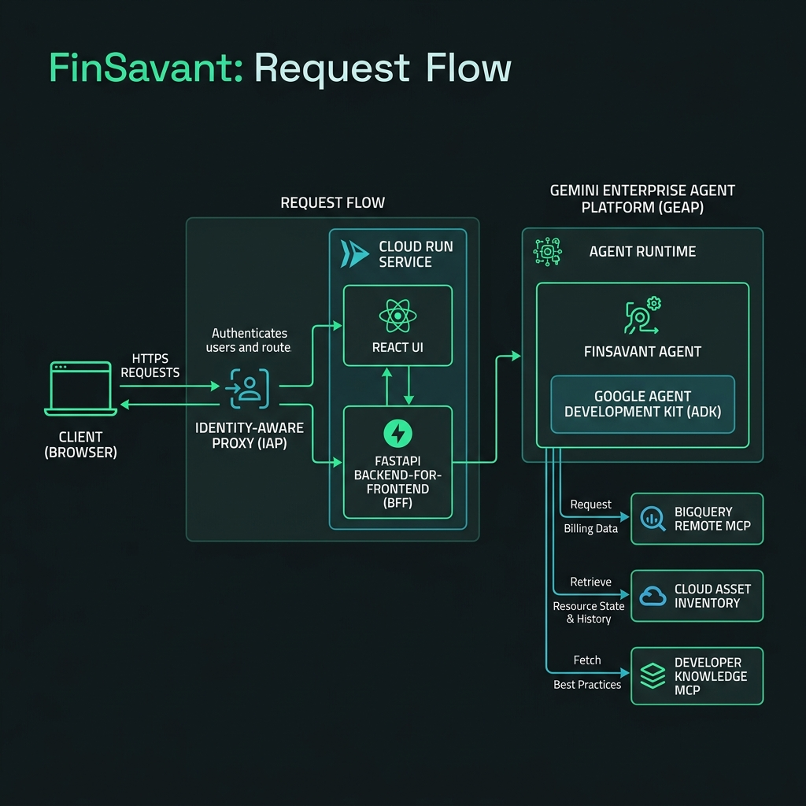

# FinSavant Part 1: Building an Agentic FinOps Platform with Google ADK and the Gemini Enterprise Agent Platform - Goals, Architecture, and Tech Stack

## Welcome

Hello folks, Dazbo here.

If you’ve ever had to manage a Google Cloud Platform footprint of any decent size, you’ll know the feeling. You open up the billing console, look at the monthly total, and feel your eyes water. You start digging into dashboards, trying to map raw costs to actual running infrastructure, and quickly realise you’re essentially flying blind.

To be fair, Google has done a lot of improvements with its own Google Cloud FinOps Hub lately. It's added a bunch of AI smarts to allow you to have natural language conversations with an agent, to help understand your spend.

But I wanted to build my own agentic FinOps solution, for a few reasons. Some are about the FinOps capability itself:

- I wanted an agentic solution that can combine information like *what* you spent last month, *why* you spent it, and why spending *spikes* occurred.
- I want the solution to be able to immediately spot *orphaned resources*, such as unused VMs, unattached disks, or unused IP addresses. For example, a persistent disk costing us $100 a month might be adding value if it's actually attached to a VM; but it's a total waste of spend if it's not. (Obviously, this is more of a problem for traditional IaaS infrastructure; this is not generally a concern for serverless services.)
- I want the solution to understand Google Cloud *architecture* and *best practices*, so that it can advise *what you should do*, and *why this is the most appropriate course of action*.

But mainly, I wanted an excuse to experiment with some relatively new agentic services in Google Cloud:

- I wanted to deploy to the new Gemini Enterprise Agent Runtime; the thing that has replaced Vertex AI Agent Engine.
- I wanted to play with some of the associated Gemini Enterprise Agent Platform capabilities, such as native support for ADK agents, the Agent Registry, and built-in observabiltiy and telemetry.
- I wanted to experiment with some specific tools and MCP servers.

Specifically:

- Native BigQuery tools from ADK - in order to interrogate by billing information in BigQuery.
- Google Cloud Assist - to be able to obtain live insights from Google Cloud metrics and logging, and provide recommendations using Google-built in recommenders.
- The Asset Inventory API - to determine our exact current deployment configuration, to identify orphaned resources, and to see what has changed.
- The Developer Knowledge MCP, so that my agent always has the latest knowledge about Google products, services, APIs, architectures, and best practices.

And so, friends, I give you **FinSavant**, an agentic FinOps solution for GCP that gives you an active, infrastructure-aware virtual analyst that combines costs with real-time operational context, and can make recommendations about what you should do next.

## Series Structure

Let's see where we are in this series.

1. Goals, Architecture, and Tech Stack: Capabilities, project goals, target architecture, technology stack, and design decisions. **<<< You are here.**
2. Dev Environment Setup with Google Antigravity, ADK, Agents CLI, MCP & Skills
3. Building the dynamic UI with A2UI
4. Authentication with IAP, Terraform, and CI/CD
5. Observing, Evaluating & Tuning Our Agent with Gemini Enterprise Agent Platform

## FinSavant: How Does It Work?

FinSavant is a conversational agent that:

- Uses **BigQuery Billing Exports** to know exactly what our costs are, down to the resource ID.
- Uses **Google Cloud Assist** in order to interrogate our services, metrics and logs, and provide recommendations accordingly.
- Uses **Google Cloud Asset Inventory** to undersatnd our realtime deployment configuration, but also to provide a 35-day audit history of every asset change in our GCP estate.
- Uses **Developer Knowledge MCP** to ground the agent with both broad and deep Google knowledge. This means that if you ask it any questions relating to Google Cloud, Google APIs, or general Google best practices, the agent will provide factually correct answers that are up-to-date, and with very little hallucination.

By bringing these together under a GenAI agent built with the Google Agent Development Kit (ADK), we have created an assistant that can perform root-cause analysis on cost spikes, as well as provide recommendations on how to fix them.

## Architecture Overview

When designing FinSavant, I wanted a clean separation between the frontend delivery mechanism and the reasoning backend, while keeping deployment costs and security overhead to an absolute minimum. To achieve this, we have:
*   **The Client & Backend-for-Frontend (BFF)**: I've packaged a React frontend and a FastAPI BFF into a single container image. This eliminates cross-origin resource sharing (CORS) headaches, minimises the runtime footprint, and simplifies authentication.
*   **The Agent**: The actual ADK agent logic is deployed to a separate backend runtime.

The FastAPI BFF simply acts as a secure proxy. It streams queries to the agent and receives structured responses. But also, it allows us to decouple the backend from the UI. If I want surface this application through a different UI in the future - like Gemini Enterprise - I can.

Here is how the request flow works in practice:

### Hybrid Execution Mode
To support a fast local development cycle, the BFF supports a **hybrid execution architecture**:
*   **Local Fallback Mode**: If no remote agent runtime ID is configured, FastAPI loads the agent code directly into the container and runs the ADK engine locally in a background thread, using the developer’s Application Default Credentials (ADC).
*   **Remote Execution Mode**: In staging and production, the BFF bypasses local execution and acts as a stateless proxy to the remote GEAP Agent Runtime.

## The Tech Stack

Let’s dive into the core components that make up FinSavant's tech stack and how they complement one another.

### Cloud Run

### 1. Google Agent Development Kit (ADK)
The ADK is the orchestrator. It manages session context, wraps our custom tools, and handles the conversation loops with the model. Crucially, I leverage ADK's **Context Caching** features to cache system instructions and tool definitions model-side, which slashes token usage and drops latency.

### 2. Cloud Asset Inventory (CAI)
Instead of querying individual GCP APIs (which is slow and rate-limited), I use CAI's `searchAllResources` and `batchGetAssetsHistory` endpoints. 
*   **Zombie Detection**: I built custom CAI queries to instantly scan for unattached disks (`state=READY AND -users:*`) and idle external IPs.
*   **Detective Mode**: When BigQuery highlights a cost spike, the agent uses CAI history to audit the exact configuration changes that occurred on that resource over the last 35 days (e.g., detecting that an engineer upscaled a Cloud Run instance memory limit).

### 3. Developer Knowledge MCP
I connected the agent to the remote Developer Knowledge MCP server. When the agent detects an inefficiency, it doesn't just say "delete this"; it queries the MCP to find official Google Cloud guidance on cost-optimisation strategies to back up its recommendation.

### 4. BigQuery Remote MCP
To query my billing data, I integrated the remote BigQuery MCP server (`https://bigquery.googleapis.com/mcp`). Because it is a remote, fully managed Google endpoint, I don't need to deploy or manage any local MCP server containers. The agent connects to it via authenticated OAuth 2.0 headers.

## Showcasing the Gemini Enterprise Agent Platform (GEAP)

Deploying a production-grade agent requires more than just running a Python loop. You need governance, security, and observability. This is why I chose the **Gemini Enterprise Agent Platform (GEAP)** as my runtime environment. 

By running on the GEAP Agent Runtime, FinSavant gains several critical advantages:

*   **Native ADK Integration**: GEAP is built from the ground up to support the Google Agent Development Kit, allowing us to package complex multi-agent flows and custom tools without having to write custom container management layers.
*   **Agent Registry**: When deployed, the agent is automatically registered in the centralised Google Cloud Console **Agent Registry** catalog under a unique URN namespace. This provides the operations team with a single pane of glass to audit, version, and manage all deployed agents across the organisation.
*   **Observability and Telemetry**: We get native tracing of agent trajectories. We can inspect exactly what reasoning path the model took, which tools it invoked, and what payloads were returned, making debugging agent loops significantly easier.
*   **Model Armor & Agent Gateway**: Security is paramount when an agent has read access to your billing data. GEAP’s **Agent Gateway** routes and monitors traffic, working alongside **Model Armor** to apply content security filters, block prompt injection attacks, and prevent unauthorised data exfiltration.

#### Deep Dive: BigQuery MCP vs. Direct ADK Toolsets vs. Direct BQ Client Libraries

When connecting an agent to BigQuery, I had to weigh the architectural trade-offs of different integration patterns:

| Feature | BigQuery MCP (Remote) | BigQueryToolset (ADK) | Direct BQ Client Library / Custom Tools |
| :--- | :--- | :--- | :--- |
| **Complexity** | **Medium**: Requires configuring connection parameters and Oauth 2.0 header providers. | **Low**: Fastest setup within the ADK ecosystem. | **Medium to High**: High development overhead; must write custom connection, querying, and parsing logic. |
| **Portability** | **High**: Cross-compatible with any MCP-compliant client. | **Medium**: Restricted to the ADK framework. | **Universal**: Can be used in any Python script or framework. |
| **State** | **Stateful**: Persistent session connections. | **Stateless**: Simple API-level calls. | **Stateless**: Managed entirely by your application logic. |
| **Streaming** | **No**: Tool execution is blocking. | **No**: Blocking. | **Yes**: Allows streaming of data chunks for lower latency UX. |
| **Governance** | Lacks business glossary (relies on schema inference). | Lacks business glossary (relies on schema inference). | Customised; can wrap query validation and access controls. |

**Why I chose a hybrid approach**:
For general database discovery (listing datasets, verifying table schemas), I let the agent use the **BigQuery Remote MCP**. It provides a standardized, robust interface that the LLM is already familiar with.

However, for execution, relying solely on raw MCP query tools carries performance and security risks. To mitigate this:
1.  **Security**: I applied a custom tool filter to exclude raw remote query execution tools, protecting the database from arbitrary SQL write actions.
2.  **Performance & Caching**: I created a custom ADK tool called `execute_cached_bigquery_sql`. When the agent wants to run a query, it routes it through this custom tool, which applies a thread-safe, 5-minute TTL cache. This bypasses the blocking nature of the MCP for duplicate queries (like fetching daily spend trends) and significantly accelerates the React canvas updates.

---

## High-Level Design Decisions (ADR Highlights)

While I will cover the deployment and infrastructure details in a later post, it’s worth highlighting how I laid the groundwork for a secure, low-cost enterprise footprint:

*   **Native Cloud Run IAP**: I secured the Cloud Run app using Identity-Aware Proxy (IAP) directly at the service level using the `google-beta` Terraform provider. This allowed us to avoid the high cost of a Global Application Load Balancer (ALB), keeping the monthly infrastructure spend to pennies.
*   **Decoupled Staging & Prod CI/CD**: I split my GitHub Actions pipelines so that staging deployments trigger automatically, while production deployments require a manual release trigger (the "Manual Gate" pattern).
*   **GCS Remote State**: All infrastructure is managed declaratively via Terraform, utilizing a GCS bucket with state locking to prevent deployment conflicts.

---

## What’s Next?

With the goals, architecture, and technology integrations defined, I had my blueprint. In the next part of this series, I will get my hands dirty and look at **Part 2: Building the Agentic Solution**, detailing how I bootstrapped the project with the Agents CLI, handled credential refreshing for long-running agent threads, and implemented the custom ADK callbacks.

Stay tuned, and hurrah for lower cloud bills!
