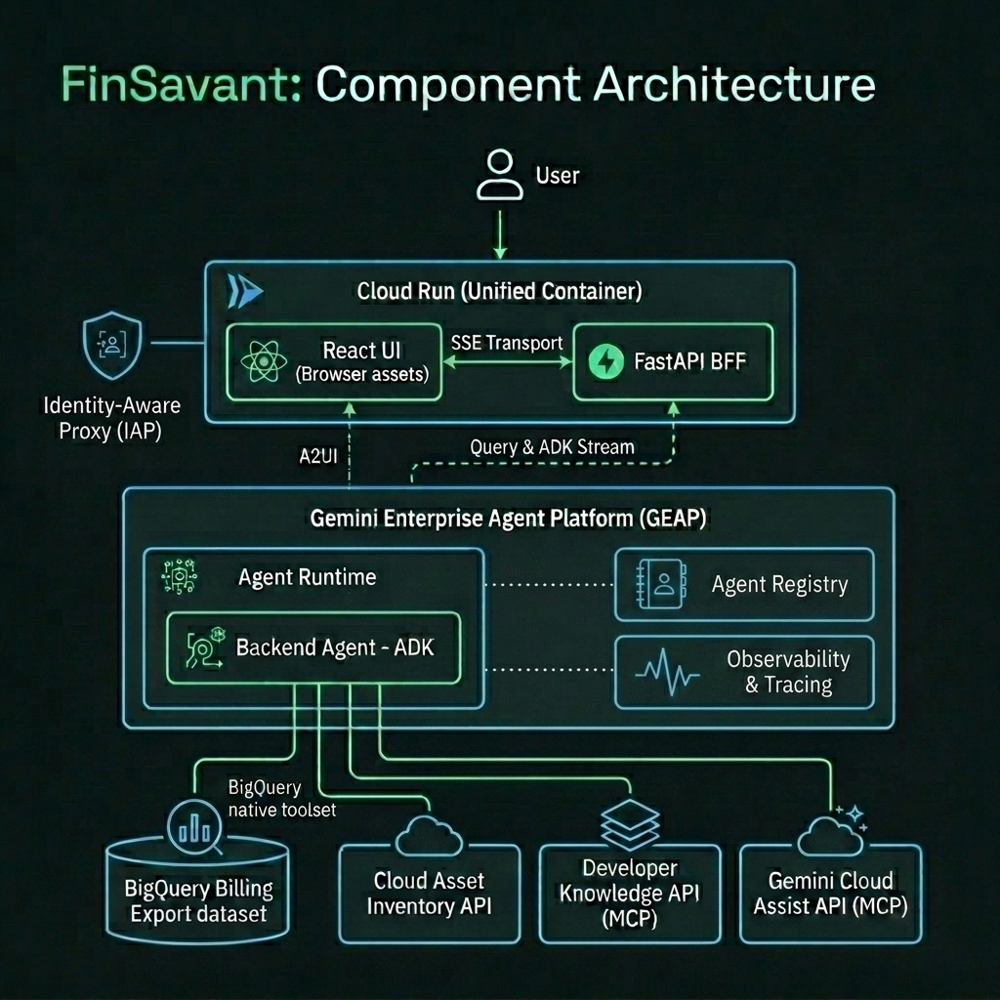
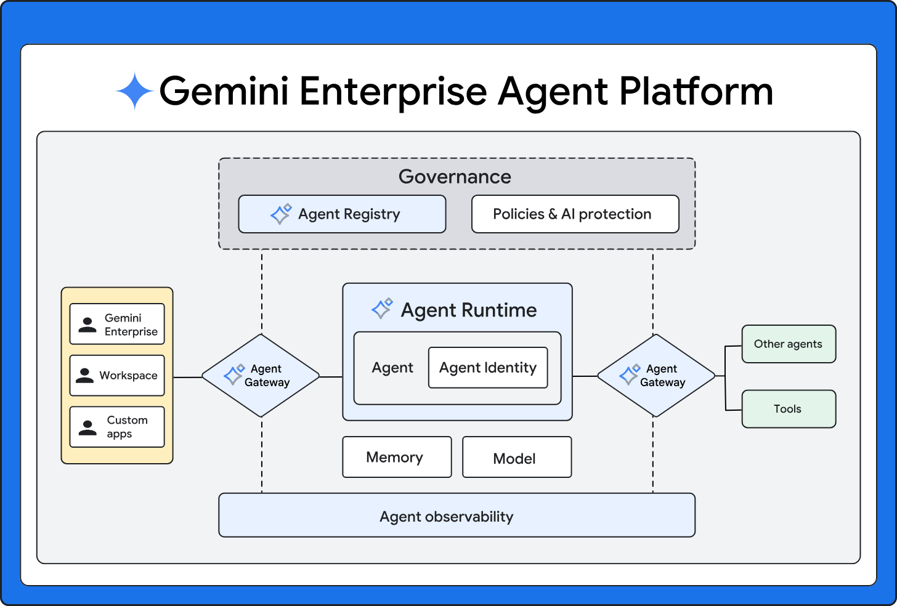

# FinSavant Part 1: Building an Agentic FinOps Platform with Google ADK and the Gemini Enterprise Agent Platform - Goals, Architecture, and Tech Stack

## Welcome

Hello folks, Dazbo here. I'm on holiday, which means I've got time to catch-up with some blogging of my recent experiments!

If you’ve ever had to manage a Google Cloud Platform footprint of any decent size, you’ll know the feeling. You open up the billing console, look at the monthly total, and feel your eyes water. You start digging into dashboards, trying to map raw costs to actual running infrastructure, and quickly realise you’re essentially flying blind.

To be fair, Google has done a bunch of improvements lately, with its own [Google Cloud FinOps Hub](https://docs.cloud.google.com/billing/docs/how-to/finops-hub). As Google describes it: 

_"The FinOps hub presents all of your active savings and optimization opportunities in one dashboard."_

But I wanted to build my own agentic FinOps solution, for a few reasons. Some are about the FinOps capability itself:

- I want to be able to have natural language conversations with the agent. I want to be able to dig into my cost spikes, and ask follow-up questions.
- I want an agentic solution that can combine information like *what* I spent last month, *why* I spent it, and why *spending spikes* occurred.
- I want the solution to be able to immediately spot *orphaned resources*, such as unused VMs, unattached disks, or unused IP addresses. For example, a persistent disk costing us $100 a month might be adding value if it's actually attached to a VM; but it's a total waste of spend if it's not. (Obviously, this is more of a problem for traditional IaaS infrastructure; this is not generally a concern for serverless services.)
- I want the solution to understand Google Cloud *architecture* and *best practices*, so that it can advise *what I should do*, and *why this is the most appropriate course of action*.

But mainly, I wanted an excuse to experiment with some relatively new agentic services in Google Cloud:

- I wanted to deploy to the new Gemini Enterprise [Agent Runtime](https://docs.cloud.google.com/gemini-enterprise-agent-platform/build/runtime); the thing that has replaced Vertex AI Agent Engine.
- I wanted to play with some of the associated [Gemini Enterprise Agent Platform](https://docs.cloud.google.com/gemini-enterprise-agent-platform/overview) capabilities, such as native support for [ADK agents](https://docs.cloud.google.com/gemini-enterprise-agent-platform/build/adk), the [Agent Registry](https://docs.cloud.google.com/gemini-enterprise-agent-platform/govern/agent-registry), and built-in [observabiltiy and telemetry](https://docs.cloud.google.com/gemini-enterprise-agent-platform/optimize/observability/overview).
- I wanted to experiment with some specific tools and MCP servers.

Specifically:

- Native [BigQuery tools from ADK](https://adk.dev/integrations/bigquery/) - in order to interrogate billing information in BigQuery.
- [Google Cloud Assist](https://docs.cloud.google.com/cloud-assist/overview) - to be able to obtain live insights from Google Cloud metrics and logging, and provide recommendations using Google-built in recommenders.
- The [Asset Inventory API](https://docs.cloud.google.com/asset-inventory/docs/overview) - to determine our exact current deployment configuration, to identify orphaned resources, and to see what has changed.
- The [Developer Knowledge MCP](https://developers.google.com/knowledge/mcp) - so that my agent always has the latest knowledge about Google products, services, APIs, architectures, and best practices.

And so, friends, I give you **FinSavant**, an agentic FinOps solution for GCP that gives you an active, infrastructure-aware virtual analyst that combines costs with real-time operational context, and can make recommendations about what you should do next.

This is what it looks like:

## Series Structure

Let's see where we are in this series.

1. Goals, Architecture, and Tech Stack: Capabilities, project goals, target architecture, technology stack, and design decisions. **📍 You are here.**
2. Dev Environment Setup with Google Antigravity, ADK, Agents CLI, MCP & Skills
3. Building the dynamic UI with A2UI
4. Authentication with IAP, Terraform, and CI/CD
5. Observing, Evaluating & Tuning Our Agent with Gemini Enterprise Agent Platform

## FinSavant: How Does It Work?

FinSavant is a conversational agent that:

- Uses **[BigQuery Billing Exports](https://docs.cloud.google.com/billing/docs/how-to/export-data-bigquery)** to know exactly what our costs are, down to the resource ID.
- Uses **[Google Cloud Assist](https://docs.cloud.google.com/cloud-assist/overview)** in order to interrogate our services, metrics and logs, and provide recommendations accordingly.
- Uses **[Google Cloud Asset Inventory](https://docs.cloud.google.com/asset-inventory/docs/overview)** to understand our realtime deployment configuration, but also to provide a 35-day audit history of every asset change in our GCP estate.
- Uses **[Developer Knowledge MCP](https://developers.google.com/knowledge/mcp)** to ground the agent with both broad and deep Google knowledge. This means that if you ask it any questions relating to Google Cloud, Google APIs, or general Google best practices, the agent will provide factually correct answers that are up-to-date, and with very little hallucination.

By bringing these together under a GenAI agent built with the Google Agent Development Kit (ADK), we have created an assistant that can perform root-cause analysis on cost spikes, as well as provide recommendations on how to fix them.

## Architecture Overview

When designing FinSavant, I wanted a clean separation between the frontend delivery mechanism and the reasoning backend, while keeping deployment costs and security overhead to an absolute minimum. 

The overall architecture looks like this:

## Tech Stack & Design Decisions

Let’s dive into the core components that make up FinSavant's tech stack and how they complement one another.

### User Interface: React/Vite

With React I can create a great looking UI, and I have the ability to render dynamic A2UI widgets. (More on this in a future part of the series.) 

_By the way: I'm no frontend developer. I used Stitch to help me design and prototype the frontend UI, and then I used Antigravity (Gemini) to turn this into React code._

I can compile the React UI to clean, static assets, so I don't need Node.js. This means my frontend container image will be pretty small, and therefore fast and cheap.

### Rich UI with Agent-to-UI (A2UI)

Rather than building a static dashboard or a free-form chatbot, FinSavant uses **Agent-to-UI (A2UI)** to dynamically render rich UI components like tables, charts, and summary cards directly from the LLM. This ensures the interface is always context-aware and adapts to the user's specific query. 

A2UI is Google's declarative specification that enables agents to generate dynamic user interfaces in the form of JSON objects. So for FinSavant, the agent builds the UI component on-the-fly, and then our frontend just converts this JSON object into a React component and renders it.

This is a game-changer for building a UI. I don't have to hard code any UI components - the agent decides what to display in real time! I'll show you exactly how to do this in a future part of the series.

### Backend-for-Frontend (BFF)

The FastAPI BFF simply acts as a secure proxy. It streams queries to the agent and receives structured responses. But also, it allows us to decouple the backend from the UI. If I want surface this application through a different UI in the future - like [Gemini Enterprise](https://docs.cloud.google.com/gemini/enterprise/docs) - I can.

### UI & BFF Unified Container

I've packaged a React frontend and a FastAPI BFF into a single container image. This eliminates cross-origin resource sharing (CORS) headaches, minimises the runtime footprint, and simplifies authentication.

### Cloud Run for Container Hosting

[Cloud Run](https://docs.cloud.google.com/run/docs/overview/what-is-cloud-run) is Google's serverless, zero-ops, autoscaling container hosting environment. This is perfect for hosting our UI/BFF container. There are a number of useful features I'm going to make use of:

- It scales to 0, so it doesn't cost anything when there's no traffic.
- It autoscales based on demand, but we can limit the number of instances in order to control costs.
- It natively integrates with Google Identity-Aware Proxy, providing a trivial way to ensure only authenticated / authorised users can get to our application. (This native integration, without need for a load balancer, is a fairly new feature.)
- We can map a domain name to our Cloud Run service, without need for a separate load balancer. (This is quite a new feature.)

### Agent Orchestration: Google Agent Development Kit (ADK)

ADK is an open source framework and SDK for building agents and agentic systems. These days I reach for it automatically.

This is what it gives us:

- Powerful multi-agent orchestration.
- Session context management.
- Bi-directional streaming support.
- Agnostic of AI model.
- Agnostic of hosting environment, but optimised for hosting on the Google Agent Runtime.
- Integrates natively with Gemini Enterprise Agent Platform / Agent Runtime.
- Easy to configure telemetry and observability.
- Really useful local development user interfaces.

### Agent Runtime for ADK Agent Hosting

Having decided I wanted to deploy the agent itself independently of the frontend and FastAPI, the next question is: where should we deploy the agent itself?

In days gone by I would probably have deployed it to a separate Cloud Run service. But now we have [Agent Runtime](https://docs.cloud.google.com/gemini-enterprise-agent-platform/build/runtime), Google's evolution of their previous product, Agent Engine. It is built for hosting agents and has a number of benefits:

- It is trivial to deploy ADK agents to Agent Runtime, using the [Agents CLI](https://google.github.io/agents-cli/).
- It is serverless and autoscaling.
- When there's no demand for the agent, there's no cost.
- Exposing the agent's endpoint to consumers (like our BFF in Cloud Run) is trivial.
- Agents deployed to Agent Runtime are automatically registered in the Gemini Enterprise Agent Platform's [Agent Registry](https://docs.cloud.google.com/agent-registry/overview).
- Agents deployed to Agent Runtime can leverage the various capabilities of [GEAP](https://docs.cloud.google.com/gemini-enterprise-agent-platform/overview), like [Memory Bank](https://docs.cloud.google.com/gemini-enterprise-agent-platform/scale/memory-bank), [Agent Gateway](https://docs.cloud.google.com/gemini-enterprise-agent-platform/govern/gateways/agent-gateway-overview), [Model Armor](https://docs.cloud.google.com/model-armor/overview), [telemetry](https://docs.cloud.google.com/gemini-enterprise-agent-platform/optimize/observability/overview), and [agent evaluations](https://docs.cloud.google.com/gemini-enterprise-agent-platform/optimize/evaluation/agent-evaluation).

### Hybrid Execution Mode

To support a fast local development cycle, the BFF supports two different run modes:

*   **Remote Execution Mode**: In staging and production, the BFF acts as a stateless proxy to the remote agent, running on the Google Agent Runtime.
*   **Local Fallback Mode**: If no remote agent runtime ID is configured, FastAPI loads the agent code directly into the container and runs the ADK engine locally in a background thread, using the developer’s Application Default Credentials (ADC).

### Project and Organisational Scope

I want FinSavant to give me a holistic view across all the projects that are incurring cost against my billing account. But at the same time, I only want FinSavant to provide insights for projects that I have actually have authority to see.

But GCP resource hierarchies are rarely neat and tidy. Some of my projects live inside a nice, clean Google Cloud organisation, and some are _standalone_ - essentially orphaned projects floating in the ether that are linked to the billing account but don't inherit anything from an organisation root.

To solve this, I designed a multi-layered discovery and security boundary:

1. **Billing-Led Discovery**: 
   Rather than scanning the Resource Manager from the top down (which misses standalone projects entirely), the backend starts by querying the Cloud Billing API to retrieve every project linked to our central billing account. This gives us a comprehensive list of all projects incurring costs.

2. **Hierarchical Permission Resolution (With Caching)**:
   Once we have the master list of billing projects, we need to know what the user is actually allowed to see. The discovery service attempts a top-down interrogation:
   - **Org-Level Scan (Fast)**: If a target organisation ID is configured, the backend queries Cloud Asset Inventory's IAM policies (`searchAllIamPolicies`) with `query="policy:{user_email}"`. This is extremely fast because it lets us resolve all of the user's project bindings across the entire hierarchy in a single API call.
   - **Project-Level Fallback (Granular)**: If organisation-wide access isn't available or fails (as is often the case with standalone projects outside the org boundary), the service seamlessly falls back to a project-by-project scan, calling `getIamPolicy` on each individual project in the billing list to compile the user's allowed set.
   - **Performance Protection**: To prevent rate limits and quota exhaustion from repeating project-by-project IAM scans, this resolved set is cached in-memory with a thread-safe, 10-minute time-to-live (TTL).

3. **IAP-Enforced Row-Level Security**:
   We serve the React dashboard and agent chat through an Identity-Aware Proxy (IAP). When a user requests data, the BFF extracts their email from the `x-goog-authenticated-user-email` header. It resolves their allowed projects list and sets it in a local context variable.
   
   To prevent prompt injections or the agent from hallucinating data about projects the user shouldn't see, we intercept all BigQuery billing queries and wrap them in a subquery that filters based on only the allowed projects. This means that even if the agent is querying the whole dataset, the database engine itself enforces strict row-level filtering based on the logged-in user's identity. If the user only has access to one project, that's all the agent can query.

### Cloud Asset Inventory (CAI)

Instead of querying individual GCP APIs (which is slow and rate-limited), I use CAI's `searchAllResources` and `batchGetAssetsHistory` endpoints. 
*   **Zombie Detection**: I built custom CAI queries to instantly scan for unattached disks (`state=READY AND -users:*`) and idle external IPs.
*   **Detective Mode**: When BigQuery highlights a cost spike, the agent uses CAI history to audit the exact configuration changes that occurred on that resource over the last 35 days (e.g., detecting that an engineer upscaled a Cloud Run instance memory limit).

### Developer Knowledge MCP

I connected the agent to the remote Developer Knowledge MCP server. When the agent detects an inefficiency, it doesn't just say "delete this"; it queries the MCP to find official Google Cloud guidance on cost-optimisation strategies to back up its recommendation.

### BigQuery Tool Calls From Our Agents

I want to be able to query my billing data - stored in BigQuery - using natural language prompts. I'm achieving this in two different ways, depending on where I'm going from.

- In my development workspace, I'm using the Google remote managed BigQuery MCP server (`https://bigquery.googleapis.com/mcp`).
- In our FinSavant ADK agent itself, I'm using ADK's native `BigQueryToolset` directly. In doing so, we  simplify authentication, reduce runtime latency when making BQ calls, reduce dependency on an external service, and align with ADK best practices. 

## Showcasing the Gemini Enterprise Agent Platform (GEAP)

Deploying a production-grade agent requires more than just running a Python loop. You need governance, security, and observability. This is why I chose the **Gemini Enterprise Agent Platform (GEAP)** as my runtime environment. 

By running on the GEAP Agent Runtime, FinSavant gains several critical advantages:

*   **Native ADK Integration**: GEAP is built from the ground up to support the Google Agent Development Kit, allowing us to package complex multi-agent flows and custom tools without having to write custom container management layers.
*   **Agent Registry**: When deployed, the agent is automatically registered in the centralised Google Cloud Console **Agent Registry** catalog under a unique URN namespace. This provides the operations team with a single pane of glass to audit, version, and manage all deployed agents across the organisation.
*   **Observability and Telemetry**: We get native tracing of agent trajectories. We can inspect exactly what reasoning path the model took, which tools it invoked, and what payloads were returned, making debugging agent loops significantly easier.
*   **Model Armor & Agent Gateway**: Security is paramount when an agent has read access to your billing data. GEAP’s **Agent Gateway** routes and monitors traffic, working alongside **Model Armor** to apply content security filters, block prompt injection attacks, and prevent unauthorised data exfiltration.

#### Deep Dive: BigQuery MCP vs. Direct ADK Toolsets vs. Direct BQ Client Libraries

When connecting an agent to BigQuery, I had to weigh the architectural trade-offs of different integration patterns:

| Feature | BigQuery MCP (Remote) | BigQueryToolset (ADK) | Direct BQ Client Library / Custom Tools |
| :--- | :--- | :--- | :--- |
| **Complexity** | **Medium**: Requires configuring connection parameters and Oauth 2.0 header providers. | **Low**: Fastest setup within the ADK ecosystem. | **Medium to High**: High development overhead; must write custom connection, querying, and parsing logic. |
| **Portability** | **High**: Cross-compatible with any MCP-compliant client. | **Medium**: Restricted to the ADK framework. | **Universal**: Can be used in any Python script or framework. |
| **State** | **Stateful**: Persistent session connections. | **Stateless**: Simple API-level calls. | **Stateless**: Managed entirely by your application logic. |
| **Streaming** | **No**: Tool execution is blocking. | **No**: Blocking. | **Yes**: Allows streaming of data chunks for lower latency UX. |
| **Governance** | Lacks business glossary (relies on schema inference). | Lacks business glossary (relies on schema inference). | Customised; can wrap query validation and access controls. |

**Why I chose the native ADK BigQueryToolset**:
Initially, I experimented with the remote BigQuery MCP server. While this is fantastic for developer-level CLI prototyping and interactive queries without deploying code, relying on a remote MCP server inside the production ADK agent adds unnecessary latency, authentication loops, and protocol overhead.

Instead, we chose the native ADK `BigQueryToolset`. It integrates directly into the ADK runtime, executes query/metadata lookups cleanly using standard Application Default Credentials (ADC), and eliminates the dependency on the remote MCP endpoint.

To ensure safety and cache optimization:
1.  **Security**: We applied a custom tool filter to exclude raw native query execution tools (`execute_sql` and `ask_data_insights`), ensuring the agent is blocked from writing data or performing un-cached execution.
2.  **Performance & Caching**: We route all custom SQL queries through `execute_cached_bigquery_sql`. This custom ADK tool applies a thread-safe, 5-minute TTL cache to skip expensive table scans and speed up UI canvas updates.

---

## High-Level Design Decisions (ADR Highlights)

While I will cover the deployment and infrastructure details in a later post, it’s worth highlighting how I laid the groundwork for a secure, low-cost enterprise footprint:

*   **Native Cloud Run IAP**: I secured the Cloud Run app using Identity-Aware Proxy (IAP) directly at the service level using the `google-beta` Terraform provider. This allowed us to avoid the high cost of a Global Application Load Balancer (ALB), keeping the monthly infrastructure spend to pennies.
*   **Decoupled Staging & Prod CI/CD**: I split my GitHub Actions pipelines so that staging deployments trigger automatically, while production deployments require a manual release trigger (the "Manual Gate" pattern).
*   **GCS Remote State**: All infrastructure is managed declaratively via Terraform, utilizing a GCS bucket with state locking to prevent deployment conflicts.

---

## What’s Next?

With the goals, architecture, and technology integrations defined, I had my blueprint. In the next part of this series, I will get my hands dirty and look at **Part 2: Building the Agentic Solution**, detailing how I bootstrapped the project with the Agents CLI, handled credential refreshing for long-running agent threads, and implemented the custom ADK callbacks.

Stay tuned, and hurrah for lower cloud bills!
