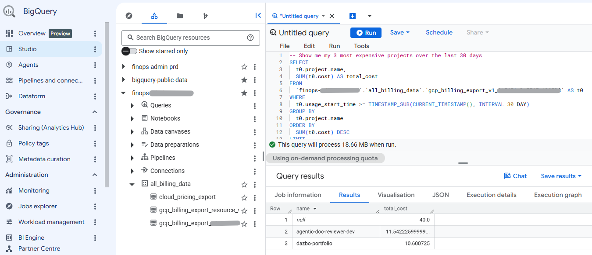
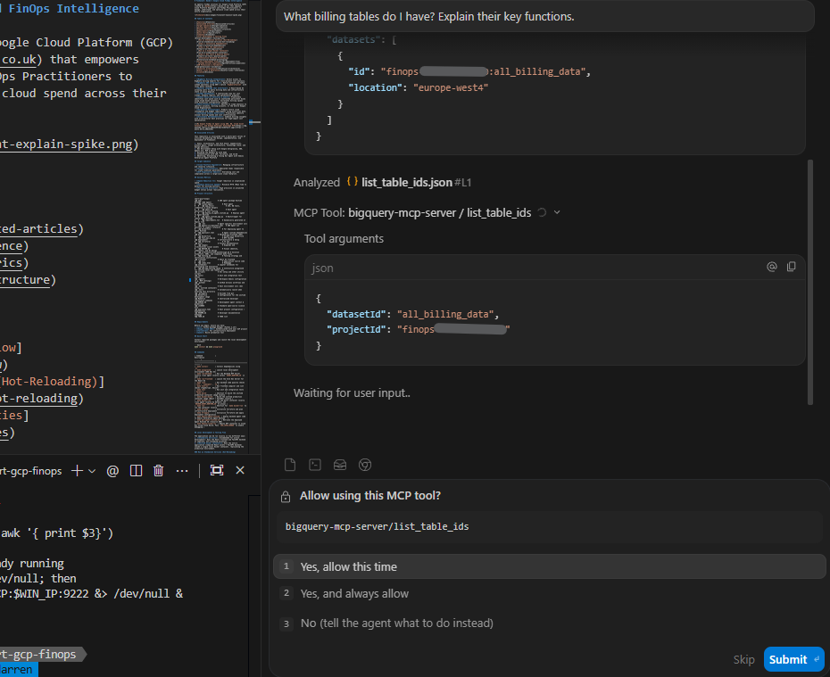
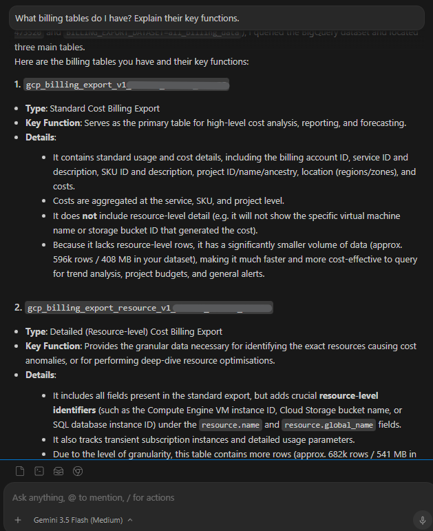
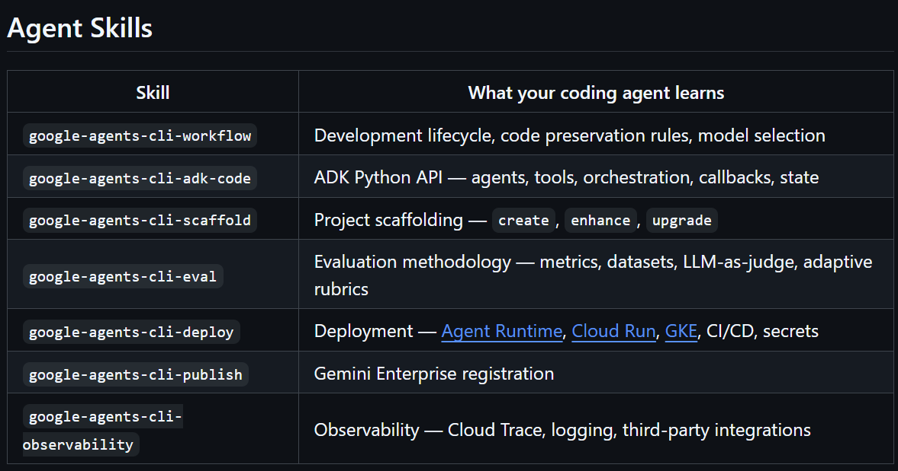
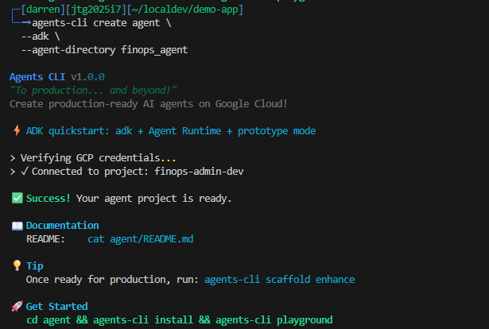

# FinSavant Part 2: Building an Agentic FinOps Platform - Development Environment Setup, Google Antigravity, MCPs and Skills, and ADK Bootstrapping with Agents CLI

## Welcome to Part 2

Welcome back, friends!

In the [first part](https://medium.com/google-cloud/finsavant-part-1-building-an-agentic-finops-platform-with-google-adk-a2ui-and-gemini-enterprise-248f59cea3a0) I described the purpose of [FinSavant](https://github.com/derailed-dash/smart-gcp-finops), the motivation for creating it, its overall architecture and tech stack, and how it works.

In this part we're going to use FinSavant as a case study in how to set up a development environment for the purposes of building such an ADK-based agentic solution. Even if you're not particularly interested in _FinSavant_ itself, I hope you'll find a bunch of useful tips here that will help you build your own solution environments more effectively and quickly.

We'll cover:

1. Using Antigravity IDE
1. Overall project workspace structure
1. Setting up agent skills for your coding agent
1. My project's `GEMINI.md` (or if you prefer, `AGENTS.md`)
1. My documentation approach
1. Setting up MCP servers for your coding agent, such as BigQuery MCP
1. Scaffolding the initial ADK agent using Google Agents CLI and its supporting skill
1. Getting started with a Makefile

Sound good? Let's get cracking!

## Series Orientation

Let's see where we are in this series.

1. Goals, Architecture, and Tech Stack: Capabilities, project goals, target architecture, technology stack, and design decisions.
2. Development Environment Setup, Google Antigravity, MCPs and Skills, and ADK Bootstrapping with Agents CLI **📍 You are here.**
3. Building the ADK Agent and API
4. Designing and Building the UI with Google Stitch and A2UI
5. Deployment with Gemini Enterprise Agent Platform, Agent Runtime, Cloud Run and IAP
6. Automating Deployment with CI/CD and Terraform
7. Agent Observability, Evaluation, and Tuning with Gemini Enterprise Agent Platform

## Getting Started with Antigravity IDE

These days, my favourite coding environment _for any significant project_ is Antigravity IDE. This is Google's _agent-first_ integrated development environment. You get a look-and-feel that's familiar to VS Code users, but powered with autonomous, context-aware agents that can plan, execute, verify, and work in parallel.

You can get it [here](https://antigravity.google/product/antigravity-ide).

(By the way, I often refer to Antigravity as _Agy_.)

## Project Structure

Here's the rough outline of the project structure we'll be creating. We won't be building all of this structure here; nor does this represent the final state of the project. But it gives you an idea of where we're heading. (I'll explain the `*` in a minute!)

```text
  smart-gcp-finops/
  ├── agent/                # ADK agent package
  │   ├── finops_agent/       # Root agent
  │   ├── .env                # Agent specific environment vars
  │   ├── Dockerfile          # For deploying agent to Agent Runtime
  │   └── pyproject.toml      # Agent runtime dependencies
* ├── bff/                # Backend-for-Frontend (API)
* ├── deployment/         # Infrastructure & CI/CD (Terraform IaC)
* │   ├── terraform/          # Centralised IaC for Prod & Staging
  │   └── README.md           # Deployment documentation
* ├── docs/               # Project documentation
* │   ├── images/             # Diagrams and architectural visual assets
  │   ├── DESIGN.md           # Visual identity, components, and UI design
  │   ├── architecture-and-walkthrough.md # Solution blueprints, ADRs, and component data flows
  │   └── testing.md          # Testing strategy and verification instructions
* ├── frontend/           # React UI frontend
* ├── notebooks/          # Jupyter notebooks for prototyping and evaluation
* ├── scripts/            # Environment setup and other utility scripts
  │   └── setup-env.sh        # Configure local environment including Google auth / ADC
* ├── tests/              # Unit and integration test suites
* │   ├── eval/               # Agent evaluation
* │   ├── unit/               # Unit tests
* │   └── integration/        # Integration tests
* ├── .agents/            # Workspace customizations root
  │   └── mcp_config.json   # E.g. MCP servers
* ├── .github/            # GitHub Actions workflows and CI/CD
* ├── .env                # Root environment vars (dev setup, unified container, GitHub, etc)
  ├── .envrc              # Automatically launch when entering this directory
* ├── .gitignore          # Exclude from git
* ├── Makefile            # Centralised developer convenience commands
* ├── GEMINI.md           # Development agent context & guidelines
* ├── LICENSE             # Standard open-source license file
* ├── pyproject.toml      # Root project configuration / dependencies
* ├── README.md           # Developer documentation homepage
  └── TODO.md             # TODO list
```

If you wanted to build such a structure from scratch, here's a cool thing to try...

1. Create your new project folder, e.g. `my-cool-project`
1. Open that folder in Antigravity IDE.
1. Supply this prompt to the Agy Agent:
   ```/grill-me Using this folder tree as a template, create the 
   required folder structure in this workspace for my new Python project.
   Only create folders and files that are marked as '*'. 
   For required files, provide initial starter-for-10 content. 
   << paste the tree structure here >>
   ```

Why `/grill-me`?  This is a built-in Agy command that causes the agent to ask questions to remove ambiguity. If you were to give the agent a slightly vague prompt without this prefix, then the agent might make some guesses about what you want. But with `/grill-me`, the agent will still make educated guesses, but it will also ask you questions to clarify your intent.

The prompt above is a good example of where this is useful. You'll notice that my project tree has a `LICENSE.md` file, which is a standard component to include in open-source projects. But my prompt doesn't specify which license to use. So when you use `/grill-me`, the agent will offer sensible license choices based on your project and context, and ask you to confirm.

This video demonstrates Agy scaffolding the entire project from scratch, in response to the prompt above:
[](https://youtu.be/DmnBHilRjOo)

Give it a go!

## Skills for Your Coding Agent

I like to describe skills as **units of knowledge that agents load on-demand**, when they need to do a particular task. I've previously written articles on the subject of my favourite skills, where to find them, and how to install them. I recommend you check out [this one](https://medium.com/google-cloud/dialling-our-agents-to-11-agent-skills-you-need-to-be-using-ccffa51e91df). You might want to go ahead and install all of my favourites!  

But for now, let's add a few skills that will definitely be useful for our current project. I recommend installing them globally, so they'll be available to all of your development projects.

```bash
npx skills add https://github.com/vercel-labs/skills -y -g --skill find-skills
npx skills add https://github.com/derailed-dash/dazbo-agent-skills -y -g
npx skills add https://github.com/google/skills -y -g
npx skills add https://github.com/google-gemini/gemini-skills/ -y -g
npx skills add https://github.com/shubhamsaboo/awesome-llm-apps/awesome-agent-skills -y -g --skill technical-writer
```

We're also going to install the Google Agents CLI and its associated skill, but we'll get to that later.

## `GEMINI.md` - Context for Your Coding Agent

The `GEMINI.md` file is how you define your project rules and context.  It's where you tell the Agy Agent:

- About your project's goals
- Rules and guidelines you want it to follow
- References you want it to read

When we create `GEMINI.md` in the root of a project, then the file is scoped only to _that project_. (This project-specific context gets appended to any global `GEMINI.md` you have defined.) Then, when you launch any Antigravity tool from this workspace - such as Agy 2.0, Agy IDE, or Agy CLI - the Agent will automatically read this context.

Let me show you what my `GEMINI.md` looks like, when starting out with _FinSavant_:

```md
# FinSavant - the Agentic FinOps Solution

## Project Goals

To create an agentic FinOps solution for GCP that:

- Uses ADK for agent orchestration.
- Is able to examine billing and cost data in BigQuery, based on billing exports.
- Is able to understand Google Cloud infrastructure and services across multiple Google projects associated with a billing account.
- Considers projects associated with a particular Google Cloud organisation, associated with a billing account.
- Leverages Google Developer Knowledge API MCP for grounding:  Google APIs, Google Cloud infrastructure, Google Cloud best practices.
- Is able to detect cost anomalies and inefficiencies, and trends.
- Is able to understand all deployed infra and services, and historical configuration changes, leveraging Google Cloud Asset Inventory
- Is able to invoke Google Cloud Assist for immediate logs investigation, RCA and recommendations.
- Is able to combine all of the above to provide actionable insights and recommendations to users.
- Provides a UI for users, which includes:
  - Dashboard of cost trends, billing data and anomalies
  - Cost forecasting
  - Cost analysis
  - Anomaly detection
  - Recommendations
  - Cost optimisation suggestions
  - A natural language chat interface
- The UI should be based on React. Use skills you have available to leverage React best practices.
- Leverage Google Stitch to design the UI, and use the Stitch MCP server to pull in the design, in order to convert to React.
- The UI is connected to the agent via FastAPI.
- The UI and API will be hosted in a single Cloud Run service. The service will be secured using IAP, using direct Cloud Run integration - no Load Balancer.
- The Agent will be deployed to Agent Runtime in Gemini Enterprise Agent Platform.

## Tool Use: Skills, Gemini Enterprise Agent Platform, Agent Runtime and ADK

Be sure to use all **agents** skills, **Gemini Enterprise Agent Platform** skills, and **ADK** skills you have available for developing ADK agents and best practices, and use **adk-docs-mcp** for latest ADK documentation. 

You will have additional skills available to you, but always check if the following can help with a particular task.

### ADK & agents-cli Lifecycle Skills

- `google-agents-cli-workflow`: Entrypoint for building ADK agents (scaffold, build, evaluate, deploy, publish, observe).
[skipping for brevity]

### Gemini Enterprise Agent Platform APIs

- `gemini-api`: Gemini Enterprise Agent Platform, Google Cloud, and Agent Platform enterprise usage with the Google Gen AI SDK.
[skipping for brevity]

### Agent Platform Engine & Model Management

- `agent-platform-deploy`: Deploying models and tuned weights to Agent Platform endpoints.
[skipping for brevity]

## Key Internal Documentation

- README.md - Project README; the developer's front door
- TODO.md - High level plan for the project
- architecture-and-walkthrough.md - The main architecture, including design decisions
- DESIGN.md - Where we will capture the UI design
- testing.md - Where we will document test strategy, summary of tests, testing instructions, any manual testing processes
- docs/blog.md - A blog post document we will build along the way
- /deployment/README.md - Deployment and CI/CD documentation

## Essential Reading

You should read and leverage these resources for guidance and best practices, in addition to the skills and MCP servers you have available for knowledge.

| Resource | Description and Relevance |
| -------- | ------------------------- |
| https://docs.cloud.google.com/bigquery/docs/use-bigquery-mcp | Use the BigQuery MCP server | 
| https://adk.dev/integrations/bigquery/ | BigQuery tool for ADK |
| https://docs.cloud.google.com/gemini-enterprise-agent-platform | Gemini Enterprise Agent Platform Overview |
| https://adk.dev/deploy/agent-runtime | ADK with Agent Runtime |
[skipping for brevity]

## Other Notes

- "Vertex AI" no longer exists as a product; the replacement is Gemini Enterprise Agent Platform.
- "Vertex AI Agent Engine" is no more; the replacement is "Agent Runtime", which is a part of the Gemini Enterprise Agent Platform.
- But APIs and Google internal resource names may still refer to legacy names, e.g. `reasoningEngine` rather than Agent Runtime. Always use the new names when creating documentation, but be mindful that we may need to use old names in API calls and certain resource definitions.

## Blog

I want to build a multi-part blog series, which I'll post on Medium and Dev.to.

### Documenting As We Go

As we go, document steps taken, experience and findings in docs/blog.md. Later, I will build a Medium blog from this content. During this "as we go" phase, the blog.md does not need to be a polished article. It can be a collection of notes, code snippets, and observations. It should:

- Include all the key steps we did, in the order we did them.
[skipping for brevity]
...
```

If you're following along, give Agy a restart now, so it picks up this context.

## Documentation Approach

I'm a big fan of having a consistent set of high-quality, continuously maintained documentation. I even have my own agent skill - `maintaining-core-documentation` - to automate much of this for me. Check out my previous blog on this subject: [Documentation as Context: A Skill to Automate Your Blueprints for the Agentic Era](https://medium.com/google-cloud/documentation-as-context-a-skill-to-automate-your-blueprints-for-the-agentic-era-2bec0cf041a3).

If you previously ran the `npx skills add https://github.com/derailed-dash/dazbo-agent-skills -y -g` command from above, then you already have this skill installed.

With this in place, you could issue this prompt to bootstrap a set of documentation for a brand-new project:

```text
Use maintaining-core-documentation to bootstrap my project documentation.
```

Check out this video to see the skill doing its magic!

[](https://youtu.be/fvT_GJ4LPhE)

As you evolve your project, this skill will automatically maintain your documentation.

## MCP Servers for Your Coding Agent

I've [previously written about](https://medium.com/google-cloud/dialling-our-agents-to-11-my-favourite-mcp-servers-9549c1442a5e) some of my favourite MCP servers. There are only a couple that we'll need for this project:

- [Google BigQuery Remote MCP Server](https://docs.cloud.google.com/bigquery/docs/use-bigquery-mcp)
- [ADK Docs MCP](https://adk.dev/tutorials/coding-with-ai/#adk-docs-mcp-server)

Note that we won't be using either of these in the _FinSavant_ agent itself. These are purely to help us during development.

Let's try out the BigQuery MCP server. In your workspace's `.agents/mcp_config.json` file, we configure the Remote BigQuery MCP server like this:

```json
{
  "mcpServers": {
    "bigquery-mcp-server": {
      "serverUrl": "https://bigquery.googleapis.com/mcp",
      "authProviderType": "google_credentials",
      "oauth": {
        "scopes": [
          "https://www.googleapis.com/auth/bigquery"
        ]
      },
      "headers": {
        "x-goog-user-project": "your-gcp-billing-project"
      }
    }
  }
}
```

A few things to note about this:

- **Billing project**: Replace `your-gcp-billing-project` with the Google project where your billing data export lives.

    

- **BigQuery API**: Make sure the BigQuery API (`bigquery.googleapis.com`) is enabled on that project.
- **Developer Identity Permissions**: Because the MCP server uses `google_credentials` to authenticate, your local developer account (active in `gcloud auth`) must be authorised on Google Cloud. You need the `roles/bigquery.dataViewer` and `roles/bigquery.jobUser` roles on the project hosting the billing dataset.  You also need the `roles/mcp.toolUser` role, in order to use this managed MCP server to query the BigQuery database.

And now, when you open the workspace in Antigravity IDE, it will load this configuration automatically. Your coding agent will then be able to query schemas, inspect tables, and try out SQL queries in order to assist you when you actually create the _FinSavant_ agent code.

Let's test it!

First, I issue this prompt to the Agy agent:

```text
What billing tables do I have? Explain their key functions.
```



You can see the agent immediately finds the MCP server, and asks for permission to invoke its tools. After I grant permission, I get this response:



Nice! You can see helpful this is going to be.

## Scaffolding Your ADK Agent

The easiest way to scaffold a new ADK agent is to make use of **Google Agents CLI**. The Agents CLI is actually a bundle, containing:

- The **Agents CLI** itself - commands for scaffolding, evaluating, deploying, and observing AI agents on Google Cloud. The [GitHub repo](https://github.com/google/agents-cli) describes the commands available:

  

- An associated set of **agent skills** that turn your development agent into an expert in using Agents CLI.

  

You install the bundle like this:

```bash
uvx google-agents-cli setup
```

If you already have it installed, then you can upgrade like this. (It's worth doing this occasionally - this CLI is evolving quickly!)

```bash
uv tool upgrade google-agents-cli
```

With this installed, we could create our top level `agent` folder that contains a root agent called `finops_agent` by running this Agents CLI command:

```bash
agents-cli scaffold create agent \
  --agent adk \
  --prototype \
  --agent-directory finops_agent 
```

It will create this, inside of our workspace folder:

```text
agent/
├── finops_agent/                 # Your agent code
│   ├── __init__.py               # Registers the app (exports `app`)
│   ├── agent.py                  # Agent definition — instructions, model, tools
│   └── app_utils/                # Utilities (telemetry, converters)
│       ├── __init__.py
│       ├── telemetry.py          # OpenTelemetry setup for Cloud Trace
│       ├── typing.py             # Request/response Pydantic models
│       └── gcs.py                # GCS utility functions
│
├── tests/
│   ├── eval/                     # Evaluation test cases
│   │   ├── datasets/
│   │   │   └── basic-dataset.json    # Default eval cases
│   │   └── eval_config.yaml          # Evaluation metrics configuration
│   ├── integration/
│   │   └── test_agent.py         # Integration test (runs agent end-to-end)
│   └── unit/
│       └── test_dummy.py         # Placeholder for unit tests
│
├── .env                          # Environment variables (project ID, location)
├── .env.example                  # Example environment variables
├── .gitignore                    # Git ignore file
├── pyproject.toml                # Project config and dependencies
├── agents-cli-manifest.yaml      # Configuration for agents-cli
├── Dockerfile                    # Dockerfile for the agent runtime
└── GEMINI.md                     # Guidance file for coding agents
```



But since we now have the skills installed, there's an easier way that doesn't require you to check the CLI documentation...

```text
Please bootstrap a new ADK agent project. The agent top-level project should be named `agent`, and it should should contain a root `agent-directory` called `finops_agent`, NOT the default of `app`. This means pyproject.toml and other config files will live under agent/, and all Python source files (like agent.py and fast_api_app.py) will live inside inside agent/finops_agent/.
```

Sure, this prompt is quite detailed, but I'm after a very specific folder structure.

Let's see a live demo...

[](https://youtu.be/wxMK7MJwHqA)

## Getting Started with a Makefile

## Useful Links and References

### Project Demo & Portfolio

- [FinSavant on GitHub](https://github.com/derailed-dash/smart-gcp-finops)
- [FinSavant YouTube Demo](https://youtu.be/zs_IRUxIx4E)
- [Dazbo's Portfolio](https://dazbo.co.uk)

### Gemini Enterprise Agent Platform & ADK

- [Gemini Enterprise Agent Platform Overview](https://docs.cloud.google.com/gemini-enterprise-agent-platform/overview?utm_campaign=DEVECO_GDEMembers&utm_source=deveco)
- [ADK Agent Building Guide](https://docs.cloud.google.com/gemini-enterprise-agent-platform/build/adk?utm_campaign=DEVECO_GDEMembers&utm_source=deveco)
- [Agents CLI on GitHub](https://github.com/google/agents-cli?utm_campaign=DEVECO_GDEMembers&utm_source=deveco)
- [Agents CLI Documentation](https://google.github.io/agents-cli/?utm_campaign=DEVECO_GDEMembers&utm_source=deveco)

### Google Cloud Services & APIs

- [Google Cloud Assist](https://docs.cloud.google.com/cloud-assist/overview?utm_campaign=DEVECO_GDEMembers&utm_source=deveco)
- [Cloud Asset Inventory (CAI) API](https://docs.cloud.google.com/asset-inventory/docs/overview?utm_campaign=DEVECO_GDEMembers&utm_source=deveco)
- [Developer Knowledge MCP Server](https://developers.google.com/knowledge/mcp?utm_campaign=DEVECO_GDEMembers&utm_source=deveco)

### Other Related Articles & Resources

- [Antigravity IDE Documentation](https://antigravity.google/product/antigravity-ide?utm_campaign=DEVECO_GDEMembers&utm_source=deveco)

