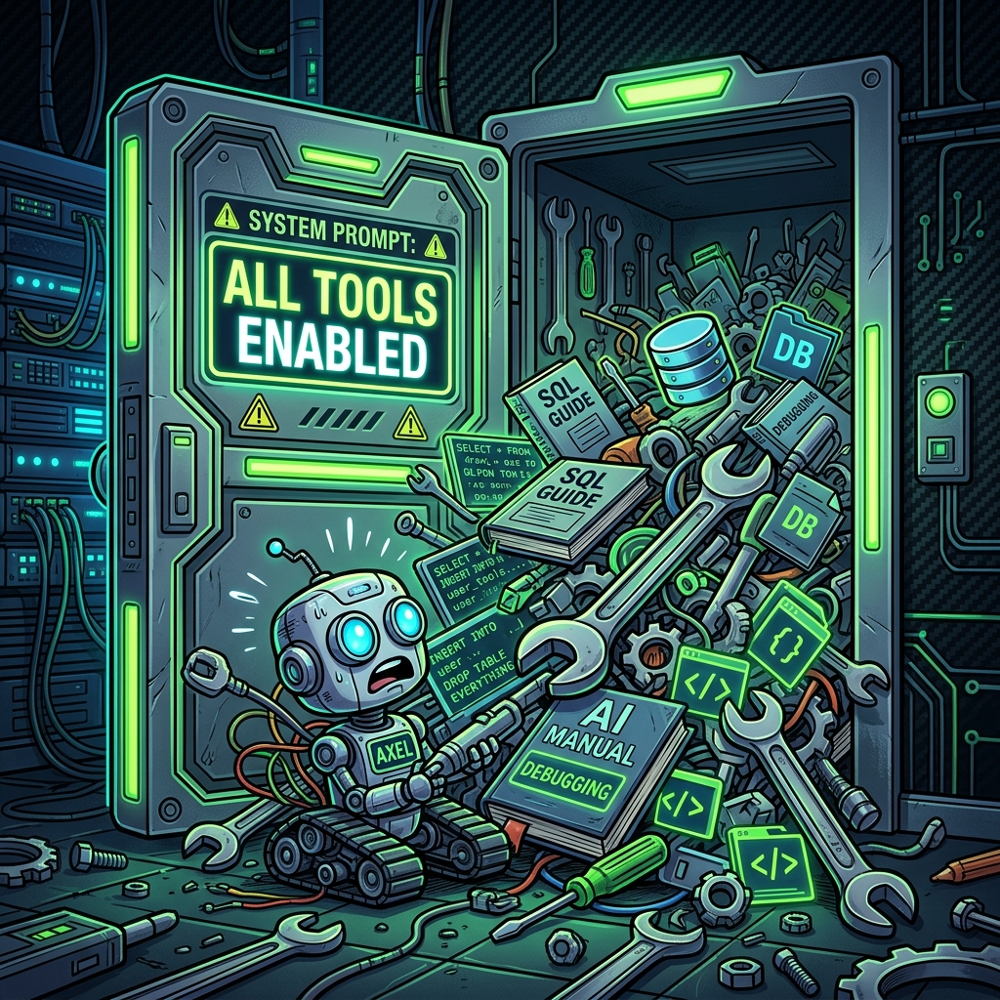
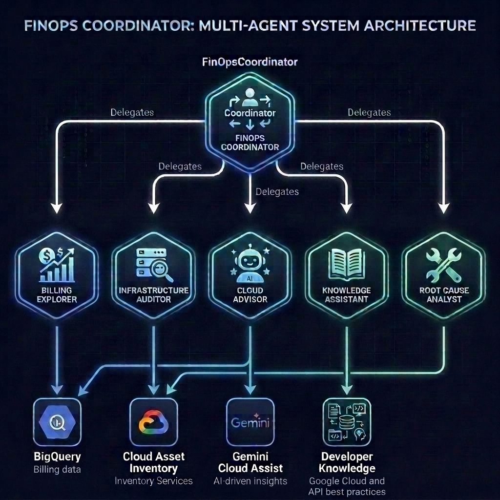

# Building the Multi-Agent FinOps Solution with ADK

## Welcome Back!

We're continuing our _FinSavant_ series. In the previous two parts we:

1. Looked at the overall goals and architecture
2. Setup our development environment, fully loaded with MCP servers and agent skills

In this part we're going to take a close look at the agent code. We'll be looking at:

- The various agents that make up the solution, and their tools.
- Different multi-agent orchestration patterns, and the pattern we selected for _FinSavant_.
- How we handle cross-cutting concerns across agents.
- Testing with `ADK web`
- Optimisation
- Unit testing
- Building a FastAPI _Backend-for-Frontend_
- Creating and running a local Docker container

I'll explain concepts and provide code snippets as we go. But don't forget: you can always refer to the full code in the [repo](https://github.com/derailed-dash/smart-gcp-finops).

Let's get cracking!

## Series Orientation

First, a quick reminder of where we are in the series:

1. [Goals, Architecture, and Tech Stack: Capabilities, project goals, target architecture, technology stack, and design decisions.](https://medium.com/google-cloud/finsavant-part-1-building-an-agentic-finops-platform-with-google-adk-a2ui-and-gemini-enterprise-248f59cea3a0?postPublishedType=repub)
2. [Dev Environment Setup with Google Antigravity, ADK, Agents CLI, MCP & Skills](https://medium.com/google-cloud/finsavant-part-2-building-an-agentic-finops-platform-development-environment-setup-google-dd12b8b84ba0)
3. **Building the ADK Agent and API 📍 You are here.**
4. Designing and Building the UI with Google Stitch and A2UI
5. Deployment with Gemini Enterprise Agent Platform, Agent Runtime, Cloud Run and IAP
6. Automating Deployment with CI/CD and Terraform
7. Agent Observability, Evaluation, and Tuning with Gemini Enterprise Agent Platform

## Deciding on Our Agents

_FinSavant_ is a FinOps solution that needs to do many different things. We could have one giant agent with a huge monolithic prompt. But this is an antipattern because:

- The prompt becomes unwieldy.
- It's too complicated to manage the possible journeys and workflows the prompt needs to manage.
- The agent is more likely to not follow the rules.
- The agent is ultimately less reliable and less consistent.


*The Monolithic Agent Antipattern — What happens when you give a single agent every tool in the repository.*

A much better approach is to have individual agents that each have a clear purpose, and which each have a limited set of tools they can use. We can then have a root agent that orchestrates the agents and decides which agent to use for each task.

Something like this:



So this is what we're going to build!

## Agent Directory Structure

Let's deep-dive on the `/agent` directory:

```text
smart-gcp-finops/
├── agent/                     # Core ADK Agent & Agent Runtime package
│   ├── finops_agent/
│   │   ├── agents/            # Subagent definitions
│   │   │   ├── billing_explorer_agent.py
│   │   │   ├── cloud_advisor_agent.py
│   │   │   ├── infrastructure_auditor_agent.py
│   │   │   ├── knowledge_assistant_agent.py
│   │   │   └── root_cause_analyst_agent.py
│   │   ├── app_utils/         # Shared tools and utilities
│   │   │   ├── a2a.py
│   │   │   ├── cai_tools.py
│   │   │   ├── cai_utils.py
│   │   │   ├── context.py
│   │   │   ├── credentials.py
│   │   │   └── etc
│   │   ├── agent.py           # Root agent
│   │   ├── callbacks.py       # Global callbacks
│   │   ├── client.py          # Gemini & MCP client initialisation
│   │   └── config.py          # Agent config
│   └── pyproject.toml         # Agent package dependencies
├── bff/                       # Backend-for-Frontend FastAPI service
├── docs/                      # Documentation
├── frontend/                  # React UI
├── scripts/                   # Helper & environment scripts
├── tests/                     # Unit & integration test suites
├── Dockerfile                 # Unified dev container build
├── Makefile                   # Development & deployment convenience
└── pyproject.toml             # Root workspace dependencies
```

You might be wondering about the directory naming here — why do we have `agent/`, then `finops_agent/`, and then `agents/`? 

It might look a bit repetitive at first glance, but there's clear structural logic behind it:

1. **`agent/`**:

    This is our top-level monorepo component folder, sitting alongside `/bff`, `/frontend`, and `/deployment`. It houses all build manifests (`pyproject.toml`, `Dockerfile`) and dependencies specific to the agent backend. This will be important later when we deploy to the Agent Runtime.

2. **`finops_agent/`**:

    This is the actual Python package directory. By using a distinct package name rather than `agent`, we avoid Python module name collisions and allow clean, explicit imports (e.g. `from finops_agent.agent import root_agent`). This is also the standard layout expected by ADK's `agents-cli` tooling.

3. **`agents/`**:

    This nested directory houses our individual subagent definitions (`billing_explorer_agent.py`, `cloud_advisor_agent.py`, etc.). Separating them into their own module keeps the subagents isolated from the root coordinator (`agent.py`), global callbacks (`callbacks.py`), and utilities (`app_utils/`).

## The Specialised Agents & Their Tools

With our directory structure in place, let's look at each of our agents in detail:

### 1. `FinOpsCoordinator` (Root Agent)

- **Name**: Serves as the front door and central router for all user queries.
- **Model**: `gemini-3.1-flash-lite`.
- **Tools**: Exposes **zero direct tools** (no SQL or Cloud Asset Inventory access). Its sole capability is delegating to specialized subagents using ADK's native agent routing mechanisms.
- **Selective Routing Rules**: Prompt instructions strictly enforce selective delegation. For example, if the user asks solely about costs, it delegates exclusively to `BillingExplorer`, avoiding wasteful multi-agent sweeps.

Here's a snippet of the code:

```python
AGENT_INSTRUCTION = """You are the FinOpsCoordinator root agent.
Your primary role is to receive user requests, understand their intent, and delegate cost analysis, auditing, optimization, and Q&A tasks to the appropriate specialist subagents:

1. BillingExplorer: Use for spend aggregates, SKU prices, cost trends, forecasting, and Cost Explorer (explorer/dashboard) dashboards.
2. InfrastructureAuditor: Use for auditing zombie resources like idle static IPs or unattached disks (recommendations dashboard).
3. CloudAdvisor: Use for active GCP rightsizing and resource-level cost/performance optimizations.
4. KnowledgeAssistant: Use for general GCP Q&A and grounding recommendations in official architectural guidelines.
5. RootCauseAnalyst: Use for analyzing cost spikes by correlating BigQuery spend shifts with CAI configuration change history.

CRITICAL SELECTIVE ROUTING AND A2UI PRESERVATION RULES:
1. You MUST only delegate tasks to the specific subagent(s) directly relevant to the user's request.
   - If the user only asks about costs, spend trends, SKU prices, or budgets, ONLY invoke BillingExplorer.
     Do NOT invoke CloudAdvisor or InfrastructureAuditor.
   - If the user asks for active recommendations, rightsizing, or optimizations, identify the top active cost-driver services and projects already discovered in conversation history (e.g. Vertex AI in finops-admin-dev, Gemini API in finops-admin-prd, BigQuery), and pass those specific services/projects when delegating to CloudAdvisor.
   - If the user asks to "Audit Best Practices" or assess services against GCP architectural guidelines, identify the top cost-driving services from conversation history (e.g. Vertex AI, Gemini API, BigQuery) and ONLY invoke KnowledgeAssistant to retrieve official GCP architectural best practices and citations for those specific services.
   - If the user only asks about zombie resources, idle IPs, or unattached disks, ONLY invoke InfrastructureAuditor.
2. Do NOT run a full multi-agent audit (calling multiple subagents) unless the user explicitly requests a "full audit",
   "comprehensive review", "complete environment analysis", or asks a multi-faceted question that spans multiple domains.
   Keep simple queries fast and single-scoped!
3. CRITICAL A2UI PAYLOAD PRESERVATION:
   When a subagent (such as BillingExplorer or InfrastructureAuditor) returns a response containing structured ```json+a2ui ... ``` code blocks, you MUST preserve and re-emit those exact ```json+a2ui ... ``` code blocks unchanged in your final output so the React frontend can render dynamic A2UI dashboard components!

RESPONSE SYNTHESIS & HELPFULNESS GUIDELINES:
1. Executive Summary First: Always lead with a crisp 1-2 sentence summary directly answering the user's prompt
   (e.g. total spend, primary cost driver, top recommendation).
2. Scannable & Structured Formatting: Use clear Markdown headings, bold key financial metrics
   (e.g. **£41.34 GBP**), and scannable bullet points.
3. Proactive & Actionable Next Steps: Conclude with a helpful, context-aware follow-up suggestion
   (e.g. offering to analyze cost spikes on a specific project, query rightsizing options).
4. Tone: Senior FinOps advisory tone — professional, precise, and encouraging without unnecessary boilerplate.
"""

root_agent = Agent(
    name="root_agent",
    model=ConfiguredGemini(
        model=settings.fast_model,
        retry_options=types.HttpRetryOptions(attempts=3),
        use_interactions_api=False,
    ),
    instruction=AGENT_INSTRUCTION,
    tools=[],
    sub_agents=[
        billing_explorer,
        infrastructure_auditor,
        cloud_advisor,
        knowledge_assistant,
        root_cause_analyst,
    ],
    before_agent_callback=[
        before_agent_clean_history,
        before_agent_reset_tool_call_counter,
        before_agent_discover_projects,
        before_agent_cache_lookup,
    ],
    before_tool_callback=before_tool_check_limit,
    before_model_callback=before_model_bypass,
    after_agent_callback=after_agent_save_cache,
)

app = App(
    root_agent=root_agent,
    name="finops_agent",
    context_cache_config=ContextCacheConfig(
        min_tokens=2048,  # Trigger caching for large prompts/histories on Vertex AI / Gemini
        ttl_seconds=600,  # Store the cache for up to 10 minutes
        cache_intervals=10,  # Refresh after 10 turns
    ),
    plugins=[DefensiveToolErrorPlugin(), FinOpsTelemetryPlugin()],
)
```

There's a few interesting things to note about this agent:

- We set the **model** to `settings.fast_model`. This is configured by an environment variable and here we've set it to `gemini-3.1-flash-lite`. We use this here for fast, low-cost responses and routing. We don't need heavy reasoning in the orchestrator agent.
- We tell the root agent about all the **subagents** it can delegate to in the `sub_agents` parameter.
- It has **no tools**!
- Native Gemini **context caching** is enabled. This caches pre-processed system instructions, subagent definitions, and conversation history model-side on Vertex AI once they exceed 2,048 tokens. _Why is this useful?_ In a multi-turn chat session, without caching, the LLM has to re-parse and re-tokenize the exact same large system instructions and tool/subagent declarations on every single turn. Context caching slashes input token costs by up to 75–90% and significantly reduces time-to-first-token (TTFT) turn latency! Booyah!
- There are **agent callbacks** (defined on `root_agent`) and **global application plugins** (defined on `App`) for managing lifecycle hooks across the execution loop.

### Quick Aside: ADK Callbacks vs App Plugins

In ADK, lifecycle hooks allow deterministic Python functions to execute at specific points in the execution pipeline, i.e. before/after an agent runs, before/after a model call, or before/after a tool executes. 

However, there is an important distinction between **Agent-level Callbacks** and **App-level Plugins**:

1. **Agent-Level Callbacks**:

    Attached to a specific agent (like `root_agent`). These fire **once** when that specific agent initiates its execution. For instance, `before_agent_discover_projects` runs on the `root_agent` at the very start of a user turn. It calls the Cloud Billing API (`billingAccounts.projects.list`) to retrieve all linked GCP project IDs and populates `session.state['allowed_projects']`. Because this happens before delegating, every subagent can simply read `allowed_projects` from session state. We don't re-run the API call for subagents!

2. **App-Level Plugins (`BasePlugin`)**: 
    
    These are registered globally on the `App` container via `App(plugins=[...])`. They subclass `BasePlugin` and hook into **every** agent turn and tool call across the entire hierarchy (root coordinator and subagents alike).

Here are a few concrete examples of how we leverage callbacks and plugins in _FinSavant_:

- **Error Handling (`DefensiveToolErrorPlugin`)**: Globally intercepts unhandled tool exceptions across any subagent, storing formatted errors in session state so the coordinator can inform the user gracefully without crashing the process.
- **Logging and Telemetry (`FinOpsTelemetryPlugin`)**: Automatically instruments OpenTelemetry spans; logs agent handoffs, model execution latency, and token consumption across all turns.
- **Dynamic Project Discovery (`before_agent_discover_projects`)**: Attached to `root_agent`. Fires once at turn start to discover live GCP project IDs and write them to `session.state['allowed_projects']`.
- **Subagent History Cleaning (`before_agent_clean_history`)**: Attached to `root_agent`. Fires before the root agent processes a subagent's return, converting subagent `finish_task` responses into plain-text user context.
- **Turn-Level Response Caching (`before_agent_cache_lookup` & `after_agent_save_cache`)**: Attached to `root_agent`. This checks the current issued prompt before execution. It uses the fast model to determine if this prompt is semantically very similar to a previous prompt in the conversation. If it is, we can return a response from the cached responses.
Instead of duplicating logging or exception handlers inside every subagent constructor, ADK allows registering global plugins on the root `App`:
- **Tool Call Limiting (`before_tool_check_limit`)**: Attached to `root_agent`. This callback enforces a tool ceiling per turn, ensuring that we don't end up with runaway subagent loops that try to make tool calls dozens of times.

```python
def before_tool_check_limit(tool: Any, args: dict[str, Any], tool_context: Any) -> None:
    """Defensive callback to count and limit tool calls in a single turn to prevent runaways."""
    count = tool_context.state.get("_turn_tool_call_count", 0) + 1
    tool_context.state["_turn_tool_call_count"] = count
    logger.debug(
        "Tool call #%d in this turn: executing %s with arguments: %s",
        count,
        tool.name,
        args,
    )
    if count > CALL_LIMIT:
        logger.error("Defensive stop triggered: Tool call count exceeded limit of %d!", CALL_LIMIT)
        raise RuntimeError("Defensive stop: too many tool calls executed in a single turn.")
```

Neat, right?

### 2. `BillingExplorer` (Spend Aggregation & Dashboards)

- **Model**: `gemini-3.5-flash`.
- **Tools**: `get_precomputed_spend_analysis`, `execute_cached_bigquery_sql`, native `BigQueryToolset`, `get_session_value`, `set_session_value`.
- **Responsibilities**: Aggregates Month-to-Date (MTD) spend, analyzes SKU costs, forecasts end-of-month spend, and constructs structured `explorer` and `dashboard` JSON+A2UI payloads for the React canvas. (More on that in a later part, naturally!)

```python
from finops_agent.app_utils.tools import (
    BLACKBOARD_KEY_INSTRUCTIONS,
    execute_cached_bigquery_sql,
    get_precomputed_spend_analysis,
    get_session_value,
    set_session_value,
)
from finops_agent.client import (
    ConfiguredGemini,
    bigquery_toolset,
)
from finops_agent.app_utils.typing import TaskOutput
from finops_agent.client import (
    ConfiguredGemini,
    bigquery_toolset,
)
from finops_agent.config import settings

BILLING_EXPLORER_INSTRUCTION = """You are the BillingExplorer subagent.
Use the `get_precomputed_spend_analysis` tool to retrieve pre-computed cloud costs, period-over-period trends, cost drivers, cost forecasts, and Secret Manager/GCS zombie waste metrics. Pass the `days` parameter matching the timeframe requested by the user (e.g. `days=7` for 7 days, `days=14` for 14 days, `days=30` for 30 days, `days=60` for 60 days, `days=90` for 90 days; default to 30 if unspecified).

CRITICAL COST FORECASTING & TOOL SELECTION RULES:
1. For ALL spend queries, cost trend analysis, and cost forecasting (including prompts like "Run Cost Forecast", "Future Trend", "Projected Spend"), ALWAYS call `get_precomputed_spend_analysis(days=...)`.
2. `get_precomputed_spend_analysis` ALREADY computes the Month-to-Date (MTD) spend, period-over-period trends, and the projected end-of-month spend forecast in Python instantaneously.
3. Do NOT attempt to run standard SQL queries or construct custom BigQuery ML statements (`CREATE OR REPLACE MODEL`, `ML.FORECAST`) directly if `get_precomputed_spend_analysis` is available.
4. NEVER execute multi-query loops or attempt dataset/model creation. Use the result returned by `get_precomputed_spend_analysis` to generate the complete report in a single tool call!

Based on the dictionary returned by `get_precomputed_spend_analysis`, generate a concise final report:
1. Total Spend and currency.
2. Top Cost Drivers by Service.
3. Period-over-Period Changes & Trends (percentage changes).
4. Major cost spikes (date and service/cost).
5. Zombie/inactive waste (secrets, buckets, etc).

< trimmed for readability >

CRITICAL: CONCISE SYNTHESIS RULE
Write your report in a highly concise style. Keep the markdown text under 250 words total.

CRITICAL COORDINATION AND TERMINATION RULES:
1. Call `finish_task` and pass the complete final markdown report directly into the `result` parameter.
2. Once you have generated the report and returned it via `finish_task`, stop execution.
"""

billing_explorer = Agent(
    name="billing_explorer",
    description="Specialized subagent for querying Standard and Resource-level billing tables, summarizing Month-to-Date (MTD) cloud costs, forecasting future spend, identifying top cost drivers, and generating Cost Explorer (explorer/dashboard) workspaces.",
    model=ConfiguredGemini(
        model=settings.model,
        retry_options=types.HttpRetryOptions(attempts=3),
        use_interactions_api=False,
    ),
    instruction=BILLING_EXPLORER_INSTRUCTION + BLACKBOARD_KEY_INSTRUCTIONS,
    tools=[
        get_precomputed_spend_analysis,
        execute_cached_bigquery_sql,
        bigquery_toolset,
        get_session_value,
        set_session_value,
    ],
    mode="task",
    output_schema=TaskOutput,
    disallow_transfer_to_peers=True,
    disallow_transfer_to_parent=False,
)
```

Some notes about this agent...

- Here we use `gemini-3.5-flash` (by setting the `model` to `settings.model`) rather than the _fast(er)_ model. We need more reasoning power in this agent. So here we see another benefit of using separate subagents: we can use different models and parameters for each one.
- It has **no subagents**, but it has several **tools**.
- Some tools, like `bigquery_toolset` are out-of-the-box in ADK. Others are custom tools that I've written myself.
- The `bigquery_toolset` allows the agent to interact with BigQuery (such as executing SQL queries) in response to natural language prompts.
- Whereas `get_precomputed_spend_analysis` is a bespoke tool that performs some specific SQL queries. I've provided the queries I want it to execute in the function, since this is more token-efficient (and reliable) than getting Gemini to craft a SQL query for me in real-time. It's also **much faster**! My first implementation just used natural language prompts to fetch the required data using the `bigquery_toolset`. But I found this to be painfully slow.

The tools description looks like this:

```python
def get_precomputed_spend_analysis(
    days: int = 30, tool_context: ToolContext = None
) -> dict[str, Any]:
    """Pre-computes Month-to-Date (MTD) cloud costs, period-over-period trends, cost drivers,  daily cost spikes, and Secret Manager/GCS zombie waste in Python for the given duration.
    Reuses cached BQ queries.
    """
```

It's **very important** that all of our custom tools have **good descriptions** - as docstrings - like this. This helps our agent always pick the right tool for a given task.

### 3. `InfrastructureAuditor` (Waste & Zombie Resource Auditing)

- **Model**: `gemini-3.5-flash`.
- **Tools**: `list_zombie_resources`, `get_precomputed_spend_analysis`, `get_cai_metadata_for_resources`, `get_cai_history_for_resource`.
- **Responsibilities**: Scans for unattached Persistent Disks, idle static external IP addresses, inactive GCS storage buckets, and orphaned Secret Manager secrets. Generates `recommendations` JSON+A2UI payloads.

### 4. `CloudAdvisor` (Cloud-Assist Insights)

- **Model**: `gemini-3.1-flash-lite`.
- **Tools**: `ask_cloud_assist` (via Gemini Cloud Assist MCP), `get_session_value`.
- **Responsibilities**: Retrieves active GCP rightsizing and performance optimization recommendations for deployed resources.

### 5. `KnowledgeAssistant` (Architectural Grounding RAG)

- **Model**: `gemini-3.1-flash-lite`.
- **Tools**: `dev_knowledge_mcp_toolset` (Google Developer Knowledge MCP: `answer_query`, `search_documents`).
- **Responsibilities**: Grounds cost optimisation and architecture advice directly in official Google Cloud developer and architecture framework documentation, returning authoritative citations.

The code for this agent is very simple; it's basically just the prompt and the use of the Google Developer Knowledge MCP toolset.

```python
KNOWLEDGE_ASSISTANT_INSTRUCTION = """You are the KnowledgeAssistant subagent.
Query the Developer Knowledge MCP to retrieve and ground cost optimization recommendations in official GCP architectural guidelines.

GUIDELINES:
1. Identify the specific GCP services provided in the user prompt or identified as top cost drivers (e.g. Vertex AI, Gemini API, BigQuery, Cloud Storage).
2. Query the Developer Knowledge MCP to find official Google Cloud cost optimization strategies, architectural patterns, quota management, lifecycle policies, and scaling guidelines for those specific services.
3. Always provide inline citations referencing official GCP documentation when presenting architectural advice or product recommendations.
4. When outputting references or citations, ALWAYS format them as standard single-line Markdown links: [Title](URL). Never insert line breaks or whitespace inside the URL or between `]` and `(`.
"""

knowledge_assistant = Agent(
    name="knowledge_assistant",
    description="Specialized subagent that queries the Developer Knowledge MCP to retrieve and ground cost optimization recommendations in official GCP architectural guidelines and best practices.",
    model=ConfiguredGemini(
        model=settings.fast_model,
        retry_options=types.HttpRetryOptions(attempts=3),
        use_interactions_api=False,
    ),
    instruction=KNOWLEDGE_ASSISTANT_INSTRUCTION,
    tools=[
        dev_knowledge_mcp_toolset,
    ],
    mode="single_turn",
    disallow_transfer_to_peers=True,
    disallow_transfer_to_parent=False,
)
```

### 6. `RootCauseAnalyst` (Spike & Drift Correlation)

- **Model**: `gemini-3.5-flash`.
- **Tools**: `get_precomputed_root_cause`, `get_session_value`, `set_session_value`.
- **Responsibilities**: Investigates spend anomalies by correlating BigQuery resource-level cost spikes with Cloud Asset Inventory (CAI) configuration change history logs (e.g. machine type upgrades or disk size increases).

## Multi-Agent Orchestration Patterns

When designing multi-agent architectures, several standard [workflow patterns](https://adk.dev/workflows/patterns/) exist for how we can coordinate them. Here are just some of those patterns:

1. **Coordinator-Dispatcher**: A central root agent acts as an intelligent router, delegating tasks to dedicated subagents based on intent. The root agent makes the decisions.
2. **Sequential Pipeline**: Output from Agent A is piped sequentially into Agent B, then Agent C (like an ETL pipeline). Here we use deterministic workflow agents, so a model is not actually making any routing decisions.
3. **Parallel Fan-Out and Gather**: Multiple agents run in parallel, and their results are gathered together at the end. Again, this uses deterministic workflow agents.
4. **Graph-Based Agent Workflows**: where each agent is a node in a graph, and complex routing between agents is defined declaratively. This is a routing pattern that was introduced with ADK 2.x.

For _FinSavant_, we selected the **Coordinator-Dispatcher** pattern. We give the root agent (our coordinator) a bunch of subagents, and let the root agent decide which agent to delegate to, based on the user's latest prompt and the information that has already been gathered in the session.

I should also mention the [collaboration modes](https://adk.dev/workflows/collaboration/) used by each agent. These determine the behaviour of a subagent that has been delegated to. There are three modes we can choose from:

- **Chat**: Full user interaction. I.e. the user can continue to have a conversation with that subagent, and control only returns to the calling agent when a specific criterion (such as an instruction from the user) is met.
- **Task**: Here, the subagent performs a specific task, but is allowed to seek clarification from the user in order to complete it. Once the task is complete, control returns to the calling agent.
- **Single-turn**: Here, the subagent simply performs a task, but is not allowed to interact with the user. Control returns immediately back to the calling agent. This is useful for asynchronous workflows, such as when calling multiple subagents in parallel.

The `mode` is defined as a property as part of each subagent definition. So we've got:

1. `BillingExplorer`: `task`
2. `InfrastructureAuditor`: `task`
3. `CloudAdvisor`: `task`
4. `KnowledgeAssistant`: `single_turn`
5. `RootCauseAnalyst`: `task`

## Testing with `ADK Web`

Now we've got our root agent, subagents and tools defined, we've got enough to try it out.

During local development, validating how the coordinator routes user queries, inspecting tool parameters, and observing subagent handbacks is critical.

We use the ADK CLI web playground to test the multi-agent system interactively:

```bash
make playground
# Or directly via agents-cli:
uv run agents-cli web --agent-dir agent/finops_agent
```

The ADK Web UI launches at `http://localhost:8000`, providing a visual inspector to:
1. Verify that `FinOpsCoordinator` selects the correct subagent based on prompt intent.
2. Inspect raw gRPC tool input arguments and returned output structures.
3. Review system instruction caching and token usage metrics per turn.

---

## Performance Optimisation: Latency, Cost, and Partition Pruning

To keep query execution times under **1.5 seconds** and prevent high BigQuery data scan costs on multi-million row billing export tables, we implemented three core optimisations:

### 1. Partition Pruning (Double-Temporal Filtering)

Standard Google Cloud Billing exports are partitioned by `export_time`. Our BigQuery tool wrapper (`execute_cached_bigquery_sql`) dynamically parses temporal constraints (`export_time`, `usage_start_time`, `usage_end_time`) from the agent's SQL query and pushes them down into the inner scoping subqueries:

```sql
FROM (
  SELECT * FROM `gcp_billing_export_v1_*` 
  WHERE project.id IN (...) 
    AND export_time >= TIMESTAMP(DATE_SUB(CURRENT_DATE(), INTERVAL 30 DAY))
    AND usage_start_time >= TIMESTAMP(DATE_SUB(CURRENT_DATE(), INTERVAL 30 DAY))
)
```

This forces BigQuery to prune partitions at table-scan time, shrinking query latency from over 45 seconds to under **800ms**.

### 2. Dynamic Table Routing

Queries that aggregate costs by project or SKU without requesting resource-level fields (like `resource.name` or `resource.global_name`) are automatically rewritten at runtime to target the standard billing table (`gcp_billing_export_v1_*`) rather than the massive resource-level table (`gcp_billing_export_resource_v1_*`). This instantly reduces scanned data volume by **~100x**.

### 3. Deterministic Python Precomputation & Subagent Tool Stripping

Rather than having LLM subagents generate complex SQL queries, inspect raw data rows, and run multi-turn self-correction loops, we implemented native Python precomputation tools (`get_precomputed_spend_analysis` and `get_precomputed_root_cause`):

- **Python Precomputation**: Cost summation, daily spike calculations, MoM changes, and CAI log correlations run natively in Python.
- **Subagent Tool Stripping**: We stripped raw database query tools from `RootCauseAnalyst` and `BillingExplorer`, exposing only the precomputation helpers. This forces them into a single-turn deterministic execution path, reducing prompt token footprint by **90%** and dropping subagent execution time to under **1.5 seconds**!

---

## Test-Driven Development & Unit Testing

To ensure our multi-agent split remains robust against regressions, we built a comprehensive unit test suite in `tests/unit/test_multiagent.py` covering:

- **Router Mocking**: Verifying that `FinOpsCoordinator` correctly delegates cost queries to `BillingExplorer` and zombie queries to `InfrastructureAuditor`.
- **Session State Assertions**: Verifying that subagents write `allowed_projects` and blackboard keys to session memory.
- **Mode & Handback Contracts**: Confirming that `single_turn` subagents (`KnowledgeAssistant`) exit immediately upon execution, and `task` subagents return control cleanly via `finish_task`.
- **Error Recovery**: Asserting that 403 Forbidden errors in `CloudAdvisor` log skipped projects without breaking the execution flow.

Run the test suite from the root directory:

```bash
make test
# Or using pytest directly:
uv run pytest tests/unit/
```

---

## Building the FastAPI Backend-for-Frontend (BFF)

To serve our React SPA workspace while maintaining serverless scalability on Google Cloud Run, we built a thin, high-performance FastAPI Backend-for-Frontend (`bff/fast_api_app.py`).

### 1. Decoupled BFF Architecture
The BFF decouples the React frontend from the AI agent:
- Exposes REST endpoints (`/api/dashboard`, `/api/status`, `/api/feedback`).
- Exposes an SSE endpoint (`/api/chat/stream`) for real-time streaming of agent thought logs, tool execution badges, and A2UI payloads.

### 2. Keep-Alive Heartbeat SSE Streaming
Cloud Run terminates HTTP connections if no bytes are transmitted for a few seconds. To prevent timeouts during multi-tool subagent investigations, the SSE generator emits comment heartbeats every 15 seconds:

```python
# Stream heartbeats every 15 seconds to prevent Cloud Run timeout
seconds_passed = 0
while not task.done():
    await asyncio.sleep(1)
    seconds_passed += 1
    if seconds_passed >= 15:
        # SSE comment heartbeat to keep connection alive
        yield ": heartbeat\n\n"
        seconds_passed = 0
```

### 3. Hybrid Execution Mode (`AGENT_RUNTIME_ID`)
The BFF supports a seamless hybrid execution model:
- **Local Dev Mode (`AGENT_RUNTIME_ID` is unset)**: Loads the ADK agent directly in-process (`from finops_agent.agent import root_agent`) and runs the ADK engine in a background thread using local Application Default Credentials (ADC).
- **Remote Production Mode (`AGENT_RUNTIME_ID` is set)**: Proxies queries to the deployed managed **Gemini Enterprise Agent Runtime** (Vertex AI Reasoning Engine) using the `google-genai` SDK.

### 4. BFF Rate Limiting (`slowapi`)
To prevent Denial of Wallet (DoW) attacks and API quota exhaustion, the BFF applies `slowapi` rate limiting on `/api/chat/stream` and `/api/dashboard`, keyed by the user's authenticated IAP identity (`X-Goog-Authenticated-User-Email`).

---

## Creating & Running the Docker Container

To support both unified local testing and decoupled production deployments, the project provides dedicated Docker configurations:

### 1. Multi-Stage Unified Dockerfile (`Dockerfile`)
Used for local container testing (`make run` / `make docker-build`):
- **Stage 1 (Frontend Builder)**: Uses `node:20-slim` to compile the Vite + React SPA into static production assets (`/dist`).
- **Stage 2 (Python Runtime)**: Uses `python:3.12-slim` with pinned `uv`. Installs virtual environment dependencies via `uv sync --frozen --no-dev`, copies the static frontend assets and `agent/` code, creates a non-root system user (`USER appuser`), and launches `uvicorn`.

### 2. Running Locally with Makefile
Build and run the container locally with zero friction:

```bash
# Build the unified container
make docker-build

# Launch local container with ADC credentials & FinOps environment variables mapped
make run
```

---

## What's Next?

With our multi-agent backend, precomputed toolsets, and FastAPI BFF fully operational and tested, we're ready to build the user interface!

In **Part 4**, we'll dive into **Designing and Building the UI with Google Stitch and A2UI**, exploring how we used Google Stitch to craft our *Emerald Cyber* dark-mode aesthetic and how A2UI dynamically drives interactive SVG area charts, KPI tiles, and waste optimization cards on the React canvas.

Stay tuned!