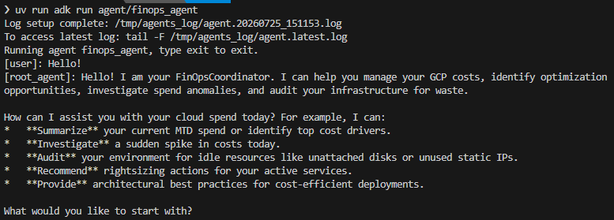
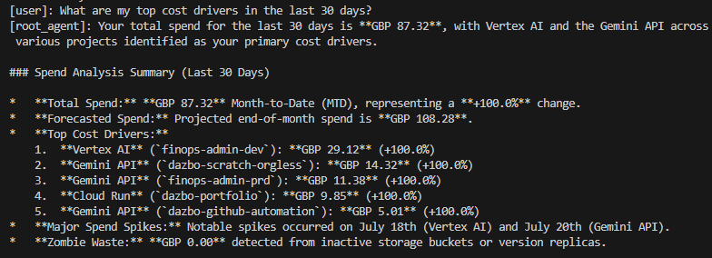
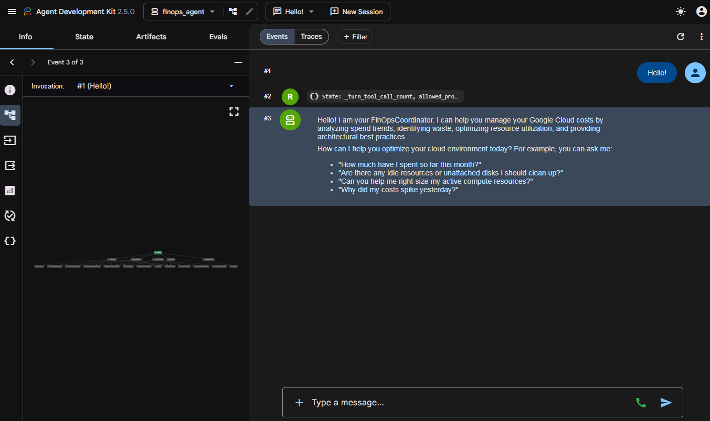
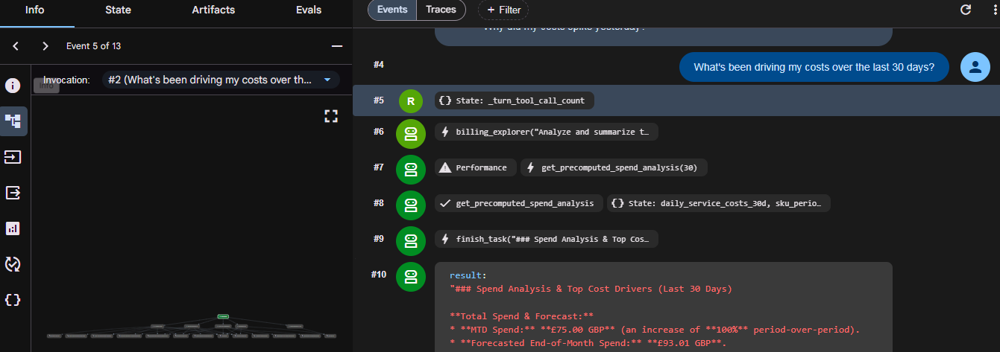
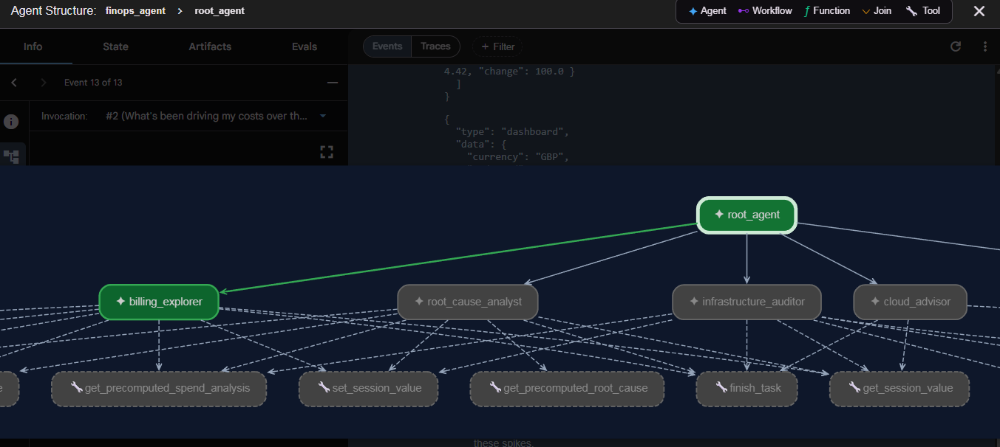
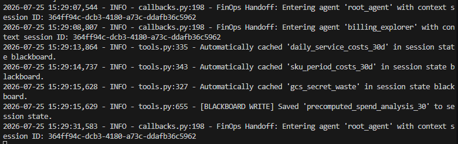
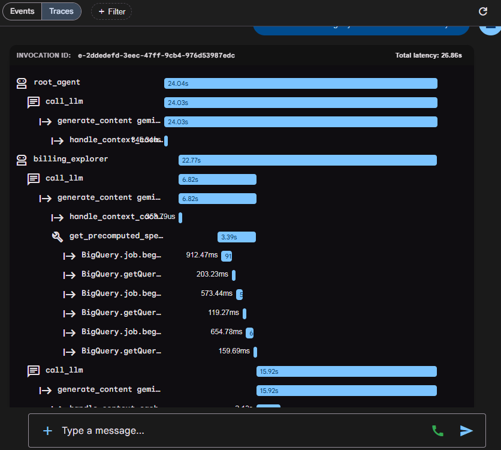

## Welcome Back!

We’re continuing our _FinSavant_ series. In the previous two parts we:

1. Looked at the overall goals and architecture
2. Setup our development environment, fully loaded with MCP servers and agent skills

In this part we’re going to take a close look at the agent code. We’ll be looking at:

- The various agents that make up the solution, and their tools.
- Different multi-agent orchestration patterns, and the pattern we selected for _FinSavant_.
- How we handle cross-cutting concerns across agents.
- Testing with `ADK Web`
- Optimisation
- Building and Testing a FastAPI _Backend-for-Frontend_

I’ll explain concepts and provide code snippets as we go. But don’t forget: you can always refer to the full code in the [repo](https://github.com/derailed-dash/smart-gcp-finops).

Let’s get cracking!

## Series Orientation

First, a quick reminder of where we are in the series:

1. [Goals, Architecture, and Tech Stack: Capabilities, project goals, target architecture, technology stack, and design decisions.](https://medium.com/google-cloud/finsavant-part-1-building-an-agentic-finops-platform-with-google-adk-a2ui-and-gemini-enterprise-248f59cea3a0?postPublishedType=repub)
2. [Dev Environment Setup with Google Antigravity, ADK, Agents CLI, MCP & Skills](https://medium.com/google-cloud/finsavant-part-2-building-an-agentic-finops-platform-development-environment-setup-google-dd12b8b84ba0)
3. **Building the ADK Agent and API 📍 You are here.**
4. Designing and Building the UI with Google Stitch and A2UI
5. Deployment with Gemini Enterprise Agent Platform, Agent Runtime, Cloud Run and IAP
6. Automating Deployment with CI/CD and Terraform
7. Agent Observability, Evaluation, and Tuning with Gemini Enterprise Agent Platform

## Deciding on Our Agents

_FinSavant_ is a FinOps solution that needs to do many different tasks. We could have one giant agent with a huge monolithic prompt. But this is an antipattern because:

- The prompt becomes unwieldy.
- It’s too complicated to manage the possible journeys and workflows the prompt needs to manage.
- The agent is more likely to not follow the rules.
- We have to give our giant agent access to all the tools, meaning it’s less likely to pick the right one for a task.
- The agent is ultimately less reliable and less consistent.


A much better approach is to have individual agents that each have a clear purpose, and which each have a limited set of tools they can use. We can then have a root agent that orchestrates the agents and decides which agent to use for each task.

Something like this:


So this is what we’re going to build!

## Agent Directory Structure

Let’s deep-dive on the `/agent` directory:

```text
smart-gcp-finops/
├── agent/                     # Core ADK Agent & Agent Runtime package
│   ├── finops_agent/
│   │   ├── agents/                  # Subagent definitions
│   │   │   ├── billing_explorer_agent.py       # BigQuery spend trends & cost breakdown subagent
│   │   │   ├── cloud_advisor_agent.py          # Cloud Assist & operational diagnosis subagent
│   │   │   ├── infrastructure_auditor_agent.py # Idle/zombie resource waste audit subagent
│   │   │   ├── knowledge_assistant_agent.py    # Developer Knowledge & best practice grounding subagent
│   │   │   └── root_cause_analyst_agent.py     # Spend anomaly, Audit Logs, and CAI correlation subagent
│   │   ├── app_utils/               # Shared tools and utilities
│   │   │   ├── a2a.py                    # Agent-to-Agent (A2A) protocol endpoints
│   │   │   ├── cai_tools.py              # Cloud Asset Inventory ADK tool wrappers
│   │   │   ├── cai_utils.py              # Cloud Asset Inventory API search & history helpers
│   │   │   ├── context.py                # Session context state helpers
│   │   │   ├── credentials.py            # ADC and Service Account auth helpers
│   │   │   ├── dashboard_data.py         # Pre-computed spend analysis & UI dataset generator
│   │   │   ├── logging_and_telemetry.py  # Cloud Logging & Audit Logs intra-day telemetry
│   │   │   ├── mcp_config.py             # Remote MCP toolsets & OAuth2 auth providers
│   │   │   ├── project_discovery.py      # Dynamic Google project hierarchy discovery
│   │   │   ├── services.py               # ADK services
│   │   │   ├── tools.py                  # BigQuery spend analysis & SQL execution tools
│   │   │   ├── typing.py                 # Pydantic schemas & structured output models
│   │   │   ├── zombie_resources.py       # Idle & zombie GCP resource detection logic
│   │   │   └── zombie_tools.py           # Tools for zombie waste auditing
│   │   ├── agent.py                 # Root agent
│   │   ├── callbacks.py             # Global callbacks
│   │   ├── client.py                # Gemini & MCP client initialisation
│   │   └── config.py                # Agent config
│   └── pyproject.toml         # Agent package dependencies
├── bff/                       # Backend-for-Frontend FastAPI service
├── docs/                      # Documentation
├── frontend/                  # React UI
├── scripts/                   # Helper & environment scripts
├── tests/                     # Unit & integration test suites
├── Dockerfile                 # Unified dev container build
├── Makefile                   # Development & deployment convenience
└── pyproject.toml             # Root workspace dependencies
```

You might be wondering about the directory naming here — why do we have `agent/`, then `finops_agent/`, and then `agents/`?

It might look a bit repetitive at first glance, but there’s clear logic behind it:

1. **`agent/`**:  
This is our top-level monorepo component folder, sitting alongside `/bff`, `/frontend`, and `/deployment`. It houses all build manifests (`pyproject.toml`, `Dockerfile`) and dependencies specific to the agent backend. This will be important later when we deploy to the Agent Runtime.

2. **`finops_agent/`**:  
This is the actual Python package directory. By using a distinct package name rather than `agent`, we avoid Python module name collisions and allow clean, explicit imports (e.g. `from finops_agent.agent import root_agent`). This is also the standard layout expected by ADK's `agents-cli` tooling.

3. **`agents/`**:  
This nested directory houses our individual subagent definitions (`billing_explorer_agent.py`, `cloud_advisor_agent.py`, etc.). Separating them into their own module keeps the subagents isolated from the root coordinator (`agent.py`), global callbacks (`callbacks.py`), and utilities (`app_utils/`).

## The Specialised Agents & Their Tools

With our directory structure in place, let’s look at each of our agents in detail:

### 1. `FinOpsCoordinator` (Root Agent)

- **Purpose**: Serves as the front door and central router for all user queries.
- **Model**: `gemini-3.5-flash-lite`.
- **Tools**: Uses **zero direct tools**, e.g. no SQL or Cloud Asset Inventory access. Its sole capability is delegating to specialised subagents using ADK’s native agent routing mechanisms.
- **Selective Routing Rules**: Prompt instructions strictly enforce selective delegation. For example, if the user asks solely about costs, it delegates exclusively to `BillingExplorer`, avoiding wasteful multi-agent sweeps.

Here’s a snippet of the code:

```python
AGENT_INSTRUCTION = """You are the FinOpsCoordinator root agent.
Your primary role is to receive user requests, understand their intent, 
and delegate cost analysis, auditing, optimization, and Q&A tasks to the appropriate 
specialist subagents:

1. BillingExplorer: Use for spend aggregates, SKU prices, cost trends, forecasting, 
   and Cost Explorer (explorer/dashboard) dashboards.
2. InfrastructureAuditor: Use for auditing zombie resources like idle static IPs 
   or unattached disks (recommendations dashboard).
3. CloudAdvisor: Use for active GCP rightsizing and resource-level cost/performance 
   optimisations.
4. KnowledgeAssistant: Use for general GCP Q&A and grounding recommendations in 
   official architectural guidelines.
5. RootCauseAnalyst: Use for analyzing cost spikes by correlating BigQuery 
   spend shifts with CAI configuration change history.

CRITICAL SELECTIVE ROUTING AND A2UI PRESERVATION RULES:
1. You MUST only delegate tasks to the specific subagent(s) directly relevant 
   to the user's request.
   - If the user only asks about costs, spend trends, SKU prices, or budgets, 
     ONLY invoke BillingExplorer.
     Do NOT invoke CloudAdvisor or InfrastructureAuditor.
   - If the user asks for active recommendations, rightsizing, or optimizations, 
     identify the top active cost-driver services and projects already discovered 
     in conversation history (e.g. Vertex AI, Gemini API, BigQuery), 
     and pass those specific services/projects when delegating to CloudAdvisor.
   - If the user asks to "Audit Best Practices" or assess services against 
     GCP architectural guidelines, identify the top cost-driving services from 
     conversation history (e.g. Vertex AI, Gemini API, BigQuery) and ONLY 
     invoke KnowledgeAssistant to retrieve official GCP architectural best practices 
     and citations for those specific services.
   - If the user only asks about zombie resources, idle IPs, or unattached disks, 
     ONLY invoke InfrastructureAuditor.
2. Do NOT run a full multi-agent audit (calling multiple subagents) unless the user 
   explicitly requests a "full audit", "comprehensive review", "complete environment analysis,
   or asks a multi-faceted question that spans multiple domains.
   Keep simple queries fast and single-scoped!
3. CRITICAL A2UI PAYLOAD PRESERVATION:
   When a subagent (such as BillingExplorer or InfrastructureAuditor) returns a response 
   containing structured ```json+a2ui ... ``` code blocks, you MUST preserve and 
   re-emit those exact ```json+a2ui ... ``` code blocks unchanged in your final output 
   so the React frontend can render dynamic A2UI dashboard components!

RESPONSE SYNTHESIS & HELPFULNESS GUIDELINES:
1. Executive Summary First: Always lead with a crisp 1-2 sentence summary directly 
   answering the user's prompt (e.g. total spend, primary cost driver, top recommendation).
2. Scannable & Structured Formatting: Use clear Markdown headings, bold key financial metrics
   (e.g. **£41.34 GBP**), and scannable bullet points.
3. Proactive & Actionable Next Steps: Conclude with a helpful, context-aware follow-up 
   suggestion (e.g. offering to analyze cost spikes on a specific project, query rightsizing options).
4. Tone: Senior FinOps advisory tone — professional, precise, and encouraging without unnecessary boilerplate.
"""

root_agent = Agent(
    name="root_agent",
    model=ConfiguredGemini(
        model=settings.fast_model,
        retry_options=types.HttpRetryOptions(attempts=3),
        use_interactions_api=False,
    ),
    instruction=AGENT_INSTRUCTION,
    tools=[],
    sub_agents=[
        billing_explorer,
        infrastructure_auditor,
        cloud_advisor,
        knowledge_assistant,
        root_cause_analyst,
    ],
    before_agent_callback=[
        before_agent_clean_history,
        before_agent_reset_tool_call_counter,
        before_agent_discover_projects,
        before_agent_cache_lookup,
    ],
    before_tool_callback=before_tool_check_limit,
    before_model_callback=before_model_bypass,
    after_agent_callback=after_agent_save_cache,
)

app = App(
    root_agent=root_agent,
    name="finops_agent",
    context_cache_config=ContextCacheConfig(
        min_tokens=2048, # Trigger caching for large prompts/histories on Vertex AI / Gemini
        ttl_seconds=600, # Store the cache for up to 10 minutes
        cache_intervals=10, # Refresh after 10 turns
    ),
    plugins=[DefensiveToolErrorPlugin(), FinOpsTelemetryPlugin()],
)
```

There’s a few interesting things to note about this agent:

- We set the **model** to `settings.fast_model`. This is configured by an environment variable and here we've set it to [`gemini-3.5-flash-lite`](https://docs.cloud.google.com/gemini-enterprise-agent-platform/models/gemini/3-5-flash-lite?utm_campaign=DEVECO_GDEMembers&utm_source=deveco). We use this here for fast, low-cost responses and routing. We don't need heavy reasoning in the orchestrator agent.
- We tell the root agent about all the **subagents** it can delegate to in the `sub_agents` parameter.
- It has **no tools**!
- Native Gemini [**context caching**](https://docs.cloud.google.com/gemini-enterprise-agent-platform/models/context-cache/context-cache-overview?utm_campaign=DEVECO_GDEMembers&utm_source=deveco) is enabled. This caches pre-processed system instructions, subagent definitions, and conversation history. _Why is this useful?_ In a multi-turn chat session, without caching, the LLM has to re-parse and re-tokenise the exact same large system instructions and tool/subagent declarations on every single turn. Context caching slashes input token costs by up to 75–90% and significantly reduces time-to-first-token (TTFT) turn latency. Booyah!
- There are [**agent callbacks**](https://adk.dev/callbacks/) (defined on `root_agent`) and [**global application plugins**](https://adk.dev/plugins/) (defined on `App`) for managing lifecycle hooks across the execution loop.

### Quick Aside: ADK Callbacks vs App Plugins

In ADK, lifecycle hooks allow deterministic Python functions to execute at specific points in the execution pipeline, i.e. before/after an agent runs, before/after a model call, or before/after a tool executes.

However, there is an important distinction between **Agent-level Callbacks** and **App-level Plugins**:

1. **Agent-Level Callbacks**:  
Attached to a specific agent (like `root_agent`). These fire **once** when that specific agent initiates its execution. For instance, `before_agent_discover_projects` runs on the `root_agent` at the very start of a user turn. It calls the Cloud Billing API (`billingAccounts.projects.list`) to retrieve all linked GCP project IDs and populates `session.state['allowed_projects']`. Because this happens before delegating, every subagent can simply read `allowed_projects` from session state. We don't re-run the API call for subagents!

2. **App-Level Plugins (`BasePlugin`)**:  
These are registered globally on the `App` container via `App(plugins=[...])`. They subclass `BasePlugin` and hook into **every** agent turn and tool call across the entire hierarchy (root coordinator and subagents alike).

Here are a few concrete examples of how we leverage callbacks and plugins in _FinSavant_:

- **Error Handling (`DefensiveToolErrorPlugin`)**: Globally intercepts unhandled tool exceptions across any subagent, storing formatted errors in session state so the coordinator can inform the user gracefully without crashing the process.
- **Logging and Telemetry (`FinOpsTelemetryPlugin`)**: Automatically instruments OpenTelemetry spans; logs agent handoffs, model execution latency, and token consumption across all turns.
- **Dynamic Project Discovery (`before_agent_discover_projects`)**: Attached to `root_agent`. Fires once at turn start to discover live GCP project IDs and write them to `session.state['allowed_projects']`.
- **Subagent History Cleaning (`before_agent_clean_history`)**: Attached to `root_agent`. Fires before the root agent processes a subagent's return, converting subagent `finish_task` responses into plain-text user context.
- **Turn-Level Response Caching (`before_agent_cache_lookup` & `after_agent_save_cache`)**: Attached to `root_agent`. This checks the current issued prompt before execution. It uses the fast model to determine if this prompt is semantically very similar to a previous prompt in the conversation. If it is, we can return a response from the cached responses. Instead of duplicating logging or exception handlers inside every subagent constructor, ADK allows registering global plugins on the root `App`:
- **Tool Call Limiting (`before_tool_check_limit`)**: Attached to `root_agent`. This callback enforces a tool ceiling per turn, ensuring that we don't end up with runaway subagent loops that try to make tool calls dozens of times.

```python
def before_tool_check_limit(tool: Any, args: dict[str, Any], tool_context: Any) -> None:
    """Defensive callback to count and limit tool calls in a single turn to prevent runaways."""
    count = tool_context.state.get("_turn_tool_call_count", 0) + 1
    tool_context.state["_turn_tool_call_count"] = count
    logger.debug(
        "Tool call #%d in this turn: executing %s with arguments: %s",
        count,
        tool.name,
        args,
    )
    if count > settings.max_tool_calls_per_turn:
        logger.error(
            "Defensive stop triggered: Tool call count exceeded limit of %d!",
            settings.max_tool_calls_per_turn,
        )
        raise RuntimeError("Defensive stop: too many tool calls executed in a single turn.")
```

Neat, right?

### 2. `BillingExplorer` (Spend Aggregation & Dashboards)

- **Model**: `gemini-3.6-flash`.
- **Tools**: `get_precomputed_spend_analysis`, `execute_cached_bigquery_sql`, native `BigQueryToolset`, `get_session_value`, `set_session_value`.
- **Responsibilities**: Aggregates Month-to-Date (MTD) spend, analyzes SKU costs, forecasts end-of-month spend, and constructs structured explorer and dashboard JSON+A2UI payloads for the React canvas. (More on that in a later part, naturally!)

```python
from finops_agent.app_utils.tools import (
    BLACKBOARD_KEY_INSTRUCTIONS,
    execute_cached_bigquery_sql,
    get_precomputed_spend_analysis,
    get_session_value,
    set_session_value,
)
from finops_agent.app_utils.typing import TaskOutput
from finops_agent.client import (
    ConfiguredGemini,
    bigquery_toolset,
)
from finops_agent.config import settings

BILLING_EXPLORER_INSTRUCTION = """You are the BillingExplorer subagent.
Use the `get_precomputed_spend_analysis` tool to retrieve pre-computed cloud costs, period-over-period trends, cost drivers, cost forecasts, and Secret Manager/GCS zombie waste metrics. Pass the `days` parameter matching the timeframe requested by the user (e.g. `days=7` for 7 days, `days=14` for 14 days, `days=30` for 30 days, `days=60` for 60 days, `days=90` for 90 days; default to 30 if unspecified).

CRITICAL COST FORECASTING & TOOL SELECTION RULES:
1. For ALL spend queries, cost trend analysis, and cost forecasting (including prompts like "Run Cost Forecast", "Future Trend", "Projected Spend"), ALWAYS call `get_precomputed_spend_analysis(days=...)`.
2. `get_precomputed_spend_analysis` ALREADY computes the Month-to-Date (MTD) spend, period-over-period trends, and the projected end-of-month spend forecast in Python instantaneously.
3. Do NOT attempt to run standard SQL queries or construct custom BigQuery ML statements (`CREATE OR REPLACE MODEL`, `ML.FORECAST`) directly if `get_precomputed_spend_analysis` is available.
4. NEVER execute multi-query loops or attempt dataset/model creation. Use the result returned by `get_precomputed_spend_analysis` to generate the complete report in a single tool call!

Based on the dictionary returned by `get_precomputed_spend_analysis`, generate a concise final report:
1. Total Spend and currency.
2. Top Cost Drivers by Service.
3. Period-over-Period Changes & Trends (percentage changes).
4. Major cost spikes (date and service/cost).
5. Zombie/inactive waste (secrets, buckets, etc).

< trimmed for readability >

CRITICAL: CONCISE SYNTHESIS RULE
Write your report in a highly concise style. Keep the markdown text under 250 words total.

CRITICAL COORDINATION AND TERMINATION RULES:
1. Call `finish_task` and pass the complete final markdown report directly into the `result` parameter.
2. Once you have generated the report and returned it via `finish_task`, stop execution.
"""

billing_explorer = Agent(
    name="billing_explorer",
    description="Specialised subagent for querying Standard and Resource-level billing tables, summarizing Month-to-Date (MTD) cloud costs, forecasting future spend, identifying top cost drivers, and generating Cost Explorer (explorer/dashboard) workspaces.",
    model=ConfiguredGemini(
        model=settings.model,
        retry_options=types.HttpRetryOptions(attempts=3),
        use_interactions_api=False,
    ),
    instruction=COMMON_AGENT_HEADER + "\n\n" + BILLING_EXPLORER_INSTRUCTION,
    tools=[
        get_precomputed_spend_analysis,
        execute_cached_bigquery_sql,
        bigquery_toolset,
        get_session_value,
        set_session_value,
    ],
    mode="task",
    output_schema=TaskOutput,
    disallow_transfer_to_peers=True,
    disallow_transfer_to_parent=False,
)
```

Some notes about this agent…

- Here we use [`gemini-3.6-flash`](https://docs.cloud.google.com/gemini-enterprise-agent-platform/models/gemini/3-6-flash?utm_campaign=DEVECO_GDEMembers&utm_source=deveco) (in `settings.model`) rather than the _fast(er)_ model. We need more reasoning power in this agent. So here we see another benefit of using separate subagents: we can use different models and parameters for each one.
- It has **no subagents**, but it has several **tools**.
- Some tools, like `bigquery_toolset` are out-of-the-box in ADK. Others are custom tools that I've written myself.

The `bigquery_toolset` allows the agent to interact with BigQuery (such as executing SQL queries) in response to natural language prompts. Let's take a look at how we configure this.

You can see I passed `bigquery_toolset` as a parameter to the tools list. We've defined this in `finops_agent/client.py` which serves as my centralised hub for client initialisation. Instead of having the root orchestrator and individual subagents instantiate their own SDK clients or tools independently, `client.py` sets up thread-safe, shared resources at the module level. Here I'll show you a few snippets from this file, for our BQ tools setup:

```python
# Imports
import google.auth
from google.adk.integrations.bigquery import BigQueryCredentialsConfig, BigQueryToolset

from finops_agent.config import settings
# Other imports...
# Setup ADC and then configure BQ tools to use it
credentials, _ = google.auth.default()
credentials_config = BigQueryCredentialsConfig(credentials=credentials)
EXCLUDED_BQ_TOOL_KEYWORDS = {"execute", "query", "forecast", "anomalies"}

def bq_tool_filter(tool: Any, ctx: Any = None) -> bool:
    """Excludes certain BigQuery tools from the exposed tool list to prevent bypass of custom tools."""
    name = tool.name.lower()
    return not any(keyword in name for keyword in EXCLUDED_BQ_TOOL_KEYWORDS)

bigquery_toolset = BigQueryToolset(
    credentials_config=credentials_config,
    tool_filter=bq_tool_filter,
)
```

You can see I’ve added a tool filtering guardrail, which limits which of the out-of-the-box tools are exposed to the agent. For example, I don’t want to expose the standard SQL execution tools to the agent, as I want to use my custom tools instead, such as `execute_cached_bigquery_sql` and `get_precomputed_spend_analysis`.

Not a lot of code required!

Now, let’s take a look at one my custom tools: `get_precomputed_spend_analysis`. This bespoke tool performs some specific SQL queries. I've provided the queries I want it to execute in the function, since this is more token-efficient (and reliable) than getting Gemini to craft a SQL query for me in real-time. It's also **much faster**! (I'll talk a bit more about this later in this article.)

The tool’s description looks like this:

```python
def get_precomputed_spend_analysis(
    days: int = 30, tool_context: ToolContext = None
) -> dict[str, Any]:
    """Pre-computes Month-to-Date (MTD) cloud costs, period-over-period trends, cost drivers, daily cost spikes, and Secret Manager/GCS zombie waste in Python for the given duration.
    Reuses cached BQ queries.
    """

    # Now I define the actual SQL queries and execute them
    # Skipping in the snippet for brevity
```

It’s **very important** that all of our custom tools have **good descriptions** — as docstrings — like this. This helps our agent always pick the right tool for a given task.

### 3. `InfrastructureAuditor` (Waste & Zombie Resource Auditing)

- **Model**: `gemini-3.6-flash`.
- **Tools**: `list_zombie_resources`, `get_precomputed_spend_analysis`, `get_cai_metadata_for_resources`, `get_cai_history_for_resource`.
- **Responsibilities**: Scans for unattached Persistent Disks, idle static external IP addresses, inactive GCS storage buckets, and orphaned Secret Manager secrets. Generates recommendations JSON+A2UI payloads.

### 4. `CloudAdvisor` (Live Guidance Proxy)

- **Model**: `gemini-3.5-flash-lite`.
- **Tools**: `cloud_assist_mcp_toolset`.
- **Responsibilities**: Proxies requests to Google Gemini Cloud Assist MCP for infrastructure recommendations.

This is a pretty simple agent that makes use of [Google Cloud Assist](https://cloud.google.com/products/gemini/cloud-assist?utm_campaign=DEVECO_GDEMembers&utm_source=deveco).

Let’s look at the relevant code…

```python
from finops_agent.app_utils.mcp_config import cloud_assist_mcp_toolset
# Other imports

CLOUD_ADVISOR_INSTRUCTION = """You are the CloudAdvisor subagent.
Use Gemini Cloud Assist tools (ask_cloud_assist, investigate_issue) to retrieve active rightsizing recommendations, perform operational issue diagnostics, and optimize performance/cost for active GCP resources.

CRITICAL OPERATIONAL DIAGNOSIS & RIGHTSIZING RULES:
1. OPERATIONAL ANOMALIES: If the session context or prompt indicates active operational errors (e.g. `today_operational_anomaly == True` or crash loops), use `investigate_issue` or `ask_cloud_assist` to query active GCP Monitoring alerts, failing services, and system diagnostics for the affected project/service.
2. DISCOVERED CONTEXT: BEFORE querying, inspect the prompt and session context for the top active services and projects ALREADY DISCOVERED in this session.
3. Focus all recommendation and diagnostic queries (`ask_cloud_assist`, `investigate_issue`) SPECIFICALLY on those identified active services and projects.
4. Do NOT output generic boilerplate recommendations for unconfigured services (like GKE or Compute Engine VMs if they are not driving spend). Every recommendation MUST be tailored directly to the discovered active workloads.

CRITICAL AUTH & FALLBACK RULES:
1. If `ask_cloud_assist` returns recommendations or diagnostic findings, compile them into a clear, structured report detailing estimated monthly savings or operational remediation steps.
2. If `ask_cloud_assist` returns a 403 Forbidden or permission error for certain projects:
   - Highlight any recommendations retrieved from accessible active projects.
   - For projects lacking Recommender permissions, provide high-value, actionable optimization guidance strictly tailored to the specific active services discovered in the environment.
3. Always invoke `finish_task` with your complete, formatted Markdown report in the `result` argument.
"""

cloud_advisor = Agent(
    name="cloud_advisor",
    description="Specialised subagent that calls Gemini Cloud Assist tools to retrieve active rightsizing recommendations, perform operational issue diagnostics, and optimize performance/cost for active GCP resources.",
    model=ConfiguredGemini(
        model=settings.fast_model,
        retry_options=types.HttpRetryOptions(attempts=3),
        use_interactions_api=False,
    ),
    instruction=COMMON_AGENT_HEADER + "\n\n" + CLOUD_ADVISOR_INSTRUCTION,
    tools=[
        cloud_assist_mcp_toolset,
        get_session_value,
    ],
    mode="task",
    output_schema=TaskOutput,
    disallow_transfer_to_peers=True,
    disallow_transfer_to_parent=False,
)
```

Now we’ll look at how we define `cloud_assist_mcp_toolset`. Obviously, we're using MCP and the actual configuration is defined in my `app_utils/mcp_config.py`:

```python
class GcpMcpAuthProvider:
    """Provides valid OAuth2 headers for Google Cloud remote MCP connections."""

    def __init__(self, scopes: list[str] | None = None):
        self._scopes = scopes or ["https://www.googleapis.com/auth/cloud-platform"]
        self._credentials = None
        self._lock = threading.Lock()

    def __call__(self, ctx: ReadonlyContext) -> dict[str, str]:
        with self._lock:
            if self._credentials is None:
                self._credentials, _ = google.auth.default(scopes=self._scopes)

            if not self._credentials.valid:
                self._credentials.refresh(Request())

            token = self._credentials.token

        return {
            "Authorization": f"Bearer {token}",
            "x-goog-user-project": settings.google_cloud_project,
            "Content-Type": "application/json",
            "Accept": "application/json, text/event-stream",
        }

# Gemini Cloud Assist MCP Toolset Configuration
cloud_assist_mcp_toolset = McpToolset(
    connection_params=StreamableHTTPConnectionParams(
        url="https://geminicloudassist.googleapis.com/mcp",
    ),
    header_provider=GcpMcpAuthProvider(),
)
```

So now, whenever we need an _investigation_, we can get Gemini Cloud Assist to do the heavy lifting. Nice!

### 5. `KnowledgeAssistant` (GCP Architecture Grounding)

- **Model**: `gemini-3.5-flash-lite`.
- **Tools**: `dev_knowledge_mcp_toolset` (Google Developer Knowledge MCP: `answer_query`, `search_documents`).
- **Responsibilities**: Grounds cost optimisation and architecture advice directly in official Google Cloud developer and architecture framework documentation, returning authoritative citations.

The code for this agent is very simple; it’s basically just the prompt and the use of the Google Developer Knowledge MCP toolset. The toolset itself is defined using the same pattern that we used previously for `cloud_assist_mcp_toolset`.

```python
KNOWLEDGE_ASSISTANT_INSTRUCTION = """You are the KnowledgeAssistant subagent.
Query the Developer Knowledge MCP to retrieve and ground cost optimization recommendations in official GCP architectural guidelines.

GUIDELINES:
1. Identify the specific GCP services provided in the user prompt or identified as top cost drivers (e.g. Vertex AI, Gemini API, BigQuery, Cloud Storage).
2. Query the Developer Knowledge MCP to find official Google Cloud cost optimization strategies, architectural patterns, quota management, lifecycle policies, and scaling guidelines for those specific services.
3. Always provide inline citations referencing official GCP documentation when presenting architectural advice or product recommendations.
4. When outputting references or citations, ALWAYS format them as standard single-line Markdown links: [Title](URL). Never insert line breaks or whitespace inside the URL or between `]` and `(`.
"""

knowledge_assistant = Agent(
    name="knowledge_assistant",
    description="Specialised subagent that queries the Developer Knowledge MCP to retrieve and ground cost optimization recommendations in official GCP architectural guidelines and best practices.",
    model=ConfiguredGemini(
        model=settings.fast_model,
        retry_options=types.HttpRetryOptions(attempts=3),
        use_interactions_api=False,
    ),
    instruction=COMMON_AGENT_HEADER + "\n\n" + KNOWLEDGE_ASSISTANT_INSTRUCTION,
    tools=[
        dev_knowledge_mcp_toolset,
    ],
    mode="single_turn",
    disallow_transfer_to_peers=True,
    disallow_transfer_to_parent=False,
)
```

### 6. `RootCauseAnalyst` (Spike & Drift Correlation)

- **Model**: `gemini-3.6-flash`.
- **Tools**: `get_today_top_services_and_usage`, `investigate_today_service_logs`, `get_precomputed_root_cause`, `get_precomputed_spend_analysis`, `get_session_value`, `set_session_value`.
- **Responsibilities**: Investigates spend anomalies across two workflows:  
  - **Intra-Day (Today’s Spend)**: Uses real-time Cloud Audit Logs and BigQuery data to discover active services, API invocation counts, caller identities, and operational error anomalies (bypassing GCP Billing ingestion lag).  
  - **Historical Spikes**: Correlates BigQuery resource-level cost spikes with Cloud Asset Inventory (CAI) configuration change history logs (e.g. machine type upgrades or disk size increases).

Let’s look at the prompt:

```text
You are the RootCauseAnalyst subagent.
Investigate spend anomalies and intra-day cost drivers by executing either the INTRA-DAY or HISTORICAL workflow based on the user request.

FIRST: Determine the investigation time-frame:
- If the request targets TODAY or real-time cost/spikes, follow the INTRA-DAY WORKFLOW.
- If the request targets a PAST date spike, follow the HISTORICAL WORKFLOW.

INTRA-DAY (TODAY'S COST) INVESTIGATION WORKFLOW:
1. Call `get_today_top_services_and_usage()` FIRST to discover active services today.
2. Extract the top active service names returned (e.g., ["Gemini API", "BigQuery", "Vertex AI", "Cloud Run"]) and pass them into `investigate_today_service_logs(target_services=[...])`.
3. Synthesise intra-day SQL metrics, audit log invocation counts, and caller findings in your final report.
4. INGESTION LATENCY & DISCLOSURE RULE: Always note that standard GCP Billing Export has a 3-12+ hour ingestion delay. If billing partitions show minimal ingested spend while Audit Logs show active calls, report the active invocation counts and state official billing figures are pending.
5. OPERATIONAL ANOMALY RULE: If `has_operational_anomaly == True`, explicitly highlight errors in your summary report and recommend that the user/coordinator run a follow-up diagnosis with `CloudAdvisor`.

HISTORICAL COST SPIKE WORKFLOW (PAST DATES):
1. Identify the single primary spike date (YYYY-MM-DD).
2. Call `get_precomputed_root_cause(date_str="YYYY-MM-DD")` EXACTLY ONCE for that peak date against `{resource_table_id}`.
3. NEVER call `get_precomputed_root_cause` multiple times or loop through multiple dates.
4. Correlate persistent resources with Cloud Asset Inventory (CAI) configuration logs.

CRITICAL: CONCISE SYNTHESIS & TERMINATION
1. Keep the final markdown report under 350 words total.
2. Call `finish_task` and pass the complete final markdown report directly into the `result` parameter, then terminate execution.
```

There are a few key highlights worth calling out in this system prompt:

- **Explicit Time-Frame Branching**: The prompt mandates a top-level decision step (`TODAY` vs `HISTORICAL`) before executing any tools.
- **Overcoming Ingestion Lag via Audit Logs**: Standard GCP Billing Exports have a propagation delay, which could be several hours. For intra-day queries, the agent pairs BigQuery partition checks with real-time Cloud Audit Logs (`get_today_top_services_and_usage` and `investigate_today_service_logs`) to capture active API invocations, caller principal identities, and operational errors in real-time.
- **Clean Advisory Hand-Off**: `RootCauseAnalyst` focuses purely on log and spend telemetry. It does not contain Gemini Cloud Assist tools directly. When `investigate_today_service_logs` detects operational errors (`has_operational_anomaly == True`), our agent explicitly recommends that the user or root coordinator run a follow-up diagnostic turn with `CloudAdvisor` (which holds the `investigate_issue` and `ask_cloud_assist` MCP tools).

Okay, that’s it for our overview of the agents. Let’s take a look at how they’re coordinated.

## Multi-Agent Orchestration Patterns

When designing multi-agent architectures, several standard [workflow patterns](https://adk.dev/workflows/patterns/) exist for how we can coordinate them. Here are just some of those patterns:

1. **Coordinator-Dispatcher**: A central root agent acts as an intelligent router, delegating tasks to dedicated subagents based on intent. The root agent makes the decisions.
2. **Sequential Pipeline**: Output from Agent A is piped sequentially into Agent B, then Agent C (like an ETL pipeline). Here we use deterministic workflow agents, so a model is not actually making any routing decisions.
3. **Parallel Fan-Out and Gather**: Multiple agents run in parallel, and their results are gathered together at the end. Again, this uses deterministic workflow agents.
4. **Graph-Based Agent Workflows**: where each agent is a node in a graph, and complex routing between agents is defined declaratively. This is a routing pattern that was introduced with ADK 2.x.

For _FinSavant_, we selected the **Coordinator-Dispatcher** pattern. We give the root agent (our coordinator) a bunch of subagents, and let the root agent decide which agent to delegate to, based on the user’s latest prompt and the information that has already been gathered in the session.

I should also mention the [collaboration modes](https://adk.dev/workflows/collaboration/) used by each agent. These determine the behaviour of a subagent that has been delegated to. There are three modes we can choose from:

- **Chat**: Full user interaction. I.e. the user can continue to have a conversation with that subagent, and control only returns to the calling agent when a specific criterion (such as an instruction from the user) is met.
- **Task**: Here, the subagent performs a specific task, but is allowed to seek clarification from the user in order to complete it. Once the task is complete, control returns to the calling agent.
- **Single-turn**: Here, the subagent simply performs a task, but is not allowed to interact with the user. Control returns immediately back to the calling agent. This is useful for asynchronous workflows, such as when calling multiple subagents in parallel.

The `mode` is defined as a property as part of each subagent definition. So we've got:

1. `BillingExplorer`: `task`
2. `InfrastructureAuditor`: `task`
3. `CloudAdvisor`: `task`
4. `KnowledgeAssistant`: `single_turn`
5. `RootCauseAnalyst`: `task`

You can see that all of our subagents ultimately return control back to the coordinator. And you can also see — in our agent definitions — that I explicitly prohibit subagents handing off to a peer. They must return to the calling orchestrator agent.

## Testing with ADK UI Tools

Now we’ve got our root agent, subagents and tools defined, we’ve got enough to try it out.

A great thing about using ADK is that we don’t even need to build a UI to test our agents! We can just use the out-of-the-box developer UIs, like **ADK CLI** and **ADK Web**.

ADK CLI is a command-line interface intended for easy text-only chats with our agent. For _FinSavant_, we can launch it like this:

```bash
uv run adk run agent/finops_agent
```

And then you can issue prompts to the agent, like this:



Let’s ask it what’s driving my costs over the last 30 days…



(Just type `exit` when you're done.)

This is okay, but we can do much better! We can use [ADK Web](https://adk.dev/runtime/web-interface/), a rich web UI that gives us loads of insights into what our agents are doing.

```bash
uv run adk web agent/finops_agent
```

By the way, this is a convenient time to add a shortcut to our `Makefile`, so we don't have to remember these ADK commands! If you followed my setup guidance from the previous part, this might already be in your `Makefile`. But if not, go ahead and add this target:

```makefile
# Launch local ADK Web dev playground
playground:
	@echo "======================================================="
	@echo "| 🚀 Starting your agent playground... |"
	@echo "======================================================="
	uv run adk web agent/finops_agent --port 8501 --reload_agents
```

The ADK Web UI launches at `http://localhost:8000`. And it looks like this:



There’s so much cool stuff you can see and do from here. For example:

- We can see which agents and tools are currently being invoked.
- We can view our request and response payloads, including the exact prompts that were issued to the agent.
- We can view event metadata, such as number of input and output tokens consumed.
- We can view the agent state.
- We can even build and run evaluation sets. (More on this in a future blog.)

I’ll issue the same “30 day” prompt that we used before.

Immediately, we get to see a load of useful real-time information. The first thing we see are the state changes, such as which sub-agents and tools are being called:



We can even view a dynamic visual graph, which reflects whatever event (e.g. request or response) we currently have highlighted:



Of course, we’ve still got our terminal logs:



And this is super-cool… We can even see a trace view in `ADK Web`, that shows a breakdown of the durations of each call:



Once upon a time, it was difficult to know what calls were causing our multi-agent solution to be slow. No longer!!

## Performance Optimisation Lessons Learned

Speaking of slow, let me share a couple of key moments in my _FinSavant_ optimisation journey. I made dozens of performance optimisations, but I’ll just share a couple of the most impactful ones.

### Partition Pruning & Predicate Pushdown

Standard Google Cloud Billing export tables in BigQuery are partitioned by `export_time`. However, if an agent generates an outer SQL query with temporal filters wrapped around an un-scoped inner subquery, BigQuery ends up scanning the entire multi-gigabyte historical dataset before filtering the results!

To fix this, our BigQuery tool wrapper (`execute_cached_bigquery_sql`) dynamically parses temporal constraints (`export_time`, `usage_start_time`, `usage_end_time`) from the agent's SQL query and **pushes down the predicates** directly into the inner scoping subqueries:

```sql
FROM (
  SELECT * FROM `gcp_billing_export_v1_*` 
  WHERE project.id IN (...) 
    AND export_time >= TIMESTAMP(DATE_SUB(CURRENT_DATE(), INTERVAL 30 DAY))
    AND usage_start_time >= TIMESTAMP(DATE_SUB(CURRENT_DATE(), INTERVAL 30 DAY))
)
```

**Why is predicate pushdown so powerful?**

By moving the date filters directly into the inner table scan, BigQuery performs _partition pruning_ right at the start. It reads _only_ the specific disk partitions containing data for the requested time window (e.g. the last 30 days), completely skipping possibly years of irrelevant historical data.

This results in queries that are much faster and much cheaper! For me, the total time taken by the subagent was trimmed from over a minute to a few seconds.

### Deterministic Python Precomputation & Subagent Tool Stripping

Rather than having LLM subagents generate complex SQL queries, inspect raw data rows, and run multi-turn self-correction loops, I implemented native Python precomputation tools, like `get_precomputed_spend_analysis` and `get_precomputed_root_cause`. Why do this?

Well…

- Dynamically writing SQL queries is slow, non-deterministic, and often requires loops if the initial SQL queries are incorrect.
- And, getting the agent to do this work is costly! It’s a waste of tokens.

If we know exactly what we need the agent to do in a given step, and we can code in a deterministic way, **THEN WE SHOULD**. Don’t use LLMs to dynamically work out how to do stuff you already know how to do. That’s a poor way to use AI!

Across all our agents, this change was probably the most significant time and token saver, overall.

## Test-Driven Development & Unit Testing

Of course, I created unit tests. I say _“I created unit tests”_, but in reality, I got Antigravity to build most of them for me. But these proved extremely useful in catching issues and preventing regressions.

At the time of writing, I have:

- 80 unit tests across 13 modules
- 5 integration tests across 3 modules

I run them with `make test`, using these targets in my `Makefile`:

```makefile
# Run unit tests
test:
	uv sync --dev
	uv run pytest tests/unit

# Run unit and integration tests
test-all:
	uv sync --dev
	uv run pytest tests/unit && uv run pytest tests/integration
```

I also have these tests integrated into my GitHub Actions CI/CD pipeline. (I’ll cover this in a future part.)

## Building the FastAPI Backend-for-Frontend (BFF)

This part of the series is mainly about the agentic parts of the solution, so I won’t go into a lot of detail about the BFF itself. But I’ll cover it briefly, so you’ve got an understanding of how our UI will interact with the agentic layer.

### What is a BFF and Why Do We Need It?

A **Backend-for-Frontend (BFF)** is an architectural pattern where a dedicated server-side application acts as an intermediary (a kind of proxy) between the client frontend (our React UI) and backend services, such as our agents. Rather than having the browser React application talk directly to GCP APIs or remote Agent Runtime endpoints, the BFF handles all the heavy lifting behind the scenes.

In _FinSavant_, the BFF is doing (amongst other things) the following:

- **Protocol & Stream Formatting**: Formats raw agent event streams and tool calls into clean Server-Sent Events (SSE) for the React frontend.
- **Rate Limiting & Protection**: Enforces per-user rate limits (via `SlowAPI`) to prevent denial-of-wallet API spikes.

### What is FastAPI and Why Have We Used It?

[FastAPI](https://fastapi.tiangolo.com/) is a modern, high-performance Python API framework. It’s basically the gold standard for building APIs in Python these days. And Google ADK provides a native FastAPI helper (`get_fast_api_app`), making it simple to bind ADK runners, session storage, and A2A routes.

Let’s look at how the BFF (`bff/fast_api_app.py`) interacts with our agent layer...

### Defining the FastAPI App

```python
app: FastAPI = get_fast_api_app(
    agents_dir=AGENT_DIR,
    web=False,
    artifact_service_uri=services.ARTIFACT_SERVICE_URI,
    allow_origins=allow_origins,
    session_service_uri=services.SESSION_SERVICE_URI,
    otel_to_cloud=otel_to_cloud,
    lifespan=lifespan,
)
app.title = "smart-gcp-finops-bff"
app.description = "BFF API for interacting with the FinOps Agent"
app.state.limiter = limiter
app.add_middleware(SlowAPIMiddleware)
app.add_exception_handler(RateLimitExceeded, _rate_limit_exceeded_handler)
```

Note the **`web=False`** setting. By default, ADK's `get_fast_api_app` helper sets `web=True`, which automatically mounts ADK's built-in developer playground UI at the root (`/`) path. Since our BFF container serves our custom React SPA in production, setting `web=False` is essential. Without this, ADK's default playground (i.e. the ADK Web UI) overrides the root route.

The BFF automatically detects its runtime environment at startup. In local dev mode, it runs a standard in-process ADK `Runner`. In production on Cloud Run, it switches to "remote mode" and routes requests directly to **Gemini Enterprise Agent Platform Agent Runtime**:

```python
@contextlib.asynccontextmanager
async def lifespan(app: FastAPI) -> AsyncIterator[None]:
    agent_runtime_id = os.environ.get("AGENT_RUNTIME_ID")
    if not agent_runtime_id:
        # Local development mode: run agent in-process via ADK Runner
        from finops_agent.agent import app as adk_app
        runner = Runner(
            app=adk_app,
            session_service=services.get_session_service(),
            artifact_service=services.get_artifact_service(),
        )
        app.state.runner = runner
    else:
        # Production mode: agent runs remotely on Agent Runtime
        app.state.runner = None

    yield
```

### Streaming Agent Events over SSE (`/api/chat/stream`)

When a user submits a prompt, the React frontend calls `/api/chat/stream`. The BFF resolves the authenticated user's project permissions, sets contextual state variables (`ALLOWED_PROJECTS_VAR`), invokes the agent, and streams back thought logs, friendly tool names, and A2UI payloads in real time:

```python
@app.post("/api/chat/stream")
@limiter.limit(settings.chat_rate_limit)
async def chat_stream(request: Request):
    user_email = _get_user_email(request)
    allowed_projects = get_user_accessible_projects(user_email)
    
    # Scope execution context to projects this user is authorised to query
    token = ALLOWED_PROJECTS_VAR.set(allowed_projects)
    
    async def event_generator():
        # Stream thought logs, tool execution badges, and final text/A2UI payloads
        async for event in run_agent_stream(request, user_prompt):
            yield f"data: {json.dumps(event)}\n\n"
            
    return StreamingResponse(event_generator(), media_type="text/event-stream")
```

This ensures the React frontend receives real-time progress updates. For details of what this looks like... You’ll have to wait until the next part!

### Cloud Run Keep-Alive Heartbeats

Cloud Run automatically terminates HTTP connections if no data bytes are transmitted for a few seconds. To prevent connection drops during complex multi-tool agent reasoning flows, our SSE generator emits comment heartbeats every 15 seconds while waiting for agent turn updates:

```python
# Stream heartbeats every 15 seconds to prevent Cloud Run connection timeouts
seconds_passed = 0
while not task.done():
    await asyncio.sleep(1)
    seconds_passed += 1
    if seconds_passed >= 15:
        # SSE comment heartbeat to keep connection alive
        yield ": heartbeat\n\n"
        seconds_passed = 0
```

### BFF Rate Limiting (`slowapi`)

To prevent Denial-of-Wallet attacks and API quota exhaustion, the BFF applies `slowapi` rate limiting on some of our endpoints, like `/api/chat/stream`, keyed by the user's authenticated identity.

### Testing the BFF

In the absence of a UI (coming in the next part), we just need to be able to send an HTTP request to our new shiny API. Let’s create a new target in our `Makefile`:

```makefile
# Launch local development server with hot-reload (defaults to local in-process ADK agent mode)
# Usage: make local-backend [PORT=8000] - Specify PORT for parallel scenario testing
local-backend:
	AGENT_RUNTIME_ID="" PYTHONPATH=agent uv run uvicorn bff.fast_api_app:app --host 127.0.0.1 --port $(or $(PORT),8000) --reload
```

Now we can launch the API — which automatically launches the backend agent — with this command:

```bash
make local-backend
```


Once that’s running, start a separate terminal session and send some requests to the API with `curl`:

```bash
curl http://localhost:8000/api/status
```


Or we can issue a prompt, like this:

```bash
curl -N -X POST "http://localhost:8000/api/chat/stream" \
   -H "Content-Type: application/json" \
   -d '{"message": "What is driving my costs over the last 30 days?"}'
```

The response looks a bit horrible, but you get the idea!


## What’s Next?

With our multi-agent backend, precomputed toolsets, and FastAPI BFF tested and (slightly) optimised, we’re ready to build the user interface!

In **Part 4**, we’ll dive into **Designing and Building the UI with Google Stitch and A2UI**, exploring how we used Google Stitch to craft our dark-mode aesthetic and how A2UI dynamically drives interactive SVG area charts, KPI tiles, and waste optimisation cards on the React canvas.

Stay tuned!

## Before You Go

- Please **share this** with anyone that you think will be interested. It might help them, and it really helps me!
- Please give me loads of **claps**! (Just hold down the clap button.)
- Please leave a **comment** 💬. Interaction is good!
- Add a **star** on the repo!
- **Follow and subscribe**, so you don’t miss my content.

## Useful Links and References

### Project Demo & Portfolio

- [FinSavant on GitHub](https://github.com/derailed-dash/smart-gcp-finops)
- [FinSavant YouTube Demo](https://www.youtube.com/watch?v=zs_IRUxIx4E)
- [Dazbo’s Portfolio](https://dazbo.co.uk/)

### Series Links

- [Goals, Architecture, and Tech Stack: Capabilities, project goals, target architecture, technology stack, and design decisions.](https://medium.com/google-cloud/finsavant-part-1-building-an-agentic-finops-platform-with-google-adk-a2ui-and-gemini-enterprise-248f59cea3a0?postPublishedType=repub)
- [Dev Environment Setup with Google Antigravity, ADK, Agents CLI, MCP & Skills](https://medium.com/google-cloud/finsavant-part-2-building-an-agentic-finops-platform-development-environment-setup-google-dd12b8b84ba0)

### Google Cloud Services & APIs

- [Introducing Gemini 3.6 Flash and 3.5 Flash-Lite](https://blog.google/innovation-and-ai/models-and-research/gemini-models/gemini-3-6-flash-3-5-flash-lite-3-5-flash-cyber/?utm_campaign=DEVECO_GDEMembers&utm_source=deveco)
- [Google Cloud Assist](https://docs.cloud.google.com/cloud-assist/overview?utm_campaign=DEVECO_GDEMembers&utm_source=deveco)
- [Cloud Asset Inventory (CAI) API](https://docs.cloud.google.com/asset-inventory/docs/overview?utm_campaign=DEVECO_GDEMembers&utm_source=deveco)
- [Developer Knowledge MCP Server](https://developers.google.com/knowledge/mcp?utm_campaign=DEVECO_GDEMembers&utm_source=deveco)

### ADK

- [ADK Callbacks](https://adk.dev/callbacks/)
- [ADK Plugins](https://adk.dev/plugins/)
- [ADK Workflow Patterns](https://adk.dev/workflows/patterns/)
- [ADK Collaboration Modes](https://adk.dev/workflows/collaboration/)
- [ADK Web](https://adk.dev/runtime/web-interface/)
